## "东北热创业史"


第一阶段：自己写

第二阶段：短视频

第三阶段：


初始化git命令：`git init`

`git status`  检测文件状态

`git add 文件名` 要管理的文件

`git add .` 管理当前文件夹没有被管理起来的所有文件

> git status 显示红色的文件表示没有被管理起来，绿色表示已经管理起来的文件，此时可以使用 `git commit`生成一个版本。	 


个人信息配置：用户名、邮箱【安装完git后配置一次即可】

```
git config --global user.email "xxx@xxx.com"
git config --global user.name "your name"
```


### git三大区域

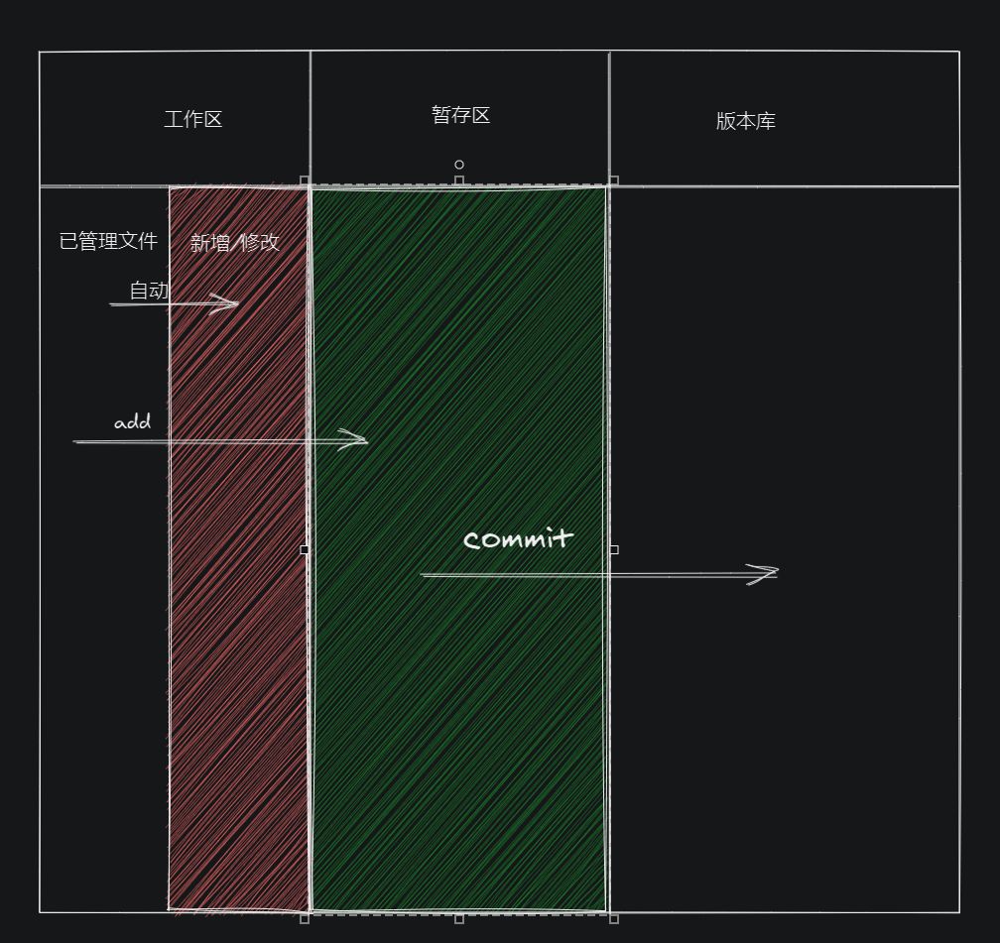

> 工作区就是你写代码的地方，你增加代码、删除代码都会自动添加到工作区。
>
> 你使用`git add`命令其实就是把工作区的代码提交到暂存区，这里举个例子解释一下暂存区：
>
> 如果你写代码很生气，你想马上砸电脑，然后你就立马把电砸了；
>
> 另外一种情况，你很生气，你也很想砸电脑，但是你没有马上砸，你想明天再砸，今天冷静下，然后你把这个想法暂时记在了纸条上，这个就是有暂存区的情况。
>
> git就是这样的情况，他不会把你新增、修改的代码马上提交成一个版本，而是先让你考虑要不要提交，要提交你就先提交到暂存区，此时如果你反悔了，你可以撤销暂存区的代码，否则你就可以通过commit命令提交一个版本。


### 回滚

遇到下图的情况就需要回滚了。

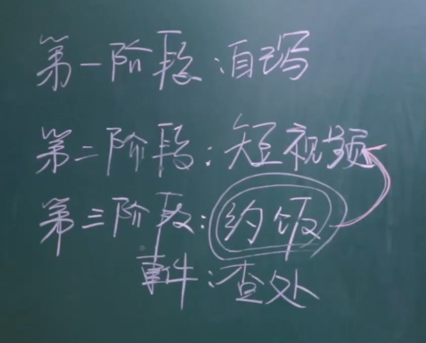

回滚命令：`git reset --hard 版本号`


现在如果我们需要回到约饭功能的版本，你通过`git log`查看会发现没有版本记录信息，此时怎么办呢？

这种时候查看 git 历史提交记录的时候就不要用 `git log`了，应该使用 `git reflog`查看记录了，找到约饭功能的记录然后使用 `git reset --hard 版本号` 方式回滚即可。

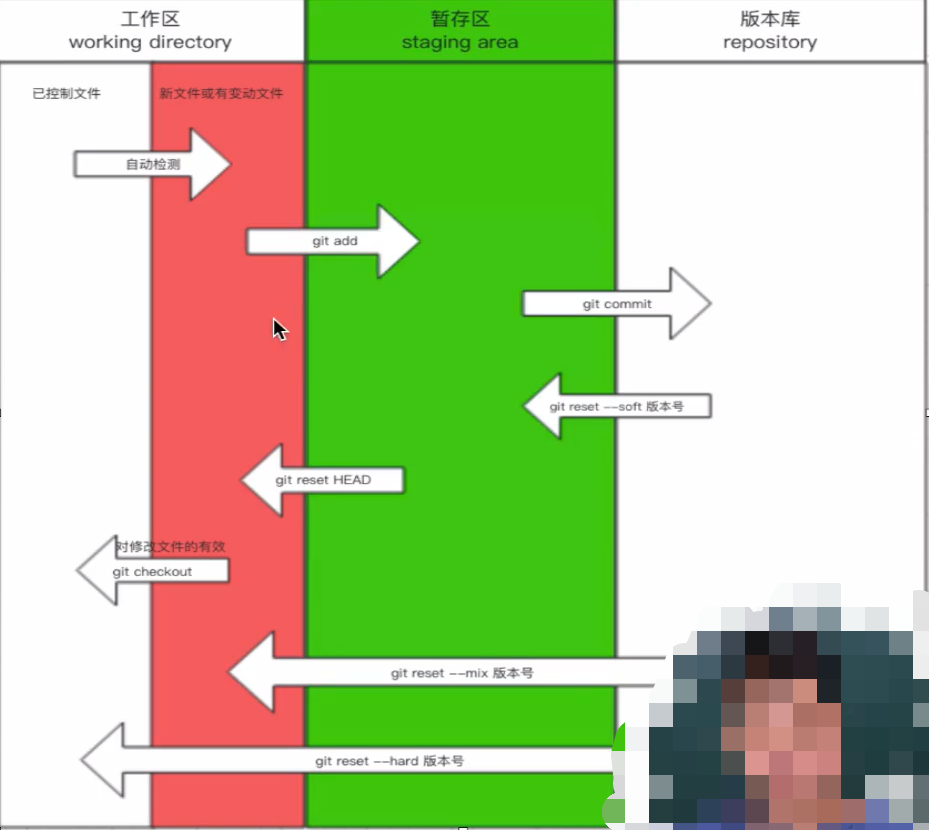


### 分支

版本和版本之间有一个指针的关系。

> V1版本和V2版本，如果V1版本修改了部分内容，并且提交成为V2版本，那么V2版本不会将整个V1版本复制一遍，而仅仅是保存V1版本修改的内容，V2此时通过指针建立和V1的关系，如果V2后期要用到V1版本没有修改的代码，V2则会通过指针去找到V1,然后读取内容，这样能节省生成版本的速度，提高效率。


### 紧急修复线上BUG的思路（分支）

在master分支上建立一个临时分支，该分支用来专门用来解决BUG，解决完BUG之后合并到master分支上，然后上线，没有问题就删除掉这个临时分支。

每个分支都是一个隔离的环境，做自己想做的事情。


**创建分支**

例如通过master主干分支创建dev分支：`git branch dev`，前提是你在master分支。


**切换分支**

`git checkout 分支名称`

> master分支一般为项目运行在生产环境中的分支，也称为线上分支。


**合并分支**

`git merge 分支名称`

例如你在`fixbug`分支修改完BUG后你要合并分支到master线上分支，首先你要切换到master分支，`git checkout master`，然后你要切换到使用`git merge fixbug`命令来进行合并，成功上线后将修复bug的临时分支删除。

删除`fixbug`分支：`git branch -d fixbug`

> 注意：一定要知道谁合并谁，注意合并分支之前先切换分支。

合并代码过程中遇到冲突怎么办，例如下图。

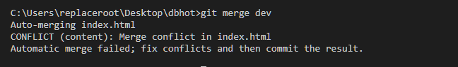

找到冲突的文件，然后根据你的需求删除掉旧的代码即可。

**注意下面的一种情况**

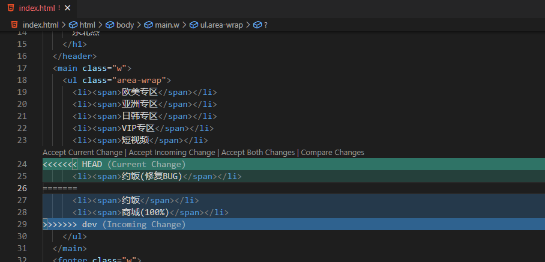

> 上图中，要在master分支上合并dev分支，由于我们在dev分支开发新功能的时候master分支出现紧急BUG，此时我们切换回了master分支并且建立了一个临时分支`fixbug`用来修复master分支的bug，bug修复完，合并到master之后，checkout回dev继续开发商城功能，开发完毕，然后回到master分支合并dev分支，此时就出现冲突了，原因是dev分支没有fixbug分支里面修复的bug的代码，master分支不知道应该合并谁的，此时如果你使用当前分支的代码合并(accept current change)，那么dev分支的代码就没合并到master；如果你使用dev分支的代码合并(accept incoming change)，那么你合并fixbug的代码就会被dev分支覆盖，这种情况在多人协作的项目开发中是很常见的，此时只能手动解决冲突了，无法再依赖工具了。

手动解决冲突后的代码。

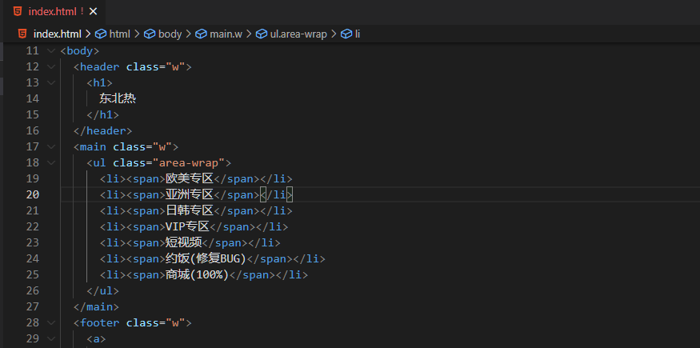

如果你足够细心，一定会思考：为什么master分支和fixbug分支合并代码的时候没有出现冲突呢？

下面的图清晰记录了每次commit的信息。

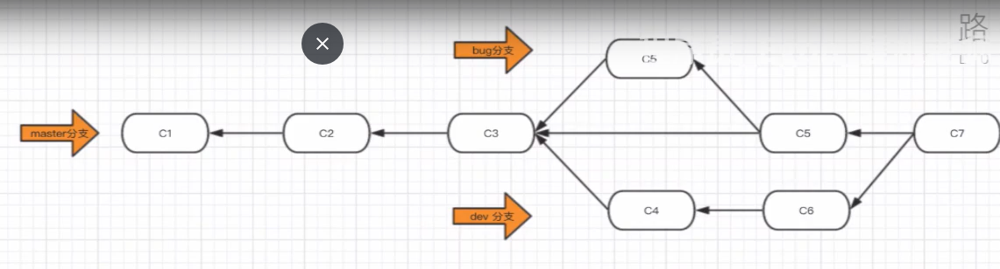

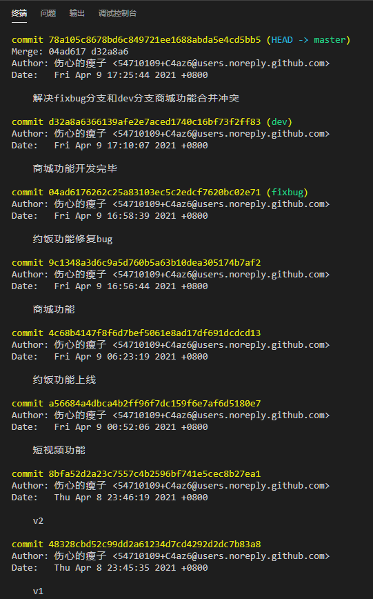

> 我们将`约饭功能`开发完毕之后，基于这个版本新建了一个`dev`分支用来开发`商城功能`，但是这个功能开发到一半的时候master分支出现了bug，我们需要紧急修复这个bug，于是我们`git checkout master`切换回到master分支，然后`git branch fixbug`创建一个修复bug的临时分支，修复完bug，此时我们`git checkout master`切换回master分支，然后`git merge fixbug`合并修复bug的临时分支，此时你发现为什么没有冲突 ，因为你在合并bug分支的时候，master分支的版本是比`fixbug`分支的版本要落后的，因此git检测到之后会直接将fixbug分支的代码覆盖到master分支，当然如果你在fixbug分支修复bug的过程中你的队友修改了master分支的代码，比如他的新功能上线了或者他修复完自己模块的bug要上线（这个情况很常见），并且改了你修改的同一行代码（例如一些公共函数你代码），此时master就比你的fixbug分支版本要新，此时你在master分支合并fixbug分支的时候就会冲突，因为他和你改了同一行；如果他只是增加了自己的功能模块或者修改了自己功能模块里面的代码，那就不会产生冲突。


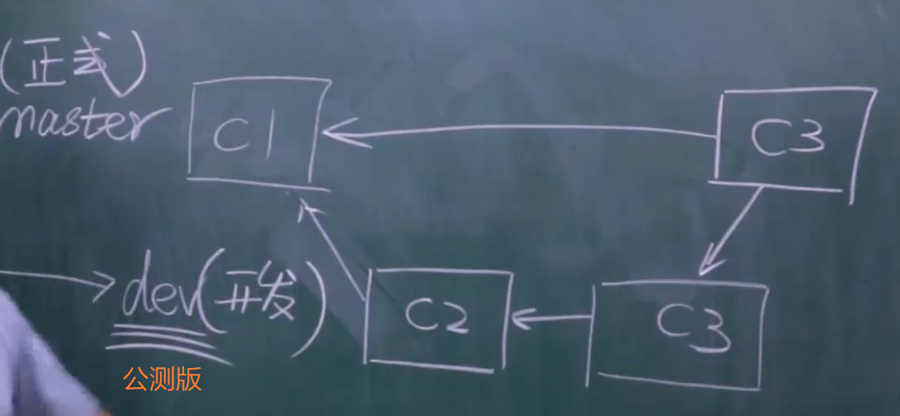

> 记住：以后写代码一定要在dev分支上写。


### Github

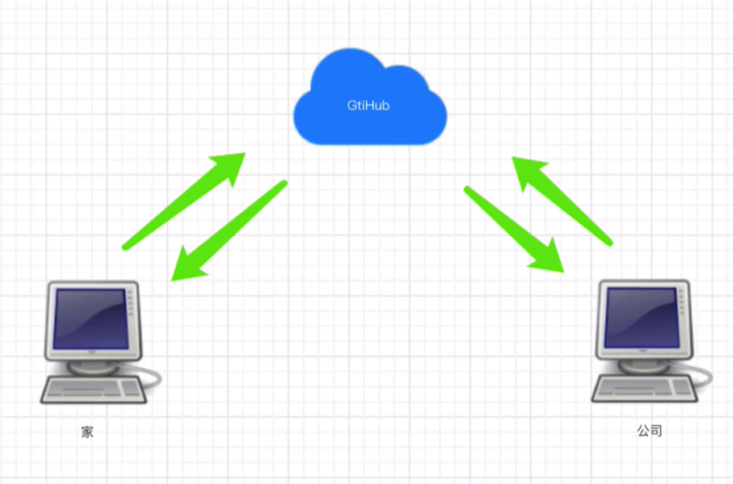

git是一个软件，github / gitlab 是一个做代码托管的平台。

gitlab是一个开源软件，允许你公司自己搭建一个仓库。

推送到远程仓库的时候要手动推送分支，例如`git push origin dev`，clone仓库的项目会默认把项目的所有分支一并clone下来，但你通过`git branch`看不到分支，此时你直接通过`git checkout 分支名`也是可以切换的。


```
1. 给远程仓库起别名
	git remote add origin 远程仓库地址
2. 向远程仓库推送代码
	git push -u origin 分支
```


```js
1. 克隆仓库远程代码
	git clone 远程仓库代码（内部已经实现 git remote add origin 远程仓库地址）
2. 切换分支
	git checkout 分支名称
```


从github上拉取代码后要继续开发新功能，为了保证代码是最新的，需要切换到dev分支，然后将master分支合并到dev分支：`git merge master`。

开发完成功能之后将代码推送到dev分支：`git push origin dev`，此时已经推送到远程仓库的dev分支了。

这时你就可以回家了。

回到家里，打开家里面的代码，然后切换到dev分支准备继续开发，此时需要从远程仓库拉取最新的代码到本地。

从远程dev分支拉取代码：`git pull origin dev`

> 你开发功能之前，应该先从远程仓库拉代码，下班时应该把你写的代码推送到远程仓库，养成这样的一个好习惯。


开发完毕要上线。

```
1. 将dev分支合并到master，进行上线
	git checkout master
	git merge dev
	git push origin master
2. 把dev分支也推送到远程
	git checkout dev
	git merge master
	git push origin dev
```


### 约妹子忘记推送代码了

> git pull origin dev 等同于下面2个命令的结合：
>
> 1. git fetch origin dev 	拉取远程仓库dev分支的代码到本地仓库
> 2. git merge origin/dev    将远程仓库的dev分支合并到本地的dev分支
>
> 这2个命令了解即可，一般直接使用 git pull origin dev

思考以下场景：

某一天快下班的时候，隔壁的妹子一直催我快点弄完然后陪她去吃饭，催烦了，我就直接git add . + git commit -m "update" 然后就和她下班了，吃饭完送她回家之后我一个人到家迫不及待开机写代码，git pull 的时候发现代码不是最新的，猛然想起下班的时候走得太着急忘记 git push了，但是今晚又不能不写，不写会觉得寂寞空虚冷，思考片刻后决定写一些其他的功能，凌晨3点写完功能 git push 到远程仓库后才安心睡觉。

第二天到公司，开机，拉代码，`git pull origin dev`，结果出现了冲突，思考片刻后发现是昨天下班修改的代码是a1.js文件，回家后也修改了a1.js文件，应该是修改了同一行的代码导致的冲突，然后我找到这个a1.js文件解决了冲突，然后继续愉快地开发新功能了，以后妹子再约我吃饭，走之前一定要push代码。


### rebase(变基)

rebase的本质意义是什么？

> 使你的 git 提交记录变得简洁。
>


三种场景。

第一种场景：

把多个提交记录合并成为一个提交记录。

方式1：

`git rebase -i 版本号`  

> 合并当前版本号到指定版本号区间的版本，例如当前版本是v4，指定合并的版本号为v2，那么就会合并v4到v2之间的版本。

方式2：

`git rebase -i HEAD~3`

> 合并当前版本号与最近3条版本号区间的版本。


输入命令后会出现下面界面。

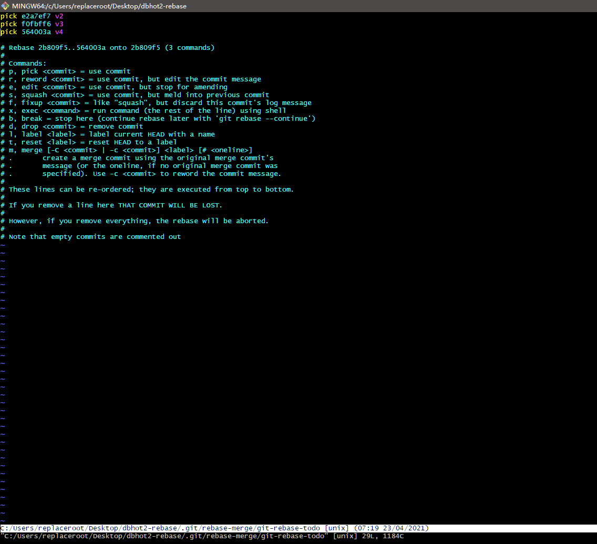

此时只需要将v3和v4的`pick`改成`s`即可。

> s的意思是将当前的提交合并到上次的提交记录中。

改动后

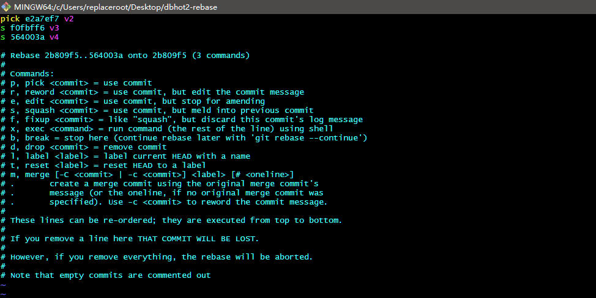

退出vi编辑界面的时候会出现下图内容

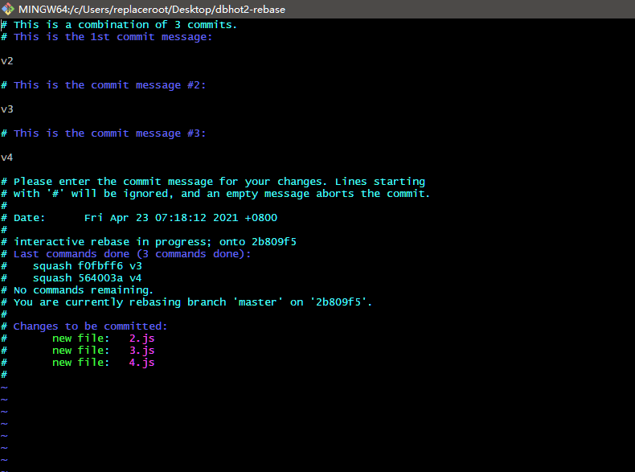

这个界面提示你修改记录合并之后的备注信息。

这个可以随意发挥，也可以参考我修改的效果。

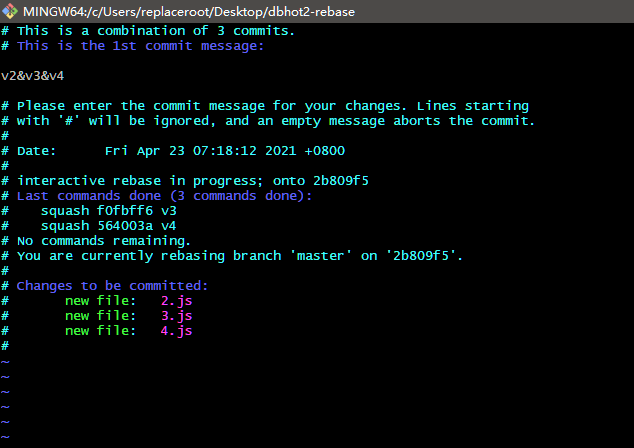

此时再次查看git提交记录时就可以看到已经合并的记录了。

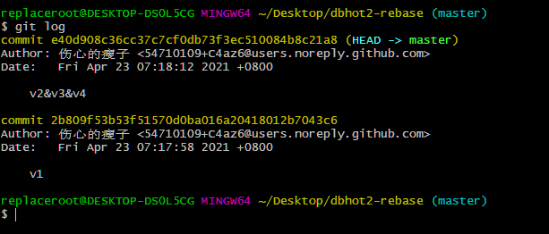

注意事项

> 如果你的git提交记录已经push到远程仓库了，最好不要再将它做rebase合并，尽量合并那些没有push到远程仓库的提交记录，否则可能会导致远程仓库和本地仓库的历史记录不一致，会很麻烦。


第二种场景：

适用于分支合并。

一般合并分支我们都是直接`git merge dev`这样操作的，但是这样操作之后会导致提交记录不是很清晰，此时我们就可以利用rebase来实现让合并分支更简洁，通过下面2张图片可以清晰看到区别。

直接使用merge方式合并分支后的提交记录图：


使记录更加简洁的方式：`git log --graph --pretty=format:"%h %s"`

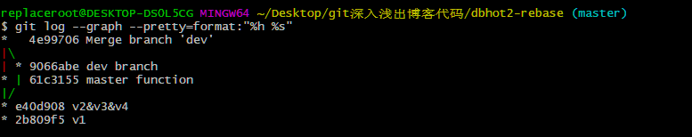


使用rebase方式合并分支后的提交记录图：

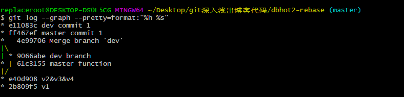

这种方式没有分叉，变得很简洁。

需要遵循下面步骤：

1. 切回dev分支
2. 执行`git rebase master`命令使dev分支的提交记录变成基本分支（master分支）的提交记录，这个过程也叫变基。
3. 切换回master分支，合并dev分支即可。

> 这种方式虽然会让提交记录变得更简洁，但也会让提交记录无法显示得更加详细，这个要自己取舍。


第三种场景：

类似第二种场景。

例如在家开发完一个版本之后上传到`github`云端，然后回到公司从云端拉取最新代码，这个拉取操作如果你使用的是`git pull`命令则会在本地仓库产生分叉，可读性不太好，此时就可以使用`git rebase`命令来解决。

> `git pull origin dev`这个命令其实等于 `git fetch` + `git merge`，这样会导致分叉。
>
> 解决方法：
>
> 使用`git fetch origin dev`命令拉取云端代码，然后使用`git rebase origin/dev`命令来合并分支，这样就不会导致分叉出现了，可以使分支合并的提交记录更简洁。

这种方式稍微有点麻烦。

> 注意事项：
>
> 在执行`git rebase`的时候可能会产生冲突，此时应该根据提示解决冲突，解决完冲突使用`git rebase --continue`继续合并。


### 命令总结

- 添加远程连接（别名）

  ```
  git remote add origin 地址
  ```

- 推送代码

  ```
  git push origin dev
  ```

- 下载代码

  ```
  git clone 地址
  ```

- 拉取代码

  ```
  git pull origin dev
  等价于
  git fetch origin dev
  git merge origin/dev
  ```

- 保持代码提交整洁（变基 ）

  ```
  git rebase 分支
  ```

- 记录图形化展示

  ```
  git log --graph --pretty=format:"%h %s"
  ```


### 多人协作开发

gitFlow工作流

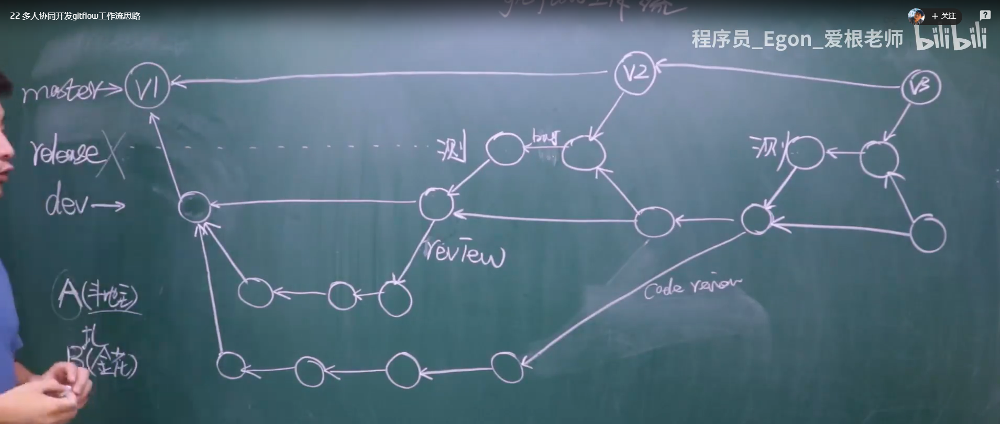


给版本号打标签：

```
git tag -a v1 -m "第一版"
```


### 给开源项目贡献代码

-  第一步：先fork这个框架。
- 第二步：在自己的仓库修改代码。
- 第三步：给源代码作者提交一个修复bug的申请。


