# JS面向对象编程 Day1

------

## 1.对象的概念

在编程领域，任何 事 和 物都可以概括成对象。

用编程思想抽象出你心仪对象的属性和方法。

对象由属性和方法组成，属性和方法都可以用 键值对 定义。

心仪对象：

​	属性：特征

​		身高：170 cm

​		年龄：26

​		性别：女

​		腿：大长腿

​	方法：功能 - 函数

​		生活技能：煮饭

​		运动技能：打篮球

​		艺术技能：rap


## 2.对象的创建和使用

```javascript
  <script>
    // 创建一个对象
    var person = {
      // 对象的属性 - 特征
      height: "170cm",
      age: 26,
      gender: '女',
      leg: '大长腿',
      // 生活技能，也就是对象的方法，就是函数
      liveSkill: function(){
        console.log("生活技能： 煮饭");
      },
      sportSkill: function(){
        console.log("运动技能：打篮球");
      },
      artSkill: function(){
        console.log("艺术技能: 弹钢琴")
      }
    }

    console.log(person);
    // 编程中的对象主要是对 事和物进行了概括
    // 编程的时候要把属性和方法写到对应的键值对中
    // 方法：就是代表某个技能，比如煮饭，该功能是可以反复调用的
    // 对象是无序的，不需要管输出顺序，只需要管书写顺序，数组是有序的。


    // 使用一个对象
    for(let key in person) {
      // console.log(key, person[key])
      // console.log(typeof person[key])
      typeof person[key] === 'function' ? console.log(person[key]()) : console.log(key + '---' + person[key])
    }

    // 属性往往获取了之后可以把值存起来
    // 方法往往就是字节调用即可，不需要存起来，除非需要用到它的返回值
    
  </script>
```


### 1.创建一个动物对象

```javascript
  <script>
    var animal = {
      // 属性 - 就是这个对象的一些特征
      species: 'lion',
      height: "200cm",
      weight: "200KG",

      // 方法 - 就是这个对象的一些功能
      run: function(){
        console.log(this)
        console.log(this.species + " is " + "Running...");
      }
    }

    console.log(animal.species)
    console.log(animal.height)
    console.log(animal.weight)
    animal.run()
  </script>
```


### 2.创建贪吃蛇食物

```javascript
<script>
    /* 
      1. 获取随机数
      注意：这里使用floor进行随机数 "向下" 取整，如果想要获取最后一个数据，就必须给随机的结果加1
      
      这里的780是地图盒子宽度800px - 食物盒子宽度20px 的结果，如果不减去盒子的宽度，食物盒子有几率会跑出去
      780/20 是为了获取到整个盒子里面能存放多少个食物，然后把这个值作为随机数的生成范围
      randomNum * 20 就可以得到随机的水平坐标值，因为食物盒子的宽度是20px

      -------------------------------------------------------------------------------------------

      2. 获取随机宽度
      var randomNumLeft = Math.floor(Math.random() * (780 / 20 + 1) );
      var positionLeft = randomNumLeft * 20;
      food.style.left = positionLeft + "px";

      -------------------------------------------------------------------------------------------

      3. 获取随机高度
      var randomNumTop = Math.floor(Math.random() * (380/20+1));
      var positionTop = randomNumTop * 20;
      food.style.top = positionTop + "px";

      -------------------------------------------------------------------------------------------

      4. 获取随机颜色
      var colorA = Math.floor(Math.random() * (3 + 1));
      var colorB = Math.floor(Math.random() * (255 + 1));
      var colorC = Math.floor(Math.random() * (255 + 1));
      console.log(colorA)
      food.style.backgroundColor = `rgb(${colorA}, ${colorB}, ${colorC})`
    */

    // 查找地图
    var map = document.getElementById('map');
    // // 创建食物盒子并且插入
    var food = document.createElement('div')
    map.appendChild(food)
    // 设置样式
    food.style.width = "20px";
    food.style.height = "20px";
    food.style.position = "absolute"
    food.style.backgroundColor = "lightpink";

    /* ---------------------------------------------------------------------------------------------------------------- */
    // 版本1
    // // 获取随机宽度位置
    // var randomNum = Math.floor(Math.random() * (780/20+1));   // 随机数就意味着食物在地图的X轴的第几个位置
    // var randomPositionLeft = randomNum * 20;    // 得出食物的具体宽度位置
    // food.style.left = randomPositionLeft + "px";

    // // 获取随机高度位置
    // var randomNum = Math.floor(Math.random() * (380 / 20 + 1) );
    // var randomPositionTop = randomNum * 20;   // 得出食物的具体高度位置
    // food.style.top = randomPositionTop + "px";
    // console.log("food current x y position: ", randomPositionLeft, randomPositionTop);

    // // 获取随机颜色 rgb(255,255,255);
    // var colorA = Math.floor(Math.random() * (3 + 1));
    // var colorB = Math.floor(Math.random() * (255 + 1));
    // var colorC = Math.floor(Math.random() * (255 + 1));
    // console.log(colorA)
    // food.style.backgroundColor = `rgb(${colorA}, ${colorB}, ${colorC})`

    /* ---------------------------------------------------------------------------------------------------------------- */
    // 版本2 封装函数版本

    // 封装获取随机宽度位置的函数
    function getRandomLeft() {
      var randomNum = Math.ceil(Math.random() * (780 / 20));
      var randomPositionLeft = randomNum * 20;
      return randomPositionLeft
    }

    // 封装获取高度位置的函数
    function getRandomTop() {
      var randomNum = Math.ceil(Math.random() * (380 / 20));
      var randomPositionTop = randomNum * 20;
      return randomPositionTop;
    }

    // 封装获取随机颜色的函数
    function getRandomColor(num) {
      return Math.ceil(Math.random() * num)
    }

    food.style.left = getRandomLeft() + "px";
    food.style.top = getRandomTop() + "px"
    food.style.backgroundColor = `rgb(${getRandomColor(255)},${getRandomColor(255)},${getRandomColor(255)})`
  </script>
```


HTML+CSS

```html
  <style>
    #map {
      width: 800px;
      height: 400px;
      background: #333;
      margin: 50px auto;
      position: relative;
    }
  </style>

<div id="map"></div>
```


效果图：


### 3.利用面向对象创建贪吃蛇食物

```javascript
  <script>
    // 获取随机数函数
    function getRandomNum(num) {
      return Math.ceil(Math.random() * num)
    }

    // 获取随机颜色
    function getRandomColor(num) {
      return Math.ceil(Math.random() * num)
    }
    var food = {
      // 食物的属性
      width: 20,
      height: 20,
      top: 0,
      left: 0,
      color: 'pink',
      position: 'absolute',
      element: "",
      // 创建食物的方法
      createFood: function () {
        // 创建食物标签，获取地图标签，往地图标签下面插入食物标签
        var foodElement = document.createElement('div');
        var map = document.getElementById('map');
        map.appendChild(foodElement)
        // 设置样式
        this.element = foodElement;
        this.element.style.width = this.width + "px";
        this.element.style.height = this.height + "px";
        this.element.style.backgroundColor = this.color;
        this.element.style.position = this.position
      },

      //获取随机位置
      getRandomPosition: function () {
        // 获取水平方向的随机位置
        var positionLeft = getRandomNum(780 / 20) * 20;
        // 获取垂直方向的随机位置
        var positionTop = getRandomNum(380 / 20) * 20;
        console.log(positionLeft, positionTop)
        this.left = positionLeft
        this.top = positionTop;
        // 设置样式
        this.element.style.left = this.left + "px";
        this.element.style.top = this.top + "px";
        console.log(this.element)
      },

      // 获取随机颜色
      setRandomColor(num) {
        this.color = `rgb(${getRandomColor(255)},${getRandomColor(255)},${getRandomColor(255)})`
        console.log(this)
        this.element.style.backgroundColor = this.color
      }
    }

    food.createFood()
    food.getRandomPosition()
    food.setRandomColor()
  </script>
```


## 3.面向过程和面向对象

### 1.面向对象三大特性

面向对象三大特征：封装，继承 和 多态。

注意：JS不支持多态，我们 JS 的面向对象主要是 封装 和 继承。


### 2.面向过程编程

想到什么写什么，按照需求一步步实现，不需要把项目的元素抽离成对象。


### 3.面向对象编程

1. 分析页面中哪些元素可以抽离成对象
2. 分析对象的属性
3. 分析抽象对象的方法
4. 按照需求一步步实现


### 4.小结

面向过程书写简单，但是修改起来麻烦。

面向对象书写复杂，但是后期加功能，或者修改功能较为方便。


## 4.工厂函数

工厂函数其实就是把创建对象的过程进行封装，函数内部创建对象，并把对象返回出去。

```javascript
  <script>
    // 对象字面量的方式创建一个函数
    // var person = {
    //   name: '张三',
    //   age: 30,
    //   say: function(){
    //     console.log(this.name + "： 老铁双击666...");
    //   }
    // }


    // var person2 = {
    //   name: '李四',
    //   age: 33,
    //   say: function(){
    //     console.log(this.name + ": 老铁快给我刷礼物...")
    //   }
    // }

    // person.say();

    // person2.say()

    /* 
      工厂函数 - 把创建对象的过程进行封装
      1. 在函数的内部创建对象
      2. 根据传进来参数，把数据添加到对象的属性上
      3. 在函数内部把对象返回出去
    */

    function createPerson(name, age) {
      var person = {
        // 对象的属性
        name: name,
        age: age,
        // 对象的方法
        say: function(){
          console.log(this.name + ": 双击666！");
        }
      }
      // 把函数内部的对象返回出去
      return person;
    }

    var p1 = createPerson('张三', 23);
    var p2 = createPerson('赵四', 30);
    // 输出2个对象
    console.log(p1, p2);
    p1.say();
    p2.say();
  </script>
```


**工厂函数第二种写法，更方便调试**

```javascript
    // 写法2 与第一种写法一样，但是更方便调试，看代码运行过程
    debugger;
    function createPerson(name, age) {
      // 创建一个空对象
      var person = new Object();
      // 给对象添加属性
      person.name = name;
      person.age = age;
      // 给对象添加方法
      person.say = function(){
        console.log(this.name + "： 我很666~~");
      }
      return person;
    }


    var p1 = createPerson('张三', 30);
    var p2 = createPerson('王五', 34);

    p1.say();
    p2.say();
```


**小结**

1. 工厂函数需要在函数内部手动创建对象。
2. 工厂函数需要设置返回值，返回创建的对象。


## 5.构造函数！！！

### **参考代码**

```javascript
  <script>
    // ————————————————工厂函数创建对象————————————————
    // function createPerson(name, age) {
    //   // 创建一个空对象
    //   var person = new Object();
    //   // 给对象添加属性
    //   person.name = name;
    //   person.age = age;
    //   // 给对象添加方法
    //   person.say = function(){
    //     console.log(this.name + "： 我很666~~");
    //   }
    //   return person;
    // }


    // var p1 = createPerson('张三', 30);
    // var p2 = createPerson('王五', 34);

    // p1.say();
    // p2.say();

    // ————————————————构造函数————————————————
    // 创建构造函数
    function Person(name, age) {
      this.name = name;
      this.age = age;
      this.say = function(){
        console.log("我是: " + this.name + "，我很666~~~~");
      }
    }

    var p1 = new Person("超人", 100);
    var p2 = new Person('蝙蝠侠', 120);
    p1.say();
    p2.say();
    console.log(p1.say === p2.say); // false 因为2个函数的内存地址不同
    
  </script>
```

构造函数其实也是函数，用于创建对象，多次调用能创建多个不同的对象。

功能：构造函数也是个函数，用于创建多个对象。


### 构造函数和工厂函数区别

|                                   | 构造函数 *        | 工厂函数             |
| --------------------------------- | ----------------- | -------------------- |
| 函数名称                          | 首字母大写        | 驼峰命名             |
| 在函数内部，是否需要创建对象      | 不需要            | 需要创建对象         |
| 在函数内部，是否需要设置返回值    | 不需要            | 需要返回创建的对象   |
| 在调用的时候，是否需要 new 关键词 | 需要 `new` 关键词 | 不需要，普通函数调用 |

> 构造函数创建对象更方便，推荐使用。

注意：如果构造函数忘记了些 new 关键词，JS 会把他当做普通函数执行。

​	   普通函数内部的 this 默认指向 window 对象。


### 小结

​	构造函数相对于工厂函数来说更多人使用。推荐大家也使用构造函数创建对象。


### 构造函数的方法优化

```javascript
  <script>
    debugger
    // ——————————————构造函数————————————————
    // 创建构造函数
    function CreatePerson(name,age) {
      this.name = name;
      this.age = age;
      this.say = fn;
    }

    // 函数仅仅创建了一次
    function fn(){
      console.log(this)
      console.log("我是: "+this.name);
    }


    var p1 = new CreatePerson("alex", 20);
    var p2 = new CreatePerson("rose", 30);
    p1.say()
    p2.say()

    /* 
      小结：
      函数抽离到构造函数外面创建，可以解决函数多次创建浪费性能的问题
      可以实现性能的优化，但是fn缺少和CreatePerson的关联性
    */
  </script>
```


## 5.new 的功能

### 目标

了解 new 主要的功能


### 概念

new 在构造函数内部主要有以下功能。

1. 函数内部创建一个新对象      this
2. 函数最后把对象返回              return this

> 所以调用 `构造函数` 的时候一定要记得 new 关键词。

```javascript
 // 创建构造函数
function Person(name, age) {
    // var person = new Object();    
    this.name = name;
    this.age = age;
    this.sayHi = function () {
        console.log("我是" + this.name + "，我很666");
    }
    // return person;
}
var p1 = new Person("超人", 100);
var p2 = new Person("蝙蝠侠", 30);
console.log(p1, p2);

```


## 6.原型关系图

### 目标

梳理构造函数，实例对象，原型对象的关系

### 参考关系图


### 参考代码

```javascript
  <script>
    // —————————————————构造函数—————————————————————
    // 创建构造函数
    function Person(name, age){
      this.name = name;
      this.age = age;
    }

    // 函数在JS中其实就是个对象
    // console.dir(Person);
    
    // Person.prototype 可以叫做 构造函数Person的原型或者原型对象
    // 注意：在原型(prototype)上添加的方法，能给创建出来的实例对象共享方法
    console.log(Person.prototype)
    Person.prototype.gender = "男";
    Person.prototype.say = function(){
      console.log("hello, friends！");
    }
    console.log(Person.prototype)

    // p1 就是通过构造函数创建的 【实例对象】
    var p1 = new Person('张三', 23)
    // 输出实例对象
    console.log("p1: ", p1);

    // 【原型对象】能被【实例对象】 和 【构造函数】 共享
    // 实例对象.__proto__ 等同于 构造函数.prototype，属性和方法添加后能共享
    console.log(p1.__proto__ === Person.prototype);   // true 内存地址是同一个

    // 实例对象调用共享的方法
    p1.say();   // hello, friends！
  </script>
```


### 原型的方式实现贪吃蛇食物

```javascript
  <script>
    // 创建食物的构造函数
    function Food(width,height,backgroundColor,left,top){
      this.width = width;
      this.height = height;
      this.backgroundColor = backgroundColor;
      this.left = left;
      this.top = top;
      this.element = "";   // 存储页面食物盒子
    }
    
    // 创建盒子的方法
    Food.prototype.render = function() {
      var map = document.getElementById("map");
      var box = document.createElement('div');
      map.appendChild(box);
      this.element = box;
      this.element.style.width = this.width + "px";
      this.element.style.height = this.height + "px";
      this.element.style.backgroundColor = this.backgroundColor;
      this.element.style.left = this.left + "px";
      this.element.style.top = this.top + "px";
      this.element.style.position = 'absolute'
    }

    // 随机位置的方法
    Food.prototype.ranPos = function() {
      var posLeft = getRandomNum(780/this.width) * this.width;
      var posTop = getRandomNum(380/this.height) * this.height;
      this.element.style.left = posLeft + "px";
      this.element.style.top = posTop + "px";
      this.left = posLeft;
      this.top = posTop;
    }

    // 随机颜色的方法
    Food.prototype.ranColor = function() {
      this.element.style.backgroundColor = `rgb(${getRandomNum(255)},${getRandomNum(255)},${getRandomNum(255)})`
    }

    // 点击食物 食物更新颜色和位置
    Food.prototype.bindClick = function() {
      var that = this;
      this.element.addEventListener('click', function() {
        // 事件处理函数内部this指向事件源，所以这个函数内不能使用this
        that.ranPos();
        that.ranColor();
      })
    }

    // 获取随机数公共方法
    function getRandomNum(num) {
      return Math.ceil(Math.random() * num)
    }
    var f1 = new Food(20,20,'pink',0,0)
    f1.render();
    f1.ranPos();
    f1.ranColor();
    f1.bindClick();

  </script>
```


### 注意三个关键术语

1. 构造函数 -  用于创建对象的函数

2. 实例对象 - 调用构造函数创建出来的对象

3. 原型对象 -  构造函数和实例对象都有原型

   注意：原型方法是《共享》的，书写的时候写到《构造函数》上，给《实例对象》使用。


### 小结

​	构造函数相当于妈妈，(妈妈主要是用于添加属性的)

​	原型对象相当于爸爸，(JS自动给妈妈分配了个老公，主要用于添加方法的)

​	实例对象相当于孩子，(通过妈妈创建孩子，孩子有妈妈的属性，有爸爸的方法)


## 第一天总结


面向过程：不涉及抽离对象，封装对象方法。

面向对象编程：`封装，继承，多态`。

今天主要讲解 `封装`。


面向对象编程步骤：

1. 分析项目中有什么对象，抽离成对象。
2. 分析对象的属性 - 属性写到构造函数的内部
3. 分析对象的方法 - 方法写到构造函数的原型
4. 用 new 关键词调用构造函数，创建实例对象。
5. 封装的功能写到方法上，实例对象调用方法激活功能。


# JS面向对象编程 Day2

------

### 1.原型关系图

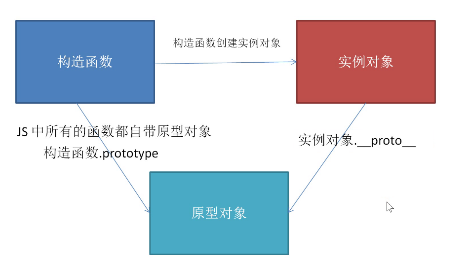

原型对象一般用来添加方法。


### 2.游戏地图对象

#### 对象属性和方法

属性：

​	宽度

​	高度

​	背景色

​	element 属性

方法：

​	渲染方法 - 把 地图 添加到界面中

#### 参考代码

```javascript
(function () {
    // 构造函数 - 地图构造函数
    function Map(obj) {
        // 知识点：短路运算 || 找真，如果不传入参数，就使用运算符后面的数据
        // obj 是对象，如果调用的时候没有传入参数，应该要初始化空对象。
        obj = obj || {};
        // 地图对象的属性，对象的参数需要 this.属性名 添加
        this.width = obj.width || 800;
        this.height = obj.height || 200;
        this.backgroundColor = obj.backgroundColor || "#333";
        // element 属性用来存储 创建的 地图盒子
        this.element = null;
        // 通过实例对象，调用初始化地图的方法
        this.render();
        // this 就是实例对象，构造函数执行完毕后自动 return this; 
        // 把 this 实例对象保存给变量 map ，map 只是接收 this 实例对象的变量名而已
        // return this;
    }

    // 原型对象 - 添加创建地图的方法 - render
    Map.prototype.render = function () {
        // 1. 创建地图盒子
        var mapBox = document.createElement("div");
        // 2. 把地图盒子添加到 body 中
        document.body.appendChild(mapBox);
        // 3. 把创建的盒子存到对象的 element 属性中
        this.element = mapBox;
        // 4. 添加地图样式
        // 在这个函数内 this.element 和 mapBox 都一样
        // console.log(mapBox === this.element); 
        this.element.style.width = this.width + "px";
        this.element.style.height = this.height + "px";
        this.element.style.backgroundColor = this.backgroundColor;
        // 5. 父级相对
        this.element.style.position = "relative";
    }
    // 把自调用函数的局部 Map 变成全局对象 Map，在任何地方都能调用到
    window.Map = Map;
})();
```


### 3.游戏食物对象

#### 对象属性和方法

属性：

​	宽度

​	高度

​	背景色

​	left 坐标

​	top 坐标

​	element 属性

方法：

​	渲染方法 - 把 食物 添加到 地图 中

​	随机位置方法 - 贪食蛇吃到食物后，食物位置要改变

#### 参考代码	

```javascript
(function () {
    // 构造函数 - 食物
    function Food(obj) {
        obj = obj || {};
        this.width = obj.width || 20;
        this.height = obj.height || 20;
        this.backgroundColor = obj.backgroundColor || "hotpink";
        this.left = obj.left || 0;
        this.top = obj.top || 0;
        this.element = null;
        // 在创建对象的同时，调用 render 方法把食物添加到地图中
        this.render();
        // 调用随机位置的方法
        this.ranPos();
    }

    // 原型对象 - 添加方法 - render 渲染到页面
    Food.prototype.render = function () {
        // 把食物盒子创建并保存到 element 属性中
        this.element = document.createElement("div");
        // 地图盒子是 map.element，把当前食物盒子添加到地图盒子中
        map.element.appendChild(this.element);
        // 添加盒子基本样式
        this.element.style.width = this.width + "px";
        this.element.style.height = this.height + "px";
        this.element.style.backgroundColor = this.backgroundColor;
        // 添加盒子定位样式
        this.element.style.position = "absolute";
        this.element.style.left = this.left + "px";
        this.element.style.top = this.top + "px";
    }

    // 封装一个获取随机数的方法，调用的时候 return 随机数
    function getRanNum(num) {
        return Math.floor(Math.random() * (num + 1));
    }

    // 原型对象 - 添加方法 - ranPos 更新食物位置
    Food.prototype.ranPos = function () {
        // 更新数据：获取随机数，赋值给 对象的 left 和 top 属性
        this.left = getRanNum((map.width - this.width) / this.width) * this.width;
        this.top = getRanNum((map.height - this.height) / this.height) * this.height;
        // 更新视图：把食物的 left top 修改，更新位置
        this.element.style.left = this.left + "px";
        this.element.style.top = this.top + "px";

    }
    // !!! 把 Food 设置成全局的
    window.Food = Food;
})()
```


### 4.贪吃蛇对象

#### 对象属性和方法

属性：

​	每节的宽度

​	每节的高度

​	蛇身体 3 节

​		每节left 坐标，top坐标，背景色

​	蛇移动方向

方法：

​	`render` 渲染方法- 把 蛇 添加到 地图 中

​	`style` 样式更新方法 - 因为蛇能移动，移动的时候需要更新数据和更新位置，所以单独抽离一个方法

​	`move` 蛇移动方法	


​	`growth` 蛇成长的方法 - 吃到食物后在封装


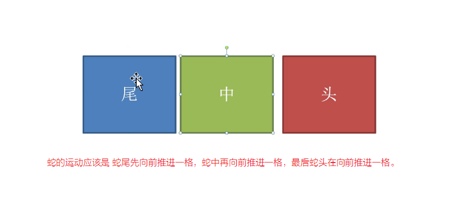

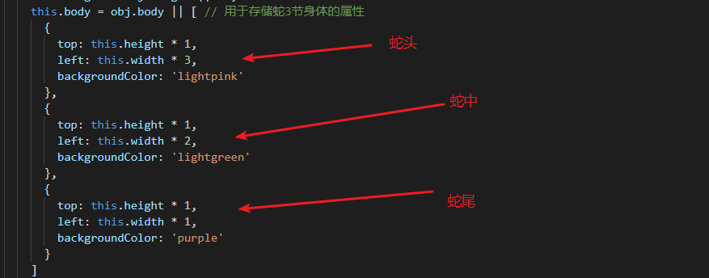


#### 参考代码

```javascript
(function () {
    // 构造函数 - 用于创建蛇对象
    function Snake(obj) {
        obj = obj || {};
        // 每节的宽度
        this.width = obj.width || 20;
        // 每节的高度
        this.height = obj.height || 20;
        // 蛇的三节身体
        this.body = obj.body || [
            // 蛇头索引值 [0]
            {
                left: 3 * this.width,
                top: 1 * this.height,
                backgroundColor: "red"
            },
            // 蛇中索引值 [1]
            {
                left: 2 * this.width,
                top: 1 * this.height,
                backgroundColor: "white"
            },
            // 蛇尾索引值 [2]
            {
                left: 1 * this.width,
                top: 1 * this.height,
                backgroundColor: "blue"
            }
        ];
        // 蛇的移动方向
        this.direction = obj.direction || "right";
        // element  属性用来存储 创建的 蛇身体盒子，身体有3节，用数组管理三节身体盒子
        this.element = [];
        // 接收游戏地图
        this.map = obj.map;
        // 调用渲染到页面的 render 方法
        this.render();
    }

    // 原型对象 - 添加方法 - render 蛇渲染到页面
    Snake.prototype.render = function () {
        // 遍历蛇身体的数据，身体多少节，循环多少次，创建多少个盒子
        for (var i = 0; i < this.body.length; i++) {
            // 创建盒子，并保存到数组中
            this.element[i] = document.createElement("div");
            // 创建的时候把盒子添加到地图中
            this.map.element.appendChild(this.element[i]);
        }
        // 上面代码循环完毕后，再调用更新样式的 style 方法
        this.style();
    }

    // 原型对象 - 添加方法 - style 蛇样式更新的方法
    Snake.prototype.style = function () {
        // 遍历蛇身体的数据，用于更新样式
        for (var i = 0; i < this.body.length; i++) {
            // 设置基本样式，宽，高，背景色
            this.element[i].style.width = this.width + "px";
            this.element[i].style.height = this.height + "px";
            // 背景色的数据来源于  body 数组中
            this.element[i].style.backgroundColor = this.body[i].backgroundColor;
            // 设置定位样式, position ,left ,top 
            this.element[i].style.position = "absolute";
            // left top 的数据来源于  body 数组中
            this.element[i].style.left = this.body[i].left + "px";
            this.element[i].style.top = this.body[i].top + "px";
        }
    }

    // 原型对象 - 添加方法 - move 蛇移动的方法
    Snake.prototype.move = function () {
        // debugger;
        // 蛇尾蛇中：先移动蛇尾和蛇中，蛇的前进，其实后面推着前面走，需要倒序循环
        for (var i = this.body.length - 1; i > 0; i--) {
            // 蛇中的数据给蛇尾，蛇头的数据给蛇中 [2] 蛇尾索引 [1] 蛇中索引
            this.body[i].left = this.body[i - 1].left;
            this.body[i].top = this.body[i - 1].top;
        }
        // 蛇头：蛇头移动单独处理，蛇头索引值是 [0]
        // this.body[0].left += this.width;
        // debugger;
        if (this.direction === "right") {
            this.body[0].left += this.width;
        } else if (this.direction === "left") {
            this.body[0].left -= this.width;
        } else if (this.direction === "up") {
            this.body[0].top -= this.height;
        } else if (this.direction === "down") {
            this.body[0].top += this.height;
        }
        // 调用 style 方法 更新蛇样式，让蛇在界面中动起来
        this.style();
    }
    // 把 Snake 设置成全局的 Snake
    window.Snake = Snake;
})()
```


绑定键盘按下的事件，输出左上右下的4个按键的编码。

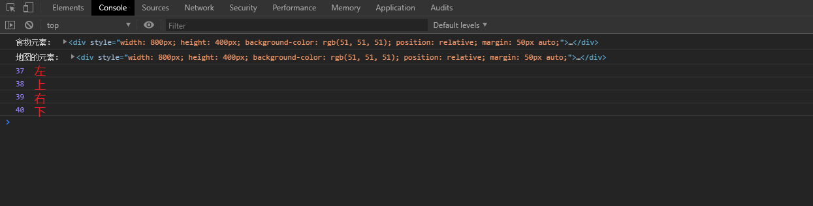


### 5.游戏对象

#### 对象属性和方法

属性：

​	地图

​	食物

​	蛇

方法：

​	`start` 游戏开始方法 - 蛇需要移动

​	`bindkey` 绑定键盘事件 - 键盘按下能改变蛇移动位置


#### 游戏构造函数

#### 参考代码

```javascript
// 构造函数 - 用于游戏对象
function Game() {
    // 游戏属性 - 地图
    this.map = new Map();
    // 游戏属性 - 食物，传入地图对象
    this.food = new Food({ map: this.map });
    // 游戏属性 - 蛇，传入地图对象，传入蛇移动方向
    this.snake = new Snake({ map: this.map, direction: "down" });
}
```

#### 游戏开始方法 - start

##### 蛇移动参考代码

```javascript
// 原型对象 - 添加方法 - start 游戏开始
Game.prototype.start = function () {
    // !!! 把外函数的 this 存到 that 变量中
    var that = this;
    // 游戏开始的时候，蛇动起来
    that.timer = setInterval(function () {
        // that 代表整个游戏对象，蛇移动的方法其实也在 that.snake 中
        that.snake.move();
    }, 1000);
}
```

##### 游戏边界检测参考代码

```javascript
// 蛇头是索引为 0 那一节身体
var snakeHead = that.snake.body[0];
// 边界检测需要分成 上下左右 四个方向
// 1. 右边界检测
if (snakeHead.left >= that.map.width) {
    // console.log("右边界检测");
    // 如果蛇超过了地图，清除定时器，让蛇停止移动
    clearInterval(that.timer);
}
// 2. 左边界检测
if (snakeHead.left < 0) {
    clearInterval(that.timer);
}
// 3. 上边界检测
if (snakeHead.top < 0) {
    clearInterval(that.timer);
}
// 4. 下边界检测
if (snakeHead.top >= that.map.height) {
    clearInterval(that.timer);
}
```

#### 游戏键盘控制方向方法 - bindkey

键盘编码


##### 参考代码

```javascript
// 原型对象 - 添加方法 - bindKey 通过键盘控制蛇方向
Game.prototype.bindKey = function () {
    // !!! 把外函数的 this 存到 that 变量中
    var that = this;
    // 整个页面绑定个键盘按下事件，如果是方向键上下左右，就改变蛇移动的方向
    document.addEventListener("keydown", function (event) {
        // 按左上右下按键，先获取编码 左37 上38  右39  下40
        // console.log(event.keyCode);
        // debugger;
        // 判断键盘编码，按键可以改变蛇的移动方向
        if (event.keyCode === 37) {
            // 如果键盘编码是 37，蛇方向改成 left
            that.snake.direction = "left";
        } else if (event.keyCode === 38) {
            // 如果键盘编码是 38，蛇方向改成 up
            that.snake.direction = "up"
        } else if (event.keyCode === 39) {
            // 如果键盘编码是 39，蛇方向改成 right
            that.snake.direction = "right"
        } else if (event.keyCode === 40) {
            // 如果键盘编码是 40，蛇方向改成 down
            that.snake.direction = "down"
        }
    });
}
```

#### 游戏吃到食物

##### 参考代码

```javascript
// 食物碰撞检测：蛇头left top坐标 和 食物 left top坐标 相等
if (snakeHead.left === that.food.left && snakeHead.top === that.food.top) {
    // console.log("蛇头碰到食物");
    // 碰撞到食物，调用食物更新位置的方法
    that.food.ranPos();
    // 调用蛇成长的方法
    that.snake.growth();
}
```

#### 蛇成长方法

##### 参考代码

```javascript
// 原型对象 - 添加方法 - growth 蛇成长的方法
Snake.prototype.growth = function () {
    // 1. 蛇身体增加一份数据
    // 1.1 获取蛇身体最后一节的数据
    var lastBody = this.body[this.body.length - 1];
    // 1.2 把蛇身体最后的一份每个属性分别复制给新的一节中
    var newBody = {
        left: lastBody.left,
        top: lastBody.top,
        backgroundColor: lastBody.backgroundColor
    };
    // 1.3 把新的那节身体添加到 body 中
    this.body.push(newBody);
    // 2. 视图中增加一个盒子
    // 2.1 创建一个盒子
    var newBox = document.createElement("div");
    // 2.2 把盒子添加到 element 属性中
    this.element.push(newBox);
    // 2.3 把盒子添加 地图 中
    this.map.element.appendChild(newBox);
    // 2.4 更新样式，不写也可以，因为定时器中 move 方法中已经包含了样式更新
    // this.style();
}
```


#### 封装游戏对象

##### 参考代码

```javascript
(function () {
  // 构造函数 - 用于游戏对象
  function Game() {
    // 游戏属性 - 地图
    this.map = new Map();
    // 游戏属性 - 食物
    this.food = new Food({
      map: this.map
    });
    console.log(this)
    // 游戏属性 - 蛇
    this.snake = new Snake({
      map: this.map,
      food: this.food,
      direction: 'right'
    });

    // 调用开始游戏的方法 start
    this.start();
    this.bindKey();
  }

  // 原型对象 - 添加方法 - start 游戏开始
  Game.prototype.start = function () {
    // 游戏开始的时候，蛇动起来
    that = this;
    this.timer = setInterval(function () {
      that.snake.move();

      // 添加边界判断，超过边界则弹窗提示game over！
      // 获取蛇头对象
      var snakeHead = that.snake.body[0];
      // 如果满足下面4个条件就清除定时器
      if (snakeHead.left >= that.map.width || snakeHead.left < 0 || snakeHead.top < 0 || snakeHead.top >= that
        .map.height) {
        console.log("触发边界检测！！！")
        clearInterval(that.timer);
      }

      // 食物碰撞检测：蛇头left、top坐标 和 食物 left top坐标 相等时说明蛇吃到食物了
      if (snakeHead.left === that.food.left && snakeHead.top === that.food.top) {
        console.log("蛇头碰到食物了!")
        // 调用蛇成长的方法
        that.snake.growth();
        // 碰撞到食物，调用食物更新位置的方法
        that.food.randomPosition();
        that.food.randomColor();
      }
    }, 200);
  }

  // 原型对象 - 添加方法 - bindKey 绑定键盘按下事件
  Game.prototype.bindKey = function () {
    that = this;
    document.body.addEventListener('keydown', function (e) {
      console.log(e)
      if (e.keyCode === 37) {
        that.snake.direction = 'left';
      } else if (e.keyCode === 38) {
        that.snake.direction = 'up';
      } else if (e.keyCode === 39) {
        that.snake.direction = 'right';
      } else if (e.keyCode === 40) {
        that.snake.direction = 'down';
      }
    })
  }

  window.Game = Game;
})()
```


# JS面向对象编程 Day3

------

## 1.学习目标

1. 继承
2. call
3. apply
4. bind
5. this指向


继承就是 父类把自己的属性 给子类使用，子类里面不需要定义重复的属性。

## 2.继承的概念

### 最终目标

学习组合继承，class 继承

### 概念

继承可以化简构造函数的代码，让构造函数更灵活。

人类 - 学生类，**学生类** 的属性和方法可以从 **人类** 中继承。

动物类 - 猫类，**猫类** 的属性和方法可以从**动物类**中继承。

> PS： 这里的 `人类` 和 `动物类` 可以被称为 `基类`，可用于继承

### 动物类分析

#### 动物类属性和方法

属性：特征

​		年龄：xx，

​		体重：xx

​	方法：功能，技能

​		吃技能：吃

#### 参考代码

```js
debugger;  // 断点调试
// 构造函数 - 动物类
function Animal(age, weight) {
    // 动物的年龄
    this.age = age;
    // 动物的体重
    this.weight = weight;
}

// 原型对象 - 添加动物吃的方法
Animal.prototype.eat = function () {
    console.log("动物能吃东西的方法被调用了");
}

// 实例对象
var a1 = new Animal(2, "5kg");

// 实例对象能调用原型上的方法
a1.eat();

// 输出实例对象控制台检查
console.log(a1);
```


### 猫类分析

#### 猫类属性和方法

属性：特征

​		年龄：xx，

​		体重：xx,

​		毛色: xx

​	方法：功能，技能

​		吃技能：吃，

​		叫技能：喵喵喵

#### 参考代码

```js
debugger; // 断点调试
// 构造函数 - 猫类
function Cat(age, weight, color) {
    // 年龄
    this.age = age;
    // 体重
    this.weight = weight;
    // 毛色
    this.color = color;
}

// 原型对象 - 吃方法
Cat.prototype.eat = function () {
    console.log("动物能吃东西的方法被调用了");
}

// 原型对象 - 叫方法：喵喵喵
Cat.prototype.say = function () {
    console.log("喵喵喵方法被调用了");
}

// 实例对象
var c1 = new Cat(2, "5kg", "粉色");

// 调用原型上的吃方法
c1.eat();
// 调用原型上的叫方法
c1.say();

// 输出实例对象控制台检查
console.log(c1);
```

以上代码暂时不涉及继承。

### 小结

`面向对象编程` 相对于 `面向过程编程` 在后续添加功能的时候会变得比较方便。

对象的属性写到构造函数中，方法写到原型对象上。

温馨提示：

​	平常自己设计构造函数的时候，根据项目需求添加属性和方法即可。

​	不用把全部想到的属性和方法都按照百科全书添加，因为面向对象编程要添加功能比较方便。


## 3.组合继承

### 目标

学习组合继承

### 概念

组合继承分两部分：

​	属性继承

​	方法继承


### 属性继承

知识点：利用 call 方法

call 主要就是在调用函数的时候，**改变函数内 this 的指向** 。

#### call 参数传递

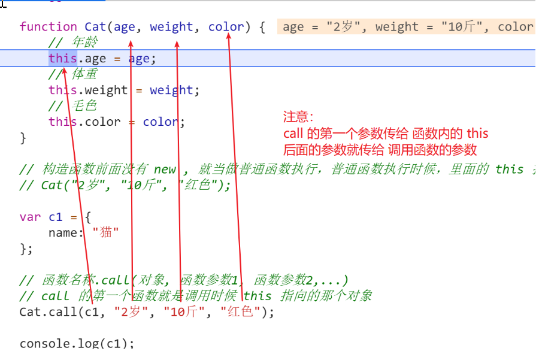

#### 参考代码

```js
 // 人类 Person 构造函数     基类
function Person(name, sex, age) {
    // 名字
    this.name = name;
    // 性别
    this.sex = sex;
    // 年龄
    this.age = age;
}
// 学生 Student 构造函数   
function Student(name, sex, age, number) {
    // 通过 call 继承 Person 的 名字，性别，年龄 三个属性
    Person.call(this, name, sex, age);
    // 独立写个学号属性
    this.number = number;
}
```


### 方法继承

主要利用 `原型对象` 继承，因为我们的方法都写在原型对象上。

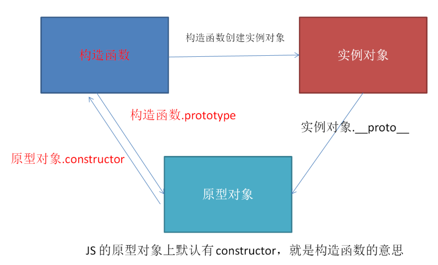

#### 参考代码

```js
 //  把人类实例对象，赋值给 学生 的原型对象
Student.prototype = new Person();
// 由于组合继承是覆盖了原本的原型对象，所以原本的 constructor 属性就没有了，手动修正
Student.prototype.constructor = Student;
```


### 组合继承练习

需求：使用组合继承，学生类 继承 人类的 属性 和 方法。

```js
人类 Person      基类
​	属性：
​		名字：xx,
​		性别：xx,
​		年龄：xx
​	方法：
​		跑技能：
​		说技能：

学生 Student
​	属性：
​		名字：xx,
​		性别：xx,
​		年龄：xx,
​		学号：xx
​	方法：
​		跑技能：
​		说技能：
​		写代码技能：
```

### 组合继承对象输出

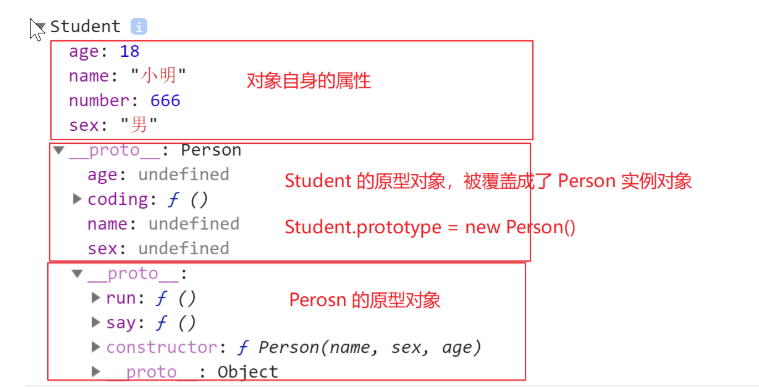

#### 参考代码

```js
<!DOCTYPE html>
<html lang="en">

<head>
    <meta charset="UTF-8">
    <meta name="viewport" content="width=device-width, initial-scale=1.0">
    <meta http-equiv="X-UA-Compatible" content="ie=edge">
    <title>Document</title>
</head>

<body>
    <script>
        debugger;
        // 人类 Person 构造函数     基类
        function Person(name, sex, age) {
            // 名字
            this.name = name;
            // 性别
            this.sex = sex;
            // 年龄
            this.age = age;
        }

        // 人类原型对象添加方法 run
        Person.prototype.run = function () {
            console.log("人跑的方法被调用了");
        }

        // 人类原型对象添加方法 say 
        Person.prototype.say = function () {
            console.log("人说话的方法被调用了");
        }

        // 学生 Student 构造函数   继承人类的所有属性和方法
        function Student(name, sex, age, number) {
            // 通过 call 继承 Person 的 名字，性别，年龄 三个属性
            Person.call(this, name, sex, age);
            // 独立写个学号属性
            this.number = number;
        }

        // 方法继承需要用到 原型对象
        //  把人类实例对象，赋值给 学生 的原型对象
        Student.prototype = new Person();
        // 由于组合继承是覆盖了原本的原型对象，所以原本的 constructor 属性就没有了，需要手动修正
        Student.prototype.constructor = Student;

        // 写代码技能，需要写到后面，否则会被覆盖掉
        Student.prototype.coding = function () {
            console.log("写代码方法被调用了");
        }

        // 实例对象
        var s1 = new Student("小明", "男", 18, 666);

        // 输出实例对象
        console.log(s1);
 
        // 调用实例对象原型的方法
        s1.say();
        s1.run();
        s1.coding();
    </script>
</body>

</html>
```

### 小结

组合继承实现继承。


## 4.对象成员访问规则

### 目标

了解 对象成员(属性和方法) 访问规则

### 查找规则

1. 先在对象自身上找
2. 如果对象自身找不到，就找原型对象上的属性和方法
3. 原型对象上没有，继续找原型对象的原型对象
4. 如果属性查找到最后都没有，就返回 undefined，如果方法找到最后都没有，就报错。

### 小结

概括：原型上的属性和方法都是共享的，遵循`就近原则` 使用。

其实就是某个属性或方法在 对象自身 和 原型对象 上查找到之后就不继续查找。


## 5.ECMAScript6 的 class 继承

### 目标

学习 ECMAScript6 的 class 继承


### 概念

JavaScript 三大组成：ECMAScript  DOM  BOM

ECMAScript 5 ，2009 年的语法标准，  构造函数继承语法需要自己组合继承实现 (主流浏览器都支持)

ECMAScript 6 ，2015 年制定的标准 ，Class 类创建对象和实现继承。(浏览器局部支持)

class 语法是 ECMAScript 6 制定的标准。


### class 基本语法

```js
class Person {
    // 类语法的 constructor 方法写属性
    constructor(name, age) {
        this.name = name;
        this.age = age;
    }
    // 类语法的方法，直接书写方法到同级即可
    say() {
        console.log("你好我是：" + this.name);
    }
}

var p1 = new Person("小明",19);
```


### 练习

用 ES6 的 class 语法分别实现 Person 和 Student。

```js
人类 Person      基类
	属性：
		名字：xx,
		性别：xx,
		年龄：xx
	方法：
		跑技能：
		说技能：

学生 Student
	属性：
		名字：xx,
		性别：xx,
		年龄：xx,
		学号：xx
	方法：
		跑技能：
		说技能：
		写代码技能：
```

### class 继承

知识点

```js
extends 主要用于继承方法，extends  是一个继承的关键词。

super() 主要用于继承属性，super 是一个函数。
```

注意：calss 语法中 extends 可以单独使用，super 函数不能单独使用，super函数使用的时候必须有 extends。

### 参考代码

```js
  <script>
    // 创建 Person 基类
    class Person {
      // 在 constructor 构造函数里面写属性
      constructor(name, gender, age) {
        this.name = name;
        this.gender = gender;
        this.age = age;
      }

      // 直接在 constructor 构造函数同层级下面写方法
      // 跑 方法
      run() {
        console.log("调用了跑的方法...");
      }

      // 说方法
      say() {
        console.log("调用了说的方法...");
      }
    }

    // 创建 Student 类
    class Student extends Person {  
      constructor(name, gender, age, stuNumber) {
        // 使用super继承Person父类的属性，相当于之前的 Person.call(this, xxx,xxx)
        super(name, gender, age)
        this.stuNumber = stuNumber;
      }
      // extends关键词继承父类的方法，我们正常写类方法即可
      // 写代码 方法
      coding() {
        console.log("调用了 写代码 方法!");
      }
    }

    var s1 = new Student('赵四', '男', 30, '30f323-32381832-321328183');

    console.log(s1); // 4个属性,3个方法
    s1.run();
    s1.say();
    s1.coding();
  </script>
```


### 小结

ECMAScript 6 的 class 语法是未来的标准，本质是 构造函数 的语法糖。

class 继承 语法。


## 6.改变调用函数 this 的指向

### 目标

学习 call apply bind

### call

```js
函数名称.call(一般传入对象, 参数1, 参数2)
```

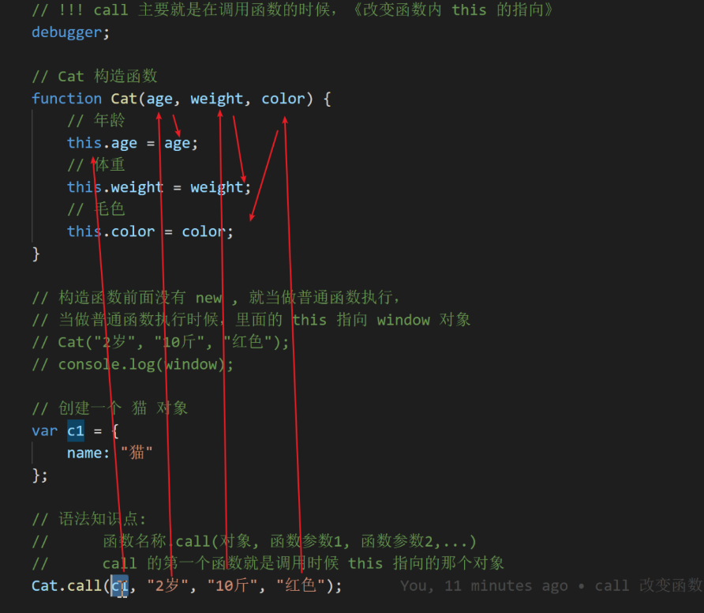

### apply

```js
函数名称.apply(一般传入对象, [参数1, 参数2])
```

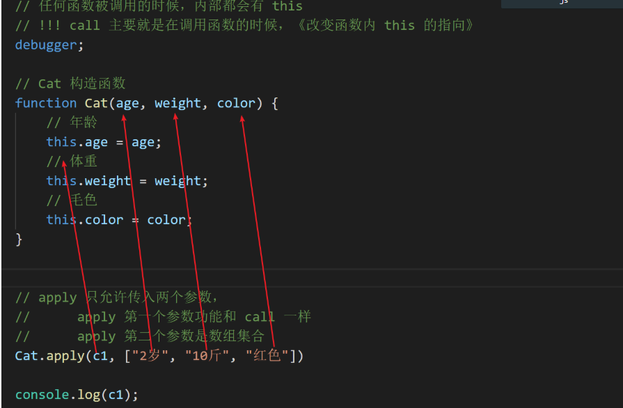

### bind

```js
函数名称.bind(对象,参数1,参数2)
```

bind 能改变 this 的指向，但是默认函数不调用。


bind的应用场景

```js
<!DOCTYPE html>
<html lang="en">

<head>
  <meta charset="UTF-8">
  <meta name="viewport" content="width=device-width, initial-scale=1.0">
  <title>Document</title>
</head>

<body>
  <input type="button" id="btn" value="点击按钮，数字定时增加">
  <script>
    // 需求：点击按钮，数字定时增加
    var btn = document.querySelector('#btn');
    // 给按钮增加点击事件
    btn.addEventListener("click", function () {
      // 第一个函数内的this指向btn
      // console.log(this)
      // console.log(this === btn);
      var num = 0;
      // bind的功能，复制一个新的函数，改变函数内部的this指向
      window.setInterval(function () {
        console.log(this);
        // 第二个函数默认指向 window， bind（this）之后会变成 btn
        // console.log(this);
        // 通过bind改变函数内的this的指向，改变成btn
        this.value = ++num;
        // bind(this) 把事件源的this传到定时器函数内部
      }.bind(this), 1000);
    })
  </script>
</body>

</html>
```


### 小结

| 区别                     | call     | apply                        | bind                    |
| ------------------------ | -------- | ---------------------------- | ----------------------- |
| 是否改变函数内 this 指向 | 是       | 是                           | 是                      |
| 参数个数                 | 不限个数 | **两个参数，第二参数是数组** | 不限个数                |
| 函数是否被调用           | 是       | 是                           | **否，bind 默认不调用** |

```js
call 是基本的改变 this 指向的函数，他的功能也可以被 apply 和 bind 取代。
可以利用 call apply bind 的特征去借用其他函数。
```


## 7.利用 apply 求数组的最大值

### 思路

数组中没有求最大值的方法

Math 对象有求最大值的方法 Math.max()

问题是 Math.max() 是一个个传递的，不能传入数组，怎么办？

**解决方案：利用 apply 可传入数组**

### 参考代码

```js
debugger;
// 字面量：创建数组
var arr1 = [11, 22, 33, 44];
// 构造函数：创建数组
var arr2 = new Array(11, 22, 33, 44);

// 数组的原型
// 保险起见，如果 Array 的原型上没有求最大值的时候才添加功能
if (Array.prototype.max === undefined) {
    Array.prototype.max = function () {
        // 参数 null，代表不需要改变函数内 this 的指向
        // 参数 this，表示指向调用 max 函数时的那个对象
        return Math.max.apply(null, this);
    }
}

if (Array.prototype.min === undefined) {
    // 数组的原型
    Array.prototype.min = function () {
        // 参数 null，代表不需要改变函数内 this 的指向
        // 参数 this，表示指向调用 min 函数时的那个对象
        return Math.min.apply(null, this);
    }
}


// 所有 数组 都是 Array 构造函数的实例对象
console.log(arr1);
console.log(arr2);

// 数组本质是实例对象，实例对象能共享原型的 max 方法
var res1 = arr1.max();
var res2 = arr2.max();

// 输出最大值
console.log(res1);
console.log(res2);
```


## 8.练习：让所有的数组都可以求最大值

### 知识点

1. Math.max() 可以求最大值
2. apply 用法，第二个参数是数组
3. Array.prototype 原型对象，数组其实就是 Array 的实例对象，所以都能共享原型上的方法。


### 参考代码

````js
debugger;
// 字面量：创建数组
var arr1 = [11, 22, 33, 44];
// 构造函数：创建数组
var arr2 = new Array(11, 22, 33, 44);

// 数组的原型
// 保险起见，如果 Array 的原型上没有求最大值的时候才添加功能
if (Array.prototype.max === undefined) {
    Array.prototype.max = function () {
        // 参数 null，代表不需要改变函数内 this 的指向
        // 参数 this，表示指向调用 max 函数时的那个对象
        return Math.max.apply(null, this);
    }
}

if (Array.prototype.min === undefined) {
    // 数组的原型
    Array.prototype.min = function () {
        // 参数 null，代表不需要改变函数内 this 的指向
        // 参数 this，表示指向调用 min 函数时的那个对象
        return Math.min.apply(null, this);
    }
}


// 所有 数组 都是 Array 构造函数的实例对象
console.log(arr1);
console.log(arr2);

// 数组本质是实例对象，实例对象能共享原型的 max 方法
var res1 = arr1.max();
var res2 = arr2.max();

// 输出最大值
console.log(res1);
console.log(res2);
````


## 9.this 常见应用场景指向

### 目标

能够说出不同函数调用方式下 this 的指向


### 概念

口诀：this 默认指向<调用>该<函数>的那个<对象>。

通俗讲法：谁调用函数，this 就指向谁。


```js
注意这三个关键词：
	<函数>：this 一般出现在函数内部
	<调用>：this 的指向其实是在调用的时候才确定的
	<对象>：this 一般指向某个对象
```


### 常见应用场景

1. 普通函数
2. 对象字面量的方法
3. 事件处理函数
4. 定时器的回调函数
5. 构造函数
6. 原型对象的方法


### 参考代码

```js
debugger;
// 把函数保存到变量 fn 种，不同场景调用时 this 指向不同
var fn = function () {
    console.log(this);
}

// 1. 普通函数直接调用
//   this 指向：window 对象
fn();
// console.log(window.fn === fn);

// 2. 对象字面量的方法
//   this 指向：指向调用的对象
var obj = {
    name: "小米",
    say: fn
}
obj.say();

// 3. 事件处理函数，!! 事件需要触发才会有 this 输出
//     this 指向：事件源 对象
// document.onclick = function(){};
document.onclick = fn;
document.addEventListener("click", fn);

// 4. 定时器的回调函数
//      this 指向：window 对象
// window.setInterval(fn, 10000);

// 5. 构造函数： 
//     this 指向：!! 特别的，this 指向实例对象
function Person() {
    this.name = "小明";
}
// 构造函数通过 new 关键词调用，new 会创建一个新的对象
var p1 = new Person();   // 构造函数执行完毕后把 实例对象 赋值给 p1

// 6. 原型对象
//      this 指向：原型对象方法一般被实例对象调用，所以指向调用的实例对象
Array.prototype.max = fn;
// arr 是 Array 的实例对象
var arr = [11];
// 实例对象 arr 调用了 max，所以内部的 this 指向 arr
arr.max();
```


### 小结

|                      | this 指向  | 备注                                               |
| -------------------- | ---------- | -------------------------------------------------- |
| 普通函数             | window     |                                                    |
| 对象字面量的方法 obj | 对象       |                                                    |
| 事件处理函数         | 事件源     |                                                    |
| 定时器的回调函数     | window     | 因为定时器是 window对象下的方法                    |
| **构造函数**         | 实例对象   |                                                    |
| 原型对象的方法       | 调用的对象 | 原型对象的方法一般被实例对象调用，所以指向实例对象 |


### 总结

面向对象三大特征：

​	封装，继承，[多态]

​	JavaScript里面没有多态


组合继承

​	属性继承：

​		`call ` 继承属性，借用需要继承的构造函数

​	方法继承：

​		原型对象继承方法

​		`Student.prototype = new Person()`

​		`Student.prototype.constructor = Student`


class 继承

​	ECMAScript 6 新版本的语法，其实本质就是构造函数的语法糖。


```js
class Person{
    constructor(){
        // 写属性
    }
    方法名(){
        
    }
}

class Student extends Person{
    constructor(){
        // 写属性
        super();
    }
    方法名(){
        
    }
}
```

this 指向口诀：this 指向调用该函数的那个对象。


# JS面向对象编程 Day4

------

## 1.学习目标

- [x] 函数创建方式  -  3 种
- [x] 函数是对象 - 函数成员(属性和方法)
- [x] 函数作为参数或返回值
- [x] 沙箱函数 - 自调用函数
- [x] 闭包函数的作用
- [x] 形成闭包的条件
- [x] 断点调试工具查看闭包执行过程
- [x] 递归函数使用场景
- [x] 递归计算n个数字的累乘(n阶乘)


## 2.函数

### 目标

了解函数基本概念

### 概念

函数是 JavaScript 一等公民，地位非常重要。

函数 其实是 对象，函数有 `prototype` 属性 有  `call,apply,bind` 方法，

实例对象又是通过构造函数创建出来，`new 构造函数()` 创建实例对象。


### 函数的三种创建方式

```js
// #1 函数声明
function fn1() {
	console.log("创建函数方式1：函数声明，被调用了");
}

// #2：函数表达式
var fn2 = function () {
	console.log("创建函数方式2：函数表达式，被调用了");
}

// #3: new Function 构造函数
var fn3 = new Function("console.log('创建函数方式3：函数表达式，被调用了')");
//  所以说函数本质也是对象

// 在控制台 console.dir() 用对象方式输出
console.dir(fn1);
console.dir(fn2);
console.dir(fn3);

// 三个函数都能被调用
fn1();
fn2();
fn3();
```

### 小结

函数三种创建方式回顾。

其实所有的函数都是 `Function 构造函数` 的 `实例对象` 。

了解：

`new Function` 的特殊功能，字符串可以解析成 JS 代码并运行。

后续学习的一些框架里面，我们使用的时候，写成字符串的形式代码可以被当做  JS 语句执行，

原理其实就是 `new Function` 或 `eval` 把JS解析成可执行的 JS 代码。


## 3.函数成员

### 目标

查看函数成员（函数的属性和方法）

### 概念

函数是对象，对象就有 属性 和 (原型)方法。

属性：

| 属性名      | 解释                        | 备注                       |
| ----------- | --------------------------- | -------------------------- |
| `prototype` | 函数的原型对象              | 重要                       |
| `__proto__` | Function 构造函数的原型对象 | 函数是 Function 的实例对象 |
| arguments   | 所有实参集合                | 伪数组                     |
| name        | 当前函数名                  | 了解即可                   |
| length      | 函数形参个数                | 了解即可                   |
| caller      | 调用该函数的函数            | 了解即可                   |

方法(原型方法)：

| 方法名 | 功能                          | 方法是否调用函数 | 参数                   |
| ------ | ----------------------------- | ---------------- | ---------------------- |
| call   | 改变函数的this指向            | 调用             | 不限个数               |
| apply  | 改变函数的this指向            | 调用             | 两参数，第二参数为数组 |
| bind   | 复制返回新函数，改变 this指向 | 不调用           | 不限个数               |
| ...... |                               |                  |                        |


### 参考代码

```js
// 外层函数
function fn2() {
    // 定义 里层函数，定义 3 个形参
    function fn1(a, b, c) {
        console.log("函数被调用了");
        // 在控制台用对象形式输出函数
        console.dir(fn1);
        console.log(fn1.arguments);     // 所有实参集合
        console.log(fn1.caller);        // 调用该函数的外层函数
    }
	// 调用 里层函数 并传入 3 个实参
    fn1(111, 22, 33);
    // 其实 apply ，call ，bind 这些方法是在 原型对象 上有，所以能调用
    // fn1.apply();
}
fn2(111);
```


### 控制台输出截图

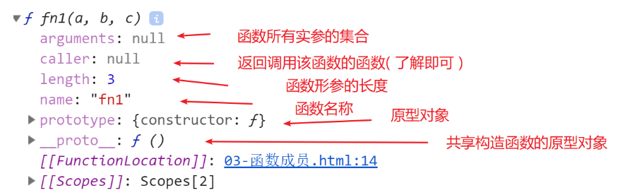

### 小结

函数的本质是不是对象？有哪些学习过的函数属性和方法？

为什么所有的函数都有  `prototype` 和 `__proto__` ?


## 4.沙箱函数 - 自调用函数

### 目标

学习沙箱函数

### 概念

沙箱主要价值：防止变量名称冲突，避免对项目造成变量污染影响。

沙箱函数内创建的变量都是局部变量，不会和其他函数变量名冲突。


### 局部变量主要形式

1. 函数的形参名
         	2. 函数内创建的变量名
   1. 函数内创建的函数名


### 沙箱函数写法

写法1：

```js
(function(){
    
})()
```

写法2：

```js
(function(){
    
}())
```

保险写法：(两个分号，能防止别人的代码影响我们，避免我们的沙箱影响别人)

```js
;(function(){
    
})();
```

### 沙箱函数的形参和实参

```js
;(function(形参){
    
})(实参);
```

后面的括号用于调用函数，前面的括号用于接收参数。

### 小结

沙箱函数的价值？
`避免变量名称冲突。`

沙箱函数的形参和实参？

`后面的括号用于调用函数并且传入实参，前面的括号用于接收形参`


## 5.函数作为参数 -  回调函数

### 目标

了解回调函数


### 回调函数概念

回调函数：等待某个时机再执行的函数。


### 函数作为参数的场景

1. 事件的处理函数其实就是回调函数，执行时机，时机被触发的时候，执行事件处理函数内的代码。
2. 定时器传入的函数也是回调函数，执行时机，定时器时间到了，自动执行函数体内的代码。
3. jQuery 动画回调函数，执行时机：动画结束后，执行回调函数内的代码。

了解：

以后还会有回调函数的场景：如 Ajax 请求数据的时候，请求成功的时机，再执行回调函数。


### 小结

之前我们在哪些场景把函数作为参数使用？


## 6.函数作为返回值

### 目标

函数作为返回值


### 参考代码

```js
// 外层函数
function fn1() {
     console.log("执行了外层函数 fn1");
     // 里层函数 - 局部的函数
     function fn2() {
         console.log("执行了里层函数 fn2");
     }
     // 把 里层函数 作为 外层函数的 返回值
     return fn2;
}
// 等号右边：调用外层函数
// 等号左边：接收外层函数的返回值,返回值其实就是 里层 的 fn2
var res = fn1();
// 执行了 res，就是执行了 fn2 这个里层函数
res();
```


### 小结

在 JS 中，函数可以作为另一个函数的返回值。

返回的函数可以在外面被调用到。


## 7.闭包函数  - Closure  *

### 目标

学习闭包函数


### 闭包特点

1. 函数套函数
2. 外层函数创建局部变量
3. 里层函数使用外层函数的局部变量
4. 里层函数能被调用执行


### 参考代码

```js
debugger;
// 1.1 外层函数
function fn1() {
    console.log("执行了外层函数 fn1");
    // 2. 外函数创建局部变量
    var num = 1;
    // 1.2 里层函数 - 函数套函数
    function fn2() {
        console.log("执行了里层函数 fn2");
        // 3. 里函数使用到外函数的局部变量
        num++;
        console.log(num);
    }
    return fn2;
}
// res 接收里层函数
var res = fn1();
// 4. 里层函数能被调用执行
res();	// 2
res();  // 3
```

### 调试工具截图

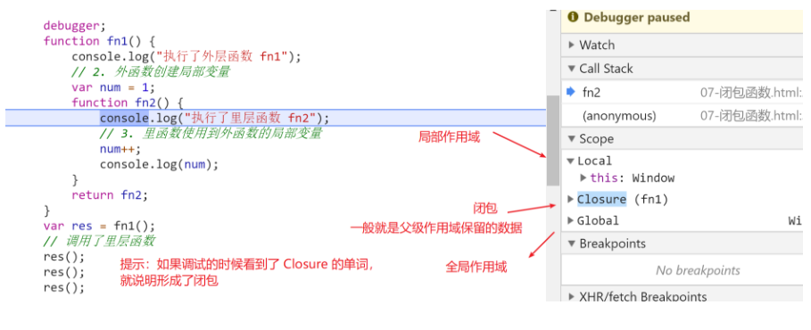


### 函数作用域

#### 目标

学习函数作用域


#### 概念

在 JS 中，一个函数就是一个独立作用域，函数内创建的变量都是局部变量。

访问规则：内层作用域可以访问外层作用域，反之不行。


#### 作用域链参考代码

```js
var a = 10

function fn () {
  var b = 20

  function fn1 () {
    var c = 30
    console.log(a + b + c)	// 有结果
  }

  function fn2 () {
    var d = 40
    console.log(c + d)		// 报错
  }

  fn1()
  fn2()
}
```

- 内层作用域可以访问外层作用域，反之不行

#### 作用域链图解

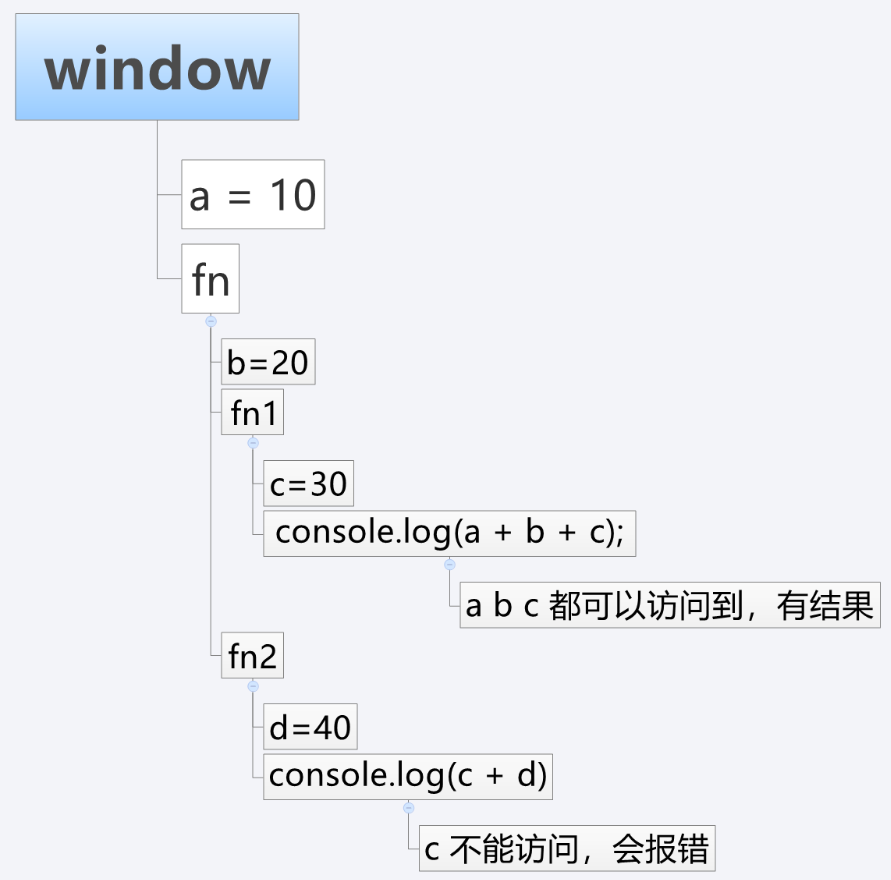


