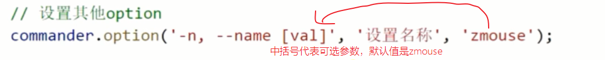

# commander.js入门

## commander.js是什么？


## commander.js使用


## 前端文件自动合并

前端工程中的文件热更新，CSS、JS代码自动压缩合并的原理其实就是通过监听文件变动，然后进行一些列的操作。

```js
const fs = require('fs');
const filedir = './source';
fs.watch(filedir, function (ev, file) {
  // console.log(ev + '/' + file); // 这里不需要判断file是否有内容

  // 只要有一个文件发生了变化，我们就需要对这个文件夹下的所有文件进行读取然后合并
  fs.readdir(filedir, (err, dataList) => {
    let arr = [];
    console.log("dataList: ", dataList);
    dataList.forEach((f) => {
      if (!f) return;
      let info = fs.statSync(filedir + '/' + f)
      if (info.mode === 33206) {
        arr.push(filedir + '/' + f)
      }
    })

    // 读取数组中的文件内容并且合并
    let content = "";
    arr.forEach((item) => {
      let c = fs.readFileSync(item);
      content += c.toString() + "\n";
    })
    fs.writeFile('./demo/js/index.js', content, function (e) {
      console.log(e);
    });
  })
})
```


## 



## ls命令案例


