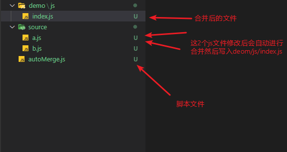
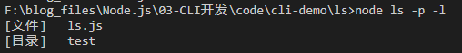
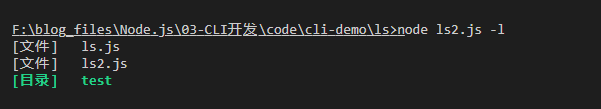
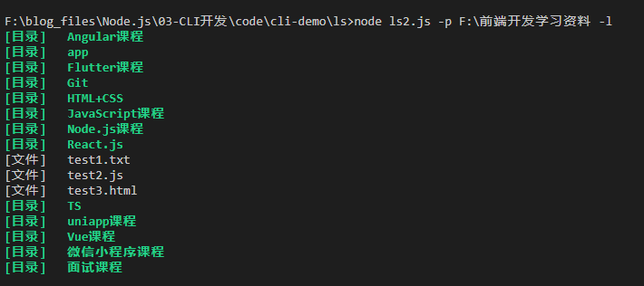

## Node.js能做什么？

**开发方向**

GUI - Graphical User Interface ： 图形用户界面	office、vscode、浏览器、播放器……

CLI - Command-Line Interface：命令行界面，也称为 CUI，字符用户界面；虽然没有GUI操作直观，但是CLI更加节省计算机资源（所以一般用于服务器环境）babel、tsc / webpack / vue-cli

Server - 服务提供（**Web Server**、IM……）

这篇博客主要分享一点点使用node.js开发cli工具的知识。

## 前端文件自动合并

前端工程中的文件热更新，CSS、JS代码自动压缩合并的原理其实就是通过监听文件变动，然后进行一系列的操作。

```js
const fs = require('fs');
const filedir = './source';
fs.watch(filedir, function (ev, file) {
  // console.log(ev + '/' + file); // 这里不需要判断file是否有内容

  // 只要有一个文件发生了变化，我们就需要对这个文件夹下的所有文件进行读取然后合并
  fs.readdir(filedir, (err, dataList) => {
    let arr = [];
    console.log("dataList: ", dataList);
    dataList.forEach((f) => {
      if (!f) return;
      let info = fs.statSync(filedir + '/' + f)
      if (info.mode === 33206) {
        arr.push(filedir + '/' + f)
      }
    })

    // 读取数组中的文件内容并且合并
    let content = "";
    arr.forEach((item) => {
      let c = fs.readFileSync(item);
      content += c.toString() + "\n";
    })
    fs.writeFile('./demo/js/index.js', content, function (e) {
      console.log(e);
    });
  })
})
```



其实node.js可以写很多类似的工具，下面我们就来学习下如何编写一个cli。

## CLI介绍

CLI就是我们常用的命令行界面中的一些工具，比如vue-cli就是一个典型的例子，我们可以通过`vue create app`命令创建一个名称为app的项目。

command [subCommand] [options] [arguments]
		command：命令，比如 vue
		[subCommand]：子命令，比如 vue create
		[options]：选项，配置，同一个命令不同选项会有不一样的操作结果，比如 vue -h，vue -v
		[arguments]：参数，某些命令需要使用的值，比如 vue create myApp
		选项与参数的区别：选项是命令内置实现，用户进行选择，参数一般是用户决定传入的值


选项一般会有全拼与简写形式（具体看使用的命令帮助），比如 --version = -v
全拼：以 -- 开头 / 简写：以 - 开头
选项也可以接受值，值写在选项之后，通过空格分隔
多个简写的选项可以连写，开头使用一个 - 即可，需要注意的是，如果有接受值的选项需要放在最后，比如：
	vue create -d -r <-r的值> myApp
	vue create -dr <-r的值> myApp

## 开发CLI的第三方框架

### 1.commander

命令行开发工具，TJ大神出品，[官网](https://github.com/tj/commander.js)

安装`npm install commander`

**demo1**

```js
const commander = require('commander');

// 设置当前命令的版本
commander.version("v1.0.0", '-v, --version');
/**
 * 设置其他option，--name 后面的 [val] 是当前这个选项的参数值
 * []表示可选，<>表示必填
 * 如果第三个参数是一个函数的话，那么该函数会接收来自用户输入的值并返回最后一个值最为这个参数实际的值
 */
// commander.option('-s, --setname [val]', '设置名称', (val)=>{
//   console.log(val);
// })

// commander.option('-s, --setname <val>', '设置名称', (val)=>{
//   console.log(val);
// })

commander.option('-s --setname [val]', '设置名称', '我是默认值')

commander.command('create');

// 设置命令的动作
commander.action(() => {
  // 这里的setname其实是option中设置的完整命令变量名，用户输入命令之后，commander会自动挂载
  console.log("Hello " + commander.setname);
})

// 解析来自process.argv上的数据，commander会自动帮助我们添加一个 -h 的解析
commander.parse(process.argv);
```

**demo2**

```js
const commander = require('commander');
const fs = require('fs');

commander.version('v1.0.0', '-v, --version');

commander.option('-s --setname [val]', '设置名称', '');

commander.command('create <app-name>')
.description('创建项目')
.alias('c')
.usage('使用说明')
.action(appName=>{
  console.log("项目名称: ", appName);
  // 使用fs.existsSync API判断文件夹是否存在
  if(fs.existsSync(appName)) {
    return console.log("项目已经存在!");
  }
  fs.mkdirSync(appName)
  console.log("[+] project init success!");
})

commander.parse( process.argv );
```

**.parse(argv: string[])**
解析执行传入的 argv 命令字符串，通常该命令字符串来自用户在命令行的输入，process.argv；
commander 同时会默认创建一个 -h, --help 的选项。

**.version(str, flags?)**

设置版本信息，该方法会自动为命令注册一个 -V,  --version 的 option；
str：版本号
flags：指定的 option，默认为：" -V, --version "

**.option(flags, description?, fn?, defaultValue?)**
设置命令选项
flags：选项标记名称，”-v, --version”
description：选项使用说明
fn：默认值，函数返回值为defaultValue，优先级高于defaultValue
defaultValue：选项默认值，如果需要的话


**选项属性**
		flags 中的格式可以接收参数
		-n, --setname[val]
		-n, --setname<val>
			[] 可选
			<> 必填
		设置成功以后，会在命令对象下增加一个与全局的同名的属性

**.action(fn)**
		指定命令要执行的动作行为
		该函数执行过程会接收到至少一个参数
		如果命令中带有参数，则是对应的参数列表
		参数的最后一个永远都是 commander 实例

**.command(name, desc?, opts?)**
		子命令
		name：命令的名称，也可以接受值  'create [appName]'
		desc：简介
		opts：配置

**.description(str)**
   	命令描述
	.alias(str)
		设置命令别名
	.usage(str)
		设置或获取当前命令的使用说明

**ls案例**

```js
/**
 * ls
 * 输出当前运行命令所在的目录下的文件和文件夹
 * ls d:\
 * 我们还可以指定要显示的目录
 */

// 加载commander和fs模块
const commander = require('commander');
const fs = require('fs');

// 设置当前命令工具的版本
commander.version('v1.0.0', '-v, --version');

// 设置命令选项 默认值是当前目录
commander.option('-p, --path [path]', '设置要显示的目录', __dirname);

// 以列表的形式显示，如果选项不接受用户输入的值，那么这个选项将以boolean的形式提供给后面命令使用
commander.option('-l, --list', '以列表的形式显示');

// 实现命令的具体逻辑
commander.action(()=>{
  // option中的变量会挂载到当前commander
  // console.log(commander.path);
  // console.log(commander.list);
  try {
    // 读取用户输入的目录
    const files = fs.readdirSync(commander.path);
    if(commander.list) {
      // 用户输入了-l，以列表的方式展示
      let output = files.map(item=>{
        // 文件的拓展信息，除了文件内容以外的信息
        let stat = fs.statSync(commander.path + '/' + item);
        // 根据isDirectory()显示不同的文件类型
        let type = stat.isDirectory() ? '目录' : '文件';
        return `[${type}]   ${item}\r\n`;
      }).join('');
      console.log(output);
    }else {
      console.log(files);
    }
  } catch (error) {
    console.log(error);
  }
})

commander.parse(process.argv);
```

使用方式1：什么都不传默认列出当前目录文件夹和文件，-p代表路径，-l代表是否以列表方式显示



使用方式2：传入指定路径


### 2.chalk

node中命令行样式风格控制器，[官网](https://github.com/chalk/chalk)

**安装：**`npm install chalk`

**使用方式：**

`const chalk = require('chalk')`得到一个 chalk 对象，通过这个对象，我们就可以给控制台中的文字加上各种样式了，就像css一样。

**语法：**

```js
chalk.<style>[.<style>...](string, [string...])
```


**Styles**
		Modifiers 文字修饰：
		bold Colors 文字颜色：red、green、yellow、blue、cyan 
		Background colors 背景颜色：bgRed、bgGreen、bgYellow、bgBlue、bgCyan

**Colors**
		.hex('#DEADED') 
		.keyword('orange') 
		.rgb(15, 100, 204)

**Background colors**
		.hex('#DEADED')
		.keyword('orange')
		.rgb(15, 100, 204)	


**添加了颜色的ls案例**

```js
const fs = require("fs");
const commander = require("commander");
// 引入美化命令行模块
const chalk = require("chalk");

// 设置当前cli的版本
commander.version('v1.0.0', '-v, --version');

// 设置命令选项，默认值是当前目录
commander.option('-p, --path [path]', '设置要显示的目录', __dirname);

// 以列表的形式显示
commander.option('-l, --list', '以列表的形式显示');

// 编写命令具体逻辑
commander.action(()=>{
  try {
    // 显示用户输入的路径下的所有文件和目录
    const files = fs.readdirSync(commander.path);
    if(commander.list) {
      let output = files.map(item=>{
        let stat = fs.statSync(commander.path + '/' + item);
        return stat.isDirectory() ? chalk.greenBright.bgBlack.bold(`[目录]   ${item}\r\n`) : `[文件]   ${item}\r\n`;
      }).join('');
      console.log(output);
    }else {
      console.log(files);
    }
  } catch (error) {
    console.log(error)
  }
})

commander.parse(process.argv);
```

使用：





### 3.inquirer

交互式命令，提问用户，收集用户输入数据，[官网](https://github.com/SBoudrias/Inquirer.js)

安装：`npm install inquirer`

使用：

`require('inquirer')`

```inquirer.prompt(questions).then(answers=>{

			...

		})


**questions**
		type：提问类型，input, confirm, list, rawlist, expand, checkbox, password, editor
		name：问题名称，供程序后续使用
		message：问题文字，给用户看的
		default：默认值
		choices：选项
		validate：输入验证
		filter：数据过滤


**input**
		提出问题，用户输入答案
		可用选项：type, name, message[, default, filter, validate, transformer]

**confirm**
		提出选择，用户选择 Y or N
		可用选项：type, name, message, [default]
		default如果提供，必须是 boolean 类型

**list**
		单选
		可用选项：type, name, message, choices[, default, filter]
		choices为一个数组，数组中可以是简单的字符串，也可以是一个包含了name和value属性的对象
		默认选中项为数组中某条数据的下标，通过default设置

**rawlist**
		单选
		可用选项：type, name, message, choices[, default, filter]
		choices为一个数组，数组中可以是简单的字符串，也可以是一个包含了name和value属性的对象
		通过数字进行选择

**checkbox**
		多选
		可用选项：type, name, message, choices[, filter, validate, default]
		choices 为一个对象数组，对象中 checked 属性 为 true 的表示默认选中项

**validate方法**
		对用户输入或选择的内容进行验证，返回boolean值，确定提问是否继续
		可以返回字符串作为验证失败的提示

**filter方法**
		对用户输入或选择的内容进行过滤
		接受一个参数：用户输入或选择的内容
		返回的值将作为过滤后的值

**demo**

​```js
const inquirer = require('inquirer');

// 提问用户，与用户进行命令行的交互
// prompt数组中存放一个指定格式的对象，我们称之为question对象
inquirer.prompt([{
    type: 'input',
    name: 'username',
    message: 'please input your project name',
    default: 'app',
    // 对用户输入的数据或选择的数据进行验证
    validate(val) {
      if (val.trim() === "") {
        return 'project name can not be empty'
      }
      return true;
    },
    // 对用户输入的数据或选择的数据进行过滤
    filter(val) {
      return val.toLowerCase();
    }
  },
  {
    type: 'confirm',
    name: 'useEs6',
    message: '是否启用ES6支持',
    default: true
  },
  /*   {
      type: 'list',
      name: 'framework',
      message: '请选择后端框架',
      choices: ['Express.js', 'Koa2.js', 'Egg.js'],
      default: 0
    }, */
  {
    type: 'rawlist',
    name: 'framework2',
    message: '请选择前端框架',
    choices: ['Vue', 'React', 'Angular'],
    default: 1
  },
  {
    type: 'checkbox',
    name: 'tools',
    message: '开发工具',
    choices: [{
        name: '使用ESLint',
        value: 'eslint',
        checked: true
      },
      {
        name: '使用mocha单元测试',
        value: 'mocha'
      }
    ]
  }
]).then(res => {
  console.log(res);
})
```

**效果演示：**


## 去除node

如果不想每次都输入node inquirer.js运行脚本，可以创建一个bat文件，然后将下面代码写入，下次直接运行这个bat脚本文件即可。下面的代码我们只需要关心文件名即可。

```basic
@IF EXIST "%~dp0\node.exe" (
  "%~dp0\node.exe"  "%~dp0\inquirer.js" %*
) ELSE (
  @SETLOCAL
  @SET PATHEXT=%PATHEXT:;.JS;=;%
  node  "%~dp0\inquirer.js" %*
)
```

## 个人问卷调查Demo

```js
/**
 * 个人问卷调查
 * 功能：
 *    1.姓名、用户输入、必填
 *    2.性别、用户选择、男女、默认男
 *    3.年龄、用户输入、必填
 *    4.手机号、用户输入、必填、作校验，必须符合正常的手机号格式
 *    5.选择你最熟悉的框架、[Vue,React,Angular]
 *    7.将信息写入脚本同目录下的log.txt
 */

const commander = require('commander');
const fs = require('fs');
const inquirer = require('inquirer');
const chalk = require('chalk');

inquirer.prompt([{
    type: 'input',
    name: 'username',
    message: '请输入你的姓名,请确保英文字符为小写',
    // 对用户输入的数据进行验证
    validate(val) {
      if (val.trim() === "") {
        return '姓名不能为空!'
      }
      return true; // 代表验证通过
    },
    filter(val) {
      return val.toLowerCase();
    }
  },
  {
    type: 'rawlist',
    name: 'gender',
    message: '请选择你的性别',
    choices: ['男', '女'],
    default: 0
  },
  {
    type: 'input',
    name: 'age',
    message: '请输入年龄',
    validate(val) {
      if (val.trim() === "") {
        return '年龄不能为空'
      }
      return true;
    }
  },
  {
    type: 'input',
    name: '手机号',
    message: '请输入手机号',
    validate(val) {
      console.log("phone number: ", val);
      let re = new RegExp(/^(13[0-9]|14[5|7]|15[0|1|2|3|4|5|6|7|8|9]|18[0|1|2|3|5|6|7|8|9])\d{8}$/);
      if (!re.test(val)) {
        return '请输入合法的手机号!'
      }
      return true;
    }
  },
  {
    type: 'list',
    name: 'framework',
    message: '请选择你最熟悉的框架',
    choices: ['Vue', 'React', 'Angular'],
    default: 1
  },
  {
    type: 'confirm',
    name: 'saveFile',
    message: '是否保存信息到本地',
    default: true
  },
]).then(res => {
  console.log(res);
  if (res.saveFile) {
    try {
      fs.writeFileSync(__dirname + '/logs/question' + Math.ceil(Math.random() * 100000000) + 'log.txt', JSON.stringify(res));
    } catch (error) {
      console.log(error)
    }
  }
})
```

## CLI补充

### commander 多个参数获取

```js
/**
 * commander.js commander多个参数获取
 */

 const commander = require('commander');

 const subCommand = commander.command('create <a> <b> <c>');


 // 在action的回调函数的列表中参数列表就是command定义的参数
 // option就是一个参数（选项）option('-p', --path <path>)
 subCommand.action((a,b,c)=>{
   console.log(a,b,c);
 })

 commander.parse(process.argv);
```

## Global CLI

配置package.json，关键是添加了bin这个关键字，bin的键就是包名，值就是main字段配置的的入口主文件。

```json
{
  "name": "global3714",
  "version": "1.0.2",
  "description": "",
  "main": "index.js",
  "bin": {
    "global3714": "index.js"
  },
  "scripts": {
    "test": "echo \"Error: no test specified\" && exit 1"
  },
  "author": "",
  "license": "ISC"
}
```

**index.js**

```js
#!/usr/bin/env node
console.log("Hello, my cli");
```

> #!/usr/bin/env node表示当前文件需要以node脚本执行

发布包到npm，然后别人全局安装你的包就可以使用了。

全局安装包的路径：`C:\Users\replaceroot\AppData\Roaming\npm`

