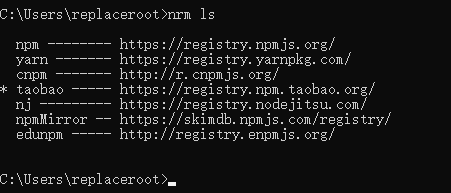
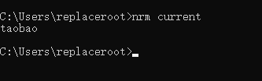
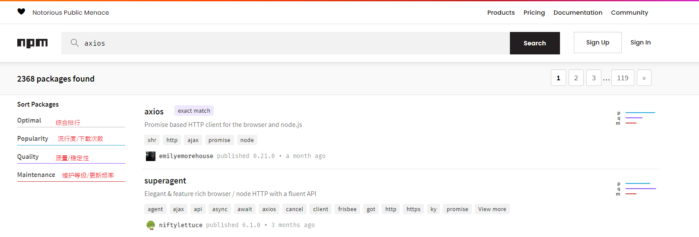
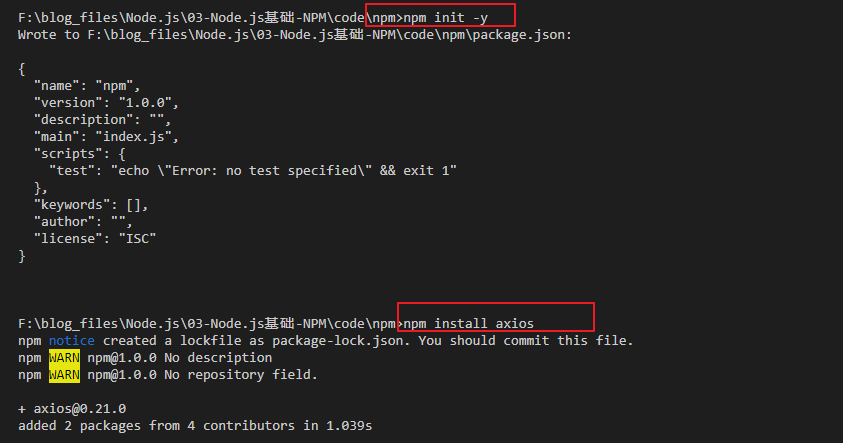
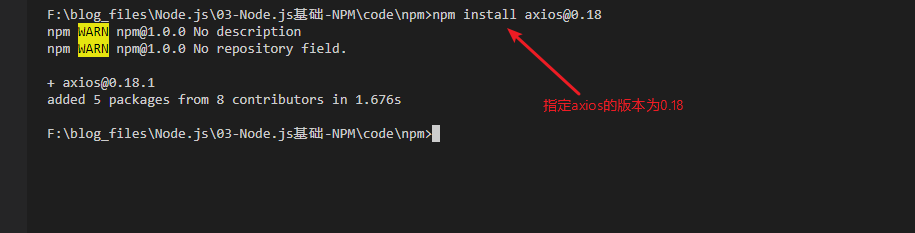
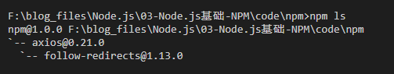
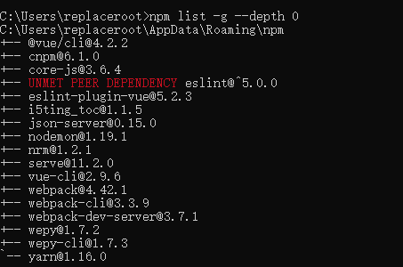
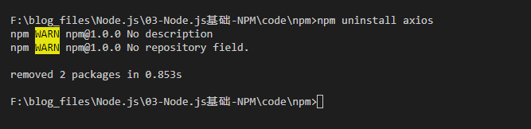
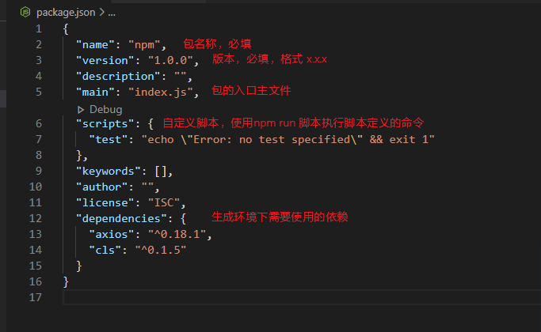
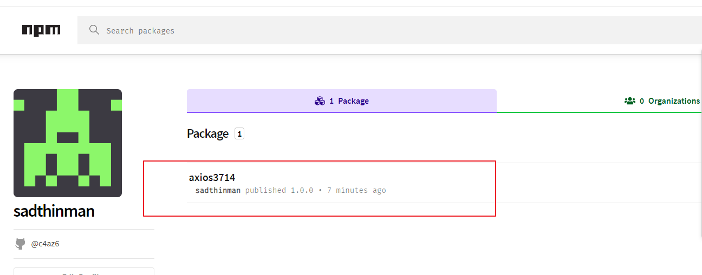

## NPM简介

[NPM官网](https://www.npmjs.com/)

一个Node.js的包/模块管理器，类似App Store，全称：`Node Package Manager`。

下面围绕npm源配置、搜索、下载（安装）、升级、删除、发布自己的node包（模块）展开讲解。

## 配置NPM源

由于npm默认源的服务器在国外，国内的网络访问速度不理想，因此可以通过切换源的方式加速访问。

查看npm当前源：`npm config get registry`

设置淘宝源：`npm config set registry=https://registry.npm.taobao.org/`

也可以通过nrm的方式。

nrm 是一个 npm 源管理器，允许你快速地在 npm源间切换。，通过`npm install -g nrm`安装。

**查看可选源，带*号表示你当前使用的源**

`nrm ls`

**查看当前源**

`nrm current`

**切换源**

`nrm use taobao`

## 搜索node包

直接进入npm官网搜索，下面以axios为例。

点击包名即可进入详细界面，可以看到每周下载次数和使用文档。

## 下载node包

在CMD界面输入`npm init -y`初始化package.json文件，然后使用`npm install`的方式安装包。

安装在当前项目目录（node_modules）下，根据模块访问规则，当前项目以及子项目可访问。一般用于安装项目独立使用的包。

### 1.安装指定版本的node包

### 2.安装全局包

`npm install -g <包>`

安装在 npm 指定的全局目录下，通过全局模块访问机制可以在全局范围内访问。一般用于安装工具性质的包。

## 查看已经安装的依赖

通过`npm ls`方式查看当前项目中安装的包。

查看全局环境下安装的包。

`npm list -g --depth 0`

| 命令      | 解释               |
| --------- | ------------------ |
| npm list  | 显示安装过的包     |
| -g        | 全局安装过的包     |
| --depth 0 | 显示输出模块的层级 |

## 升级node包

更新node包：`npm update`

> npm update更新依赖包不会更新主版本号，只会更新次版本号。
>
> 需要更新主版本直接npm install 覆盖安装即可。

## 删除node包

使用`npm uninstall`卸载。

## 发布自己的NPM模块包

package.json 文件，项目（模块、包）的说明配置文件，该文件描述了当前包的信息，只有拥有 package.json 文件的项目才可以被发布

### 1.初始化npm

`npm init -y`

### 2.package.json介绍

### 3.发布

1. 注册npmjs.org账号
2. 使用`npm adduser`或者`npm login`登录
3. `npm publish`发布

记得注册完账号之后验证一下邮箱，否则可能无法发布，报403的错误。

如果验证邮箱后还是403的话先把源设置成官方的，然后再登录发布，发布完成之后切换成淘宝的源即可。

发布完之后登录npmjs.com查看效果。

