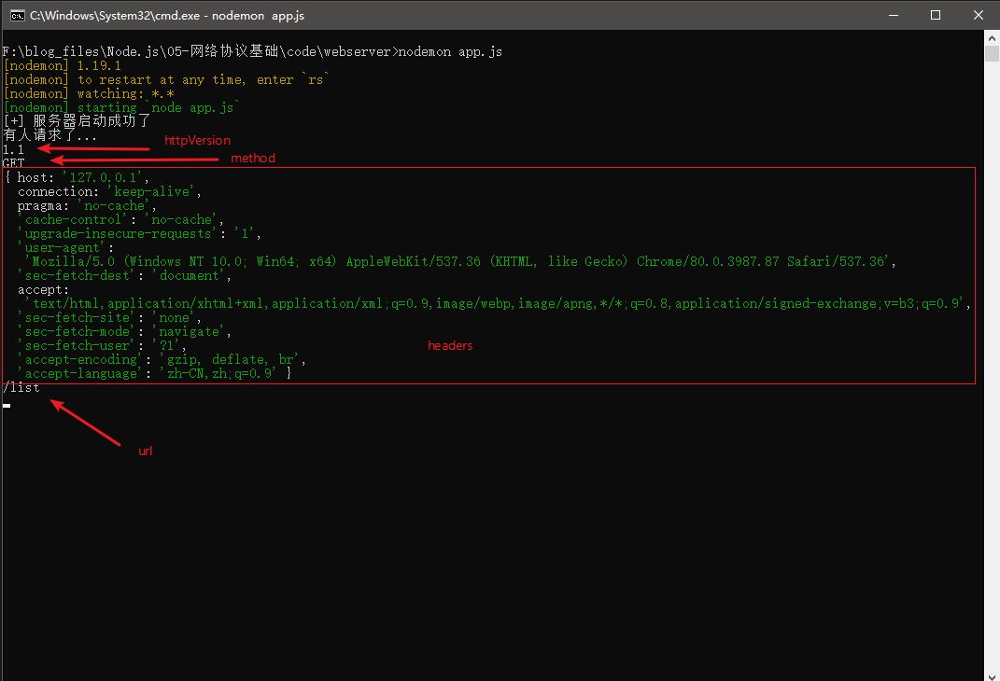
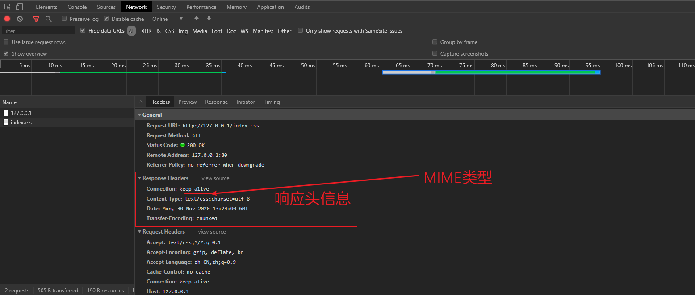
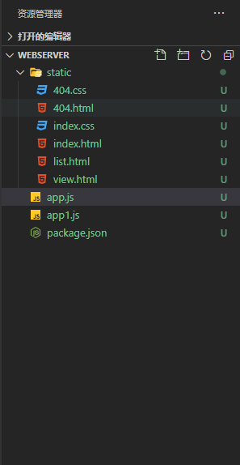
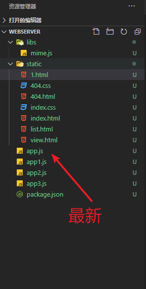
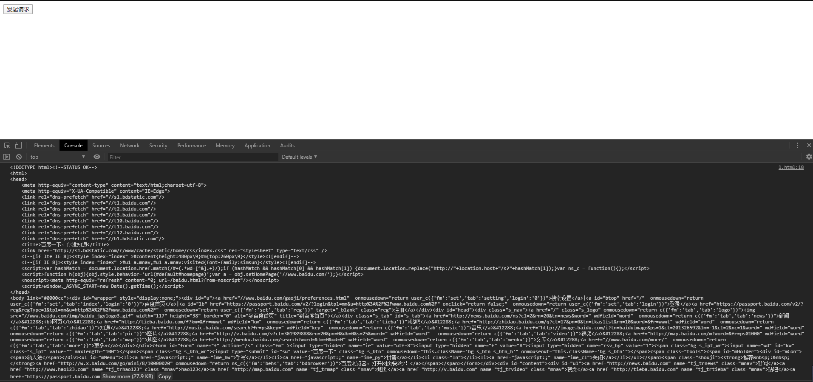

## 基础知识

### 网络的概念

为了能够让不同的计算机之间进行数据共享（分享），就需要在不同的计算机之间建立一种连接，通过某种方式连接在一起的计算机之间就组成了一个网络，在同一个网络中的计算机就可以通过一些制定好的规则进行通信与数据传输了。

**常见的网络连接方式：**

- 网线
- 无线
- 蓝牙


### 监听

一台计算机的数据都是通过网卡等设备进行传输的（发送和接受），那么也就是意味着我们电脑中运行的各种不同的软件使用可能都是同一块网卡；为了解决程序与程序之间数据传输，所以一个应用程序在使用网卡发送和接收数据的时候，需要指定你要监听的网卡（一台机器可能有多块网卡），同时还要指定一个端口号。


### 端口

类似我们去银行办理业务的窗口，不同的端口为不同的应用程序进行服务，当一个程序需要接收来自某块网卡设备的数据的时候，需要指定监听的端口，同时发送数据到某个地址（网卡）的数据也要指定接收方的端口号发送数据的端口由系统分配	一个应用程序可以同时监听多个网卡的多个端口，一个端口只能同时被一个程序监听，如果一个程序尝试监听一个已经被其他程序监听的端口，就会报端口占用的错误。


### 数据传输协议

TCP、UDP

| TCP                                              | UDP                                            |
| ------------------------------------------------ | ---------------------------------------------- |
| 可靠的、面向连接的协议、传输效率低               | 不可靠的、无连接的服务、传输效率高             |
| 适用于效率要求相对低，但对准确性要求相对高的场景 | 适用于效率要求相对高，对准确性要求相对低的场景 |
| 应用场景：文件传输、接收邮件、远程登录           | 应用场景：在线视频、网络语音电话               |


## Node.js中的UDP协议

### dgram

dgram模块提供了 UDP 数据包 socket 的实现，socket又称"套接字"，应用程序通常通过"套接字"向网络发出请求或者应答网络请求，其本质上就是一套用于实现网络数据交换的接口（API）。

### UDP demo

`server.js`

```js
// server端
const dgram = require('dgram');

// 1. 第一种创建socket服务的方式
// const server = new dgram.Socket();
/* 
  第二种创建方式，其实就是return new dgram.Socket()封装成一个API;
  第一个参数是协议类型，udp4表示IPV4，udp6表示IPV6
*/
// const server = dgram.createSocket('udp4', (data)=>{
//     console.log("receive data: ", data.toString());
// });

const server = dgram.createSocket('udp4');
server.on('error', err=>{
  console.log(`服务器异常: \n${err.stack}`)
  server.close();
});

server.on('message', (msg, rinfo)=> {
  console.log(`服务器接收到来自${rinfo.address}:${rinfo.port}的 ${msg}`)
});

server.on('listening', ()=>{
  const address = server.address();
  console.log(`服务器监听 ${address.address}: ${address.port}`);
});

/* 
  2. 监听端口
    使用server.bind([port],[,address],[,callback])
      port：未指定则由路由系统分配
      address：默认0.0.0.0，表示所有地址IP
      callback：绑定成功后的回调
*/
server.bind('4444', '127.0.0.1')
```

`client.js`

```js
// client端
const dgram = require('dgram');

// 1. 创建socket服务
const server = dgram.createSocket('udp4');
// 2.发送数据
server.send('hello, server', '4444', '127.0.0.1', () => {
  console.log("send data success!");
  // 3.关闭服务
  server.close();
});
```


## Node.js中的TCP协议

### net  模块

net 模块提供了创建基于流的 TCP 或 IPC 服务器(net.createServer())和客户端(net.createConnection()) 的异步网络 API。

**服务端**：提供服务，被连接，被请求的一方。

**客户端**：获取服务，发起连接，请求的一方。


### TCP  demo

实现一个从server端下载图片到本地的功能。

`server.js`

```js
/* 
  在node中，tcp协议基于 net 模块来实现
*/

const net = require('net');
const fs = require('fs');

/**
 * 创建一个服务器端
 *   1. 监听地址以及端口
 *   2. 处理发送到当前监听地址以及端口的数据
 *   3. 返回/发送 数据到连接的客户端
 * 
 * net.server类
 *   new net.Server()
 *   net.createServer() 等于 return new net.Server()
 */

const server = net.createServer(() => {
  // 这个函数其实就是connection事件绑定的函数
})
// 当有客户端连接的时候触发
server.on('connection', socket => {
  console.log("Welcome To TCP Server");
  // socket.write('连接者,你好.')
  // 发送一个图片给客户端
  let data = fs.readFileSync('./server/1.jpg');
  console.log(data.length);
  socket.write(data);
  socket.end();
  /*   socket.on('data', data => {
      console.log(socket.remoteAddress, socket.remotePort, data.toString());
    }) */
})

// 监听地址以及端口，ip默认为0.0.0.0，表示监听系统网卡的所有地址
server.listen(4444, () => {
  console.log("[+] TCP server listen 127.0.0.1:4444...")
});

// server.listen(4444, '127.0.0.1', () => {
//   console.log("[+] TCP server listen 127.0.0.1:4444...")
// });
```


`client.js`

```js
const net = require('net');
const fs = require('fs');

/**
 * 创建客户端与udp不同
 * net.Socket 类
 * 
 * 1. new net.Socket()
 * 2. net.createConnection()
 */
let buf = [];
// 要连接的目标主机地址以及端口号
const clientSocket = net.createConnection(4444, '127.0.0.1');
clientSocket.write('hello');
// 监听数据传输
clientSocket.on('data', data => {
  //  console.log(data.toString());
  // 这个地方触发2次是因为分包的原因
  console.log("pic data: ", data);
  console.log(data.length);
  buf.push(data);
})

clientSocket.on('end', () => {
  console.log('数据包接收完成!');
  // 拼装buffer数据
  // console.log(`---------------------\n${buf}`);
  imgBufferData = Buffer.concat(buf);
  console.log("Buffer Data: \n", imgBufferData)
  console.log(imgBufferData.length);
  //  /* 
  //   把接收到的数据组合起来吗，然后通过fs写入到client文件夹中
  //   注意：我们接收到的数据是buffer
  //   保存写入buffer数据到文件
  //  */
  if (!fs.existsSync(__dirname + '/client')) {
    fs.mkdirSync('./client');
  }
  try {
    fs.writeFileSync('./client/01.jpg', imgBufferData)
  } catch (error) {
    console.log("err: ", error);
  }

  const picData = fs.readFileSync('./client/01.jpg');
  console.log("01.jpg二进制数据长度: ", picData.length);
})
```


## 挑战：实现一个FTP Server

功能如下：

1. 用户登录（server端的账号密码暂时写死）
2. 登录成功之后显示服务端ftp文件夹的内容
   1. 文件类型（文件还是文件夹）
   2. 文件名
   3. 修改时间
   4. 文件大小
3. 用户上传和下载的时候显示进度条
4. 允许用户上传/下载文件，示例命令：
   1. 上传：node ftpclient.js upload a.txt,b.jpg
   2. 下载：node.ftpclient.js download a.txt,b.jpg
5. 支持文件夹的上传和下载
6. 支持断点续传
7. 新功能思考中......


## HTTP协议

HTTP是一个基于TCP/IP通信协议来传输（超文本）数据。

HTTP是基于TCP/IP协议来定位传输数据，同时在TCP/IP包基础上对要传输的数据进行再次包装。

### 状态码

HTTP/1.1中定义了5类状态码，状态码由三位数字组成，第一个数字定义了影响的类别

- 1XX 提示信息 - 表示请求已被成功接收，继续处理
- 2XX 成功 - 表示请求已被成功接收，成功处理
- 3XX 重定向 - 要完成请求必须进行更进一步的处理
- 4XX 客户端错误 - 请求有语法错误或请求无法实现
- 5XX 服务器端错误 - 服务器未能实现合法的请求

### http模块

#### 创建http server

```js
// 1. 引入内置核心模块
const http = require('http');
/**
 * http.Server 类
 * new http.Server()
 * http.createServer()
 */


// 2. 创建http服务器实例对象
const server = http.createServer();

// 3. 设置服务器监听  80默认端口，这是一种约定，给HTTP使用
server.listen(80, '0.0.0.0');

// 4. 注册请求事件，监听请求
server.on('request', (request, response) => {
	console.log("接收到http请求...")
})
```

创建一个http服务器有以下几个步骤：

1. 引入内置核心模块 http
2. 创建http服务器的实例对象
3. 启动服务器并且监听服务器，80端口为http协议的默认端口，第二个参数表示要监听的地址，0.0.0.0表示监听所有网卡
4. 注册请求事件，监听请求，如果客户端发送请求这可以通过回调函数中的`request`和`response`参数获取到请求和响应对象


#### 创建http client

创建一个client客户端，下载百度的图片并保存到本地。

```js
const fs = require('fs');
const http = require('http');

/**
 * http.clientRequest 类
 * new http.ClientRequest()
 * http.request()
 */

// 创建一个客户端（能发http请求）的对象
// 请求行：get http://127.0.0.1:80/ 协议：http1.1
let content = Buffer.alloc(0); // 创建Buffer对象并且填充长度为0
const client = http.request({
  // tcp需要的设置
  host: 'www.baidu.com',
  port: 80,
  // http需要的配置
  protocol: 'http:',
  method: 'get',
  path: '/img/PCtm_d9c8750bed0b3c7d089fa7d55720d6cf.png'
}, res => {
  // 这个函数会在服务器响应的时候触发
  res.on('data', data => {
    content = Buffer.concat([content, data], content.length + data.length);
  });
  res.on('end', _ => {
    console.log("data receive done...");
    fs.writeFileSync('./baidu.png', content);
  })
});

// 请求的发送需要调用下面的方法
client.write('');
// 表示请求发送完成
client.end();
```

首先引入内置核心模块http，然后创建一个Buffer类型的全局变量`content`，使用http.request()方法创建客户端实例对象；

http.request方法中传入一个对象，配置说明如下：

- http：请求的主机地址，一般为服务器的域名或者IP
- port：请求的主机端口，默认为80
- protocol：发起请求的协议，默认为'http:'
- method：发起请求的类型，get、post、默认为get
- path：请求的路径

http.request对象第二个参数为一个callback(回调函数)，这个函数会在服务器响应的时候触发，因此我们需要在函数中设置一些监听事件。

`data`事件接收服务器正在发送的数据，使用Buffer.cancat方法对Buffer数据进行拼接，然后等所有数据包接收完毕后进入`end`事件，将Buffer数据写入一个图片中。


#### http demo

`server.js`

```js
const http = require('http');

const server = http.createServer();

/**
 * request : 客户端请求对象，保存了与当前这次请求的客户端相关的信息
 *           http.IncomingMessage 类
 * 
 * response: 服务器输出对象，提供了服务端输出（响应）有关的一些方法
 */
server.on('request', (request, response) => {
    console.log('接收到了请求');

    // 向客户端返回数据
    // request本质是net.socket+http协议增加的一些内容
    // request.socket => net.socket
    // console.log(request.socket.remoteAddress);

    // console.log(request.url);

    // 我们可以根据 url 来判断当前用户想要什么

    //response.setHeader('Content-Type', 'text/html;charset=utf8'); //MIME : https://baike.baidu.com/item/MIME/2900607?fr=aladdin

    switch(request.url) {
        case '/':
            response.writeHead(200, 'ok', {
                'Content-Type': 'text/html;charset=utf8'
            });
            response.write('<h1>Index</h1>');
            break;
        case '/list':
            response.writeHead(200, 'ok', {
                'Content-Type': 'text/html;charset=utf8'
            });
            response.write('<h1>List</h1>');
            break;
        case '/view':
            response.writeHead(200, 'ok', {
                'Content-Type': 'text/html;charset=utf8'
            });
            response.write('<h1>View</h1>');
            break;
        default:
            // response.writeHead(404, http.STATUS_CODES[404], {
            //     'Content-Type': 'text/html;charset=utf8'
            // });
            // response.writeHead(404, 'ye mian mei le', {
            //     'Content-Type': 'text/html;charset=utf8'
            // });
            // response.write('<h1>页面不存在</h1>');

            response.writeHead(301, http.STATUS_CODES[301], {
                'Content-Type': 'text/html;charset=utf8',
                // 重定向地址
                // 'Location': 'http://www.miaov.com'
                'Location': '/'
            });
            response.write('<h1>页面不存在</h1>');

            break;
    }

    response.end();
});

server.listen(80, '0.0.0.0');
```

`client.js`

```js
const http = require('http');
const fs = require('fs');

const client = http.request({
    host: '127.0.0.1',
    port: 80,

    protocol: 'http:',
    method: 'get',

    path: '/view'
}, res => {
    
    res.on('data', data => {
        console.log(data.toString());
    });

});

client.write('');
client.end();
```

> 可以在浏览器中直接访问127.0.0.1/发送请求给http服务器


## Web Server

### nodemon

[Github地址](https://github.com/remy/nodemon)

nodemon是一个帮助开发基于node.js的应用程序的工具，它可以在检测到目录中的文件更改时自动重新启动节点应用程序。

简单说就是你开发的node程序运行之后，修改了程序的代码，需要手动重启程序，但是有了nodemon之后，就不需要手动去重启了，nodemon会自动检测程序的变动，然后自动重启服务，非常适合开发环境使用。

**nodemon安装**

`npm install -g nodemon`

**nodemon使用**

`nodemon ./app.js`

### IncomingMessage对象

request.httpVersion：表示客户端发送的 HTTP 版本

request.method：表示客户端请求的方法，字符串。 只读。 示例：`'GET'`、 `'DELETE'`、`POST`

request.headers：表示请求的消息头对象。

request.url：表示请求的路径。



### ServerResponse对象

response.writeHead()：表示设置响应头信息

response.end()：表示响应结束



### app version 1.0

```js
/**
 * 后端入口文件
 * web server：提供给web浏览器访问的服务器
 */

const http = require('http');

// 创建http服务器
const app = http.createServer((req, res) => {
  // 接收到用户的请求
  console.log("有人请求了...");
  /**
   * req: IncomingMessage类的实例对象，保存和提供了当前请求的客户端信息
   * res: ServerResponse类的实例对象，保存和提供了响应的相关方法
   */
  console.log(req.httpVersion);
  console.log(req.method);
  console.log(req.headers);
  console.log(req.url);
  // console.log("------------------------");
  // console.log("------------------------");
  // console.log("------------------------");
  // 向客户端发送数据则需要使用到res对象
  // res.write('Hello');
  // res.end("Hello");

  /**
   * 我们需要根据不同的url返回给客户端不同的数据
   * http://127.0.0.1
   *  /：     返回首页
   *  /list:  列表页面
   *  /view:  内容页面
   * 我们如何知道当前用户访问的url地址? 通过req.url 
   */


  /**
   * 设置并写入头信息
   *    res.writeHead(状态码，状态码描述，头信息)
   * 设置头信息
   *    res.setHeader(头信息名称, 值);
   * 
   * 头信息设置的时候需要注意的问题：
   *     头信息的写入与设置必须在res的write、end之前
   *     头信息的设置必须早于内容的发送·1
   */
  // 设置响应头
  // res.setHeader('Content-Type', 'text/html;charset=utf-8');
  // 头信息必须在end之前调用
  res.writeHead(200, http.STATUS_CODES[200], {
    'Content-Type': 'text/html;charset=utf-8'
  });
  //  res.end('内容');

  /**
   * 服务器必须对客户端的每一个请求做对应的处理，否则就会有问题
   * 
   * 下面的处理方式是有问题
   * - 要把输出的内容写在node.js代码里面，代码很不方便编写，维护...
   * - 每一个请求都单独的处理，会特别的麻烦
   */

  switch (req.url) {
    case '/':
      res.end(`
        <html>
    <head>
        <link rel="stylesheet" href="/index.css" />
    </head>
    <body>
        <h1>首页</h1>
    </body>
</html>
        `);
      break;
    case '/list':
      res.end('列表页面');
      break;
    case '/view':
      res.end('内容页面');
      break;
    case '/index.css':
      res.writeHead(200, http.STATUS_CODES[200], {
        'Content-Type': 'text/css;charset=utf-8'
      })
      res.end('body {color: pink; font-size: 12px;}')
      break;
    default:
      res.writeHead(404, http.STATUS_CODES[404], {
        'Content-Type': 'text/html;charset=utf-8'
      });
      res.end('页面被外星人偷走了!!!');
      break;
  }
});

// 指定app监听的端口以及IP地址，IP不填则默认为0.0.0.0
app.listen(80, () => {
  console.log("[+] 服务器启动成功了");
})
```

这个web server有2个明显的问题：

1. 要把输出的内容写在node.js代码里面，非常不方便编写代码和维护
2. 每一个请求都要单独的处理，会特别的麻烦，如果有20张图片，10张css样式表，那会非常繁琐

下面我们进行优化操作。


### app version 2.0

改进后的目录结构：



`app.js`

```js
const http = require('http');
const fs = require('fs');

const app = http.createServer((req, res) => {
  res.writeHead(200, http.STATUS_CODES[200], {
    'Content-Type': 'text/html;charset=utf-8'
  });

  // 通过fs读取对应的文件，返回给客户端
  let content = '';

  switch (req.url) {
    case '/':
      console.log(__dirname + '/static/index.css');
      staticSend(__dirname + '/static/index.html')
      break;
    case '/list':
      staticSend(__dirname + '/static/list.html')
      break;
    case '/view':
      staticSend(__dirname + '/static/view.html')
      break;
    case '/index.css':
      staticSend(__dirname + '/static/index.css', {
        'Content-Type': 'text/css;charset=utf-8'
      });
      break;
    case '/404.css':
      staticSend(__dirname + '/static/404.css', {
        'Content-Type': 'text/css;charset=utf-8'
      });
      break;
    default:
      staticSend(__dirname + '/static/404.html', {
        'Content-Type': 'text/html;charset=utf-8'
      }, 404);
      break;
  }

  // 返回静态资源的函数
  function staticSend(filename, headers = {
    'Content-Type': 'text/html;charset=utf-8'
  }, statusCode = 200) {
    res.writeHead(statusCode, http.STATUS_CODES[statusCode], headers);
    content += fs.readFileSync(filename);
    res.end(content);
  }
})

app.listen(80, () => {
  console.log("[+] 服务器启动成功了");
})
```

主要的改动是将设置请求头和响应数据的操作封装成了`staticSend`函数，然后将静态资源放入到了static文件夹中。

虽然相对app version1.0的版本有了很大的简化，但是还是有不完善的地方，比如需要新增一个`about`页面，我们就得在app.js中的switch case部分增加代码，那么有没有可以更轻松的方法呢？新增about页面，我们只需要把about页面丢入static静态资源文件夹，程序自动根据用户输入的url进行匹配对应的页面文件并且自动设置对应的MIME类型。

下面的版本实现了这个小功能！

### app version 3.0

`app.js`

```js
const http = require('http');
const fs = require('fs');
const Mime = require('./libs/mime');

// console.log(Mime);
// console.log(Mime.getType('txt')); // text/plain
// console.log(Mime.getType('html')); // text/html
// console.log(Mime.getExtension('text/html')); // ['html', 'htm']

const app = http.createServer((req, res) => {
  res.writeHead(200, http.STATUS_CODES[200], {
    'Content-Type': 'text/html;charset=utf-8'
  });

  /**
   * 我们直接让用户访问/static/index.html, /static/list.html
   * 我们在url后面带的路径，我们直接把他关联到服务器本地的目录文件中
   */
  let content = "";
  console.log(__dirname + req.url);
  staticSend(__dirname + req.url);
  function staticSend(filename, headers = {
    'Content-Type': 'text/html;charset=utf-8'
  }, statusCode = 200) {
    console.log(filename);
    if (fs.existsSync(filename)) {
      let ext = filename.substring(filename.lastIndexOf('.') +1 );
      console.log("ext: ", ext);
      if (!ext) {
        exit = 'txt';
      }
      // 根据拓展名输出对应的MIME
      headers['Content-Type'] = Mime.getType(ext);
      res.writeHead(statusCode, http.STATUS_CODES[statusCode], headers);
      content += fs.readFileSync(filename);
      res.end(content)
    } else {
      staticSend(__dirname + '/static/404.html', {
        'Content-Type': 'text/html;charset=utf-8'
      }, 404);
    }
  }
})

app.listen(80, () => {
  console.log("[+] 服务器启动成功了");
})
```

`mime.js`

```js
const _mime = {
  'text/plain': ['txt'],
  'text/html': ['htm', 'html'],
  'text/css': ['css'],
  'text/javascript': ['js', 'jsx'],
  'image/png': ['png'],
  'image/jpeg': ['jpg']
}

module.exports = {
  getType(ext) { // html
    console.log(ext);
    for (let key in _mime) {
      if (_mime[key].includes(ext)) {
        return key
      }
    }
  },

  getExtension(type) {
    return _mime[type];
  }
}
```

> 公司项目的开发中建议还是使用第三方成熟的库来做MIME的类型检验

[MIME库 Github地址](https://github.com/broofa/mime)

最后，再完善一下动态资源的问题，如果是动态资源，我们需要动态返回数据给前端渲染页面，而且有时候前端发起请求会出现跨域的问题，我们也可以通过node来实现中间层代理接口，转发数据给前端用。

### app version 4.0

更新后的目录结构



`app.js`

```js
const http = require('http');
const fs = require('fs');
const Mime = require('./libs/mime');

let goodsData = [{
    goods_name: '电视',
    goods_price: 3700,
    goods_id: 0001
  },
  {
    goods_name: '键盘',
    goods_price: 299,
    goods_id: 0002
  },
  {
    goods_name: '鼠标',
    goods_price: 130,
    goods_id: 0003
  },
  {
    goods_name: '蓝牙耳机',
    goods_price: 229,
    goods_id: 0004
  },
  {
    goods_name: '显示器',
    goods_price: 1199,
    goods_id: 0005
  }
]

const app = http.createServer((req, res) => {
  console.log("监听到请求了...");
  // 设置默认的响应头
  res.writeHead(200, http.STATUS_CODES[200], {
    "Content-Type": 'text/html;charset=utf-8'
  });
  let content = "";
  /**
   * 把动态与静态资源进行区分:  通过url
   *  约定：以/static 开头的都算是静态，我约定把静态文件都放在了 /static 对应的目录下
   */
  if (req.url.startsWith('/static')) {
    // 静态资源
    staticSend(__dirname + req.url);
  } else {
    // 动态资源
    switch(req.url) {
      case '/user':
        res.writeHead(200, http.STATUS_CODES[200],{'Content-Type': 'application/json;charset=utf-8'});
        let data = goodsData.map(item=>{
          return {"goods_name": item.goods_name, "goods_price": item.goods_price}
        })
        console.log(data);
        res.end(JSON.stringify(data))
        break;
      case '/getbaidu':
        const result = http.request({
          host: 'www.baidu.com'},baiduRes=>{
            let data = "";
            baiduRes.on('data', chunk => {
              data += chunk.toString();
            });
            baiduRes.on('end', ()=>{
              // 响应数据完成
              res.end(data);
            })
          })
          // 请求发送完成
          result.end();
        break;
    }
  }

  function staticSend(filename, headers = {
    'Content-Type': 'text/html;charset=utf-8'
  }, statusCode = 200) {
    if (fs.existsSync(filename)) {
      let ext = filename.substring(filename.lastIndexOf('.') + 1);
      headers['Content-Type'] = Mime.getType(ext);
      res.writeHead(statusCode, http.STATUS_CODES[statusCode], headers);
      content += fs.readFileSync(filename);
      res.end(content);
    } else {
      staticSend(__dirname + '/static/404.html', {
        'Content-Type': 'text/html;charset=utf-8'
      }, 404);
    }
  }
});

app.listen(80, () => {
  console.log("[+] 服务器启动成功了");
})
```

商品渲染列表页面（动态资源）

`list.html`

```html
<!DOCTYPE html>
<html lang="en">

<head>
  <meta charset="UTF-8">
  <meta name="viewport" content="width=device-width, initial-scale=1.0">
  <title>Document</title>
  <script src="https://cdn.jsdelivr.net/npm/vue@2.5.17/dist/vue.js"></script>
</head>

<body>
  <div id="app">
    <h1>商品列表</h1>
    <ul>
      <li v-for="(item,index) in goodsList">{{index}}-----{{item.goods_name}}-----￥{{item.goods_price}}</li>
    </ul>
  </div>

  <script>
    new Vue({
      el: '#app',
      data: {
        goodsList: []
      },
      created() {
        fetch('/user').then(res => {
          // 返回的还是一个Promise
          return res.json()
        }).then(res => {
          console.log(res);
          this.goodsList = res;
        })
      }
    })
  </script>
</body>

</html>
```

如果我们直接在浏览器中使用fetch对象发起请求，肯定会报跨域的错误，因为不同源，因此就需要使用node来做中间层代理请求。

`1.html`

```html
<!DOCTYPE html>
<html lang="en">

<head>
  <meta charset="UTF-8">
  <meta name="viewport" content="width=device-width, initial-scale=1.0">
  <title>Document</title>
</head>

<body>
  <button>发起请求</button>
  <script>
    const button = document.querySelector("button");
    button.onclick = function () {
      fetch('/getbaidu').then(res => {
        return res.text();
      }).then(res => {
        console.log(res);
      })
    }
  </script>
</body>

</html>
```

效果：



[点我获取代码](https://github.com/C4az6/blogs/tree/master/Node.js/05-%E7%BD%91%E7%BB%9C%E5%8D%8F%E8%AE%AE%E5%9F%BA%E7%A1%80/code/webserver)

