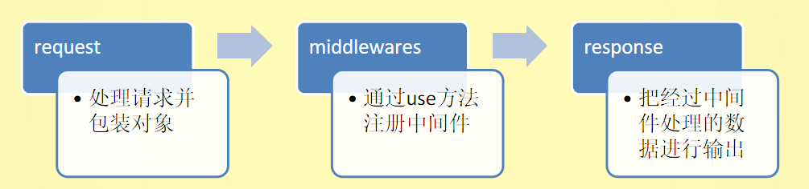

## Koa介绍

[Koa官网](https://koa.bootcss.com/#request)

Koa 是一个新的 web 框架，由 Express 幕后的原班人马打造， 致力于成为 web 应用和 API 开发领域中的一个更小、更富有表现力、更健壮的基石。 通过利用 async 函数，Koa 帮你丢弃回调函数，并有力地增强错误处理。 Koa 并没有捆绑任何中间件， 而是提供了一套优雅的方法，帮助您快速而愉快地编写服务端应用程序。

就像你很会原生，但是使用原生的API操作dom会比较麻烦，所以你才会用jQuery，Koa的出现也是如此。

Koa是一个类似Vue的渐进式的Node.js的Web开发框架，为什么说他是渐进式的？因为Koa框架本身的东西很少，只是对原生http部分做了封装，让我们可以写更少的代码就可以实现原生http的功能，这部分变得很高效，但是如果我们要使用更多的功能，比如`静态资源托管`、`路由`、`模版引擎`、`body解析`、`formData解析`，这些都是项目开发中经常用到的功能，Koa框架本身没有给我们集成进来，需要我们自己去寻找相应的中间件来解决问题。

因此可以说Koa的生态就是靠它的中间件支撑起来的。



Koa精简的地方就在于他封装了图中的request和response方法，middlewares部分我们需要引入对应的中间件来完成，常用的中间件如下：

- koa-static-cache：静态文件代理服务
- koa-router：路由
- koa-swig：模版引擎
- koa-bodyparse：body解析
- koa-multer：formData解析

这篇博客也是围绕这几个中间件为核心来讲解的。


## Koa安装与使用

安装Koa：`npm i koa`

Koa基本使用。

```js
const Koa = require('koa'); // 本质还是http， 包装过的http

// 创建一个http服务器，监听请求，类似http.createServer()
const app = new Koa();

// 注册中间件函数
app.use((ctx, next) => {
  ctx.body = "Hello Koa";
})

// 监听当前机器的地址以及端口
app.listen(80, () => {
  console.log("[+] 服务器启动成功.")
});
```

**Application**
当前应用程序对象，即 new Koa() 得到的实例对象，保存了应用全局状态以及其他对象，后面的Context、Reqeust、Response对象都是该对象下的子对象。

**中间件**

- .use(callbakc)	callback函数中有2个参数，context和next，每一次请求都会包装一个context对象，每一个中间件都是一个迭代器，需要调用next方法进入下一次迭代
- 异步中间件，.use(async callback)  就是在callback函数前加一个async关键字，配合callback函数中await使用即可

**错误处理**

```js
app.on('error', err=>{})
```


## context对象

每一次请求都会包装一个 context 对象，该对象对 node 的 request 和 response 对象进行了封装（加强了node中的request和response）同时提供了其他一些有用的 api，koa 会把 context 传入到中间件函数的第一个参数中，可以对context进行扩展，并在中间件中使用。这个context对象其实就是上面代码中app.use的回调函数第一个参数ctx。

下面为context对象中的一些属性：

- .req：Node的request对象

- .res：Node的response对象

- **注意：在Koa中尽量使用Koa提供的封装对象**

- .request：Koa的request对象

- .response：Koa的response对象

- .state：用户数据存储空间

- .app：当前应用程序实例 - Application对象

- .cookies对象

- .throw([status],[,msg],[,properties])：抛出一个错误，Koa会进行处理（比如返回对应的响应信息）

  在app.on('error')事件中可以捕获到该异常，error参数中也会保存msg和properties


## request对象

在 Koa 中，request 对象是 Context 对象下的一个属性，为了方便调用 request 对象下的一些常用属性与方法同时在 Context 下有对应的挂载，也就是 Context 下的一些属性与方法等同于 request 对象下的对应属性和方法，response也是如此。

- .header：头信息对象，别名：headers
- .header=：设置头信息，别名：headers=
- .method：请求方式
- .method=：设置请求方式
- .length：请求正文内容长度
- .url：请求URL
- .url=：设置请求URL，不包含协议与主机部分
- .originalURL：原始URL，不包含协议与主机部分
- .href：原始完整URL，包含协议、主机、URL
- .path：URL路径部分
- .path=：设置URL路径
- .querystring：URL中的querystring
- .querystring=：设置URL中的querystring
- .search：URL中的search，带?的querystring
- .search=：设置URL中的search
- .host：请求头中的host
- .hostname：请求头中的hostname
- .URL：解析过的URL对象
- .type：请求头中content-type
- .charset：请求头中的charset
- .query：解析过的querystring对象
- .query=：设置querystring对象值
- .fresh：判断缓存设置时候有效，true表示有效
- .stale：与fresh相反
- protocol：请求使用的协议
- .secure：是否是安全协议，protocol=='https'
- .ip：请求客户端 IP
- .ips：请求客户端所有 IP（比如使用了代理等）
- .subdomains：子域名数组
- .is(types...)：判断提交内容的MIME类型
- .socket：request.socket对象
- .get(field)：获取请求头的通用方法


## response对象

- .header：响应头对象
- .headers：header的别名
- .socket：response.socket对象
- .status：响应状态码
- .status=：设置响应状态码
- .message：响应状态码描述文本
- .message=：设置响应状态码描述文本
- .body：响应内容
- .body=：设置响应内容，如果status没有设置，Koa会默认设置status为：200 或者 204，同时 Koa 会根据返回的数据类型自动设置 content-type
  - string：text/html 或 text/plain
  - buffer/Stream：application/octet-stream
  - object：application/json
- .length：响应内容长度
- .length=：设置响应内容长度
- .get(field)：获取指定头信息
- .get(fields)：批量设置头信息
- .set(field)：设置指定头信息
- .append(field, value)：追加头信息
- .remove(field)：移除头信息
- .type：获取 content-type
- .type=：设置 content-type
- .is(types...)：判断 content-type
- .redirect(url)：重定向，默认重定向状态码为：302，可以通过status进行设置
- .attachment([filename])：设置下载文件头，filename为下载文件的名称

**参考代码**

```js
const Koa = require('koa'); // koa本质是一个包装过的http

// 创建一个http服务器，监听请求，本质是http.createServer()
const app = new Koa();

app.use((ctx, next) => {
  // ctx 是 koa处理过的对象
  console.log(1);
  ctx.body = '<h1>Hello，Koa</h1>'
  // 异常处理
  // ctx.throw(404, '页面没了', {a: 1});
  // next的应用场景：判断当前用户是否有权限，如果有权限再调用next()
  next();
})

app.use(async (ctx, next) => {
  console.log(2);
  ctx.body += '<strong>Welcome Use Koa</strong>'
  // await 异步请求/查询数据库
  next();
});

app.use((ctx, next) => {
  // throw new Error('非常严重的错误!');
  let n = Math.random();
  // 不推荐这种写法
  // ctx.n = n;
  ctx.state.n = n;
  // console.log("ctx.request: ", ctx.request);
  next();
})

app.use((ctx, next) => {
  console.log(ctx.state.n);
  ctx.response.body = {
    a: 1,
    b: 2
  };
  ctx.attachment('a.txt');
})

// 监听错误
app.on('error', (err, ctx) => {
  console.log("[-] 检测到错误: ", err);
})

// 监听当前机器的地址、端口
app.listen(80);
```


## koa-static-cache 静态资源代理服务

[官方Github地址](https://github.com/koajs/static-cache#readme)

参考代码

```js
const Koa = require('koa');
const koaStaticCache = require('koa-static-cache');

const app = new Koa();

// 主要有请求，则通过 koaStaticCache 进行处理
app.use(koaStaticCache(__dirname + '/static', {
  // root：__dirname + '/static'  // 与上面的第一个参数效果一样
  prefix: '/public', // 如果当前请求的url是以 /public开始，则作为静态资源请求
}));

app.use((ctx, next) => {
  // ...其他业务逻辑
  console.log("请求来了")
});

// 监听当前机器的地址，端口
app.listen(80);
```

这个中间件的目的就是帮助我们托管静态资源文件，我们按照配置的路径在浏览器的URL地址中输入带/public前缀的路径就能访问到static目录下的文件，比如`http://127.0.0.1/public/index.html`，这个时候中间件就会将我们的请求代理到/static文件夹下的index.html，读取文件，自动识别MIME类型，然后进行响应，非常方便，极大程度提高了我们的开发效率！


## koa-router 路由系统

像极了`vue-router`系统，学起来成本较低。

[官方Github地址](https://github.com/koajs/router)

安装：`npm i koa-router`

**非RESTful的路由设计：**

http://127.0.0.1/user/add 新增用户
http://127.0.0.1/user/query/1 查询用户
http://127.0.0.1/user/delete/1 删除用户

存在的问题：URL反映的是资源的位置，不应该带有操作，换句话说，对资源的操作不应该改变资源的定位。


**RESTful的路由设计：**

使用 http 中的 method 来表述动作

POST：http://127.0.0.1/user 新增用户
GET：http://127.0.0.1/user/1 查询用户
DELETE：http://127.0.0.1/user/1 删除用户


**HTTP 中的 method**

- GET：用来获取资源
- POST：新建资源
- PUT：更新资源
- DELETE：删除资源


**参考代码**

```js
const Koa = require('koa');
const koaStaticCache = require('koa-static-cache');
const Router = require('koa-router');
const app = new Koa();

app.use(koaStaticCache(__dirname + '/static', {
  prefix: '/public'
}));


// app.use((ctx, next) => {
//   console.log(ctx.request.url);
//   下面的代码其实也是一种路由，只不过特别简单，还需要处理很多其他一些问题，因此我们需要使用模版
//   switch (ctx.request.url) {
//     case '/user':
//       ctx.response.body = "<h1>user 页面</h1>"
//       break;
//   }
// })

const router = new Router();
// 通过 get 方式 发送 / 请求 => get http://127.0.0.1
router.get('/', (ctx, next) => {
  ctx.body = "<h1>首页</h1>";
})

// 子路由,也叫嵌套路由
const userRouter = new Router();
userRouter.get('/', (ctx, next) => {
  ctx.body = "<h1>用户首页</h1>";
})

userRouter.get('/address', (ctx, next) => {
  ctx.body = '<h1>用户收货地址</h1>'
})

router.use('/user', userRouter.routes());

// 子路由：添加前缀方式
const itemRouter = new Router({
  prefix: '/item'
});

itemRouter.get('/add', (ctx, next) => {
  ctx.body = '<h1>添加物品</h1>';
})

// 子路由 动态路由
const goodsRouter = new Router();
goodsRouter.get('/goods/:id', (ctx, next) => {
  // URL生成器
  console.log(Router.url('/list', {
    page: 1
  }, {
    query: {
      order: 'desc'
    }
  }));
  ctx.body = `<h1>添加商品：</h1> ${ctx.params.id}`
})

// 路由重定向
// router.redirect('/admin', '/user', 301);
router.redirect('/admin/test', '/user', 301);

// 把路由对象挂载到app对象中
app.use(router.routes());
app.use(itemRouter.routes());
app.use(goodsRouter.routes());

// 监听当前机器的地址，端口
app.listen(80)
```

创建路由

```js
const Router = require('koa-router');	// 引入路由模块
const router = new Router();	// 创建路由实例对象
```

给应用注册指定的路由中间件

```js
app.use(router.routes());
```

命名路由

```js
router.get('main', '/', cb);
```

嵌套路由

```js
const parent = new Router()
const child = new Router()
parent.use('/p', child.routes())	// 注册子路由
```

路由前缀

```js
const router = new Router({
	prefix: '/user'
})
```

动态路由

```js
router.get('/user/:id', cb);  // 动态路由参数通过 ctx.params 对象获取
```

路由重定向

```js
router.redirect('/user', '/login', 301)  // 将/user路由重定向到/login路由
```

URL生成器

```js
Router.url('/list', {page:1}, {query{order:'desc'}})
```

更多API介绍参考koa-router官方文档

[点我进入koa-router文档](https://github.com/koajs/router/blob/master/API.md)


## koa-swig 模版引擎

[官方地址](https://www.npmjs.com/package/koa-swig)

安装：`npm install koa-swig`

koa v2.x 需要使用 co 函数

加载 co 模块，安装：`npm i co`


**参考代码**

```js
const Koa = require('koa');
const koaStaticCache = require('koa-static-cache');
const Router = require('koa-router');
const Swig = require('koa-swig');
const co = require('co');

const app = new Koa();

let users = [
  {username: 'Alex'},
  {username: 'Jack'},
  {username: 'Rose'},
  {username: 'Jim'}
]

app.use(koaStaticCache(__dirname + '/static'), {
  prefix: '/public'
});

const router = new Router();

const render = Swig({
  root: __dirname + '/views',
  autoscape: true,
  cache: false,
  ext: '.html'
});

app.context.render = co.wrap(render);

router.get('/list', async (ctx,next) => {
  ctx.body = await ctx.render('list.html', {
    users
  })
})

app.use(router.routes());

app.listen(80);
```

> 注意：读取模版文件中的数据这个行为是异步的，需要使用async/await方式进行等待，否则ctx.body响应给前端的数据为空


