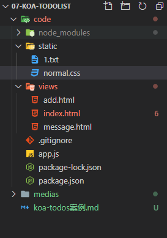
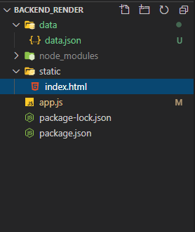

## 服务端渲染版本

### 目录结构



### 参考代码

`app.js`

```js
const Koa = require('koa');
const koaStaticCache = require('koa-static-cache');
const Router = require('koa-router');
const Swig = require('koa-swig');
const co = require('co');
const bodyParse = require('koa-bodyparser');

const app = new Koa();

/**
 * 处理静态文件
 */
app.use(koaStaticCache(__dirname + '/static'), {
  prefix: '/static',
  // 开启gzip文件压缩
  gzip: true
})

/**
 * 使用bodyParse中间件 处理请求正文中的数据
 	该中间件会在解析来自正文的数据以后，把解析后的数据挂载在ctx.request.body下面
 */
app.use(bodyParse());

// 创建路由实例对象
const router = new Router();

/**
 * 存储当前所有的任务数据
 *  当前这个数据是存储在服务器运行中的内存中
 */
let datas = {
  maxId: 3,
  appName: 'Koa-ToDoList',
  skin: 'normal.css',
  tasks: [{
      id: 1,
      title: '复习JavaScript基础',
      done: true
    },
    {
      id: 2,
      title: '学习koa',
      done: false
    },
    {
      id: 3,
      title: '学习sequelize',
      done: false
    }
  ]
}

/**
 * 设置模版引擎
 */
app.context.render = co.wrap(Swig({
  root: __dirname + '/views',
  autoescape: true, // 是否html编码，为了安全起见，一般不开启该功能，设置为true
  cache: false,
  //  cache: 'memory',  // memory参数：把解析后的结果保存在内存中，比如每次访问都去解析模版，一般用于线上生成环境
  ext: 'html' // 模版后缀，'html'
}));

/**
 * 首页，用于展示任务清单
 */
router.get('/', async ctx => {
  // ctx.body = '/'
  ctx.body = await ctx.render('index.html', {
    datas
  })
})

/**
 * 添加，添加新的任务，用来展示添加任务的页面
 */
router.get('/add', async ctx => {
  // ctx.body = '/add'
  ctx.body = await ctx.render('add.html', {
    datas
  })
})

/**
 * 添加新任务，处理通过添加页面提交的数据
 */
router.post('/posttask', async ctx => {
  /* 
    querystring与当前请求的方式是没有关系的，无论是get还是post，querystring一样
    都可以传递数据，querystring与get没有任何一毛钱的关系

    get 方式请求不能操作正文
  */
  let title = ctx.request.body.title || "";
  if (!title) {
    ctx.body = await ctx.render('message', {
      msg: '警告：请输入任务标题！！！',
      href: 'javascript:history.back();'
    });
    return;
  }

  datas.tasks.push({
    id: ++datas.maxId,
    title: ctx.request.body.title,
    done: false
  });

  ctx.body = await ctx.render('message', {
    msg: '添加成功',
    href: '/'
  })
})

/**
 * 改变，修改任务的状态
 */
router.get('/change/:id', ctx => {
  // ctx.body = `/change/${ctx.params.id}`
  let id = ctx.params.id;
  console.log("任务 Id: ", id);
  // forEach不会遍历空数组
  // console.log(typeof id, typeof datas.tasks[0].id)
  datas.tasks.forEach(item => item.id == +id && (item.done = !item.done))
  ctx.response.redirect('/');
})

/**
 * 删除任务
 */
router.get('/remove/:id', async ctx => {
  // ctx.body = `/remove/${ctx.params.id}`
  let id = ctx.params.id;
  console.log("即将删除的任务ID: ", id);
  datas.tasks = datas.tasks.filter(item => item.id !== +id);
  ctx.body = await ctx.render('message', {
    msg: '删除成功',
    href: '/'
  })
})

// 注册路由
app.use(router.routes());
app.listen(80, () => {
  console.log("[+] server is running at: 0.0.0.0:80");
});
```

`add.html`

```html
<!DOCTYPE html>
<html lang="en">
<head>
  <meta charset="UTF-8">
  <meta name="viewport" content="width=device-width, initial-scale=1.0">
  <title>Document</title>
</head>
<body>
  <h1>{{datas.appName}}</h1>
  <hr />
  <!-- 
    我们可以通过url中querystring传递地址以外的数据
    当我们通过表单发送一个请求的时候：
      当method为get的时候，会把表单中的数据通过表单name=表单值的形式添加到action地址的?后面
    
    /posttask?title=123
    注意：
      url的长度是有限制的，所以querystring的长度也是有限制的，数据量比较大的内容是不推荐使用
      querystring的方式进行传输的；
      这个querystring是url中一部分，所以最终问题是因为url的问题，不是get请求方式的问题。
      
      get请求会缓存url，所以get请求的时候，url上面的内容也会被缓存，可以从浏览器历史记录寻找

    get请求：如果当前请求是以获取为主，那么就应该是get
    post提交：如果当前请求是提交数据为主，那么就应该是post
   -->
   <form action="/posttask" method="POST">
    <input type="text" name="title">
    <button>添加</button>
  </form>
</body>
</html>
```

`index.html`

```html
<!DOCTYPE html>
<html lang="en">

<head>
  <meta charset="UTF-8">
  <meta name="viewport" content="width=device-width, initial-scale=1.0">
  <title>Document</title>
  <link rel="stylesheet" href="./{{datas.skin}}">
  <style>
    .done>div {
      text-decoration: line-through;
    }

    body {
      text-align: center;
    }

    ul {
      text-align: left;
      position: absolute;
      top: 5%;
      left: 50%;
      transform: translate(-50%, 0);
    }

    ul>li {
      display: flex;
    }

    ul>li>div {
      min-width: 300px;
      max-width: 300px;
      overflow: hidden;
      word-break: break-all;
    }

    .container {
      width: 100%;
      height: 100vh;
      background-color: #000;
      position: relative;
    }
  </style>
</head>

<body>
  <h1>{{datas.appName}}</h1>
  <a href="/add">添加新任务</a>
  <hr />
  <div class="container">
    <ul>
      
      
      <li class="done">
        <div>
          <input type="checkbox" onclick="change({{task.id}})" checked>
          <span>[{{task.id}} - {{task.title}}]</span>
        </div>
        <a href="/remove/{{task.id}}">删除</a>
      </li>
      
      <li>
        <div>
          <input type="checkbox" onclick="change({{task.id}})">
          <span>[{{task.id}} - {{task.title}}]</span>
        </div>
        <a href="/remove/{{task.id}}">删除</a>
      </li>
      
      
    </ul>
  </div>
  <script>
    function change(id) {
      window.location.href = '/change/' + id;
    }
  </script>
</body>

</html>
```

`message.html`

```html
<!DOCTYPE html>
<html lang="en">

<head>
  <meta charset="UTF-8">
  <meta name="viewport" content="width=device-width, initial-scale=1.0">
  <title>Document</title>
</head>

<body>
  <h1>{{datas.appName}}</h1>
  <a href="/add">添加新任务</a>
  <hr />
  <p style="color: red">{{msg}}</p>
  <a href="{{href}}">点击这里跳转</a>
</body>

</html>
```

`normal.css`

```css
* {
  padding: 0;
  margin: 0;
  box-sizing: border-box;
}

body {
  background-color: #1e1e1e;
  font-size: 20px;
  color: #007acc;
}

a,ul,li,h1,h2,h3,h4,h5,h6 {
  font-style: normal;
  list-style: none;
}

a {
  color: lightgreen;
  text-decoration: none;
}

a:hover {
  color: lightpink;
  font-size: 22px;
  transition: all .2s;
}
```


`package.json`

```json
{
  "name": "code",
  "version": "1.0.0",
  "description": "",
  "main": "index.js",
  "scripts": {
    "test": "echo \"Error: no test specified\" && exit 1"
  },
  "keywords": [],
  "author": "",
  "license": "ISC",
  "dependencies": {
    "koa": "^2.13.0",
    "koa-bodyparser": "^4.3.0",
    "koa-router": "^10.0.0",
    "koa-static-cache": "^5.1.4",
    "koa-swig": "^2.2.1"
  }
}
```

### 效果演示


## 前端渲染版本



`app.js`

```js
const Koa = require('koa');
const StaticCache = require('koa-static-cache');
const Router = require('koa-router');
const BodyParser = require('koa-bodyparser');
const fs = require('fs');

let todosDatas = JSON.parse(fs.readFileSync('./data/data.json'));
const app = new Koa();
app.use(StaticCache('./static', {
  prefix: '/static',
  gzip: true
}));

app.use(BodyParser());

const router = new Router();

// 查询todos列表数据API
router.get('/getTodoList', ctx => {
  ctx.body = {
    code: 1,
    data: todosDatas
  }
})

// 添加todos数据API
router.post('/add', ctx => {
  // 接收前端传递过来的title，然后将title写入todosDatas的data数组中
  let title = ctx.request.body.title || "";
  if (!title) {
    ctx.body = {
      code: 0,
      data: 'title不能为空'
    }
    return
  }
  todosDatas._id++;
  todosDatas.data.push({
    title,
    done: false
  });
  ctx.body = {
    code: 1,
    data: '添加成功'
  }
  fs.writeFileSync('./data/data.json', JSON.stringify(todosDatas));

})

// 删除todos数据API
router.post('/remove', ctx => {
  let title = ctx.request.body.title || "";
  if (!title) {
    ctx.body = {
      code: 0,
      data: '删除失败!'
    }
    return
  }
  todosDatas._id--;
  todosDatas.data = todosDatas.data.filter(item => item.title !== title);
  ctx.body = {
    code: 1,
    data: '删除成功!'
  }
  fs.writeFileSync('./data/data.json', JSON.stringify(todosDatas));

})

// 修改todos任务状态API
router.post('/modifyStatus', ctx => {
  let {
    title,
    done
  } = ctx.request.body || "";
  console.log(ctx.request.body);
  if (!title) {
    ctx.body = {
      code: 0,
      data: '修改任务状态失败!'
    }
    return
  }
  todosDatas.data.forEach(item => {
    // if(item.title === title) {
    //   item.done = done
    // }
    (item.title === title) && (item.done = done);
  })
  ctx.body = {
    code: 1,
    data: todosDatas.data
  }
  fs.writeFileSync('./data/data.json', JSON.stringify(todosDatas));
})

app.use(router.routes());

app.listen(80, () => {
  console.log("server is running at: 0.0.0.0:80");
});
```


`index.html`

```html
<!DOCTYPE html>
<html lang="en">

<head>
  <meta charset="UTF-8">
  <meta name="viewport" content="width=device-width, initial-scale=1.0">
  <title>Document</title>
  <script src="https://cdn.staticfile.org/vue/2.2.2/vue.min.js"></script>
  <style>
    * {
      /* margin: 0; */
      padding: 0;
      box-sizing: border-box;
    }

    .done {
      text-decoration: line-through;
    }

    ul,
    li {
      list-style: none;
    }
  </style>
</head>

<body>
  <div id="app">
    <h1>TodoList Ajax</h1>
    <hr />
    <input type="text" placeholder="请输入任务" v-model="taskValue">
    <button @click="handleAddTask">添加</button>
    <ul>
      <li v-for="(item,index) in list" :key="index">
        <span>[{{index}}]</span>
        <input type="checkbox" @click="handleCheckboxClick(item)" :checked="item.done">
        <span :class="item.done?'done':''">{{item.title}}</span>
        <button @click="handleRemoveItem(item.title)">删除</button>
      </li>
    </ul>
  </div>

  <script>
    new Vue({
      el: '#app',
      data: {
        list: [], // todoList列表数据
        taskValue: "", // 任务标题
      },
      methods: {
        // 获取数据函数
        getList() {
          fetch('http://127.0.0.1/getTodoList').then(res => {
            return res.json();
          }).then(response => {
            if (response.code) {
              this.list = response.data.data;
            }
          })
        },
        // 添加任务接口
        handleAddTask() {
          console.log("要添加的任务标题: ", this.taskValue);
          fetch('http://127.0.0.1/add', {
            method: 'POST',
            // 不设置请求头的话Koa2框架的bodyParser获取数据
            headers: {
              'Content-Type': 'application/json'
            },
            body: JSON.stringify({
              title: this.taskValue
            })
          }).then(res => res.json()).then(response => {
            console.log("response: ", response);
            if (!response.code) {
              alert(response.data);
            } else {
              this.taskValue = "";
              alert("添加成功!");
              this.getList();
            }
          })
        },
        // 监听修改任务状态事件
        handleCheckboxClick(item) {
          console.log(item);
          fetch('http://127.0.0.1/modifyStatus', {
            method: 'POST',
            headers: {
              'Content-Type': 'application/json'
            },
            body: JSON.stringify({
              title: item.title,
              done: !item.done
            })
          }).then(res => res.json()).then(response => {
            if (!response.code) {
              alert(response.data);
            } else {
              this.getList();
            }
          })
          // item.done = !item.done;
        },
        // 监听删除任务事件
        handleRemoveItem(title) {
          fetch('http://127.0.0.1/remove', {
            method: 'POST',
            headers: {
              'Content-Type': 'application/json'
            },
            body: JSON.stringify({
              title
            })
          }).then(res => res.json()).then(response => {
            if (!response.code) {
              alert(response.data)
            } else {
              alert(response.data);
              this.getList();
            }
          })
        }
      },
      created() {
        this.getList()
      }
    })
  </script>
</body>

</html>
```


`data.json`

```json
{"_id":3,"data":[{"title":"学习Node.js","done":true},{"title":"学习Koa","done":true},{"title":"学习MySQL","done":true}]}
```


