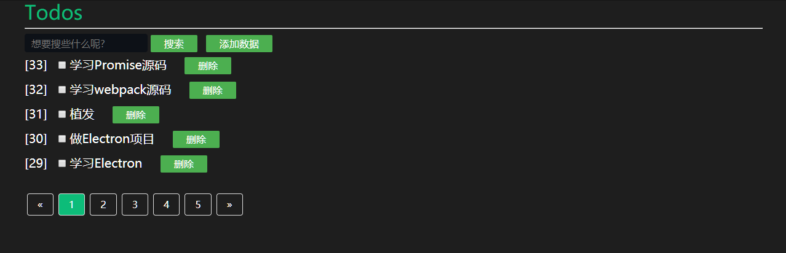

## 数据库简介

数据库(Database)是按照数据结构来组织、存储和管理数据的仓库。

为什么需要用到数据库？我们之前写服务端的时候，数据都是存储在本地文件中做持久化存储的，对于少量的数据还可以，读写速度也能接收，但是一旦数据量大起来，读文件的操作将会非常慢，读了文件之后还要对文件中的信息进行检索，这样就显得非常低效，查询一个数据要等待几十秒甚至上百秒这显然是不能接受的，这时就需要使用数据了系统才存储数据了，那有人问为什么数据库存数据就比使用文件存储数据查询速度要快呢？因为数据库系统里面使用了很多数据结构和算法来优化检索，这是文件没法比拟的。

数据以表格的形式出现，表格中每一行表示一组数据，表格中每一列表示某组数据对应的字段（属性），若干这样的行和列就组成了一张表，若干个表格组成一个库。

MySQL 服务就是维护了若干个这样的库。


## 数据库安装

官网：https://www.mysql.com/

下载：https://dev.mysql.com/downloads/mysql/

集成了MySQL的第三方工具：XAMPP、PHPstudy


## SQL语句

### 查询数据

#### 排序查询

#### 数量限制查询

SELECT column_name,column_name FROM table_name [LIMIT N]

N：数字，要限制的查询数据的最大条数

```sql
select id,done,title from todos where status=1 limit 5
```

### 查询与偏移

SELECT column_name,column_name FROM table_name [LIMIT N] [OFFSET M]

M：数字，要偏移的数量值，从 0 开始

OFFSET必须与LIMIT一起使用，且LIMIT在前

```sql
select * from todos where status=1 limit 5 offset 5;
```

每页查询5条数据，从第二页开始。

### 添加数据

INSERT INTO table_name ( field1, ...fieldN ) VALUES ( value1, ...valueN );

Node.js - mysql2
connection.query('INSERT INTO `users` SET ?', {key:value,...})

返回值依据其操作来决定

INSERT INTO：[{affectedRows ,insertId}，undefined]

```js
  // 添加任务 API
  router.post('/add', async ctx => {
    console.log(ctx.request.body);
    let {
      title
    } = ctx.request.body || "";
    if (!title.trim()) {
      ctx.body = {
        code: 1,
        data: '任务标题不能为空'
      }
      return
    }
    let sql = `INSERT INTO todos (title, done) VALUES ('${title}', 0)`;
    let [res] = await connection.query(sql);
    if (res.affectedRows > 0) {
      // 插入成功
      ctx.body = {
        code: 0,
        data: '添加成功'
      }
    } else {
      ctx.body = {
        code: 2,
        data: '添加失败'
      }
    }
  })
```


### 更新数据

UPDATE table_name SET field1=value1;

Node.js - mysql2

返回值依据其操作来决定

UPDATE：[{affectedRows ,insertId}，undefined]

```js
  // 修改任务状态
  router.post('/change', async ctx => {
    let {
      id,
      done
    } = ctx.request.body;
    console.log(ctx.request.body);
    let sql = `UPDATE todos SET done=${done} WHERE id=${id}`;
    let [res] = await connection.query(sql);
    if (res.affectedRows > 0) {
      // 更新成功
      ctx.body = {
        code: 0,
        data: '更新成功'
      }
    } else {
      // 更新失败
      ctx.body = {
        code: 1,
        data: '更新失败'
      }
    }
  })
```

### 删除数据

> 不推荐使用删除操作，太危险了，一旦删错数据会很麻烦，建议使用update更新数据的状态来实现删除的效果；
>
> 例如把要删除的数据的status改变成0，查询的时候直接查询status非0的数据即可。

DELETE FROM table_name [WHERE];
Node.js - mysql2

connection.query('DELETE FROM `users` WHERE id=?', [1])

返回值依据其操作来决定

INSERT INTO：[{affectedRows}，undefined]

```js
  // 删除任务 API
  router.post('/remove', async ctx => {
    console.log(ctx.request.body);
    let {
      id
    } = ctx.request.body;
    // let sql = `DELETE FROM todos WHERE id=${id}`;  DELETE太危险了,别这么干
    let sql = `UPDATE todos SET status=0 WHERE id=${id}`
    let [res] = await connection.query(sql);
    if (res.affectedRows > 0) {
      // 删除成功
      ctx.body = {
        code: 0,
        data: '删除成功'
      }
    } else {
      // 删除失败
      ctx.body = {
        code: 1,
        data: '删除失败'
      }
    }
  })
```

### 模糊查询

LIKE 模糊查询，通常与 % 配合使用。

%123：以 123结尾的内容
123%：以 123开头的内容
%123%：包含 123的内容
SELECT column_name... FROM table_name WHERE column_name LIKE %123%
NOT LIKE：与 LIKE 相反

## todos案例



[案例Github地址](https://github.com/C4az6/koa-mysql-todos)

## 待解决的BUG


服务跑一会就会自动挂掉，然后就得重启才行，莫名其妙。


## 拓展学习

存储引擎：https://dev.mysql.com/doc/refman/5.7/en/storage-engine-setting.html
字符集、编码：https://dev.mysql.com/doc/refman/5.7/en/charset.html
数据类型：https://dev.mysql.com/doc/refman/5.7/en/data-types.html
主键：https://dev.mysql.com/doc/refman/5.7/en/primary-key-optimization.html
自动增长：https://dev.mysql.com/doc/refman/5.7/en/example-auto-increment.html
索引：https://dev.mysql.com/doc/refman/5.7/en/column-indexes.html

菜鸟教程Mysql：<https://www.runoob.com/mysql/mysql-tutorial.html>