## 玩转Node.js-sequelize-cli

## 安装sequelize-cli

由于`sequelize-cli`依赖于`sequelize`包，sequelize又需要使用`mysql2`包来连接数据库，所以我们需要安装三个包。

```shell
npm i sequelize mysql2 sequelize-cli
```

如果是局部安装方式的话，安装完成之后进入node_modules目录下面的.bin目录下执行`sequelizse-cli`命令来测试sequelize-cli是否安装成功。

运行成功会出现下面信息。

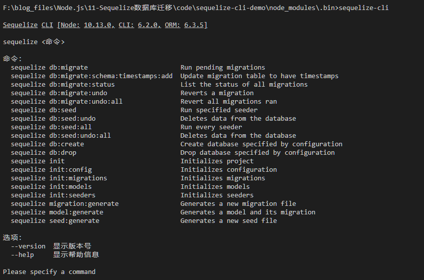

## 初始化项目

执行`sequelize-cli init`命令初始化sequelize项目，成功执行之后会创建4个文件夹。

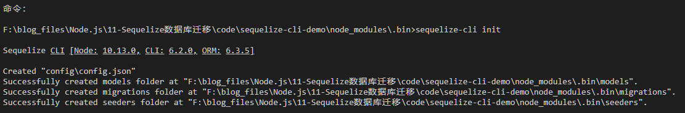

- config：		包含配置文件，它高速CLI如何连接数据库
- models：            包含你项目的所有模型
- migrations：     包含所有迁移文件
- seeders：           包含所有种子文件

config文件夹中的`config.json`配置有3个环境，分别是开始环境、测试环境、生产环境。

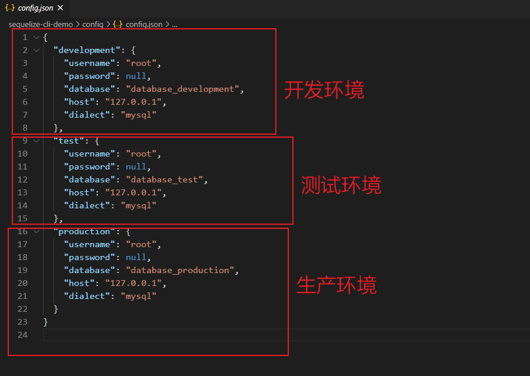


## 创建数据库

sequelize-cli会根据`config/config.json`里面的环境配置信息自动为我们创建数据库，默认情况会根据开发环境信息进行配置。

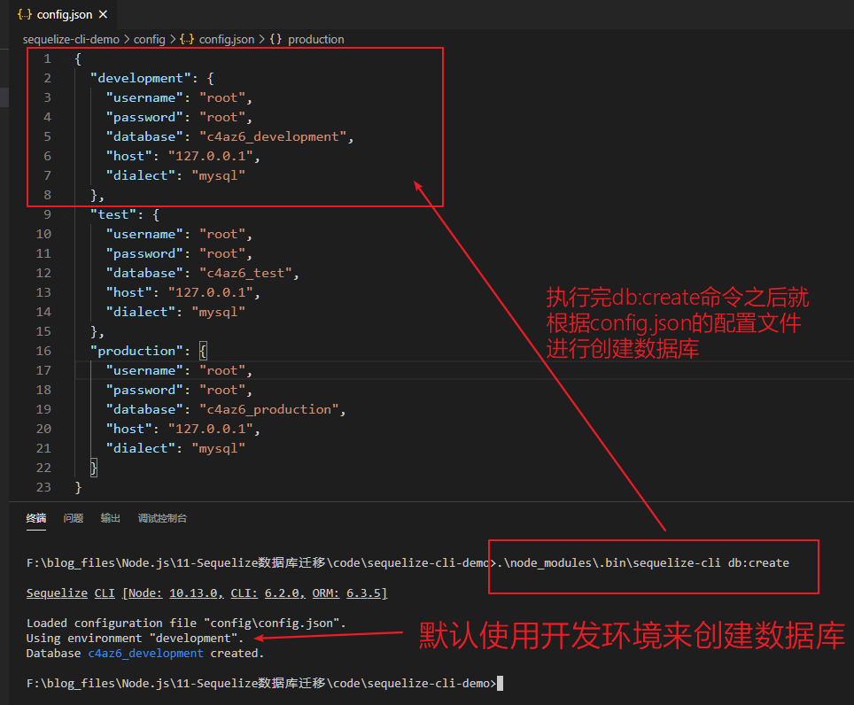

可以看到数据库成功创建。

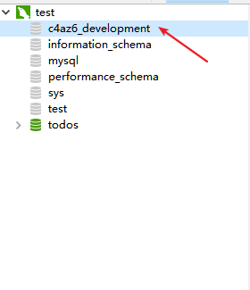

删除数据库

`sequelize-cli db:drop`命令会根据配置信息删除数据库。

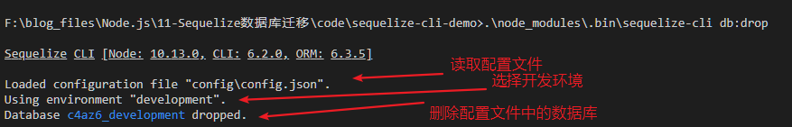


## 自定义环境变量

1.设置环境变量。

```shell
#设置环境变量NODE_ENV的值为home
set NODE_ENV=home
#删除环境变量，此时会得到home
echo %NODE_ENV%
#还原NODE_ENV的环境变量
set NODE_ENV=
```

2.在`config/config.json`中新增一项环境配置。

```json
  "home": {
    "username": "root",
    "password": "root",
    "database": "c4az6_home",
    "host": "127.0.0.1",
    "dialect": "mysql"
  },
```

3.再使用sequelize-cli创建数据库就会创建出home环境配置下的数据库了。

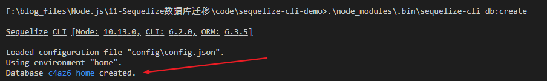


## 创建模型

使用`model:generate`或者`model:create`命令创建一个模型文件

参数：

- --name：模型名称，必须
- --attributes：字段列表，必须

参考

```shell
sequelize-cli model:create --name User --attributes username:STRING
```

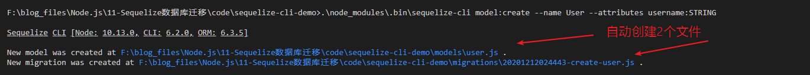

> 注意：模型文件是给程序用的，迁移文件和种子文件是给sequelize-cli使用的。


## 执行迁移

所谓迁移，就是对数据库进行结构的创建、升级（修改）等操作。

使用`db:migrate`会找到迁移文件，然后执行里面的代码创建表和字段，同时会在数据库中创建一个`sequelizemeta`的表来记录迁移的脚本名称。

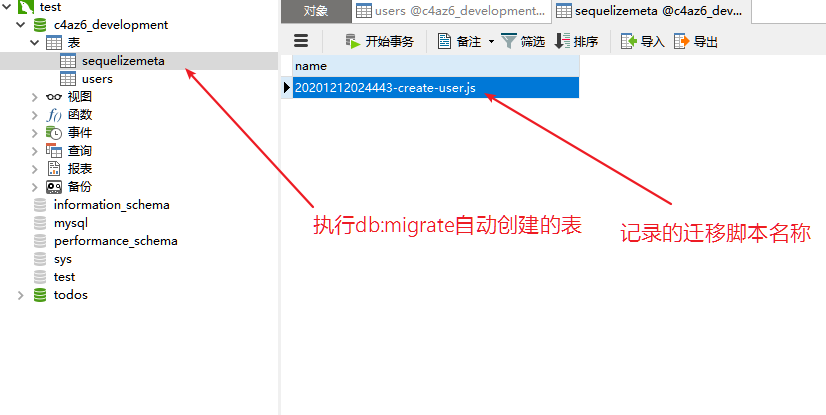

> 注意db:migrate不能对相同的表反复迁移，会报错。

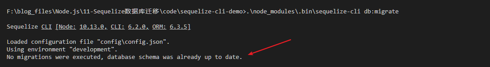

我们可以通过`db:migrate:status`命令查看迁移文件的状态。

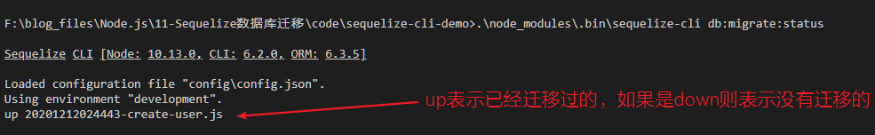

这个时候，如果有新的需求，要新增表，那么可以通过下面步骤实现。

1.首先还是创建模型。

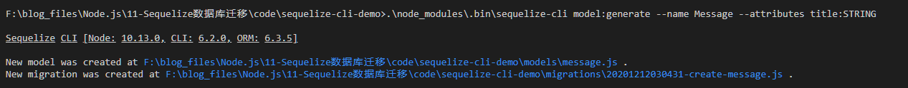

2.查看状态发现为down，就是未迁移状态。

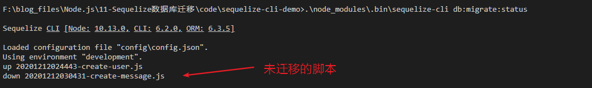

3.迁移。

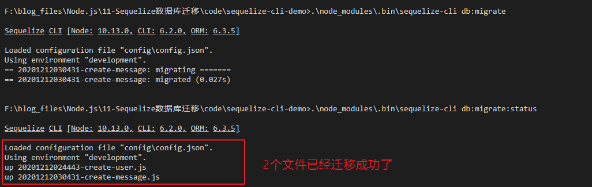

4.连接数据库进行查看。

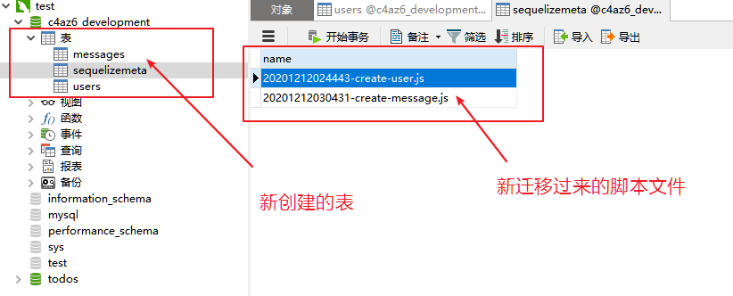


## 撤销迁移

`db:migrate:undo`命令会撤销最近的一次迁移操作，会删除最近一次创建的表，会把`sequelizemeta`表里面的最近一次记录删除。

有时候我们撤销不一定就非要删表，我们可能会有其他动作，这个时候我们就可以通过手动修改迁移脚本中的`down函数`代码来实现自定义撤销操作。

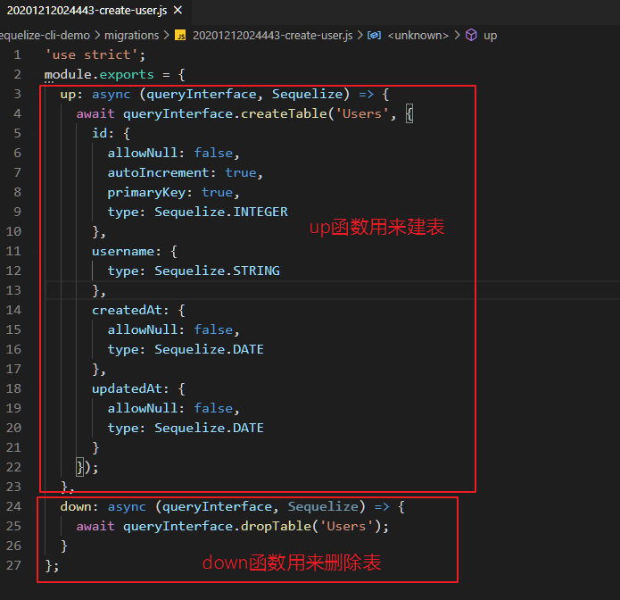

另外我们还可以通过`db:migrate:undo:all`命令来撤销所有的迁移脚本。

通过`db:migrate:undo --name 脚本名`命令指定撤销具体的迁移脚本。

```shell
sequelize-cli db:migrate:undo 20201212030431-create-message.js
```

那么如何迁移单个指定的文件呢？一般情况下我们要迁移的文件都应该是放在一个单独的文件夹下面的，然后通过下面命令指定迁移目录即可。

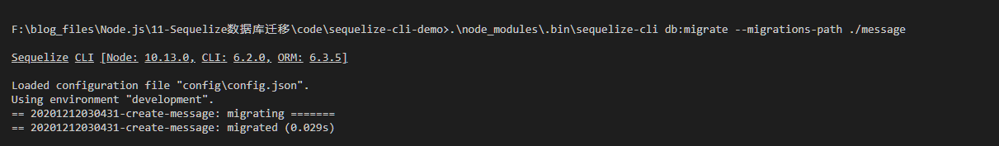


## 在表中添加字段

如何在不影响表原有的情况下添加新的字段？


## 种子文件seeder


