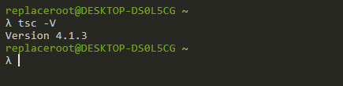
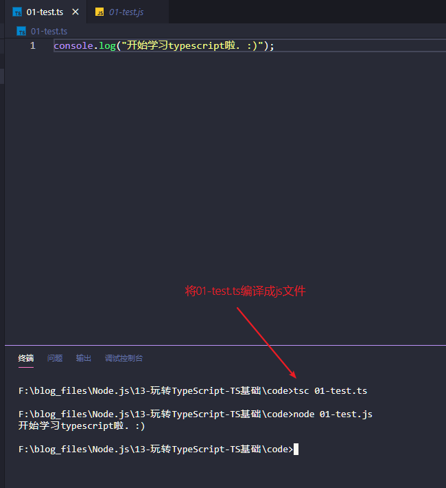
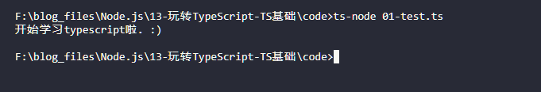
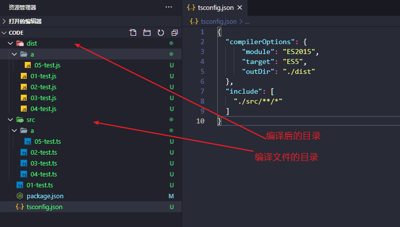
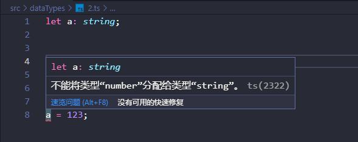
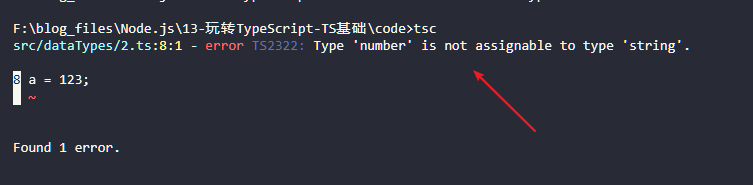
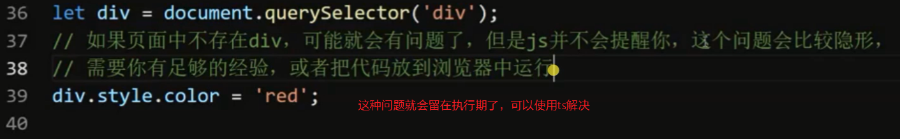

## Part1内容

### 安装typescript编译器

全局安装：`npm install -g typescript`

在命令行中查看ts编译器版本判断是否安装成功。



TypeScript 文件默认以 .ts 为后缀，TypeScript 是 JavaScript 的扩展，所以 TypeScript 代码要在 浏览器/Node 环境下运行，需要把 TypeScript 代码编译为 JavaScript 代码。


### ts初体验




### ts-node

这是一个基于Node.js的运行typescript的REPL环境，适用于*typescript@>=2.7*。

ts-node这个插件方便我们直接执行ts文件，不用手动执行ts编译后的js文件，很方便。

[Github地址](https://github.com/TypeStrong/ts-node)

全局安装：`npm install -g ts-node`




### tsconfig.json

当使用 tsc 并不指定 要编译的ts文件 的情况下，会从当前运行命令所在的目录开始逐级向上查找 tsconfig.json 文件。

tsconfig.json 文件用来配置 tsc 的编译配置选项。

我们也可以通过 --project（-p） 来指定一个包含 tsconfig.json 文件的目录来进行编译。

**编译选项**

```json
{
  "compilerOptions": {
      "module": "ES2015",
      "target": "ES5",
      "outDir": "./dist"
  },
  "include": [
    "./src/**/*"
  ]
}
```

compilerOptions字段定义了编译相关设置

- module：指定编译后的代码要使用的模块化系统
- target：指定编译后的代码对应的ECMAScript版本
- outDir：指定编译后的代码文件输出目录
- outFile：将输出文件合并成一个文件（合并的文件顺序为加载和依赖顺序）

include字段指定了要包含的编译文件目录，它的值是一个目录数组，使用glob模式

- *匹配0或多个字符（不包括目录分隔符）
- ？匹配一个任意字符（不包括目录分隔符）
- **/递归匹配任意子目录

exclude：指定不要包含的编译文件目录，值也是一个目录数组，类似include，默认会排除*`node_modules`*和*`outDir`*指定的目录。



### 类型系统

类型注解（类型声明、类型约束）

JavaScript是动态语言，变量随时可以被赋予不同类型的值，变量值的类型只有在运行时才能决定。

在编码（编译）阶段无法确定数据类型，会给程序在实际运行中带来极大的隐患，不利于编码过程中的错误排查。

使用类型注解就能够在变量声明的时候确定变量存储的值的类型，用来约束变量或参数值的类型，这样在编码阶段就可以检查出可能出现的问题，避免把错误带到执行期间。

#### 语法

语法：let变量：类型

当变量接收了与定义的类型不符的数据会导致编译失败（警告）。






#### 类型

官方文档：<https://www.tslang.cn/docs/handbook/basic-types.html>

typescript中定义的类型有：

数字、字符串、布尔值

null、undefined

数组、元组、枚举

void、any、Never

##### 字符串&数字类型

```typescript
let a: string;
a = 'asd';
// a = 1;

let b: string = 'test';

let c: String = 'test123';    // 可以把基本数据类型赋值给对应的包装对象类型
let d: String = new String('test456');
// let e: string = new String('test789');    // 不可以把包装对象类型赋值给基本类型

let f: number;
f  = 123;
// f = '123';   // 报错
```

string、number、boolean属于基本类型

String、Number、Boolean：属于对象类型

注意：

- 包装类型可以赋值给对应包装对象
- 包装对象不可以赋值给对应基本类型

```typescript
let s: String = 'some string...';		// 正确
let s: string = new String('some string...');		// 错误
```

##### 数组

TypeScript像JavaScript一样可以操作数组元素。 有两种方式可以定义数组。 第一种，可以在元素类型后面接上 `[]`，表示由此类型元素组成的一个数组：

```typescript
let list: number[] = [1, 2, 3];
```

第二种方式是使用数组泛型，`Array<元素类型>`：

```typescript
let list: Array<number> = [1, 2, 3];
```

```typescript
/**
 * 定义数组的方式有2种，第一种可以在元素后面接上[],表示由此类型元素组成的一个数组
 * 第二种方式就是使用数组泛型，Array<元素类型>
 */
let list: number[] = [1,2,3];
console.log(list);
// console.log(list.push('4'));    // 直接报错 不能把字符串类型的数据添加到number类型的数组中

// 数组泛型创建方式
let list2: Array<string> = ['a','b','c'];
console.log(list2);
console.log(list2.push('1,2,3','456'));
// console.log(list2.push(1,2,3));   // 直接报错 不能把number类型的数据添加到string类型的数组中
console.log(list2);

```

##### 元组

与数组类似，允许表示一个已知元素数量和类型的数组，各元素的类型不必相同，对于下标内的数据，数据顺序必须与声明中的类型一一对应。

```typescript
/**
 * 与数组类似，但是可以存放多种不同类型
 */

let data1: [number, string, boolean];

// 注意：顺序要对应
data1 = [1,'123',true]
```

##### 联合类型

多个类型中的一个，或的关系。

```typescript
let a: string | number;
a = "m";

a = 1;
a = '1';
// a = false;   // 报错，不能把boolean类型分配给string或者number类型
console.log(a);
```

##### 枚举类型

使用枚举可以为一组数据赋予友好的名字，`enum Color {Red, Green, Blue}`，默认情况下，元素编号从0开始，也可以手动编号`enum Color {Red=1...}`

```typescript
// let gender:number = 1;    // 1：男，2：女
// if(gender==1) {   // 容易忘记1表示的是什么

// }else {}


enum Gender {Male, Female};  // enum Gender {Male=0, Female=1};

if(Gender.Male) {
  console.log("男");
}else {
  console.log("女")
}

// enum Gender {Male=1, Female};   // Female会从2开始
```

##### 类型推导

有的时候不一定需要强制使用类型声明，在某些情况下 TS 可以根据语境进行类型推导。

**变量初始化**的时候TS 会根据变量初始化的时候赋予的值进行类型推断。

**上下文推断**的时候TS 也会根据上下文进行类型的推断，比如在事件函数中，函数的第一个参数会根据当前绑定的事件类型推断处理事件对象。

```typescript
/**
 * 其它类型
 */

//  let a:undefined;

//  a = undefined;

// 下面是可以的，可以把null赋值给其他类型，但是不能把其他类型的数据赋值给null
//  let a: number;

//  a = null;

//  let b: any;
//  b = false;
//  console.log(b)

// 类型推导
// let c = 1;   // ts会自动推导，c是number类型的
// c = 'm';   // 报错


```


## Part2内容



上面的代码在页面中没有这个div元素的时候会报错，因为`document.querySelector('div')`在页面中没有div的时候会返回一个null值，然后给这个null值添加颜色就会报错，这种问题可以通过TS来解决。

> 注意：在js中，如果一个方法的返回值是一个对象，那么该方法在没有返回值的情况下，接收的变量就会为null。

TS类似于ESLINT，通过定义各种类型检测规则来约束代码，减少隐形的错误。


### 函数

#### **函数声明**

```typescript
// 函数声明写法
function fn1(x: number, y: number): number {
  return x + y
}
let result = fn1(1,2);
```

#### **函数表达式**

```typescript
// 函数表达式
let fn2 = function(x: number, y:number): number {
  return x+y;
}
```

#### **完整函数类型写法**

```typescript
// 完整的函数类型写法
let fn2: (x:number, y:number) => number = function(x: number, y:number): number {
  return x+y;
}

// 根据类型推断可以简写
let fn2: (x: number, y:number) => number = function(x,y) {
  return x+y;
}
```

#### **可选参数写法**

```typescript
// 可选参数，没有返回值就使用viod关键字代替，可选参数使用?标识
function fn3(x: number, y?: number) :void {};

console.log(fn3(1));
```

#### **参数默认值写法**

```typescript
// 参数默认值
function fn3(x: number, y = 1): void {
  console.log(y);
}
console.log(fn3(0));
```

#### **剩余参数写法**

```typescript
// 剩余参数
function createName(firstName: string, ...args: string[]){
  return firstName + " " + args.join(" ");
}
let res = createName("Alex", "Bob", "Simth");
console.log(res);
```

#### **函数重载**

允许我们在TS中给函数传递多种对应类型的参数，前提是你已经定义好了参数的类型。

```typescript
// function fn(x, y) {
//   return x + y;
// }

// 如果在js中，我们是可以这么写的，因为没有类型检查,但是在TS中使用类型检查后推荐使用函数重载方式实现
// console.log(fn(1, 2));  // 3
// console.log(fn('a', 'b'));    // ab

// 函数重载,允许我们在TS中给函数传递多种对应类型的参数
function fn(x: number, y: number): number;
function fn(x: string, y: string): string;
function fn(x: any, y: any): any {
  return x + y;
}

console.log(fn(1,2));   // 3
console.log(fn('alex', 'zhang'));   // alexzhang
// console.log(fn('haha', 123));    // 直接报错
```

#### **this**

> 注意：在TS中能不使用any类型就不使用，因为使用any类型TS就不会对其做类型检测了，就没有任何意义了。

因为普通函数中的 this 具有执行期绑定的特性，所以在 ts 中的this 在有的时候会指向隐式的指向类型 - any（并不是所有，比如事件函数）。

我们可以通过 --noImplicitThis 选项来解决 this 隐式 any 类型的错误。

我们可以在函数参数中提供一个显示的 this 参数，this 参数是一个假的参数，它出现在参数列表的最前面。

```typescript
/**
 * ts中默认情况下函数中的this默认指向 ： any
 */

let obj = {
    a: 10,
    fn() {
        // 因为默认情况下，this是any类型，any类型ts不能提示有任何属性方法
        // let document:any;
        // any的值，ts不能提示或者进行类型属性检测
        // console.log(this.b);

        // 使用noImplicitThis选项可以取消默认this的any来这个设置
        // this.a
    }
}

// obj.fn();


// ts会自动推导事件函数中的this
// document.onclick = function() {
//     this
// }


let obj1 = {
    a: 1,
    fn(this: Element|Document) {    // 在ts中函数的第一个this参数是用来设置this类型约束的
        // 这个this是一个假参数，运行过程中是不存在，是给ts检测使用的
        // console.log(this);
    }
};

document.onclick = obj1.fn;
document.body.onclick = obj1.fn;
```

**ts会自动推导事件函数中的this！！！**

> 注意：TS是根据类型来做代码检测。


### 类

与 ES2015 中的 class 类似，同时新增了很多实用特性，与 ES2015 不同，TS 中的成员属性可以提取到构造函数以外进行定义。

#### 修饰符

通过修饰符可以对类中成员属性与成员方法进行访问控制，**public**、**protected**、**private**、**readonly**。

参数属性：我们可以在参数中使用修饰符，它可以同时定义并初始化一个成员属性。

```typescript
class Person {
  /**
   * ts中的类，成员属性必须要声明后使用
   * ts中的类的成员属性不是在构造函数中声明的，是在class内，方法外声明
   * public
   *    公开的，所有的地方都能访问，属性和方法默认是public
   * protected
   *    受保护的，在类的内部和他的子类中才能访问
   * private
   *    私有的，只能在该对象（类）的内部才可以访问
   */

  public username: string = '';
  // private username: string = '';
  // protected username: string = '';

  constructor(name: string) {
    this.username = name;
  }
}


class Student extends Person {
  say() {
    console.log(`${this.username}：哈哈哈`);
  }
}

let p1: Person = new Person('alex');
p1.username = 'john'
console.log(p1.username);
```

#### 存取器

TS 支持 getters/setters 来截取对对象成员的访问。

第一个需求：我们不希望年龄被修改。

解决方法：直接使用`private`关键字定义age成员属性即可，因为private定义的属性不能在外部访问，只能在类的内部访问。

此时，需求变动，我们允许用户修改年龄，但是要在合理的访问内修改，不能随意修改，比如只能在0到150岁之间。

解决方法：在Person内中定义`getAge`和`setAge`方法来实现，getAge方法中直接返回类中的age属性，setAge方法接收外部传递进来的参数，然后修改age属性的值达到修改的效果，哦，别忘了加一个判断，判断通过才修改。

```typescript
class Person {
  username: string = 'alexander';
  private _age: number = 21;

  getAge(): number {
    return this._age;
  }

  setAge(age: number): void {
    if (age > 0 && age < 150) {
      this._age = age;
    }else {
      console.log("[-]验证未通过!");
    }
  }
}

let p1: Person = new Person();

// 需求：允许在外部获取和修改age的值，但是不希望被修改成非法值，比如1000岁

console.log(p1);
console.log(p1.getAge());
console.log(p1.setAge(88));
console.log(p1.getAge());
```

使用TS的存取器来实现

```typescript
class Person {
  username: string = 'alexander';
  private _age: number = 21;

  // getAge(): number {
  //   return this._age;
  // }

  // setAge(age: number): void {
  //   if (age > 0 && age < 150) {
  //     this._age = age;
  //   }else {
  //     console.log("[-]验证未通过!");
  //   }
  // }

  // 存取器，这个age并不会作为方法，而是作为属性去访问，类似Vue中的computed计算属性
  get age(): number {
    return this._age;
  }

  set age(age: number) {
    if (age > 0 && age < 150) {
      this._age = age;
    }
  }
}

let p1: Person = new Person();

// 需求：允许在外部获取和修改age的值，但是不希望被修改成非法值，比如1000岁

console.log(p1.age)   // 21
p1.age = 121;    // set age 121
console.log(p1.age);  // 121
p1.age = 123;    //set age error
console.log(p1.age);    // 123
```

TS官方的demo

```typescript
let passcode = "secret passcode";

class Employee {
    private _fullName: string;

    get fullName(): string {
        return this._fullName;
    }

    set fullName(newName: string) {
        if (passcode && passcode == "secret passcode") {
            this._fullName = newName;
        }
        else {
            console.log("Error: Unauthorized update of employee!");
        }
    }
}

let employee = new Employee();
employee.fullName = "Bob Smith";
if (employee.fullName) {
    alert(employee.fullName);
}
```

注意下面几点：

- 使用存取器的成员需要被`private`修饰。

- 编译目标为 ES5+。
- 只有 get 的存取器自动被推断为 readonly只读属性。

没看官方文档之前，我还傻傻地使用`p1.age(121)`的方式尝试修改_age属性的值，始终不成功，看了文档之后发现我的写法是错的，应该用=号赋值的方式来写，总结一下，与其质疑框架、工具、库版本问题，坑多难用，不如多看官方文档，文档看不好，Bug少不了！`：）`

#### 静态成员

类的一般成员属性和方法都属于实例对象的，也就是原型链上的，静态成员属于类（也就是构造函数）的，静态成员不需要实例化对象，直接通过类即可调用。

通过下面的demo彻底理解

```typescript
// 单例模式demo

// class Mysql {
//   // 成员属性声明, 默认public
//   host: string;
//   port: number;
//   username: string;
//   password: string;
//   dbname: string;

//   constructor(host = '127.0.0.1', port = 3306, username='root', password='', dbname='') {
//     this.host = host;
//     this.port = port;
//     this.username = username;
//     this.password = password;
//     this.dbname = dbname;
//   }

//   // 类方法
//   query(){console.log("query data...")}
//   insert(){console.log("insert data...")}
//   update(){console.log("update data...")}
// }

// /**
//  * 创建一个Mysql对象，通过这个对象来操作数据库
//  * 如果我们不加以限制的话，这个Mysql是可以new出来多个对象的
//  * 每一个Mysql都会占用资源（内存）
//  * 
//  * 为了解决这个问题，我们需要对创建Mysql连接做限制，如果存在则直接使用已有的连接，不存在
//  * 则创建。
//  */

//  let db = new Mysql();
//  db.query();
//  db.insert();

//  let db1 = new Mysql();
//  db1.query();
//  db1.insert();


/**
 * 通过某种方式控制系统同时只有一个Mysql的对象在工作
 */

class Mysql {
  // 静态属性，不需要通过new出来的对象，直接是通过Mysql类来访问
  public static instance;
  host: string;
  port: number;
  username: string;
  password: string;
  dbname: string;
  private constructor(host = '127.0.0.1', port = 3306, username = 'root', password = '', dbname = '') {
    this.host = host;
    this.port = port;
    this.username = username;
    this.password = password;
    this.dbname = dbname;
  }
  public static getInstance() {
    if (!Mysql.instance) {
      Mysql.instance = new Mysql();
    }
    return Mysql.instance;
  }
  query() { console.log("query data...") }
  insert() { console.log("insert data...") }
  update() { console.log("update data...") }
}

// let db = new Mysql();
console.log(Mysql.instance);
let db = Mysql.getInstance();
db.query();
console.log(Mysql.instance);
db.insert();
db.update();
```

#### 继承

```typescript
class Person {
  // 在构造函数的参数中如果直接使用public等修饰符，则等同于同时创建了该属性
  constructor(public username: string, public age:number) {
    this.username = username;
    this.age = age;
  }
}


class Student extends Person {
  /**
   * 如果子类没有重写构造函数，则直接使用父类的
   * 如果子类重写了构造函数，则需要手动调用父类构造函数
   * super：关键字，表示父类
   */
   constructor(username: string, age:number, public gender: string) {
    super(username, age);   // 执行父类构造函数
    this.gender = gender
   }
}

let s1 = new Student('alexander', 21, '男');
console.log(s1);
```

#### 抽象类

类是对具有相同特性的对象的抽象，抽象类是对具有相同特性的类的抽象，当派生类（子类）具有的相同的方法但有不同实现的时候，可以定义抽象类并定义抽象方法。

**抽象方法只定义结构不定义实现，拥有抽象方法的类必须是抽象类，但是抽象类不一定拥有抽象方法，抽象类中也可以包含有具体细节的方法，abstract 关键字可以与 修饰符一起使用，继承了抽象类的子类必须实现了所有抽象方法才能被实例化，否则该子类也必须声明为抽象的。**

第一次接触这个概念感觉有亿点点抽象，还是直接看代码。

```typescript
abstract class Person {   // 抽象类是不能实例化的
  username: string;
  constructor(username: string) {
    this.username = username;
  }

  say() {
    console.log("哈哈哈哈哈");
  }

  /* 
    虽然子类都会有这样的特性，学习，但是子类的学习具体过程不一样，所以在父类确定不了study方法
    的具体实现，父类只能有抽象的约定，接收什么参数，返回什么内容。
    如果一个类中有抽象的方法了，那么这个类2也必须是抽象的。
  */
  abstract study():void // 抽象方法是没有具体代码的
}

class Student extends Person {
  study() {
    console.log("学生有学生的学习方法 - 需要老师教授")
  }
}

class Teacher extends Person {
  study() {
    console.log("老师的学习方法 - 自学");
  }
}

// 如果一个类继承了抽象的父类，就必须实现所有抽象方法，否则这个子类也必须是一个抽象类
abstract class P extends Person {}

let s1 = new Student('alex');
console.log(s1.say());
console.log(s1.study());
```

看完代码就理解了上面的话了。


## Part3内容

### 接口（interface）

#### Hello，Interface

接口为我们提供一种方式来定义某种结构，ts按照这种结构来检测数据。

下面看一个基础的例子。

```typescript
/**
 * interface
 *  为我们提供一种方式来定义某种结构，ts按照这种结构来检测数据
 * 
 *  写法：
 *      interface 接口名称 {
 *        // ...接口规则
 *      }
 * 
 * 
 *  接口中定义的规则只有抽象描述，不能有具体的值或实现代码
 * 
 *  对象抽象 => 类  (把对象相似的部分提取出来通过这个类去描述对象)
 *  类抽象 => 抽象类  (如果一个类中有一个抽象方法没有实现，那么这个类就是抽象类)
 *  抽象类 => 接口    (如果一个抽象类中的所有成员都是抽象的，这个类就是接口)
 */

// 定义一个名为Options接口,可以把接口看成是一个对象，但是不完全是，有些细节不一样。
interface Options {
  // width: number = 1,   // 接口中的代码不能有值
  width: number,
  height: number
}

function fn(opts: Options) {
  console.log(opts);
}

// fn();   // 报错，没有传入参数
// fn({});   // 传入的参数类型不对，ts会按照接口中定义的数据去检测
// fn({width: 300});   // 缺少height属性

// 细节：类型检测只检测必须的属性是否存在，不会按照顺序进行检测，是无序的
fn({ width: 200, height: 150 });    // 正确
```

ts中的interface接口是用来定义规则的，这个规则是给ts用来做数据检测的，上面的fn函数就是用了`Options`接口的规则来做数据检验，规则中定义了number类型的width属性和number类型的height属性，给fn函数传参的时候就得按照这种规则传，否则就报错。

总结：

1. ts中的接口是用来做类型检验的，必须严格按照接口中定义的规则来实现
2. ts的类型检测只检测必须的属性是否存在，不会按照顺序进行检测，是无序的

#### 可选参数和只读属性

```typescript
/**
 * 如果规则中有些是可选的，那么通过 ? 标识。
 * 只读属性通过 readonly 关键字标识
 */

interface Options {
  width: number,
  height: number,
  color?: string,
  readonly opcity: number
}

function fn(params: Options) {
  console.log(params);
  // params.opcity = 1.2    // 报错，只读属性不能重新赋值
}

fn({
  width: 200,
  height: 250,
  opcity: 0.5
})
```

总结：

1. 可选参数通过`?`标识
2. 只读属性通过`readonly`关键词标识

#### 检测约束

```typescript
/* 
  如果我们希望检测不要这么复杂
      -如果我们希望某些时候，只要包含其中一些规则即可
        - 通过可选参数 ? 方式实现
        - 通过 as 断言   可以传少,不能传多
        - 通过变量转换   可以传多,不能传少
*/

interface Options {
  width: number,
  height: number,
  color: string
}


function fn(params: Options) {
  console.log(params);
}


// fn({
//   width: 200,
//   height: 300
// } as Options);    // 明确告诉ts我传入的就是Options，让ts绕开检测

// 先赋值给一个变量，也可以绕开规则检测，原因是ts没有对obj这个变量做类型检测，但是这种方式只能传多不能传少
let obj = {
  height: 200,
  width: 100,
  color: 'red',
  a: 1,
  b: 2,
  c: 3
}

fn(obj);
```


#### 索引签名

```typescript
/* 
  希望规则是：一组由数字进行key命名的对象，比如下标为0,1,2,3,4这样的
  我们可以使用索引签名
    为数据定义一组具有某种特性的key的数据

  索引key的类型只能是 number和string两种
*/

// 需求类似下面这种结构
// interface Options {
//   0: string,
//   1: string,
//   2: string
// }


// 定义了一组规则，key是number类型，使用中括号包裹[变量名: 类型], value是any任意类型
interface Options {
  // key是number，value是any类型的
  // [attr: number]: any,

  // key是string的话，会同时支持string和number类型
  [attr: string]: any,
  length: number
}

function fn(params: Options) {
  console.log(params)
}

// 这种结构类似调用document.querySelectorAll('div')返回的NodeList结构
fn({
  0: 100,
  a: 'haha',
  length: 1
})
```


#### 函数类型接口


## 总结

**安装TS：**`npm install -g typescript`

**安装ts-node编译器：**`npm install -g ts-node`

**tsconfig.json作用是什么？**

是用来对typescript编译器进行配置的，比如配置编译模式、模块化系统、输出目录、编译文件目录、包含文件的层级设置、空值检查、取消this默认指向any等等。。。


**类型系统，常用有哪些类型？**

格式：let a: 类型 = 123

- string
- number
- boolean
- array
- tuple(元组)
- enum


**联合类型：**可以使用定义好的类型中任意一种类型进行赋值

**类型推导：**typescript编译器会根据初始化变量或上下文来做类型推导，例如一个函数的2个参数都是定义为number类型的，那么返回值根据类型推导也是number类型，此时可以省略不写。


**函数创建方式：**

- 函数声明	`function fn1(x: number, y: number): number {return x+y};`
- 函数表达式  `let fn2 = function(x: number, y: number):number {return x+y};`


**完整函数写法：**

`let fn2: (x:number, y:number) => number = function(x:number, y:number):number{return x+y};`

**根据类型推断简写：**

`let fn2: (x:number, y:number) => number = function(x,y){return x+y};`

**可选参数写法：**使用?标识，如果没有返回值使用void代替

`function fn3(x: number, y?:number):void{console.log(y)}`

**参数默认值写法：**和javascript一样使用=号

`function fn3(x: number, y=1): void {console.log(y)}` 

**剩余参数写法:**

`function fn3(x: number, ...args: string[]){ return x + " " + args.join(" "); }`

**函数重载：**允许我们在TS中给函数传递多种对应类型的参数，前提是你已经定义好了参数的类型。

`function fn(x: number, y: number);`

`function fn(x: string, y: string);`

`function fn(x: any, y: any): any {return x + y}`

**TS函数中的this：**

在ts中，函数默认的this指向any（并不是所有，比如事件函数除外），这会导致ts的类型系统不会检测this，因为ts不会检测any类型，所以我们需要配置`noImplicitThis：true`来解决this默认指向any的问题。

在ts中函数的第一个this参数是用来设置this类型约束的，约定this指向的是什么类型。

**类**

类是对有相同特性对象的抽象。

**修饰符**：

作用是为了对成员属性和方法进行访问控制

- public：ts中类的默认修饰符，允许类中的属性和方法公开访问
- private：私有修饰符，只允许属性在类的内部进行访问
- protected：受保护修饰符，只允许属性在类的内部和它的子类中访问
- readonly：将属性设置为只读的， 只读属性必须在声明时或构造函数里被初始化

**存取器：**

截取对对象成员的访问，get/set，注意使用get/set定义的方法在使用的时候不需要加括号，当作属性使用即可，参考修改年龄代码。

**静态成员：**

不需要通过实例化的对象，直接通过类进行调用，适用于同时只能有一个对象在工作的情况，参考单例模式的Mysql连接代码。

**继承：**

类似ES6，使用extends关键字进行继承，如果子类没有重写构造函数，则直接使用父类的，如果重写了构造函数，则需要手动调用父类构造函数，使用`super()`关键字调用。

**抽象类：**

抽象类是对具有相同特性的类的抽象，当子类具有的相同的方法但有不同实现的时候，可以定义抽象类并定义抽象方法；

参考学生学习方法和老师学习方法的代码。

[源码在这里](https://github.com/C4az6/blogs/tree/master/Node.js/13-%E7%8E%A9%E8%BD%ACTypeScript-TS%E5%9F%BA%E7%A1%80)