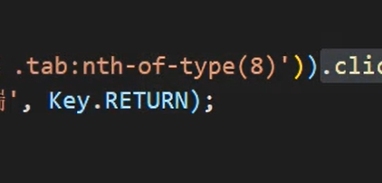

# Node.js网络爬虫学习笔记

Node.js爬虫学习目标：自动下载各大网站中的音乐！！！

自动获取新闻、自动获取电商网站数据。

做爬虫就是去解析html

Node.js知识点

- http.request
- Buffer
- cherrio库（完全按照jQuery API设计的一个库）
- jQuery选择器、方法

http请求的url中是不能包含中文的，如果有中文，浏览器会使用base64转码。

encode.uri方法

一个爬虫的基本步骤：

1. 发送http请求得到网页的字符串
2. 使用`cheerio`库对字符串进行分析
3. 使用第三方库下载分析之后的数据，例如可以使用`download`下载图片

注意伪造请求头

Selenium库

应付普通的反爬虫技术。

try catch

try finally

finally是无论如何都会执行的。

思考如何用爬虫技术薅羊毛，自动登录，输入手机号等等操作。

绕过反爬虫机制：

动态IP代理

补充CSS3选择器的知识，选择指定的某个元素 `:nth-of-type()`

vscode快速选中多个单词快捷键：ctrl + shift + 右键

