## 存储引擎

数据在计算机上存储的方式，MySQL常见存储引擎：InnoDB、MyISAM等。

InnoDB的优势在于提供了良好的事务处理、崩溃修复能力和并发控制。缺点是读写效率较差，占用的数据空间相对较大。

MyISAM的优势在于占用空间小，处理速度快。缺点是不支持事务的完整性和并发性。

## 字符集编码和排序规则

指数据库存储的数据的编码，utf8mb4：支持更多的unicode字符（四字节）。

**数据校对**：数据库除了要存储数据，还要对数据进行排序，比较等操作，不同的校对规则会有不同的结果。

**utf8mb4_unicode_ci**：一种排序规则，基于标准的Unicode来排序和比较，能够在各种语言之间精确排序。

- bin、_cs：区分大小写
- ci：不区分大小写

## 数据类型

**数据存储的类型**：

### 数字类型

INTEGER, INT, SMALLINT, TINYINT, MEDIUMINT, BIGINT, DECIMAL, NUMERIC, FLOAT, DOUBLE

日期时间类型

DATE, DATETIME, TIMESTAMP, TIM, YEAR

## 字符串类型

CHAR, VARCHAR, BINARY, VARBINARY, BLOB, TEXT, ENUM, SET

## 主键

表中的一个或多个字段，它的值用于唯一地标识表中的某一条记录，用来保持数据的完整性。

主键的特性：

1. 一个表只能有一个主键
2. 主键可以是一个字段，也可以由多个字段组成
3. 主键值不能重复
4. 可以加快对数据的操作

**自增 auto_increment**

添加数据的时候由数据库自动设置的值，一般在设计表的时候会设置一个自动增加字段作为主键，比如id字段一般就会设置为自增的。

## 索引

对表中一列或多列（注意是列）的值进行排序的一种结构，使用索引可以快速访问表中特定的信息，加快对表中记录的查找或排序。

## 通过命令行操作mysql

### 创建数据库

```shell
 create database mysql_demo01 default charset utf8mb4 collate utf8mb4_bin;
```

### 创建数据表

CREATE TABLE 数据库表名称 (
	字段名称 字段属性...,
	PRIMARY KEY (主键字段名称),
	INDEX 索引名称(索引字段...)...
) ENGINE=InnoDB DEFAULT CHARSET=utf8

```shell
CREATE TABLE user(
	`id` INT(11) UNSIGNED NOT NULL AUTO_INCREMENT,
	`username` VARCHAR(50) NOT NULL DEFAULT '',
	`age` TINYINT UNSIGNED NOT NULL DEFAULT 0,
	`gender` ENUM('男', '女') NOT NULL DEFAULT '男',
	PRIMARY KEY (`id`),
	INDEX uname(`username`),
	INDEX age(`age`),
	INDEX gender(`gender`)
)ENGINE=InnoDB DEFAULT CHARSET=utf8mb4 COLLATE=utf8mb4_bin;
```

**字段属性设置**

字段类型：int(10)、char(10)、varchar(200)

是否为null：NOT NULL

无符号：UNSIGNED

自动增长：AUTO_INCREMENT

默认值：DEFAULT 0

### 添加数据

INSERT INTO 表名称 (字段名称...) VALUES (值)

```shell
INSERT INTO `user` (`username`, `age`, `gender`) VALUES ('kimoo', 30, '男');
```

**批量添加**

```shell
INSERT INTO `user` (`username`, `age`, `gender`) VALUES ('jack', 20, '男'),('rose',25, '女');
```

### 修改数据/更新数据

```shell
UPDATE user SET `age` = 5;	-- 更新了表中所有的指定字段的数据，更新的时候要千万小心（有条件更新）
```

**条件更新**

```shell
 UPDATE `user` SET `age` = 20 WHERE `id` = 1;
```

### 删除数据

```shell
DELETE FROM `user`;	-- 删除也好格外小心，此操作会删除user表中的所有数据
```

**条件删除**

```shell
DELETE FROM `user` WHERE `id`=9;
```

**删除表的方法**

DROP TABLE 表名称：删除表、数据以及结构

```shell
DROP TABLE `user`;
```

### 数据查询

SELECT 字段,字段... FROM 表名称

```shell
select username,age,gender from user;
```

**通配符查询**，不推荐，因为性能不好

```shell
select * from user;
```

#### 数据去重查询

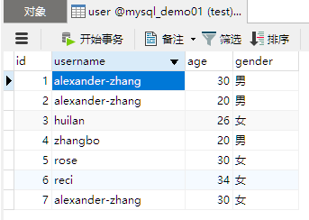

```shell
SELECT DISTINCT gender FROM user;
```

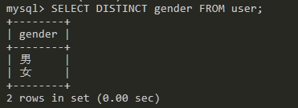

```shell
SELECT DISTINCT username,gender FROM user;  -- 去重username字段和gender字段完全一样的数据
```

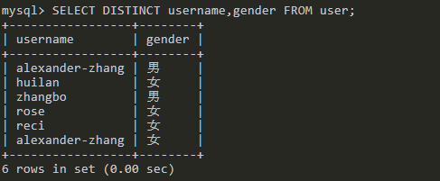

#### 分组查询

```shell
SELECT gender, count(gender) as count FROM user GROUP BY gender;
```

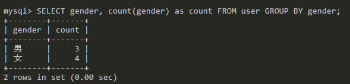

使用count函数统计gender字段的数量，然后通过gender字段进行分组显示。

#### 条件查询

```shell
SELECT * FROM user WHERE gender='男';
```

**多条件查询**

```shell
SELECT * FROM user WHERE gender='男' AND age<20;
```

**查询相关条件**

=、<>、>、<、>=、<=、BETWEEN、LIKE、IN、AND、OR

```shell
SELECT * FROM user WHERE age BETWEEN 26 AND 30;
```

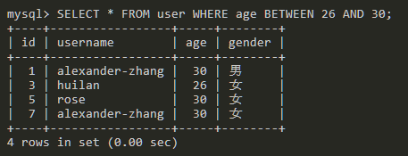

查询age字段中26到30之间的值。

#### **Like语句**

一般需要配合指定的通配符来运行：

- %：指任意一个或多个字符
- _：一个任意字符

```shell
SELECT * FROM user WHERE username LIKE 'r%';
```

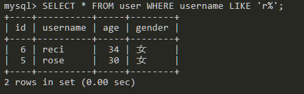

查询以r开头的字符。

```shell
mysql> SELECT * FROM user WHERE username LIKE '%e';
```

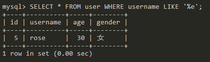

查询以e结尾的数据。

```shell
SELECT * FROM user WHERE username LIKE '%ander%';
```

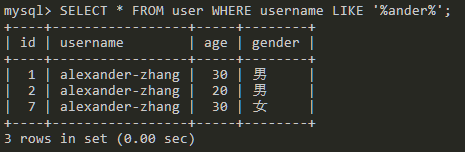

查询包含`ander`的数据。

```shell
SELECT * FROM user WHERE username LIKE '__s%';
```

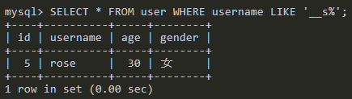

查询第三个字符串是s的数据。

#### **IN范围查询**

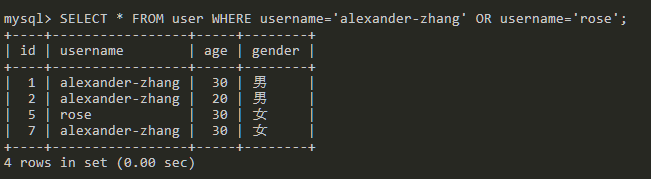

查询username为`alexander-zhang`或者username为`rose`的数据。

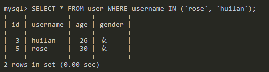

查询username为`rose`或`huilan`的数据。

**BETWEEN、LIKE、IN 都有对应的 NOT** 

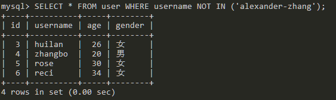

查询`username`不为`alexander-zhang`的数据。

#### 正则

SELECT 字段... FROM 表名 WHERE 字段名 REGEXP '规则'

```shell
SELECT * FROM user WHERE age REGEXP '6|4';
```

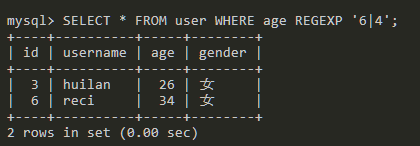

匹配`age`字段中包含6或者4的数据。

```shell
SELECT * FROM user WHERE username REGEXP '^ro';
```

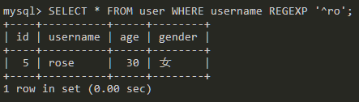

匹配`username`字段以ro开头的数据

> 注意：字符串转义，\d 需要写成 '\\d'

关于正则更多细节参考：<https://www.runoob.com/mysql/mysql-regexp.html>

#### 排序查询

SELECT 字段 FROM 表名 ORDER BY 字段 ASC|DESC, 字段 ASC|DESC；

- ASC：升序，从小到大，默认
- DESC：降序，从大到小
- 如果有多个排序字段和规则，执行顺序为从左到右

```shell
 SELECT * FROM user ORDER BY id DESC;
```

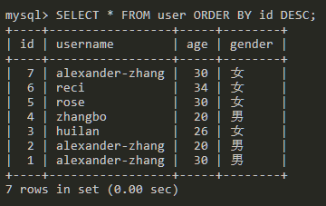

数据以id降序排序显示。

#### 限制偏移

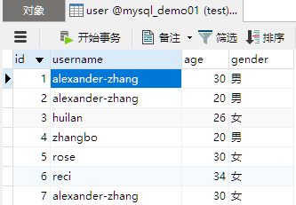


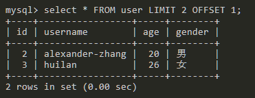

查询2条数据，从第二条开始查询，因为OFFSET默认值为0，索引是从0开始计算的，这里的1就是代表第二条数据。

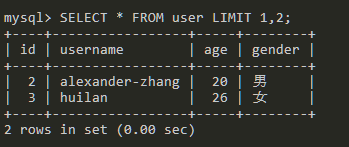

这种简介写法其中LIMIT后面的第一个参数是OFFSET的值，就是从1开始偏移，第二个参数是查询2条，因此和上面的查询结果一样。

#### 函数

UCASE函数：将字符串转换为大写再进行查询。

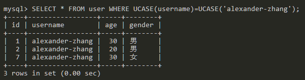

COUNT函数：统计字段中有多少条记录。

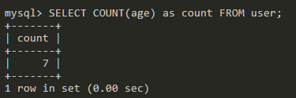

统计`age`字段中有多少条记录。

更多mysql函数知识参考：<https://www.runoob.com/mysql/mysql-functions.html>

#### 多表查询

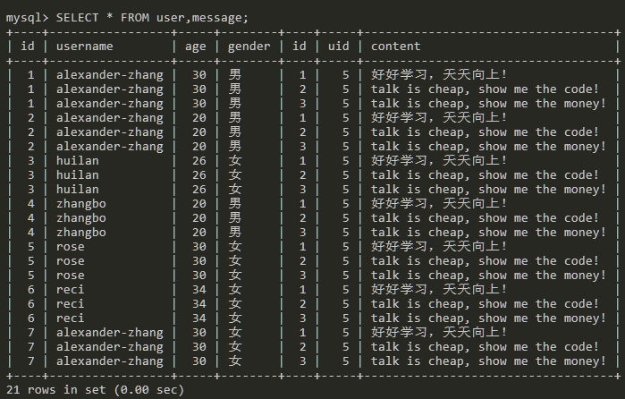

为什么会查询出来这么多数据？因为`message`表里面有3条数据，user表中的每条数据都会对应message表里面的3条数据，7*3就是21条数据了。

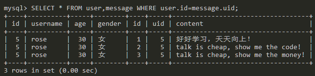

查询user和message表中user.id字段和message.uid字段值相同的数据。

```shell
SELECT * FROM user JOIN message ON user.id=message.uid;
```

同上。

**左连接查询**


LEFT JOIN 关键字从左表（表一）返回所有的行，即使右表（表二）中没有匹配。如果右表中没有匹配，则结果为 NULL。

**右连接查询**

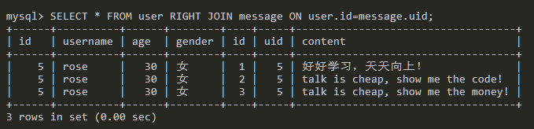

**综合查询**

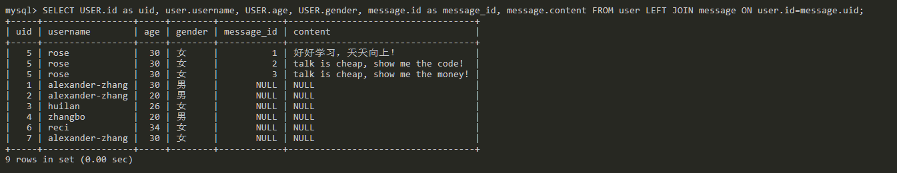

`as`关键词是取别名，将USER.id字段取别名为uid。

这些都是最最最基础的SQL知识了，后面的Sequelize ORM框架就是在原生SQL语句上进行了一层封装，支持创建数据模型通过对象的方式对数据库进行CRUD。

