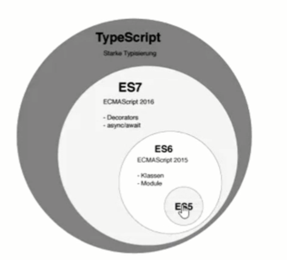
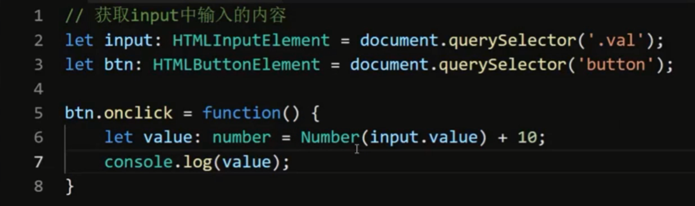

## 数据表

用户表、内容表、评论表、点赞表


## 项目初始化

创建一个`app`文件夹、在app文件夹下面创建server和client文件夹，然后在app文件夹路径下运行下面命令。

```shell
# 安装必要的包
npm sequelize-cli sequelize mysql2 @vue/cli

# cd到server目录后初始化sequelize项目
../node_modules/.bin/sequelize init
```

在`config.json`配置文件中增加时区配置。

```json
{
  "development": {
    "username": "root",
    "password": null,
    "database": "database_development",
    "host": "127.0.0.1",
    "dialect": "mysql",
    "timezone": "+08:00"
  },
  "test": {
    "username": "root",
    "password": null,
    "database": "database_test",
    "host": "127.0.0.1",
    "dialect": "mysql"
  },
  "production": {
    "username": "root",
    "password": null,
    "database": "database_production",
    "host": "127.0.0.1",
    "dialect": "mysql"
  }
```


## 创建模型


## 创建索引，username值不能唯一


## 通过seeder种子文件创建测试数据


## MD5无法解密


包版本不同坑死人，学习的时候4.x，最新的是6.x，很多API变动，语法变动坑死人，所以建议学习的时候严格按照指定版本安装学习，学习后再使用最新版本实现一遍。


## Model中配置多表查询


A拥有B，外键关系是在B里面存着的，A属于B，外键关系是在A存着的。


## 跨域配置

### 后端开启CORS

### 前端配置Proxy

默认会使用当前运行的域名作为发请求的域名。


## 日期格式化工具 momentjs


> props中的数据修改了之后，data中的数据不会立刻更新，因为data中的数据只在页面初始化的时候更新一次，因此我们需要使用watch监听props数据变化手动更新data中的数据。


## 登录状态验证


cookie

httponly模式：表示是否允许客户端（js）进行操作cookie，为true只能用于http协议传输，不允许修改cookie，为false则允许客户端修改。

将用户数据存储在客户端，不安全，容易被纂改。


session

建立在cookie之上的，cookie是直接把数据存储在客户端，session是将安全性数据、隐私数据存储在服务端，然后通过一个下发加密好的编号给客户端来进行鉴权的，session比cookie更加安全。

token


Vue的页面热重载其实就是靠`websocket`来做的。


## TypeScript

typescript是JavaScript的超集，使用TS编写可以让代码更规范，避免一些项目开发过程中的小错误；

TS最后还是会编译成JavaScript的，就类似使用babel将ES6编译成ES5。




## 安装


## 编译选项

指定编译输出文件路径。

--outdir


`tsconfig.json`配置文件


常用的模块化系统：commonjs、amd

`require`是commonjs的方式，导出module.exports

`import xxx from xxx`是amd的方式，导出export default xxx、export const xxx

> 查一下amd和commonjs的区别！！！


## ts-node

基于tsc的编译器，结合了node编译器，拥有自己的REPL环境，支持在REPL环境中直接编写和运行TS代码。


## 类型系统

### 类型注解（类型声明、类型约束）

隐患直接扼杀在编码过程中，因为等运行之后再来排查会很麻烦。

类型约束案例




#### 联合类型


#### 交叉类型


#### 枚举类型


#### 其它类型


### 类型推导

#### 变量初始化

#### 上下文推导


