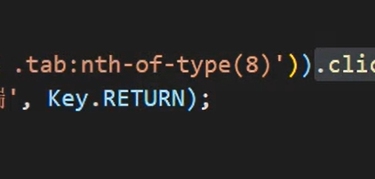
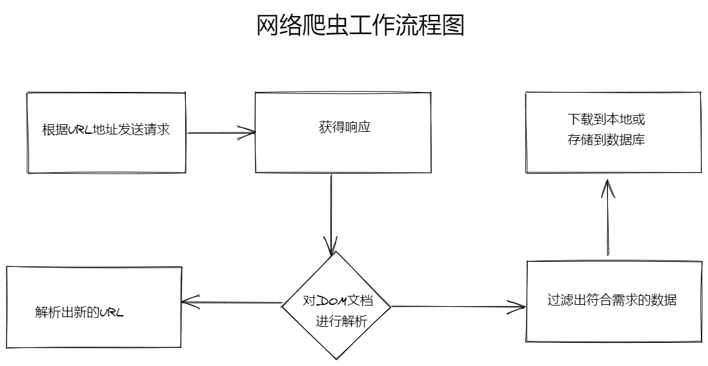
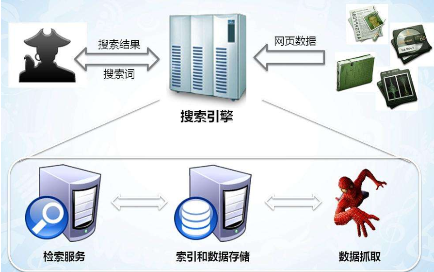
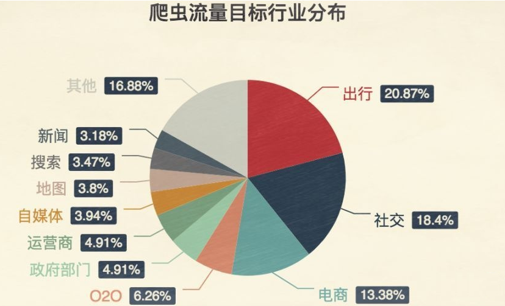
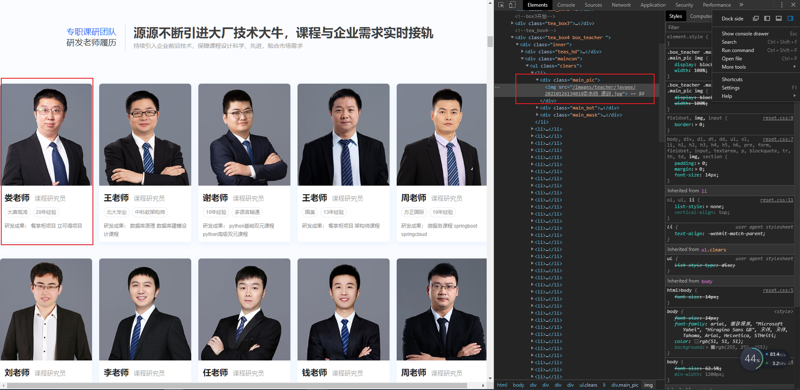
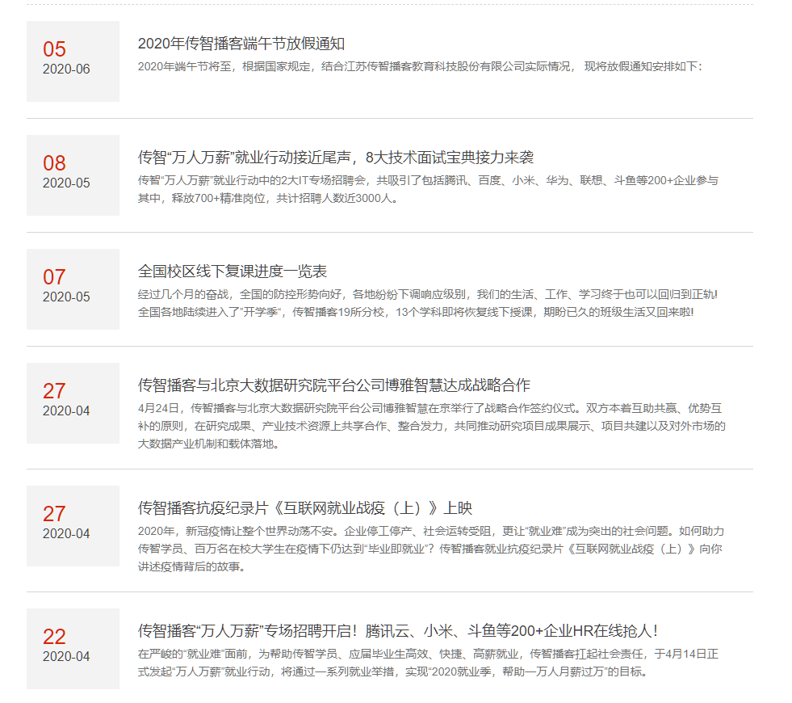
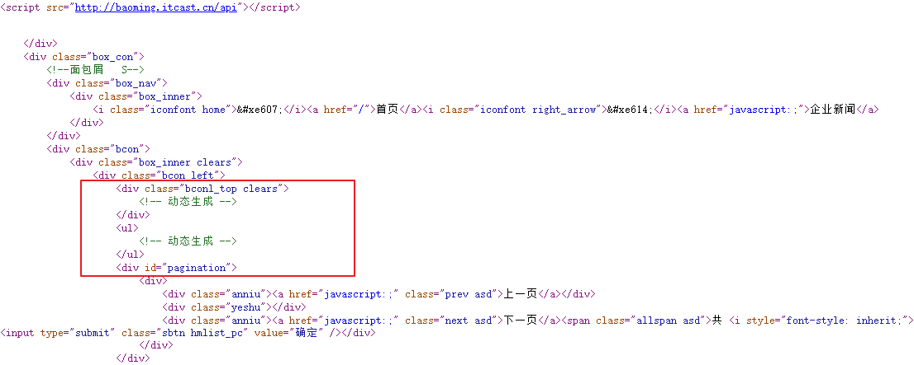
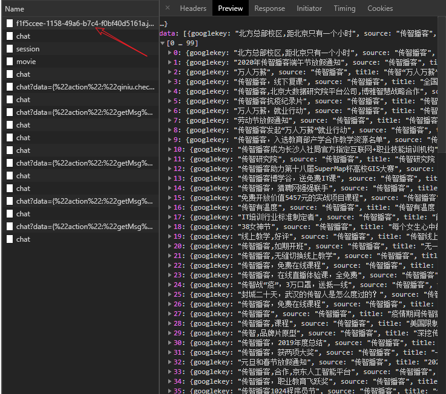

# Node.js网络爬虫实战


Node.js爬虫学习目标：自动下载各大网站中的音乐！！！

自动获取新闻、自动获取电商网站数据。

自动下载视频网站的视频。特别是pornhub（一定要尝试在这个网站上面下载学习视频）...


做爬虫就是去解析html

Node.js知识点

- http.request
- Buffer
- cherrio库（完全按照jQuery API设计的一个库）
- jQuery选择器、方法


http请求的url中是不能包含中文的，如果有中文，浏览器会使用base64转码。


encode.uri方法


一个爬虫的基本步骤：

1. 发送http请求得到网页的字符串
2. 使用`cheerio`库对字符串进行分析
3. 使用第三方库下载分析之后的数据，例如可以使用`download`下载图片


注意伪造请求头


Selenium库

应付普通的反爬虫技术。


try catch

try finally

finally是无论如何都会执行的。


思考如何用爬虫技术薅羊毛，自动登录，输入手机号等等操作。


绕过反爬虫机制：

动态IP代理


补充CSS3选择器的知识，选择指定的某个元素 `:nth-of-type()`



vscode快速选中多个单词快捷键：ctrl + shift + 右键


## Part1 爬虫介绍

### 什么是爬虫？

我们可以把互联网比喻成一张大网，爬虫就是在这张大网上面不断爬取信息的程序。

一句话总结就是：**爬虫是请求网站并提取数据的自动化程序**

爬虫的基本工作流程如下：

1. 向指定的url发送http请求
2. 获取响应数据（HTML、XML、JSON、二进制数据）
3. 处理数据（解析DOM、解析JSON等）
4. 将处理好的数据进行存储




### 爬虫的意义？

爬虫就是模拟人的功能在各个网站到出转悠，点点按钮，找找数据，把需要的数据背回来，就像一只虫子在大厦里面不知疲倦的爬来爬去。

你可以简单地想象：**每个爬虫都是你的“分身”。就像孙悟空拔了一撮汗毛，吹出一堆猴子一样。**

你每天使用的百度和Google，其实就是利用了这种爬虫技术：每天放出无数爬虫到各个网站，把他们的信息抓回来，存到数据库中等你来检索。



抢票软件，就相当于撒出去无数个分身，每一个分身都帮助你不断刷新 12306 网站的火车余票。一旦发现有票，就马上下单，然后对你喊：大爷快来付款呀。

在现实中几乎所有行业的网站都会被爬虫所 “骚扰”，而这些骚扰都是为了方便用户。



当然，有些网站是不能被过分骚扰的，其中排第一的就是出行类行业。

12306之所以会出如此变态的验证码，就是因为被爬虫折磨的无可奈何


正所谓道高一尺魔高一丈，某些爬虫工具，为了解决这种变态验证码，甚至推出了“打码平台”。

原理就是爬虫还是不断工作，但只要遇到二维码，就通过打码平台下发任务，打码平台另一边就雇佣一大堆网络闲人，只要看到有验证码来了，就人工选一下验证码，完美的让程序与人工结合！

### 学习目标

1. 制作一个自动下载图片的小爬虫
2. 使用Selenium爬取动态网站

## Part2 爬虫基础知识

学习目标：

以`http://web.itheima.com/teacher.html`网站为例，爬取页面中所有的老师图片并下载到本地。

实现步骤：

1. 发送http请求，获取整个网页内容
2. 通过cheerio库对网页内容进行分析
3. 提取img标签的src属性
4. 使用download库进行批量下载图片

### 发送第一个HTTP请求

直接使用Node.js提供的`http.request()`方法来发送请求，当然也可以使用`axios`来发送。

> axios支持在Node.js平台发送HTTP请求，其本质是对http.request进行了封装

```js
// 引入http模块
const http = require('http')

// 使用http模块的request方法发送请求
const req = http.request('http://web.itheima.com/teacher.html', res => {
  console.log('数据爬取中......')
  // 接收到数据时触发的回调函数
  let chunks = []
  res.on('data', c => chunks.push(c))

  res.on('end', _=>{
    console.log('------------------data receive success!------------------')
    // 拼接Buffer数据后转换成字符串
    console.log(Buffer.concat(chunks).toString())
  })
})

// 发送请求
req.end()
```

得到的是一个字符串，这个字符串就是整个HTML网页的内容。

### 将获取的HTML字符串使用cheerio

学习目标：

1. 使用cheerio加载HTML
2. 回顾jQueryAPI
3. 加载所有的img标签的src属性

### cheerio库简介

官网：<https://www.npmjs.com/package/cheerio>

> 这是一个核心api按照jquery来设计，专门在服务器上使用，一个微小、快速和优雅的库

简而言之，就是可以再服务器上用这个库来解析HTML代码，并且可以直接使用和jQuery一样的api

安装命令：`npm install cheerio`

官方demo如下：

```js
const cheerio = require('cheerio');
const $ = cheerio.load('<h2 class="title">Hello world</h2>');

$('h2.title').text('Hello there!');
$('h2').addClass('welcome');

$.html();
//=> <html><head></head><body><h2 class="title welcome">Hello there!</h2></body></html>
```

同样也可以通过jQuery的api来获取DOM元素中的属性和内容，是不是感觉很爽？

### 使用cheerio库解析HTML

1. 分析网页中所有img标签的结构



使用jQuery API获取所有img的src属性

```js
// 引入http模块
const http = require('http')
const cheerio = require('cheerio')

// 创建请求对象
let req = http.request('http://web.itheima.com/teacher.html', res => {
  // 准备chunks存储拼接后的 Buffer 分片数据
  let chunks = []
  res.on('data', c => chunks.push(c))
  res.on('end', () => {
    // 结束数据监听时将所有内容拼接
    let html = Buffer.concat(chunks).toString('utf-8')
    let $ = cheerio.load(html)

    let imgArr = Array.prototype.map.call($('.maincon .main_pic > img'), item => `http://web.itheima.com/${$(item).attr('src')}`)
    console.log(imgArr)
  })
})

// 发送请求
req.end()
```

### 使用download库下载图片

官方地址：<https://www.npmjs.com/package/download>

安装命令：` npm install download` 

```js
const http = require('http')
const cheerio = require('cheerio')
const download = require('download')

let req = http.request('http://web.itheima.com/teacher.html', res => {
  let chunks = []
  res.on('data', c => chunks.push(c))
  res.on('end', () => {
    let html = Buffer.concat(chunks).toString('utf-8')
    let $ = cheerio.load(html)

    let imgArr = Array.prototype.map.call($('.maincon .main_pic > img'), item => encodeURI(`http://web.itheima.com/${$(item).attr('src')}`))
    Promise.all(imgArr.map(x => download(x, 'dist'))).then(()=>{
      console.log('----------------------图片下载完成！----------------------')
    })
  })
})

req.end()
```

> 注意：如果url中有中文，硬下载会报错，使用javascript提供的encodeURI API进行编码即可

### 爬取新闻信息

爬取目标：`http://www.itcast.cn/newsvideo/newslist.html`



大部分新闻网站，现在都采取前后端分离的方式，也就是前端页面先写好模板，等网页加载完毕后，发送Ajax再获取数据，将其渲染到模板中。所以如果使用相同方式来获取目标网站的HTML页面，请求到的只是模板，并不会有数据：



此时，如果还希望使用当前方法爬取数据，就需要分析该网站的ajax请求是如何发送的，可以打开network面板来调试：



分析得出对应的ajax请求后，找到其URL，向其发送请求即可。

```js
const http = require('http')
const HOST = 'http://www.itcast.cn/news/json/f1f5ccee-1158-49a6-b7c4-f0bf40d5161a.json'
const req = http.request(HOST, res=>{
  let chunks = []
  res.on('data', c => chunks.push(c))
  res.on('end', _=>{
    let result = Buffer.concat(chunks).toString()
    console.log(JSON.parse(result))
  })
})

req.end()
```

如果遇到请求限制，还可以模拟真实浏览器的请求头：

```js
// 引入http模块
const http = require('http')
const cheerio = require('cheerio')
const download = require('download')

// 创建请求对象 (此时未发送http请求)
const url = 'http://www.itcast.cn/news/json/f1f5ccee-1158-49a6-b7c4-f0bf40d5161a.json'
let req = http.request(url, {
  headers: {
    "Host": "www.itcast.cn",
    "Connection": "keep-alive",
    "Content-Length": "0",
    "Accept": "*/*",
    "Origin": "http://www.itcast.cn",
    "X-Requested-With": "XMLHttpRequest",
    "User-Agent": "Mozilla/5.0 (Windows NT 10.0; Win64; x64) AppleWebKit/537.36 (KHTML, like Gecko) Chrome/75.0.3770.100 Safari/537.36",
    "DNT": "1",
    "Referer": "http://www.itcast.cn/newsvideo/newslist.html",
    "Accept-Encoding": "gzip, deflate",
    "Accept-Language": "zh-CN,zh;q=0.9,en;q=0.8",
    "Cookie": "UM_distinctid=16b8a0c1ea534c-0c311b256ffee7-e343166-240000-16b8a0c1ea689c; bad_idb2f10070-624e-11e8-917f-9fb8db4dc43c=8e1dcca1-9692-11e9-97fb-e5908bcaecf8; parent_qimo_sid_b2f10070-624e-11e8-917f-9fb8db4dc43c=921b3900-9692-11e9-9a47-855e632e21e7; CNZZDATA1277769855=1043056636-1562825067-null%7C1562825067; cid_litiancheng_itcast.cn=TUd3emFUWjBNV2syWVRCdU5XTTRhREZs; PHPSESSID=j3ppafq1dgh2jfg6roc8eeljg2; CNZZDATA4617777=cnzz_eid%3D926291424-1561388898-http%253A%252F%252Fmail.itcast.cn%252F%26ntime%3D1563262791; Hm_lvt_0cb375a2e834821b74efffa6c71ee607=1561389179,1563266246; qimo_seosource_22bdcd10-6250-11e8-917f-9fb8db4dc43c=%E7%AB%99%E5%86%85; qimo_seokeywords_22bdcd10-6250-11e8-917f-9fb8db4dc43c=; href=http%3A%2F%2Fwww.itcast.cn%2F; bad_id22bdcd10-6250-11e8-917f-9fb8db4dc43c=f2f41b71-a7a4-11e9-93cc-9b702389a8cb; nice_id22bdcd10-6250-11e8-917f-9fb8db4dc43c=f2f41b72-a7a4-11e9-93cc-9b702389a8cb; openChat22bdcd10-6250-11e8-917f-9fb8db4dc43c=true; parent_qimo_sid_22bdcd10-6250-11e8-917f-9fb8db4dc43c=fc61e520-a7a4-11e9-94a8-01dabdc2ed41; qimo_seosource_b2f10070-624e-11e8-917f-9fb8db4dc43c=%E7%AB%99%E5%86%85; qimo_seokeywords_b2f10070-624e-11e8-917f-9fb8db4dc43c=; accessId=b2f10070-624e-11e8-917f-9fb8db4dc43c; pageViewNum=2; nice_idb2f10070-624e-11e8-917f-9fb8db4dc43c=20d2a1d1-a7a8-11e9-bc20-e71d1b8e4bb6; openChatb2f10070-624e-11e8-917f-9fb8db4dc43c=true; Hm_lpvt_0cb375a2e834821b74efffa6c71ee607=1563267937"
  }
}, res => {
  // 异步的响应
  // console.log(res)
  let chunks = []
  // 监听data事件,获取传递过来的数据片段
  // 拼接数据片段
  res.on('data', c => chunks.push(c))

  // 监听end事件,获取数据完毕时触发
  res.on('end', () => {
    // 拼接所有的chunk,并转换成字符串 ==> html字符串
    // console.log(Buffer.concat(chunks).toString('utf-8'))
    let result = Buffer.concat(chunks).toString('utf-8')
    console.log(JSON.parse(result))
  })
})

// 将请求发出去
req.end()
```

注意：请求头的内容，可以先通过真正的浏览器访问一次后获取。

### 封装爬虫基础库

以上代码重复的地方非常多，可以考虑以面向对象的方式进行封装，为了方便开发，保证代码规范，建议使用TypeScript进行封装。

**以下知识点为扩展内容，需要对面向对象和TypeScript有一定了解！**

执行`tsc --init`初始化项目，生成ts配置文件

TS配置：

```js
{
  "compilerOptions": {
    /* Basic Options */
    "target": "es2015", 
    "module": "commonjs", 
    "outDir": "./bin", 
    "rootDir": "./src", 
    "strict": true,
    "esModuleInterop": true 
  },
  "include": [
    "src/**/*"
  ],
  "exclude": [
    "node_modules",
    "**/*.spec.ts"
  ]
}
```


## Part3 爬虫实战案例


