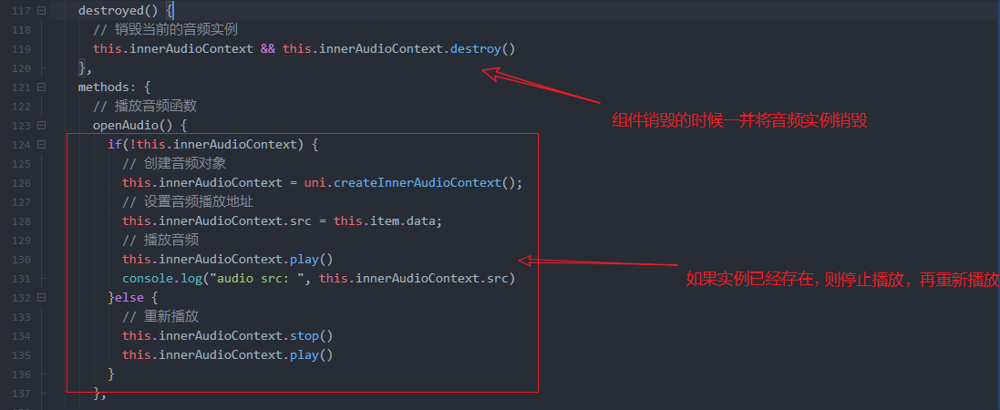

## 叮咚项目参考文档 v1.0

此项目是一款高仿`微信`APP的即时通讯应用，叫`叮咚`，是我的开源处女座，希望能与感兴趣的你交流 : )

项目技术栈：

​前端部分：uni-app + nvue 实现原生页面渲染、同时兼容多端。

后端接口：Egg.js + MySQL + Redis 实现后端API接口服务。

不使用第三方组件库，自己写一套。

为什么做这个项目？

1. 在公司用`uni-app`写的都是比较简单的小程序项目，没有真正意义上从0到1实现过一个功能较复杂的`跨端`项目，借此机会，深入实践`uni-app`技术栈
2. 我非常渴望拥有从0到1独立开发一款全栈应用的能力，因为我觉得`Node.js`太美了，太性感，对前端太友好了，不学习它简直就是对不起`前端工程师`这个 Title，借此机会彻底实践一次。

我想这是一个美好的开始，我也把它当作一种精进技术的方式，希望能在`issues`或企鹅中与你进行思想碰撞。

我的企鹅：`1762458611`


## NVUE需要注意的点

1. 在NVUE中引入字体图标需要参考Weex的引入规则 [点我查看](<https://weex.apache.org/zh/docs/modules/dom.html#addrule>)

3. NVUE模式下的页面默认是Flex布局
4. iconfont图标应该放在`text`标签中包裹，不能直接使用`view`标签包裹
5. NVUE中的屏幕都是以750像素为基准
6. text组件换行问题，text组件中的内容如果有换行，显示的效果也会换行
7. Weex是从上到下进行渲染的，如果你的元素有定位之类的脱离文档流的需求，元素最好按顺序写，否则`z-index`可能也救不了你。
8. 目前仅 iOS 支持 `box-shadow` 属性，Android 暂不支持，可以使用图片代替。每个元素只支持设置一个阴影效果，不支持多个阴影同时作用于一个元素。
9. 


`uni-app`中 vue 和 nvue 的区别：

uni-app是逻辑和渲染分离的。渲染层，在app端提供了两套排版引擎：小程序方式的webview渲染，和weex方式的原生渲染。
两种渲染引擎可以自己根据需要选。vue文件走的webview渲染，nvue走的原生渲染。
组件和js写法是一样的，css不一样，原生排版的能用的css必须是flex布局，这是web的css的子集。当然什么界面都可以用flex布出来。不懂flex布局就自己学。

一般情况下用vue就可以了。如果是app且有部分场景vue页面的性能不满足你的需求时，这个页面可以改用nvue页面。如果app里同时存在同名的vue和nvue页面，在app端会优先执行nvue页面，而其他端仍然优先vue页面。

区别和适用场景这文档里写的很清楚：<https://uniapp.dcloud.io/nvue-outline>


## 记录一些踩过的坑

1. [【报Bug】2.2.5版本纯nvue的uniapp模式子组件使用插槽报错问题](https://ask.dcloud.net.cn/question/78535)
2. 


## 需要恶补项目中的基础知识

以看懂`free-lib/time.js`这个库为目的展开复习下面的知识点：

1. JavaScript的正则表达式
2. `Date`日期时间对象知识
3. 


## 补充知识

### 1.image组件的mode属性讲解


## 1.环境搭建和项目创建

需要安装的插件：

1. 内置浏览器
2. App真机运行
3. uni-app App调试
4. less编译
5. scss/sass编译
6. stylus编译
7. es6编译


创建项目：

项目类型为：uni-app，使用默认模版。


开启原生渲染：

uni-app在App端，支持vue页面和nvue页面混搭、互相跳转。也支持纯nvue原生渲染。

启用纯原生渲染模式，可以减少App端的包体积、减少使用时的内存占用。因为webview渲染模式的相关模块将被移除。

在manifest.json源码视图的`"app-plus"`下配置`"renderer":"native"`，即代表App端启用纯原生渲染模式。此时pages.json注册的vue页面将被忽略，vue组件也将被原生渲染引擎来渲染。

如果不指定该值，默认是不启动纯原生渲染的。

```json
 // manifest.json    
    {    
         // ...    
        /* App平台特有配置 */    
        "app-plus": {    
            "renderer": "native", //App端纯原生渲染模式
        }    
    }
```

使用uni-app编译模式：

```json
 // manifest.json    
    {    
         // ...    
        /* App平台特有配置 */    
        "app-plus": {    
            "renderer": "native", //App端纯原生渲染模式
            "nvueCompiler" : "uni-app",
        }    
    }
```


## 2.全局配置

### 2.1 引入全局样式

将封装好的`free.css`库引入到项目中。


### 2.2 引入自定义图标库

全局加载自己的字体图标库并且做多端适配：

```html
<script>
	export default {
		onLaunch: function() {
			// #ifdef APP-NVUE
			// 加载公共图标库 只有在NVUE环境下才加载
			const domModule = weex.requireModule('dom')
			domModule.addRule('fontFace', {
				'fontFamily': "iconfont",
				src: "url('https://at.alicdn.com/t/font_1365296_2ijcbdrmsg.ttf')"
			});
			// #endif
		},
		onShow: function() {
			console.log('App Show')
		},
		onHide: function() {
			console.log('App Hide')
		}
	}
</script>

<style>
	/*每个页面公共css */
	@import url("./common/free.css");
	@import url("./common/common.css");
	/* #ifndef APP-PLUS */
	@import url("./common/free-icon.css");
	/* #endif */
</style>

```

> 如果对跨端兼容和条件编译语法不熟悉，可以参考[官方文档](https://uniapp.dcloud.io/platform?id=%e6%9d%a1%e4%bb%b6%e7%bc%96%e8%af%91)


### 2.3 配置tabbar底部导航

修改`package.json`配置文件、添加`tabbar`配置。

这里的 tabbar 的 icon 图标大小为 81*81。

```json
{
	"pages": [ //pages数组中第一项表示应用启动页，参考：https://uniapp.dcloud.io/collocation/pages
		{
			"path": "pages/tabbar/index/index",
			"style": {}
		},
		{
			"path": "pages/tabbar/mail/mail",
			"style": {}
		},
		{
			"path": "pages/tabbar/find/find",
			"style": {}
		},
		{
			"path": "pages/tabbar/my/my",
			"style": {}
		}
	],
	"globalStyle": {
		"navigationBarTextStyle": "black",
		"navigationBarTitleText": "叮咚",
		"navigationBarBackgroundColor": "#F8F8F8",
		"backgroundColor": "#F8F8F8"
	},
	"tabBar": {
		"color": "#000000",
		"selectedColor": "#08C261",
		"borderStyle": "black",
		"backgroundColor": "#F7F7F7",
		"list": [{
				"iconPath": "static/tabbar/index.png",
				"selectedIconPath": "static/tabbar/index-select.png",
				"pagePath": "pages/tabbar/index/index",
				"text": "首页"
			},
			{
				"iconPath": "static/tabbar/mail.png",
				"selectedIconPath": "static/tabbar/mail-select.png",
				"pagePath": "pages/tabbar/mail/mail",
				"text": "通讯录"
			},
			{
				"iconPath": "static/tabbar/find.png",
				"selectedIconPath": "static/tabbar/find-select.png",
				"pagePath": "pages/tabbar/find/find",
				"text": "发现"
			},
			{
				"iconPath": "static/tabbar/my.png",
				"selectedIconPath": "static/tabbar/my-select.png",
				"pagePath": "pages/tabbar/my/my",
				"text": "我的"
			}
		]
	}
}

```

配置细节参考[官方文档](https://uniapp.dcloud.io/collocation/pages)


### 2.4 配置globalStyle

取消APP端下的原生导航栏、滚动条。

```json
"globalStyle": {
    "navigationBarTextStyle": "black",
    "navigationBarTitleText": "叮咚",
    "navigationBarBackgroundColor": "#F8F8F8",
    "backgroundColor": "#F8F8F8",
    "app-plus":{
        "titleNView":false,
        "scrollIndicator":"none"
    }
}
```


## 3.聊天列表页开发

### 3.1 头部导航栏组件开发

```html
<template>
	<view>
		<!-- 导航栏 -->
		<view class="bg-light">
			<!-- 状态栏 -->
			<view :style="'height:'+statusBarHeight+'px'"></view>
			<!-- 导航 -->
			<view class="w-100 flex align-center justify-between border" style="height: 90rpx">
				<!-- 左边标题部分 -->
				<view class="flex align-center">
					<text class="font-md ml-3">叮咚(10)</text>
				</view>
				<!-- 右边图标部分 -->
				<view class="flex align-center">
					<view class="flex align-center justify-center border" style="height: 90rpx;width: 90rpx;">
						<text class="iconfont font-md">&#xe6e3;</text>
					</view>

					<view class="flex align-center justify-center border" style="height: 90rpx;width: 90rpx;">
						<text class="iconfont font-md">&#xe682;</text>
					</view>
				</view>
			</view>
		</view>
	</view>
</template>

<script>
	export default {
		data() {
			return {
				statusBarHeight: 0 // 状态栏高度
			}
		},
		onLoad() {
			this.statusBarHeight = plus.navigator.getStatusbarHeight()
		},
		methods: {

		}
	}
</script>

<style lang="less">
</style>

```


### 3.2 [*]图标按钮组件封装

这个地方有一个坑：

> NVUE 中如果使用 iconfont 的话就必须使用`text`标签进行包裹，如果要封装成组件，通过`slot`动态传递iconfont 的 16 进制值的话就会报错，因为 slot 会转换成`text`标签，又因为`text`标签里面不能再次嵌套`text`标签，所以报错，这个也是近期才发现的，以前看别人写没有问题，怎么解决呢？通过 props 传参。

`封装的组件: free-icon-button.vue`

```html
<template>
<view
      class="flex align-center justify-center" 
      hover-class="bg-hover-light" @click="$emit('click')"
      style="height: 90rpx;width: 90rpx;">
    <text class="iconfont font-md">{{iconValue}}</text>
    </view>
</template>

<script>
    export default {
        name: '',
        components: {},
        props: {
            iconValue: {
                required: true
            }
        },
        data () {
            return {}
        },
        computed: {},
        watch: {},
        created () {
            console.log(this.iconValue)
        },
        mounted () {},
        methods: {}
    }
</script>

<style scoped lang="less"></style>

```


`调用组件的文件  index/index.nvue`

```html
<free-icon-button @click="handleIconButtonClick" :iconValue="'\ue682'"/>
```


> 这里面还有一个细节：
>
> 通过props方式传参的话 iconfont 的 16 进制值就不能写成 `&#xe682;`，必须写成`\ue682`

这个问题通过查资料 + 反复实践大约耗时 30 分钟，因此记录一下这个坑。


### 3.3 封转头部导航组件

> uni-app的普通组件中使用onLoad、onShow不生效？，要用created、mounted，为什么？

这个就要从`uni-app`的生命周期说起了。。。

`uni-app`有 3 类生命周期：

1. 应用生命周期
2. 页面生命周期
3. 组件生命周期

应用生命周期：


> 重点是应用生命周期只能在`App.vue`中监听，其他页面监听无效，所以不要用错了。


页面生命周期： 


> 需要注意的是：`onLoad`和`onReady`只会触发一次，这是官方没有说的，所以还是要多实践！

以上是常用的几个，想了解全部的参考[官方文档](https://uniapp.dcloud.io/collocation/frame/lifecycle?id=%e9%a1%b5%e9%9d%a2%e7%94%9f%e5%91%bd%e5%91%a8%e6%9c%9f)


组件生命周期：

`uni-app` 组件支持的生命周期，与vue标准组件的生命周期相同。这里没有页面级的onLoad等生命周期：


> 以后编写组件的时候就要细心点，页面组件就用页面的生命周期，普通组件就用组件的生命周期，别乱搞给自己挖坑。


`index/index.nvue 页面代码`

```html
<template>
	<view>
		<!-- 导航栏 -->
		<free-nav-bar title titleValue="叮咚(99+)" fixed />

		<!-- 列表 -->
		<view style="height: 2000rpx;">
			<text>好好学习，天天向上！</text>
		</view>
	</view>
</template>

<script>
	import FreeNavBar from '@/components/free-ui/free-nav-bar.vue'
	export default {
		name: "IndexPage",
		components: {
			FreeNavBar
		},
		data() {
			return {}
		},
		methods: {}
	}
</script>

<style lang="less">
</style>

```


`free-nav-bar.vue 组件代码`

```html
<template>
	<view>
		<!-- 导航栏 -->
		<view class="bg-light" :class="fixed?'fixed-top':''">
			<!-- 状态栏 -->
			<view :style="'height:'+statusBarHeight+'px'"></view>
			<!-- 导航 -->
			<view class="w-100 flex align-center justify-between border" style="height: 90rpx">
				<!-- 左边标题部分 -->
				<view class="flex align-center">
					<text v-if="title" class="font-md ml-3">{{titleValue}}</text>
				</view>
				<!-- 右边图标部分 -->
				<view class="flex align-center">
					<free-icon-button :iconValue="'\ue6e3'" />
					<free-icon-button :iconValue="'\ue682'"/>
				</view>
			</view>
		</view>
		<!-- 占位 -->
		<view v-if="fixed" :style="fixedStyle"></view>
	</view>
</template>

<script>
import FreeIconButton from '@/components/free-ui/free-icon-button.vue'
export default {
  name: 'FreeNavBar',
  components: {
		FreeIconButton,
	},
  props: {
		// 是否显示标题
		title: {
			type: Boolean,
			default: false
		},
		// 标题内容
		titleValue: {
			type: String
		},
		// 是否固定导航栏
		fixed: {
			type: Boolean,
			default: true
		}
	},
  data () {
    return {
			navBarHeight: 0,		// 状态栏高度+导航栏高度
			statusBarHeight: 0 // 状态栏高度
		}
  },

  computed: {
		fixedStyle() {
			return `height: ${this.navBarHeight}px`
		}
	},
  watch: {},
  created () {},
  mounted () {
		console.log("API获取：", uni.getSystemInfoSync().statusBarHeight)
		// NVUE环境下获取系统状态栏的高度
		// #ifdef APP-NVUE
			this.statusBarHeight = plus.navigator.getStatusbarHeight()
		// #endif
		/* 
			这里使用uni.upx2px的原因是因为我们获取的statusBarHeight是px单位，要进行相加
			需要转换成相同的单位才行.
		 */
		this.navBarHeight = this.statusBarHeight + uni.upx2px(90)
	},
  methods: {},
}
</script>

<style scoped lang="less">
</style>

```

> 这里使用计算属性配合动态计算 状态栏 + 导航栏的高度，这个高度给占位的`view`标签用，防止列表被导航栏覆盖。


### 3.4 开发聊天列表组件

`index/index.nvue 文件代码`

```html
<template>
	<view>
		<!-- 导航栏 -->
		<free-nav-bar title titleValue="叮咚(99+)" fixed />

		<!-- 列表 -->
		<view class="flex align-center" v-for="(item, index) in list" :key="index">
			<!-- 左侧 -->
			<view class="flex align-center justify-center" style="width: 145rpx;">
				<image :src="item.avatar" style="width: 92rpx;height:92rpx;" mode="widthFix" class="rounded"></image>
			</view>
			<!-- 右侧 -->
			<view class="flex flex-column border-bottom flex-1 py-3 pr-3 border-light-secondary">
				<view class="flex align-center justify-between mb-1">
					<text class="font-md">{{item.nickname}}</text>
					<text class="font-sm text-light-muted">{{item.update_time | formatTime}}</text>
				</view>
				<text class="font text-ellipsis text-light-muted">{{item.data}}</text>
			</view>
		</view>
	</view>
</template>

<script>
	import FreeNavBar from '@/components/free-ui/free-nav-bar.vue'
	import $Time from '@/common/free-lib/time.js'
	export default {
		name: "IndexPage",
		components: {
			FreeNavBar
		},
		data() {
			return {
				list: [{
						avatar: "/static/avatar.jpg",
						nickname: '老婆',
						update_time: Date.now(),
						data: '今晚想吃什么都可以...'
					},
					{
						avatar: "/static/avatar.jpg",
						nickname: '老婆2',
						update_time: Date.now(),
						data: '今晚想吃什么都可以...'
					},
					{
						avatar: "/static/avatar.jpg",
						nickname: '老婆3',
						update_time: Date.now(),
						data: '今晚想吃什么都可以...'
					},
					{
						avatar: "/static/avatar.jpg",
						nickname: '老婆4',
						update_time: Date.now(),
						data: '今晚想吃什么都可以...'
					},
					{
						avatar: "/static/avatar.jpg",
						nickname: '老婆5',
						update_time: Date.now(),
						data: '今晚想吃什么都可以...'
					}
				]
			}
		},
		methods: {},
		filters: {
			formatTime(value) {
				return $Time.gettime(value)
			}
		}
	}
</script>

<style lang="less">
</style>

```


### 3.5 封装头像组件

`free-avatar.vue 文件代码`

```html
<template>
  <image
		:src="src"
		mode="widthFix"
		:style="getStyle"
		:class="type"
	></image>
</template>

<script>
export default {
  name: 'FreeAvatar',
  components: {},
  props: {
		// 图像大小
		size: {
			type: [String, Number],
			default: 90
		},
		// 图像地址
		src: {
			type: String,
			default: ""
		},
		// 图像显示类型，是否圆角显示
		type: {
			type: String,
			default: "rounded"
		}
	},
  data () {
    return {}
  },
  computed: {
		getStyle () {
			return `width: ${this.size}rpx;height: ${this.size}rpx;`
		}
	},
  watch: {},
  created () {},
  mounted () {},
  methods: {}
}
</script>

<style scoped lang="less"></style>

```

`index/index.vue 文件中使用`

```html
<free-avatar :src="item.avatar" size="92" />
```


### 3.6 badge组件封装

封装前的代码：

`index/index.nvue 角标元素代码`

```html
<!-- 角标 -->
<text class="bg-danger text-white rounded-circle font-sm badge" >9</text>
```

`角标css代码`

```css
.badge {
    padding-left: 14rpx;
    padding-right: 14rpx;
    padding-bottom: 6rpx;
    padding-top: 6rpx;
    position: absolute;
    right: 15rpx;
    top: 15rpx;
}
```


封装后的代码：

`free-badge.vue`

```html
<template>
  <text 
		class="bg-danger text-white rounded-circle font-sm free-badge"
		:class="badgeClass"
		:style="badgeStyle"
	>{{value}}</text>
</template>

<script>
export default {
  name: 'FreeBadge',
  components: {},
  props: {
		// 角标样式类名
		badgeClass: {
			type: String,
			default: ""
		},
		// 角标行内样式
		badgeStyle: {
			type: String,
			default: ""
		},
		// 角标内容
		value: {
			type: [String, Number],
			default: ""
		}
	},
  data () {
    return {}
  },
  computed: {},
  watch: {},
  created () {},
  mounted () {},
  methods: {}
}
</script>

<style scoped lang="less">
	.free-badge {
		padding: 6rpx 14rpx;
	}
</style>

```


使用`badge`

```html
<free-badge value="1" badgeClass="position-absolute" badgeStyle="top: 15rpx;right:15rpx" />
```


### 3.7 封装聊天列表组件

> 需要注意view标签监听`@longpress`长按事件无法获取坐标值，此时换成 div 标签即可。

` free-media-list.vue 文件代码`

```html
<template>
	<view hover-class="bg-hover-light" v-if="item">
		<!-- 列表 -->
		<div class="flex" @click="onClick" @longpress="long">
			<!-- 左侧 -->
			<view class="flex align-center justify-center position-relative" style="width: 145rpx">
				<free-avatar :src="item.avatar" size="92" />
				<!-- 角标 -->
				<free-badge :value="item.noreadnum" badgeClass="position-absolute" badgeStyle="top: 15rpx;right:15rpx" />
			</view>
			<!-- 右侧 -->
			<view class="flex flex-column border-bottom flex-1 py-3 pr-3 border-light-secondary">
				<view class="flex align-center justify-between mb-1">
					<text class="font-md">{{item.nickname}}</text>
					<text class="font-sm text-light-muted">{{item.update_time | formatTime}}</text>
				</view>
				<text class="font-sm text-ellipsis text-light-muted">{{item.data}}</text>
			</view>
		</div>
	</view>
</template>

<script>
	import FreeAvatar from '@/components/free-ui/free-avatar.vue'
	import FreeBadge from '@/components/free-ui/free-badge.vue'
	import $Time from '@/common/free-lib/time.js'
	export default {
		name: 'FreeMediaList',
		components: {
			FreeAvatar,
			FreeBadge
		},
		props: {
			item: Object,
			index: Number
		},
		data() {
			return {}
		},
		computed: {},
		watch: {},
		created() {},
		mounted() {},
		methods: {
			onClick() {
				this.$emit('click')
			},
			long(e) {
				console.log(e)
			}
		},
		filters: {
			formatTime(value) {
				return $Time.gettime(value)
			}
		}
	}
</script>

<style scoped lang="less">
</style>

```


使用组件的代码

```html
<!-- 列表 -->
<block v-for="(item, index) in list" :key="index">
    <free-media-list
	:item="item"
    :index="index"
	/>
</block>
```


### 3.8 封装全局mixin

> 例如有以下场景：
>
> 多个组件内需要对日期时间进行格式化处理，这时我们已经在某个组件内定义了`filters`过滤器，其他组件也需要使用这个过滤器，难道我们一个个 CV 过去吗？显然太low，而且以后这个`filters`发生变动你其他引用了这个`filters`的组件代码也得跟着改，也就会造成大量的重复代码冗余，维护起来极其不方便，此时就可以用 Vue 的`mixin`特性来解决这个问题，当然有人会说 `"我用全局过滤器也可以啊"`，是的，但我就要用`mixin`。

官方的解释和`demo`已经很详细了，参考[官方文档](https://cn.vuejs.org/v2/guide/mixins.html#%E5%9F%BA%E7%A1%80)

`mixin/free-base.js 文件代码`

```js
import $Time from '@/common/free-lib/time.js'
export default {
	filters: {
		formatTime(value) {
			return $Time.gettime(value)
		}
	}
}

```


`使用mixin`

```js
import freeBase from '@/common/mixin/free-base.js'

export default {
    mixins: [freeBase],
    props: {
    },
    data() {
        return {}
    },
    computed: {},
    watch: {},
    created() {},
    mounted() {},
    methods: {}
}
```

> 到这里就已经把处理时间的过滤器混入到组件中了，直接在模版中使用即可。


### 3.8 开发弹出层组件

> 通过 API 动态获取的参数都为 px，如果需要与 rpx 单位进行计算，要提前使用 `uni.upx2px`方法将 rpx 转换成px。
>
> ```js
> mounted() {
>     // 获取系统信息
>     let info = uni.getSystemInfoSync()
>     this.maxX = info.windowWidth - uni.upx2px(this.bodyWidth) - 30
>     this.maxY = info.windowHeight - uni.upx2px(this.bodyHeight) - 30
> },
> ```
>
> 


长按事件的跨端兼容问题。

> `@longpress`事件在nuve的原生APP环境和微信小程序环境下获取的参数属性不同，因此需要写2套代码兼容多端。
>
> ```js
> long(e) {
>     let x = 0
>     let y = 0
>     // #ifdef APP-NVUE
>     if(Array.isArray(e.changedTouches) && e.changedTouches.length > 0) {
>         x = e.changedTouches[0].screenX
>         y = e.changedTouches[0].screenY
>     }
>     // #endif
> 
>     // #ifdef MP-WEIXIN
>     x = e.target.x
>     y = e.target.y
>     // #endif
> 
>     this.$emit('long', {x,y})
> }
> ```
>
> 


处理长按弹出菜单的边界问题。

> 1. 计算屏幕宽高的边界最大值，通过API获取屏幕宽高 - 元素宽高
> 2. 判断用户点击的x/y坐标是否大于该值，大于直接使用最大值，否则是否坐标值


给弹出层组件增加动画效果，代码结合上下文进行理解。

1. 引入 weex 的 `animation`模块

   ```js
   // #ifdef APP-NVUE
   const animation = weex.requireModule('animation')
   // #endif
   ```

2. 使用 `animation` API 实现动画

   ```js
   show(x = -1, y = -1) {
       this.x = (x > this.maxX) ? this.maxX : x
       this.y = (y > this.maxY) ? this.maxY : y
       this.status = true
       // #ifdef APP-NVUE
       this.$nextTick(_=>{
           animation.transition(this.$refs.popup, {
               styles: {
                   transform: 'scale(1,1)',
                   transformOrigin: 'left top',
                   opacity: 1
               },
               duration: 200,	// 单位：ms
               timingFunction: 'ease'
           })
       })
       // #endif
   },
   ```


### 3.9 开发导航栏的弹出菜单

直接看 commit


### 3.10 删除当前聊天会话

直接看 commit


### 3.11 设置和取消聊天置顶

直接看 commit


## 4.通讯录页开发

### 4.1 通讯录列表组件开发

`mail/mail.nvue`

```html
<template>
	<view>
		<!-- 导航栏 -->
		<free-nav-bar title titleValue="通讯录" fixed @openPopup="handleOpenPopup" />
		<free-media-list />

		<!-- 通讯录列表组件 -->
		<view class="flex bg-white" v-for="item in 5">
			<!-- 左侧图片 -->
			<view class="flex justify-center align-center py-2 px-3" style="width: 132rpx; height: 104rpx;">
				<image style="width: 76rpx; height: 76rpx;" src="/static/images/mail/friend.png" mode="widthFix"></image>
			</view>

			<!-- 右侧内容 -->
			<view class="flex-1 flex align-center border-bottom">
				<text class="font-md text-dark">新的朋友</text>
			</view>
		</view>
	</view>
</template>

<script>
	import FreeNavBar from '@/components/free-ui/free-nav-bar.vue'
	export default {
		components: {
			FreeNavBar
		},
		data() {
			return {

			}
		},
		onLoad() {

		},
		methods: {

		}
	}
</script>

<style>

</style>

```


### 4.2 封装公共列表组件

`free-list-item.vue`

```html
<template>
	<view class="flex bg-white" hover-class="bg-light" @click="$emit('click')">
		<!-- 左侧图片 -->
		<view 
			class="flex justify-center align-center py-2 px-3" 
			style="width: 132rpx; height: 104rpx;"
		>
			<image v-if="cover" style="width: 76rpx; height: 76rpx;" :src="cover" mode="widthFix"></image>
		</view>

		<!-- 右侧内容 -->
		<view class="flex-1 flex align-center border-bottom">
			<text class="font-md text-dark">{{title}}</text>
		</view>
	</view>
</template>

<script>
	export default {
		name: 'FreeListItem',
		components: {},
		props: {
			// 封面
			cover: {
				type: String,
				default: ""
			},
			// 标题
			title: {
				type: String,
				default: ""
			}
		},
		data() {
			return {}
		},
		computed: {},
		watch: {},
		created() {},
		mounted() {
			console.log(123)
		},
		methods: {}
	}
</script>

<style scoped lang="less"></style>

```


页面组件中使用

```html
<!-- 通讯录列表组件 -->
<free-list-item v-for="(item, index) in list" :key="index" :cover="item.cover" :title="item.title" />
```


### 4.3 完善通讯录列表

效果图：


`mail/mail.nvue`

```html
<template>
	<view>
		<!-- 导航栏 -->
		<free-nav-bar title titleValue="通讯录" fixed @openPopup="handleOpenPopup" />

		<!-- 通讯录列表组件 -->
		<free-list-item v-for="(item, index) in topList" :key="index" :cover="item.cover" :title="item.title" />
		
		<!-- 通讯录列表 -->
		<block v-for="(item, index) in list" :key="index">
			<view v-if="item.data.length">
				<view class="py-2 px-3 border-bottom bg-light">
					<text class="font-sm text-dark">{{item.letter}}</text>
				</view>
				<free-list-item v-for="(item2, index2) in item.data" :key="index2" :title="item2" cover="/static/avatar.jpg" />
			</view>
		</block>
	</view>
</template>

<script>
	import FreeNavBar from '@/components/free-ui/free-nav-bar.vue'
	import FreeListItem from '@/components/free-ui/free-list-item.vue'
	export default {
		components: {
			FreeNavBar,
			FreeListItem
		},
		data() {
			return {
				topList: [
					{
						title: "新的朋友",
						cover: "/static/images/mail/friend.png",
						event: ""
					},
					{
						title: "群聊",
						cover: "/static/images/mail/group.png",
						event: ""
					},
					{
						title: "标签",
						cover: "/static/images/mail/tag.png",
						event: ""
					}
				],
				list: [{
					"letter": "A",
					"data": [
						"阿苏",
						"阿拉",
						"阿勒",
						"阿里",
						"安庆",
						"澳机"
					]
				}, {
					"letter": "B",
					"data": [
						"保罗",
						"包头",
						"北海福成",
						"北南苑",
						"北都国际"
					]
				}, {
					"letter": "C",
					"data": [
						"长山场",
						"长国",
						"常德",
						"长花~",
						"长王",
						"常机",
						"成双",
						"赤峰"
					]
				}, {
					"letter": "D",
					"data": [
						"大理爱你",
						"大周哈哈",
						"达河",
						"丹浪",
						"德芒",
						"迪香里拉",
					]
				}, {
					"letter": "E",
					"data": [
						"鄂多斯",
					]
				}, {
					"letter": "F",
					"data": [
						"福乐",
					]
				}, {
					"letter": "G",
					"data": [
						"固原六盘",
						"广盘龙",
						"广白机",
						"桂江",
					]
				}, {
					"letter": "H",
					"data": [
						"哈尔滨太平",
						"哈密",
						"海美兰",
						"海拉尔",
						"邯郸",
					]
				}, {
					"letter": "I",
					"data": []
				}, {
					"letter": "J",
					"data": [
						"鸡西兴",
						"佳木斯",
						"嘉峪",
					]
				}, {
					"letter": "K",
					"data": [
						"克拉玛依",
						"库车龟兹",
						"库尔勒",
					]
				}, {
					"letter": "L",
					"data": [
						"拉萨贡嘎",
						"黎平",
						"林芝米",
						"柳州白莲",
					]
				}, {
					"letter": "M",
					"data": [

					]
				}, {
					"letter": "N",
					"data": [

					]
				}, {
					"letter": "O",
					"data": []
				}, {
					"letter": "P",
					"data": [
						"普洱思茅"
					]
				}, {
					"letter": "Q",
					"data": [
						"齐齐哈尔",
						"秦皇岛山",
						"青岛流亭",
						"衢州机场",
						"泉州晋江机场"
					]
				}, {
					"letter": "R",
					"data": [
						"日喀则和"
					]
				}, {
					"letter": "S",
					"data": [
						"三亚凤凰",
						"汕头",
						"上海虹桥",
						"上海浦东",
						"深圳宝安",
						"沈阳桃仙",
						"石家庄正定",
						"苏南硕放"
					]
				}, {
					"letter": "T",
					"data": [
						"塔城",
					]
				}, {
					"letter": "U",
					"data": []
				}, {
					"letter": "V",
					"data": []
				}, {
					"letter": "W",
					"data": [
						"文山",
						"温永强",
						"乌海",
						"武汉天",
					]
				}, {
					"letter": "X",
					"data": []
				}, {
					"letter": "Y",
					"data": []
				}, {
					"letter": "Z",
					"data": [
						"昭通",
						"芷江",
						"中卫",
						"舟山",
					]
				}]
			}
		},
		onLoad() {

		},
		methods: {

		}
	}
</script>

<style>

</style>

```


## 5.发现页开发

`find/find.nvue`

```html
<template>
	<view class="page">
		<free-nav-bar title titleValue="发现" />
		
		<!-- 列表 -->
		<free-list-item title="朋友圈" rightIconShow>
			<text slot="icon" class="iconfont font-lg main-text-color">&#58983;</text>
			<view slot="right" class="position-relative p-1">
				<free-avatar src="/static/avatar.jpg" size="55"/>
				<text 
				  class="rounded-circle bg-danger position-absolute"
				  style="width: 20rpx;height: 20rpx;top: 0;right: 0;"
				></text>
			</view>
		</free-list-item>
		<free-divider />
		
		<free-list-item title="扫一扫" rightIconShow>
			<text slot="icon" class="iconfont font-lg">&#58900;</text>
		</free-list-item>
		
		<free-list-item title="摇一摇" rightIconShow>
			<text slot="icon" class="iconfont font-lg">&#58941;</text>
		</free-list-item>
		<free-divider />
		
		<free-list-item title="看一看" rightIconShow>
			<text slot="icon" class="iconfont font-lg">&#58896;</text>
		</free-list-item>
		
		<free-list-item title="搜一搜" rightIconShow>
			<text slot="icon" class="iconfont font-lg">&#58897;</text>
		</free-list-item>
		<free-divider />
		
		<free-list-item title="购物" rightIconShow>
			<text slot="icon" class="iconfont font-lg">&#58968;</text>
		</free-list-item>
	</view>
</template>

<script>
	import FreeNavBar from '@/components/free-ui/free-nav-bar.vue'
	import FreeListItem from '@/components/free-ui/free-list-item.vue'
	import FreeAvatar from '@/components/free-ui/free-avatar.vue'
	import FreeDivider from '@/components/free-ui/free-divider.vue'
	export default {
		name: "FindIndex",
		components: {
			FreeNavBar,
			FreeListItem,
			FreeDivider,
			FreeAvatar
		},
		data() {
			return {
				
			}
		},
		onLoad() {
			
		},
		methods: {

		}
	}
</script>

<style lang="less">

</style>

```

该业务针对`free-list-item`组件做了部分修改，添加了插槽，具体细节参考commit。


## 6.个人中心页开发

### 6.1 优化自定义导航栏功能

`my.nvue`

```html
<template>
  <view class="page">
	<free-nav-bar bgColor="bg-white" >
		<!-- <text slot="right" :iconValue="'\ue59117'"></text> -->
		<free-icon-button slot="right" :iconValue="'\ue6ed'" />
	</free-nav-bar>
	</view>
</template>

<script>
import FreeNavBar from '@/components/free-ui/free-nav-bar.vue'
import FreeIconButton from '@/components/free-ui/free-icon-button.vue'
export default {
  name: 'MyIndex',
  components: {
		FreeNavBar,
		FreeIconButton
	},
  props: {},
  data () {
    return {}
  },
  computed: {},
  watch: {},
  created () {},
  mounted () {},
  methods: {}
}
</script>

<style scoped lang="less"></style>

```

> 使用`iconfont`图标的`unicode`编码动态赋值，需要进行格式转换：
>
> 例如将`&#xe601;`转换成`\ue601`，注意这里去掉了分号！


### 6.2 完善个人中心页

效果图：


`my.nvue`

```html
<template>
  <view class="page">
		<free-nav-bar bgColor="bg-white" >
			<free-icon-button slot="right" :iconValue="'\ue6ed'" />
		</free-nav-bar>
		
		<free-list-item cover="/static/images/demo/demo6.jpg" coverSize="120" title="张波" rightIconShow>
			<!-- 中间文本内容 -->
			<view class="flex flex-column">
				<text class="text-dark font-lg font-weight-bold">伤心的瘦子</text>
				<text class="text-light-muted font mt-2">叮咚号: Alexander3714</text>
			</view>
			
			<!-- 右侧图标 -->
			<view slot="right">
				<text class="iconfont font-md text-light-muted">&#xe614;</text>
			</view>
		</free-list-item>
		
		<free-divider></free-divider>
		<free-list-item title="支付" rightIconShow>
			<text slot="icon" class="iconfont font-lg py-1">&#xe66c;</text>
		</free-list-item>
		<free-divider></free-divider>
		<free-list-item title="收藏" rightIconShow>
			<text slot="icon" class="iconfont font-lg py-1">&#xea2d;</text>
		</free-list-item>
		<free-list-item title="相册" rightIconShow>
			<text slot="icon" class="iconfont font-lg py-1">&#xe608;</text>
		</free-list-item>
		<free-list-item title="表情" rightIconShow>
			<text slot="icon" class="iconfont font-lg py-1">&#xe605;</text>
		</free-list-item>
		<free-divider></free-divider>
		<free-list-item title="设置" rightIconShow>
			<text slot="icon" class="iconfont font-lg py-1">&#xe612;</text>
		</free-list-item>
	</view>
</template>

<script>
import FreeNavBar from '@/components/free-ui/free-nav-bar.vue'
import FreeIconButton from '@/components/free-ui/free-icon-button.vue'
import FreeListItem from '@/components/free-ui/free-list-item.vue'
import FreeDivider from '@/components/free-ui/free-divider.vue'
export default {
  name: 'MyIndex',
  components: {
		FreeNavBar,
		FreeIconButton,
		FreeListItem,
		FreeDivider
	},
  props: {},
  data () {
    return {}
  },
  computed: {},
  watch: {},
  created () {},
  mounted () {},
  methods: {}
}
</script>

<style scoped lang="less"></style>

```


## 7.聊天页开发

> 这个模块很有意思，组件比较多，功能比较复杂，很好玩。

### 7.1 聊天页导航开发

思路：

1. 创建组件文件

2. 配置`pages.json`页面信息

   ```json
   {
       "path": "pages/chat/chat/chart",
       "style": {}
   }
   ```

3. 在`free-media-list.vue`组件中绑定点击事件跳转到聊天页

   ```js
   onClick() {
       uni.navigateTo({
           url: '/pages/chat/chat/chart'
       })
   },
   ```

   

4. 开发聊天页的导航栏

   ```html
   <template>
     <view>
         <!-- 导航栏 -->
         <free-nav-bar title titleValue="CTO" showBack>
             <free-icon-button slot="right" :iconValue="'\ue6fd'" />
         </free-nav-bar>
   	</view>
   </template>
   
   <script>
   import FreeNavBar from '@/components/free-ui/free-nav-bar.vue'
   import FreeIconButton from '@/components/free-ui/free-icon-button.vue'
   export default {
     name: 'ChatIndex',
     components: {
   		FreeNavBar,
   		FreeIconButton
   	},
     props: {},
     data () {
       return {}
     },
     computed: {},
     watch: {},
     created () {},
     mounted () {},
     methods: {}
   }
   </script>
   
   <style scoped lang="less"></style>
   ```


### 7.2 聊天页底部输入框开发

`chart.nvue`

```html
<!-- 底部输入框部分 -->
<view class="position-fixed bottom-0 left-0 right-0 flex border-top align-center" style="height: 105rpx;background-color: #F7F7F6;">
    <free-icon-button slot="right" :iconValue="'\ue606'" />
    <view class="flex-1">
        <textarea fixed  class="bg-white rounded p-2 font-md" style="height: 75rpx;" />
    </view>
    <free-icon-button slot="right" :iconValue="'\ue605'" />
    <free-icon-button slot="right" :iconValue="'\ue603'" />
</view>
```


### 7.3 聊天内容区域开发

`scroll-view`搭建聊天内容区域。

```html
<!-- 聊天内容区域 -->
<scroll-view scroll-y class="bg-warning position-fixed left-0 right-0" style="bottom: 105rpx;" :style="`top: ${navBarHeight}px`">
    <view v-for="item in 20" style="height: 200rpx;" class="border-bottom">
        <text class="text-white  font-lg">{{item}}</text>
    </view>
</scroll-view>
```


通过JS动态计算导航栏高度以适应scroll-view的固定定位。

```js
mounted() {
    // NVUE环境下获取系统状态栏的高度
    // #ifdef APP-NVUE
    let statusBarHeight = plus.navigator.getStatusbarHeight()
    // #endif
    this.navBarHeight = statusBarHeight + uni.upx2px(90)
},
```


### 7.4 聊天气泡组件开发

uni-app中`block`和`template`的区别：

> `uni-app` 支持在 template 模板中嵌套 `<template/>` 和 `<block/>`，用来进行 [列表渲染](https://uniapp.dcloud.io/vue-basics?id=%e5%88%97%e8%a1%a8%e6%b8%b2%e6%9f%93) 和 [条件渲染](https://uniapp.dcloud.io/vue-basics?id=%e6%9d%a1%e4%bb%b6%e6%b8%b2%e6%9f%93)。
>
> `<template/>` 和 `<block/>` 并不是一个组件，它们仅仅是一个包装元素，不会在页面中做任何渲染，只接受控制属性。
>
> `<block/>` 在不同的平台表现存在一定差异，推荐统一使用 `<template/>`。


封装聊天气泡组件

封装前：`chat/chat.nvue`

```html
<template>
	<view>
		<!-- 导航栏 -->
		<free-nav-bar title titleValue="CTO" showBack>
			<free-icon-button slot="right" :iconValue="'\ue6fd'" />
		</free-nav-bar>

		<!-- 聊天内容区域 -->
		<scroll-view scroll-y class="position-fixed left-0 right-0 px-3" style="bottom: 105rpx;" :style="'top:'+ navBarHeight +'px'">
			<!-- 聊天信息列表组件 -->
			
			<template v-for="(item, index) in list" >
				<view ref="renderdDom" :key="index" class="flex position-relative mb-3" :class="item.user_id===1?'align-start justify-end ':'align-start justify-start'">
					<free-avatar size="70" :src="item.avatar" v-if="item.user_id!==1"/>
					<!-- 箭头图标 -->
					<text 
						class="iconfont font-md position-absolute" :class="item.user_id===1?'text-chat-item chat-right-icon':'text-white chat-left-icon'"
					>{{item.user_id===1?'&#xe640;':'&#xe609;'}}</text>
					<div 
					class="p-2 rounded"
				  style="max-width: 500rpx;"
					:class="item.user_id===1?'mr-3 bg-chat-item':'ml-3 bg-white'"
					>
						<text class="font-md">{{item.data}}</text>
					</div>
					<free-avatar size="70" :src="item.avatar" v-if="item.user_id===1"/>
				</view>
			</template>
		</scroll-view>

		<!-- 底部输入框部分 -->
		<view class="position-fixed bottom-0 left-0 right-0 flex border-top align-center" style="height: 105rpx;background-color: #F7F7F6;">
			<free-icon-button slot="right" :iconValue="'\ue606'" />
			<view class="flex-1">
				<textarea fixed class="bg-white rounded p-2 font-md" style="height: 75rpx;" />
				</view>
			<free-icon-button slot="right" :iconValue="'\ue605'" />
			<free-icon-button slot="right" :iconValue="'\ue603'" />
		</view>
	</view>
</template>

<script>
import FreeNavBar from '@/components/free-ui/free-nav-bar.vue'
import FreeIconButton from '@/components/free-ui/free-icon-button.vue'
import FreeAvatar from '@/components/free-ui/free-avatar.vue'
export default {
  name: 'ChatIndex',
  components: {
		FreeNavBar,
		FreeIconButton,
		FreeAvatar
	},
  props: {},
  data () {
    return {
			statusBarHeight: 0,	// 系统状态栏高度
			navBarHeight: 0,		// 导航栏高度
			list: [
				{
					avatar: "/static/images/demo/demo6.jpg",
					user_id: 2,		// 用户自己
					nickname: "寻找阿诺泰的猪",
					type: "text",	// image、audio、video
					data: '1111'
				},
				{
					avatar: "/static/images/demo/demo5.jpg",
					user_id: 1,		// 用户自己
					nickname: "Alexander",
					type: "text",	// image、audio、video
					data: '2222'
				}
			]
		}
  },
  computed: {},
  watch: {},
  created () {},
	mounted() {
		// NVUE环境下获取系统状态栏的高度
		// #ifdef APP-NVUE
		this.statusBarHeight = plus.navigator.getStatusbarHeight()
		// #endif
		this.navBarHeight = this.statusBarHeight + uni.upx2px(90)
	},
  methods: {}
}
</script>

<style scoped lang="less">
</style>

```


封装后：`free-chat-item.vue`

```html
<template>
  <view :key="index" class="flex position-relative mb-3" :class="isSelf?'align-start justify-end ':'align-start justify-start'">
  	<free-avatar size="70" :src="item.avatar" v-if="!isSelf" />
  	<!-- 箭头图标 -->
  	<text 
  		class="iconfont font-md position-absolute" :class="isSelf?'text-chat-item chat-right-icon':'text-white chat-left-icon'"
  	>{{isSelf?'&#xe640;':'&#xe609;'}}</text>
  	<div 
  	class="p-2 rounded"
    style="max-width: 500rpx;"
  	:class="isSelf?'mr-3 bg-chat-item':'ml-3 bg-white'"
  	>
  		<text class="font-md">{{item.data}}</text>
  	</div>
  	<free-avatar size="70" :src="item.avatar" v-if="isSelf"/>
  </view>
</template>

<script>
import FreeAvatar from '@/components/free-ui/free-avatar.vue'
export default {
  name: 'FreeChatItem',
  components: {
		FreeAvatar
	},
  props: {
		item: {
			type: Object,
			required: true
		},
		index: [Number, String],
		required: true
	},
  data () {
    return {}
  },
  computed: {
		// 利用计算属性减少模版的判断代码，例如v-if
		isSelf() {
			let id = 1;		// 假设用户本身的id为1
			return this.item.user_id === id
		}
	},
  watch: {},
  created () {},
  mounted () {},
  methods: {}
}
</script>

<style scoped lang="less">
	.chat-left-icon {
		left: 80rpx;
		top: 20rpx;
	}
	
	.chat-right-icon {
		right: 80rpx;
		top: 20rpx;
	}
</style>

```


使用组件`chat/chat.nvue`

```html
<!-- 聊天内容区域 -->
<scroll-view scroll-y class="position-fixed left-0 right-0 px-3" style="bottom: 105rpx;" :style="'top:'+ navBarHeight +'px'">
    <!-- 聊天信息列表组件 -->

    <template v-for="(item, index) in list" >
        <free-chat-item :item="item" :index="index"></free-chat-item>
    </template>
</scroll-view>
```


### 7.5 聊天时间人性化处理

思路：

判断信息和上一条信息的时间差，如果时间差小于一个数则不显示时间，否则显示格式化后的时间。

[时间戳在线转换工具](https://tool.lu/timestamp/)

实现效果：


该功能依赖`/common/free-lib/time.js`库，具体的实现逻辑参考commit。


### 7.6 [*]长按信息弹出操作菜单

思路：

1. 实现弹出层效果
2. 优化弹出层的边界问题（额外计算并减去tabbar的高度）
3. 优化长按事件（如果对非用户的聊天内容进行长按应该隐藏`撤回`功能）

存在的BUG：

> 希望实现的效果：
>
> 用户长按自己的聊天信息弹出层的菜单高度正常，安全边界也正常。
>
> 用户长按他人的聊天信息弹出层的**菜单高度跟随弹出层的菜单数量进行变化**，**安全边界**也正常。（现在这里有BUG，这2个问题都不正常。）

以后抽时间再解决这个BUG！


### 7.7 消息撤回功能实现

```html
<!-- 撤回消息 -->
<view 
      v-if="item.isRemove"
      ref="isRemove"
      class="flex align-center justify-center pb-4 pt-2 chat-animate"
      >
    <text class="font-sm text-light-muted">你撤回了一条信息</text>
</view>
```

给`chat/chat.nvue`的popup弹出层绑定事件

```html
<!-- 弹出层 -->
<free-popup ref="popupRef" :bodyWidth="200" :bodyHeight="getMenusHeight" :tabbarHeight="105">
    <view class="flex flex-column" style="width: 240rpx;" :style="setMenusStyle">
        <view class="flex-1 flex align-center" hover-class="bg-light" v-for="(item,index) in setMenusList" :key="index" @click="handleMenuItemClick(item.event)">
            <text class="font-md p-3">{{item.name}}</text>
        </view>
    </view>
</free-popup>
```


```js
// 监听聊天信息弹出菜单点击事件
handleMenuItemClick(e) {
    switch(e) {
        case 'removeChatItem':  // 撤回消息事件
            // 拿到当前操作的信息对象
            if(this.propIndex > -1) {
                this.list[this.propIndex].isRemove = true
            }
            break;
        default:
            break;
    }
    // 关闭弹出菜单
    this.$refs.popupRef.hide()
},
```


通过`watch`监听`isRemove`字段变化来增加动画效果

```js
watch: {
    // 监听是否撤回消息
    'item.isRemove': {
        handler(newValue, oldValue) {
            // #ifdef APP-NVUE
            if(newValue) {
                const animation = weex.requireModule('animation')
                this.$nextTick(()=>{
                    animation.transition(this.$refs.isRemove, {
                        styles: {
                            opacity: 1
                        },
                        duration: 500,
                        timingFunction: 'ease',
                    },function(){
                        console.log("动画执行结束!")
                    })
                })
            }
            // #endif
        },
            immediate: true
    }
},
```


CSS代码

```css
.chat-animate {
    /* #ifdef APP-NVUE */
    opacity: 0;
    /* #endif */
}
```


### 7.8 [*]解决键盘顶起窗口问题

解决思路：

1. 取消`textarea`键盘上推功能

   在 textarea 添加`:adjust-position="false"`属性即可。

2. 监听键盘高度变化，动态设置输入框高度

   ```js
   mounted() {
       // 监听键盘高度的动态变化
       uni.onKeyboardHeightChange(res => {
           this.KeyboardHeight = res.height
       })
   }
   ```

3. 动态设置滑动内容区域的高度

   `html代码`

   ```html
   <!-- 聊天内容区域 -->
   <scroll-view scroll-y class="position-fixed left-0 right-0 px-3" :style="setBodyBottom">
       <!-- 聊天信息列表组件 -->
       <template v-for="(item, index) in list" >
           <free-chat-item :item="item" :index="index" :pretime="index>0?list[index-1].create_time:0" @long="handleLongPress"></free-chat-item>
       </template>
   </scroll-view>
   ```

   

   `js代码`

   ```js
   // 设置内容区域高度的计算属性
   setBodyBottom () {
       return `bottom: ${this.KeyboardHeight + uni.upx2px(105)}px;top: ${this.navBarHeight}px;`
   },
   ```

4. 取消内容区域的滚动条

   给 scroll-view 标签添加 `:show-scrollbar="false"`属性即可。

> BUG：弹出键盘后，用户长按聊天信息，显示弹出层后弹出层的边界会失效，可能是弹出层的边界没有随着内容区域高度的变化而变化，后续再花时间研究优化。


### 7.9 聊天内容滚动到底部

键盘弹起的时候，页面内容默认不会自动滚动到底部，这样用户需要手动将内容滑动到底部才能看到最后一条信息，然后做出对应的回复，这样的体验不是很好，怎么优化呢？这里的思路就是通过 `scrollToElement` API实现。

这个API存在兼容性，只支持 weex 渲染的nvue模式，具体参考[官方文档](https://weex.apache.org/zh/docs/modules/dom.html#scrolltoelement)

```js
<script>
	// #ifdef APP-PLUS-NVUE
	const dom = weex.requireModule('dom')
	// #endif
	export default {
		mounted() {
			// 监听键盘高度变化
			uni.onKeyboardHeightChange(res => {
			  this.KeyboardHeight = res.height 
			  if (this.KeyboardHeight > 0) {
			  	this.pageToBottom()
			  }
			})
		},
		methods: {
			// 回到底部
			pageToBottom(){
				let chatItem = this.$refs.chatItem
				let lastIndex = chatItem.length > 0 ? chatItem.length - 1 : 0
				if (chatItem[lastIndex]) {
					dom.scrollToElement(chatItem[lastIndex],{})
				}
			}
		}
	}
</script>
```


### 7.10 发送文字功能实现

思路：

1、发送按钮绑定点击事件
2、构建数据对象
3、判断是否是text文本数据类型
4、验证通过后将数据push到聊天信息列表中
5、清空输入框
6、滚动到最底部

`chat/chat.nvue`

```js
// 发送聊天信息
send(type) {
    let chatObj = {
        avatar: "/static/images/demo/demo5.jpg",
        user_id: 1,
        nickname: "伤心的瘦子",
        type: "",	// image、audio、video
        data: this.text,
        create_time: Date.now(),
        isRemove: false
    }
    switch(type) {
        case 'text':
            chatObj.type = type
            this.text = ""
            break
    }
    this.list.push(chatObj)
    this.$nextTick(_=>{
        this.setPageToBottom()
    })
}
```


### 7.11 底部菜单开发

思路：

1. 编写底部拓展菜单的弹出层

2. 开启拓展菜单弹出层的时候需要将`KeyboardHeight`值重新赋值，单位是`px`，因此需要使用`uni.upx2px`进行转换，关闭弹出层的时候重置`KeyboardHeight`的值

3. 在弹出层内添加swiper组件，遍历列表数据动态生成swiper中的菜单内容

4. 解决底部操作条弹出的键盘与拓展菜单冲突的问题

   问题细节：

   1. 当底部输入框获取焦点弹出键盘后，此时点击打开拓展菜单会有BUG，拓展菜单被键盘覆盖
   2. 点击拓展菜单按钮或点击蒙版关闭拓展菜单后键盘没有自动关闭
   3. 在没有弹起键盘的情况下打开拓展菜单，然后点击输入框希望弹起键盘，此时却直接关闭了拓展菜单

   

   针对上面的问题，这里引入`模式`的概念，用户不可能同时输入文字、语音、表情包、拓展菜单中的功能信息，我们需要通过输入模式来区分用户每次要输入的信息类型，一次只能输入一种模式，以此来实现合理切换功能。

   该业务支持以下模式：

   1. text 输入文本
   2. emoticon 表情
   3. action 操作扩展菜单
   4. audio 音频

   默认的模式为`text`，打开拓展菜单的时候将模式改变为`action`模式；

   由于监听键盘高度变化的`uni.onKeyboardHeightChange`API是异步执行的，当你使用`uni.hideKeyboard`API收起键盘的时候，此时会触发`uni.onKeyboardHeightChange`API，正因为这个API是异步执行的，所以会优先执行`this.KeyboardHeight = uni.upx2px(580)`，然后会执行`this.KeyboardHeight = res.height`，此时res.height为0，因此底部输入框状态栏出不来，因此这里要加判断了。

   `methods的代码`

   ```js
   // 底部拓展菜单展示
   handleExtandMenuShow() {
       this.mode = 'action',  // 修改模式为操作拓展菜单的模式
       // 收起键盘,此时键盘高度为0
       uni.hideKeyboard()
       // 显示拓展菜单
       this.$refs.extendMenuRef.show()
       this.KeyboardHeight = uni.upx2px(580)
   },
   ```

   

   `mounted时的代码`

   ```js
   // 监听键盘高度的动态变化
   uni.onKeyboardHeightChange(res => {
       console.log("键盘高度发生变化：", res.height)
       if(this.mode!=='action') {
           // 不为操作拓展菜单模式的时候才动态赋值
           this.KeyboardHeight = res.height
       }
       if(res.height>0) {
           this.$nextTick(_=>{
               this.setPageToBottom()
           })
       }
   })
   ```

   这个时候又会出现一个新问题，用户点击输入框 => 弹起键盘 => 打开拓展菜单 => 关闭拓展菜单 => 再次点击输入框就会发现底部输入框导航栏又不见了。。。

   解决方法：

   1. 关闭底部拓展菜单的时候让`textarea`输入框失焦
   2. 点击`textarea`的时候配置获取焦点事件`@focus="mode='text'"`

   其他的几个bug直接看commit找解决方法。

5. nvue给`scroll-view`绑定点击事件后无效，微信小程序却可以，很奇怪。。。

   解决的思路就是在底部输入框导航栏的同层级前面放一层div并且设置固定定位，背景颜色透明，

   然后绑定点击事件，点击事件触发后关闭底部的拓展菜单。

   ```html
   <!-- 针对nvue环境下的蒙版层 -->
   <!-- #ifdef APP-NVUE -->
   <div 
        v-if="mode === 'action'" 
        class="position-fixed top-0 left-0 right-0 bottom-0" 
        @click="clickPage"
        :style="'bottom:'+maskBottom+'px'"
        ></div>
   <!-- #endif -->
   ```

   

   ```js
   computed: {
       // 计算蒙版距离底部的位置
       maskBottom() {
           return this.KeyboardHeight + uni.upx2px(105)
       },
   }
   ```

   > 由于nvue使用的原生渲染引擎是weex，又因为weex的渲染是从上到下的，后面定位的元素会覆盖前面的元素，v-if条件生效的时候，元素会被插入底部，此时会覆盖输入框导航条部分的`position: fixed`，因此就造成了点击拓展菜单的时候看不见底部输入框部分了，此时就需要动态设置高度了。

   这个聊天页面底部输入框部分的交互是有点难度的，逻辑比较多，要注意的细节也比较多，需要细心思考，多看commit的代码理解吧。

6. 表情包开发

   核心代码

   ```js
   // 初始化表情包数据列表函数
   __init() {
       // 一共有20张表情包，因此total = 20
       var total = 20
       // 每个swiper-item里面有8张表情包，page为计算出来的总页数,此处为3
       var page = Math.ceil(total / 8)
       var arr = []
       for (var i = 0; i < page; i++) {
           var start = i * 8
           arr[i] = []
           for (var j = 0; j < 8; j++) {
               var no = start + j
               console.log(no)
               if ((no+1) > total) {
                   break;
               }
               arr[i].push({
                   name: '表情' + no,
                   icon: `/static/images/emoticon/5497/${no}.gif`,
                   event: ""
               })
           }
       }
       this.emoticonList = arr
   },
   ```

   > arr数组的长度其实就是表情包的页数，第一个for循环就是用来生成表情包的页数的，第二个循环用来给表情包每页加入数据的。

   

   发送表情包功能开发流程：

   1、给每项拓展菜单项绑定点击事件，传递数据，监听事件，通过`switch`做函数分发

   

   

   

   2、在`free-chat-item.vue`子组件中进行修改结构和样式

   先看一下传递过来的item表情包数据长是什么样子。

   

   首先得在组件中增加一个显示表情包的`image`标签。

   

   

   3、通过计算属性处理气泡样式

   

   此时就搞定了。

7. 发送图片功能

   关键就是调用`uni.chooseImage`API。

   点击拓展菜单的相册，调用API让用户打开相册选择图片，然后渲染到页面中。

   

   在组件中修改条件判断

   

8. 预览图片保存相册功能

   给图片标签绑定点击事件，点击后将该图像数据传递给父组件，父组件中通过`uni.previewImage`打开图片预览功能。

   

   

   

   

9. 封装图片加载组件

   解决nvue模式下`max-width、max-height`CSS属性不生效的问题，通过JavaScript动态计算最大宽度和高度。

   `free-image.vue`

   ```html
   <template>
   	<image 
   		:class="imageClass" 
   		:src="src" 
   		:style="setImageStyle"
   		@click="$emit('click')"
   		@load="loadImage"
   	></image>
   </template>
   
   <script>
   export default {
     name: 'FreeImage',
     components: {},
     props: {
   		// 图片路径地址
   		src: {
   			type: String,
   			required: true
   		},
   		// 样式类名
   		imageClass: {
   			type: String,
   			required: true
   		},
   		// 最大宽度
   		maxWidth: {
   			type: [Number, String],
   			default: 500
   		},
   		// 最大高度
   		maxHeight: {
   			type: [Number, String],
   			default: 300
   		}
   	},
     data () {
   		return {
   			w: 100,
   			h: 100
   		}
     },
     computed: {
   		// 计算图片的高度和宽度样式
   		setImageStyle() {
   			return `width: ${this.w}px; height: ${this.h}px;`
   		}
   	},
     watch: {},
     created () {
   	},
     mounted () {},
     methods: {
   		loadImage(e) {
   			console.log("loadImage", e)
   			let w = e.detail.width
   			let h = e.detail.height
   			
   			// 最大高度作为基准的写法
   			let maxW = uni.upx2px(this.maxWidth)
   			let maxH = uni.upx2px(this.maxHeight)
   			if (h <= maxH) {
   				this.h = h
   				this.w = w <= maxW ? w : maxW
   				return
   			}
   			this.h = maxH
   			// 计算等比例的最大宽度，赋值给w2变量
   			let w2 = maxH * (w / h)
   			// 如果等比例最大宽度小于之前定义的最大宽度则使用w2，否则使用之前定义的最大宽度
   			this.w = w2 <= maxW ? w2 : maxW
   		}
   	}
   }
   </script>
   
   <style scoped lang="less"></style>
   ```

   

### 7.12 音频功能开发

> 这块的功能比较复杂，多思考吧。

#### 7.12.1 语音播放功能开发

添加音频标签结构

```html
<view v-else-if="item.type === 'audio'" class="flex align-center" @click="openAudio">
    <text class="font">300'</text>
</view>
```

```js
// 播放音频函数
openAudio() {
    // 创建音频对象
    const innerAudioContext = uni.createInnerAudioContext();
    // 设置音频播放地址
    innerAudioContext.src = this.item.data;
    // 播放音频
    innerAudioContext.play()
}
```

解决返回页面不销毁音频的Bug。




#### 7.12.2 多语音播放切换功能开发

**在nvue中使用vuex。**

必看！！！nvue和vue中使用Vuex有部分差异，详细内容参考官网资料：

<https://uniapp.dcloud.io/nvue-api?id=sharevar>

多语音播放切换功能的开发需要使用到Vuex，因此我们需要在nvue项目中引入Vuex，下面是引入步骤：

在项目根目录创建`store`文件夹，然后在`store`文件夹中创建`index.js`文件，然后在`main.js`中引入并注册。


这个项目中对Vuex进行模块拆分，语音模块的状态单独使用`audio.js`文件来保存。

思考一个问题：

下面的图片中，有3个音频，如果用户点了第一个音频之后，音频就会开始播放，此时用户再点击第二个、第三个音频，这2个音频也会同时播放，导致3个音频都会同时播放，这样肯定是不行的，我们期待的效果是，用户点击第一个音频，音频播放，点击第二个音频，其他的音频都停止播放，只播放当前点击的音频。


如何解决这个问题？

思路：

音频开始播放的时候，通知`vuex`，将其他的音频全部停止。

关于Vue的actions，记住一句话。

> actions是异步修改仓库的数据，并且依赖于mutations。


