## 7.聊天页开发

> 这个模块很有意思，组件比较多，功能比较复杂，很好玩。

### 7.1 聊天页导航开发

思路：

1. 创建组件文件

2. 配置`pages.json`页面信息

   ```json
   {
       "path": "pages/chat/chat/chart",
       "style": {}
   }
   ```

3. 在`free-media-list.vue`组件中绑定点击事件跳转到聊天页

   ```js
   onClick() {
       uni.navigateTo({
           url: '/pages/chat/chat/chart'
       })
   },
   ```

   

4. 开发聊天页的导航栏

   ```html
   <template>
     <view>
         <!-- 导航栏 -->
         <free-nav-bar title titleValue="CTO" showBack>
             <free-icon-button slot="right" :iconValue="'\ue6fd'" />
         </free-nav-bar>
   	</view>
   </template>
   
   <script>
   import FreeNavBar from '@/components/free-ui/free-nav-bar.vue'
   import FreeIconButton from '@/components/free-ui/free-icon-button.vue'
   export default {
     name: 'ChatIndex',
     components: {
   		FreeNavBar,
   		FreeIconButton
   	},
     props: {},
     data () {
       return {}
     },
     computed: {},
     watch: {},
     created () {},
     mounted () {},
     methods: {}
   }
   </script>
   
   <style scoped lang="less"></style>
   ```


### 7.2 聊天页底部输入框开发

`chart.nvue`

```html
<!-- 底部输入框部分 -->
<view class="position-fixed bottom-0 left-0 right-0 flex border-top align-center" style="height: 105rpx;background-color: #F7F7F6;">
    <free-icon-button slot="right" :iconValue="'\ue606'" />
    <view class="flex-1">
        <textarea fixed  class="bg-white rounded p-2 font-md" style="height: 75rpx;" />
    </view>
    <free-icon-button slot="right" :iconValue="'\ue605'" />
    <free-icon-button slot="right" :iconValue="'\ue603'" />
</view>
```


### 7.3 聊天内容区域开发

`scroll-view`搭建聊天内容区域。

```html
<!-- 聊天内容区域 -->
<scroll-view scroll-y class="bg-warning position-fixed left-0 right-0" style="bottom: 105rpx;" :style="`top: ${navBarHeight}px`">
    <view v-for="item in 20" style="height: 200rpx;" class="border-bottom">
        <text class="text-white  font-lg">{{item}}</text>
    </view>
</scroll-view>
```


通过JS动态计算导航栏高度以适应scroll-view的固定定位。

```js
mounted() {
    // NVUE环境下获取系统状态栏的高度
    // #ifdef APP-NVUE
    let statusBarHeight = plus.navigator.getStatusbarHeight()
    // #endif
    this.navBarHeight = statusBarHeight + uni.upx2px(90)
},
```


### 7.4 聊天气泡组件开发

uni-app中`block`和`template`的区别：

> `uni-app` 支持在 template 模板中嵌套 `<template/>` 和 `<block/>`，用来进行 [列表渲染](https://uniapp.dcloud.io/vue-basics?id=%e5%88%97%e8%a1%a8%e6%b8%b2%e6%9f%93) 和 [条件渲染](https://uniapp.dcloud.io/vue-basics?id=%e6%9d%a1%e4%bb%b6%e6%b8%b2%e6%9f%93)。
>
> `<template/>` 和 `<block/>` 并不是一个组件，它们仅仅是一个包装元素，不会在页面中做任何渲染，只接受控制属性。
>
> `<block/>` 在不同的平台表现存在一定差异，推荐统一使用 `<template/>`。


封装聊天气泡组件

封装前：`chat/chat.nvue`

```html
<template>
	<view>
		<!-- 导航栏 -->
		<free-nav-bar title titleValue="CTO" showBack>
			<free-icon-button slot="right" :iconValue="'\ue6fd'" />
		</free-nav-bar>

		<!-- 聊天内容区域 -->
		<scroll-view scroll-y class="position-fixed left-0 right-0 px-3" style="bottom: 105rpx;" :style="'top:'+ navBarHeight +'px'">
			<!-- 聊天信息列表组件 -->
			
			<template v-for="(item, index) in list" >
				<view ref="renderdDom" :key="index" class="flex position-relative mb-3" :class="item.user_id===1?'align-start justify-end ':'align-start justify-start'">
					<free-avatar size="70" :src="item.avatar" v-if="item.user_id!==1"/>
					<!-- 箭头图标 -->
					<text 
						class="iconfont font-md position-absolute" :class="item.user_id===1?'text-chat-item chat-right-icon':'text-white chat-left-icon'"
					>{{item.user_id===1?'&#xe640;':'&#xe609;'}}</text>
					<div 
					class="p-2 rounded"
				  style="max-width: 500rpx;"
					:class="item.user_id===1?'mr-3 bg-chat-item':'ml-3 bg-white'"
					>
						<text class="font-md">{{item.data}}</text>
					</div>
					<free-avatar size="70" :src="item.avatar" v-if="item.user_id===1"/>
				</view>
			</template>
		</scroll-view>

		<!-- 底部输入框部分 -->
		<view class="position-fixed bottom-0 left-0 right-0 flex border-top align-center" style="height: 105rpx;background-color: #F7F7F6;">
			<free-icon-button slot="right" :iconValue="'\ue606'" />
			<view class="flex-1">
				<textarea fixed class="bg-white rounded p-2 font-md" style="height: 75rpx;" />
				</view>
			<free-icon-button slot="right" :iconValue="'\ue605'" />
			<free-icon-button slot="right" :iconValue="'\ue603'" />
		</view>
	</view>
</template>

<script>
import FreeNavBar from '@/components/free-ui/free-nav-bar.vue'
import FreeIconButton from '@/components/free-ui/free-icon-button.vue'
import FreeAvatar from '@/components/free-ui/free-avatar.vue'
export default {
  name: 'ChatIndex',
  components: {
		FreeNavBar,
		FreeIconButton,
		FreeAvatar
	},
  props: {},
  data () {
    return {
			statusBarHeight: 0,	// 系统状态栏高度
			navBarHeight: 0,		// 导航栏高度
			list: [
				{
					avatar: "/static/images/demo/demo6.jpg",
					user_id: 2,		// 用户自己
					nickname: "寻找阿诺泰的猪",
					type: "text",	// image、audio、video
					data: '1111'
				},
				{
					avatar: "/static/images/demo/demo5.jpg",
					user_id: 1,		// 用户自己
					nickname: "Alexander",
					type: "text",	// image、audio、video
					data: '2222'
				}
			]
		}
  },
  computed: {},
  watch: {},
  created () {},
	mounted() {
		// NVUE环境下获取系统状态栏的高度
		// #ifdef APP-NVUE
		this.statusBarHeight = plus.navigator.getStatusbarHeight()
		// #endif
		this.navBarHeight = this.statusBarHeight + uni.upx2px(90)
	},
  methods: {}
}
</script>

<style scoped lang="less">
</style>

```


封装后：`free-chat-item.vue`

```html
<template>
  <view :key="index" class="flex position-relative mb-3" :class="isSelf?'align-start justify-end ':'align-start justify-start'">
  	<free-avatar size="70" :src="item.avatar" v-if="!isSelf" />
  	<!-- 箭头图标 -->
  	<text 
  		class="iconfont font-md position-absolute" :class="isSelf?'text-chat-item chat-right-icon':'text-white chat-left-icon'"
  	>{{isSelf?'&#xe640;':'&#xe609;'}}</text>
  	<div 
  	class="p-2 rounded"
    style="max-width: 500rpx;"
  	:class="isSelf?'mr-3 bg-chat-item':'ml-3 bg-white'"
  	>
  		<text class="font-md">{{item.data}}</text>
  	</div>
  	<free-avatar size="70" :src="item.avatar" v-if="isSelf"/>
  </view>
</template>

<script>
import FreeAvatar from '@/components/free-ui/free-avatar.vue'
export default {
  name: 'FreeChatItem',
  components: {
		FreeAvatar
	},
  props: {
		item: {
			type: Object,
			required: true
		},
		index: [Number, String],
		required: true
	},
  data () {
    return {}
  },
  computed: {
		// 利用计算属性减少模版的判断代码，例如v-if
		isSelf() {
			let id = 1;		// 假设用户本身的id为1
			return this.item.user_id === id
		}
	},
  watch: {},
  created () {},
  mounted () {},
  methods: {}
}
</script>

<style scoped lang="less">
	.chat-left-icon {
		left: 80rpx;
		top: 20rpx;
	}
	
	.chat-right-icon {
		right: 80rpx;
		top: 20rpx;
	}
</style>

```


使用组件`chat/chat.nvue`

```html
<!-- 聊天内容区域 -->
<scroll-view scroll-y class="position-fixed left-0 right-0 px-3" style="bottom: 105rpx;" :style="'top:'+ navBarHeight +'px'">
    <!-- 聊天信息列表组件 -->

    <template v-for="(item, index) in list" >
        <free-chat-item :item="item" :index="index"></free-chat-item>
    </template>
</scroll-view>
```


### 7.5 聊天时间人性化处理

思路：

判断信息和上一条信息的时间差，如果时间差小于一个数则不显示时间，否则显示格式化后的时间。

[时间戳在线转换工具](https://tool.lu/timestamp/)

实现效果：

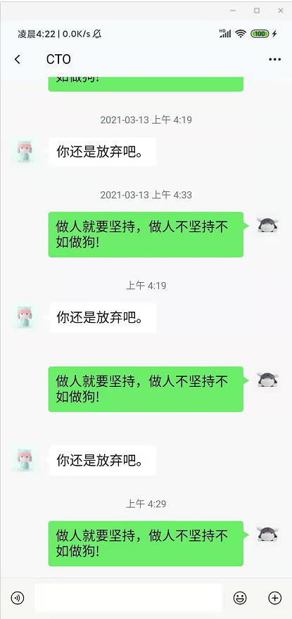

该功能依赖`/common/free-lib/time.js`库，具体的实现逻辑参考commit。


### 7.6 [*]长按信息弹出操作菜单

思路：

1. 实现弹出层效果
2. 优化弹出层的边界问题（额外计算并减去tabbar的高度）
3. 优化长按事件（如果对非用户的聊天内容进行长按应该隐藏`撤回`功能）

存在的BUG：

> 希望实现的效果：
>
> 用户长按自己的聊天信息弹出层的菜单高度正常，安全边界也正常。
>
> 用户长按他人的聊天信息弹出层的**菜单高度跟随弹出层的菜单数量进行变化**，**安全边界**也正常。（现在这里有BUG，这2个问题都不正常。）

以后抽时间再解决这个BUG！


### 7.7 消息撤回功能实现

```html
<!-- 撤回消息 -->
<view 
      v-if="item.isRemove"
      ref="isRemove"
      class="flex align-center justify-center pb-4 pt-2 chat-animate"
      >
    <text class="font-sm text-light-muted">你撤回了一条信息</text>
</view>
```

给`chat/chat.nvue`的popup弹出层绑定事件

```html
<!-- 弹出层 -->
<free-popup ref="popupRef" :bodyWidth="200" :bodyHeight="getMenusHeight" :tabbarHeight="105">
    <view class="flex flex-column" style="width: 240rpx;" :style="setMenusStyle">
        <view class="flex-1 flex align-center" hover-class="bg-light" v-for="(item,index) in setMenusList" :key="index" @click="handleMenuItemClick(item.event)">
            <text class="font-md p-3">{{item.name}}</text>
        </view>
    </view>
</free-popup>
```


```js
// 监听聊天信息弹出菜单点击事件
handleMenuItemClick(e) {
    switch(e) {
        case 'removeChatItem':  // 撤回消息事件
            // 拿到当前操作的信息对象
            if(this.propIndex > -1) {
                this.list[this.propIndex].isRemove = true
            }
            break;
        default:
            break;
    }
    // 关闭弹出菜单
    this.$refs.popupRef.hide()
},
```


通过`watch`监听`isRemove`字段变化来增加动画效果

```js
watch: {
    // 监听是否撤回消息
    'item.isRemove': {
        handler(newValue, oldValue) {
            // #ifdef APP-NVUE
            if(newValue) {
                const animation = weex.requireModule('animation')
                this.$nextTick(()=>{
                    animation.transition(this.$refs.isRemove, {
                        styles: {
                            opacity: 1
                        },
                        duration: 500,
                        timingFunction: 'ease',
                    },function(){
                        console.log("动画执行结束!")
                    })
                })
            }
            // #endif
        },
            immediate: true
    }
},
```


CSS代码

```css
.chat-animate {
    /* #ifdef APP-NVUE */
    opacity: 0;
    /* #endif */
}
```


### 7.8 [*]解决键盘顶起窗口问题

解决思路：

1. 取消`textarea`键盘上推功能

   在 textarea 添加`:adjust-position="false"`属性即可。

2. 监听键盘高度变化，动态设置输入框高度

   ```js
   mounted() {
       // 监听键盘高度的动态变化
       uni.onKeyboardHeightChange(res => {
           this.KeyboardHeight = res.height
       })
   }
   ```

3. 动态设置滑动内容区域的高度

   `html代码`

   ```html
   <!-- 聊天内容区域 -->
   <scroll-view scroll-y class="position-fixed left-0 right-0 px-3" :style="setBodyBottom">
       <!-- 聊天信息列表组件 -->
       <template v-for="(item, index) in list" >
           <free-chat-item :item="item" :index="index" :pretime="index>0?list[index-1].create_time:0" @long="handleLongPress"></free-chat-item>
       </template>
   </scroll-view>
   ```

   

   `js代码`

   ```js
   // 设置内容区域高度的计算属性
   setBodyBottom () {
       return `bottom: ${this.KeyboardHeight + uni.upx2px(105)}px;top: ${this.navBarHeight}px;`
   },
   ```

4. 取消内容区域的滚动条

   给 scroll-view 标签添加 `:show-scrollbar="false"`属性即可。

> BUG：弹出键盘后，用户长按聊天信息，显示弹出层后弹出层的边界会失效，可能是弹出层的边界没有随着内容区域高度的变化而变化，后续再花时间研究优化。


### 7.9 聊天内容滚动到底部

键盘弹起的时候，页面内容默认不会自动滚动到底部，这样用户需要手动将内容滑动到底部才能看到最后一条信息，然后做出对应的回复，这样的体验不是很好，怎么优化呢？这里的思路就是通过 `scrollToElement` API实现。

这个API存在兼容性，只支持 weex 渲染的nvue模式，具体参考[官方文档](https://weex.apache.org/zh/docs/modules/dom.html#scrolltoelement)

```js
<script>
	// #ifdef APP-PLUS-NVUE
	const dom = weex.requireModule('dom')
	// #endif
	export default {
		mounted() {
			// 监听键盘高度变化
			uni.onKeyboardHeightChange(res => {
			  this.KeyboardHeight = res.height 
			  if (this.KeyboardHeight > 0) {
			  	this.pageToBottom()
			  }
			})
		},
		methods: {
			// 回到底部
			pageToBottom(){
				let chatItem = this.$refs.chatItem
				let lastIndex = chatItem.length > 0 ? chatItem.length - 1 : 0
				if (chatItem[lastIndex]) {
					dom.scrollToElement(chatItem[lastIndex],{})
				}
			}
		}
	}
</script>
```


### 7.10 发送文字功能实现

思路：

1、发送按钮绑定点击事件
2、构建数据对象
3、判断是否是text文本数据类型
4、验证通过后将数据push到聊天信息列表中
5、清空输入框
6、滚动到最底部

`chat/chat.nvue`

```js
// 发送聊天信息
send(type) {
    let chatObj = {
        avatar: "/static/images/demo/demo5.jpg",
        user_id: 1,
        nickname: "伤心的瘦子",
        type: "",	// image、audio、video
        data: this.text,
        create_time: Date.now(),
        isRemove: false
    }
    switch(type) {
        case 'text':
            chatObj.type = type
            this.text = ""
            break
    }
    this.list.push(chatObj)
    this.$nextTick(_=>{
        this.setPageToBottom()
    })
}
```


### 7.11 底部菜单开发

思路：

1. 编写底部拓展菜单的弹出层

2. 开启拓展菜单弹出层的时候需要将`KeyboardHeight`值重新赋值，单位是`px`，因此需要使用`uni.upx2px`进行转换，关闭弹出层的时候重置`KeyboardHeight`的值

3. 在弹出层内添加swiper组件，遍历列表数据动态生成swiper中的菜单内容

4. 解决底部操作条弹出的键盘与拓展菜单冲突的问题

   问题细节：

   1. 当底部输入框获取焦点弹出键盘后，此时点击打开拓展菜单会有BUG，拓展菜单被键盘覆盖
   2. 点击拓展菜单按钮或点击蒙版关闭拓展菜单后键盘没有自动关闭
   3. 在没有弹起键盘的情况下打开拓展菜单，然后点击输入框希望弹起键盘，此时却直接关闭了拓展菜单

   

   针对上面的问题，这里引入`模式`的概念，用户不可能同时输入文字、语音、表情包、拓展菜单中的功能信息，我们需要通过输入模式来区分用户每次要输入的信息类型，一次只能输入一种模式，以此来实现合理切换功能。

   该业务支持以下模式：

   1. text 输入文本
   2. emoticon 表情
   3. action 操作扩展菜单
   4. audio 音频

   默认的模式为`text`，打开拓展菜单的时候将模式改变为`action`模式；

   由于监听键盘高度变化的`uni.onKeyboardHeightChange`API是异步执行的，当你使用`uni.hideKeyboard`API收起键盘的时候，此时会触发`uni.onKeyboardHeightChange`API，正因为这个API是异步执行的，所以会优先执行`this.KeyboardHeight = uni.upx2px(580)`，然后会执行`this.KeyboardHeight = res.height`，此时res.height为0，因此底部输入框状态栏出不来，因此这里要加判断了。

   `methods的代码`

   ```js
   // 底部拓展菜单展示
   handleExtandMenuShow() {
       this.mode = 'action',  // 修改模式为操作拓展菜单的模式
       // 收起键盘,此时键盘高度为0
       uni.hideKeyboard()
       // 显示拓展菜单
       this.$refs.extendMenuRef.show()
       this.KeyboardHeight = uni.upx2px(580)
   },
   ```

   

   `mounted时的代码`

   ```js
   // 监听键盘高度的动态变化
   uni.onKeyboardHeightChange(res => {
       console.log("键盘高度发生变化：", res.height)
       if(this.mode!=='action') {
           // 不为操作拓展菜单模式的时候才动态赋值
           this.KeyboardHeight = res.height
       }
       if(res.height>0) {
           this.$nextTick(_=>{
               this.setPageToBottom()
           })
       }
   })
   ```

   这个时候又会出现一个新问题，用户点击输入框 => 弹起键盘 => 打开拓展菜单 => 关闭拓展菜单 => 再次点击输入框就会发现底部输入框导航栏又不见了。。。

   解决方法：

   1. 关闭底部拓展菜单的时候让`textarea`输入框失焦
   2. 点击`textarea`的时候配置获取焦点事件`@focus="mode='text'"`

   其他的几个bug直接看commit找解决方法。

5. nvue给`scroll-view`绑定点击事件后无效，微信小程序却可以，很奇怪。。。

   解决的思路就是在底部输入框导航栏的同层级前面放一层div并且设置固定定位，背景颜色透明，

   然后绑定点击事件，点击事件触发后关闭底部的拓展菜单。

   ```html
   <!-- 针对nvue环境下的蒙版层 -->
   <!-- #ifdef APP-NVUE -->
   <div 
        v-if="mode === 'action'" 
        class="position-fixed top-0 left-0 right-0 bottom-0" 
        @click="clickPage"
        :style="'bottom:'+maskBottom+'px'"
        ></div>
   <!-- #endif -->
   
   ```

   

   ```js
   computed: {
       // 计算蒙版距离底部的位置
       maskBottom() {
           return this.KeyboardHeight + uni.upx2px(105)
       },
   }
   
   ```

   > 由于nvue使用的原生渲染引擎是weex，又因为weex的渲染是从上到下的，后面定位的元素会覆盖前面的元素，v-if条件生效的时候，元素会被插入底部，此时会覆盖输入框导航条部分的`position: fixed`，因此就造成了点击拓展菜单的时候看不见底部输入框部分了，此时就需要动态设置高度了。

   这个聊天页面底部输入框部分的交互是有点难度的，逻辑比较多，要注意的细节也比较多，需要细心思考，多看commit的代码理解吧。

6. 表情包开发

   核心代码

   ```js
   // 初始化表情包数据列表函数
   __init() {
       // 一共有20张表情包，因此total = 20
       var total = 20
       // 每个swiper-item里面有8张表情包，page为计算出来的总页数,此处为3
       var page = Math.ceil(total / 8)
       var arr = []
       for (var i = 0; i < page; i++) {
           var start = i * 8
           arr[i] = []
           for (var j = 0; j < 8; j++) {
               var no = start + j
               console.log(no)
               if ((no+1) > total) {
                   break;
               }
               arr[i].push({
                   name: '表情' + no,
                   icon: `/static/images/emoticon/5497/${no}.gif`,
                   event: ""
               })
           }
       }
       this.emoticonList = arr
   },
   
   ```

   > arr数组的长度其实就是表情包的页数，第一个for循环就是用来生成表情包的页数的，第二个循环用来给表情包每页加入数据的。

   

   发送表情包功能开发流程：

   1、给每项拓展菜单项绑定点击事件，传递数据，监听事件，通过`switch`做函数分发

   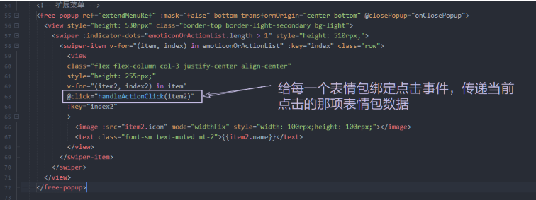

   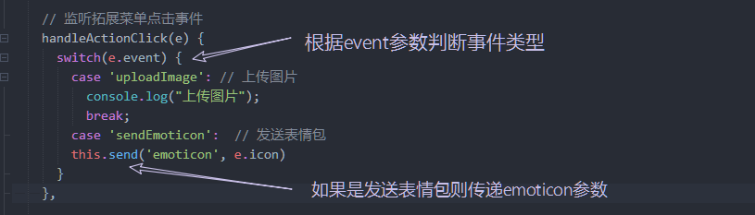

   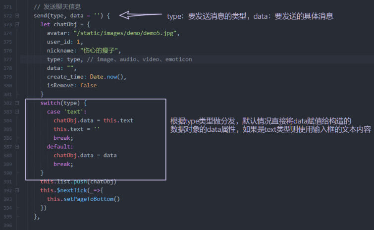

   2、在`free-chat-item.vue`子组件中进行修改结构和样式

   先看一下传递过来的item表情包数据长是什么样子。

   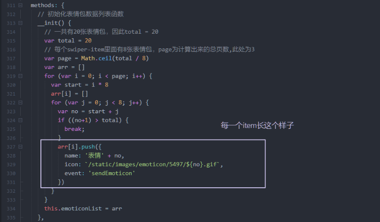

   首先得在组件中增加一个显示表情包的`image`标签。

   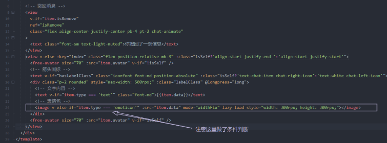

   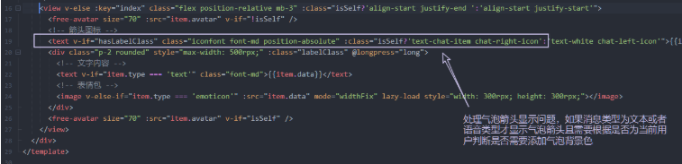

   3、通过计算属性处理气泡样式

   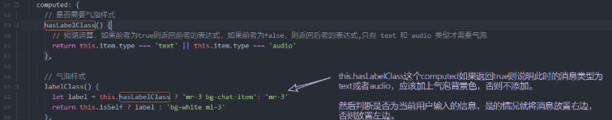

   此时就搞定了。

7. 发送图片功能

   关键就是调用`uni.chooseImage`API。

   点击拓展菜单的相册，调用API让用户打开相册选择图片，然后渲染到页面中。

   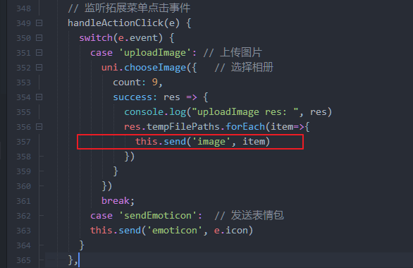

   在组件中修改条件判断

   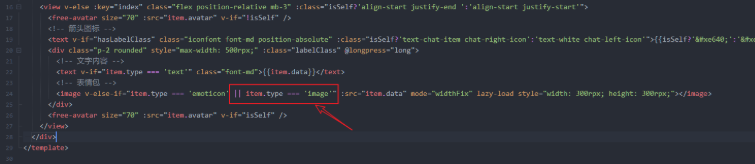

8. 预览图片保存相册功能

   给图片标签绑定点击事件，点击后将该图像数据传递给父组件，父组件中通过`uni.previewImage`打开图片预览功能。

   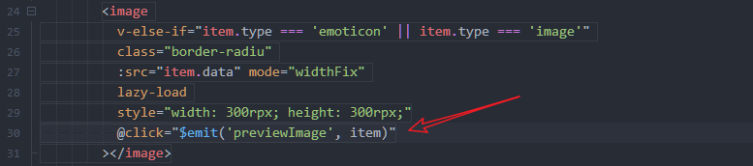

   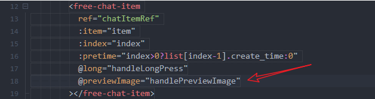

   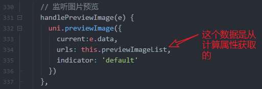

   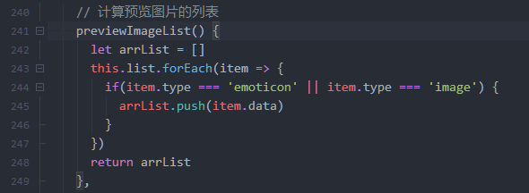

9. 封装图片加载组件

   解决nvue模式下`max-width、max-height`CSS属性不生效的问题，通过JavaScript动态计算最大宽度和高度。

   `free-image.vue`

   ```html
   <template>
   	<image 
   		:class="imageClass" 
   		:src="src" 
   		:style="setImageStyle"
   		@click="$emit('click')"
   		@load="loadImage"
   	></image>
   </template>
   
   <script>
   export default {
     name: 'FreeImage',
     components: {},
     props: {
   		// 图片路径地址
   		src: {
   			type: String,
   			required: true
   		},
   		// 样式类名
   		imageClass: {
   			type: String,
   			required: true
   		},
   		// 最大宽度
   		maxWidth: {
   			type: [Number, String],
   			default: 500
   		},
   		// 最大高度
   		maxHeight: {
   			type: [Number, String],
   			default: 300
   		}
   	},
     data () {
   		return {
   			w: 100,
   			h: 100
   		}
     },
     computed: {
   		// 计算图片的高度和宽度样式
   		setImageStyle() {
   			return `width: ${this.w}px; height: ${this.h}px;`
   		}
   	},
     watch: {},
     created () {
   	},
     mounted () {},
     methods: {
   		loadImage(e) {
   			console.log("loadImage", e)
   			let w = e.detail.width
   			let h = e.detail.height
   			
   			// 最大高度作为基准的写法
   			let maxW = uni.upx2px(this.maxWidth)
   			let maxH = uni.upx2px(this.maxHeight)
   			if (h <= maxH) {
   				this.h = h
   				this.w = w <= maxW ? w : maxW
   				return
   			}
   			this.h = maxH
   			// 计算等比例的最大宽度，赋值给w2变量
   			let w2 = maxH * (w / h)
   			// 如果等比例最大宽度小于之前定义的最大宽度则使用w2，否则使用之前定义的最大宽度
   			this.w = w2 <= maxW ? w2 : maxW
   		}
   	}
   }
   </script>
   
   <style scoped lang="less"></style>
   ```

   

### 7.12 音频功能开发

> 这块的功能比较复杂，多思考吧。

#### 7.12.1 语音播放功能开发

添加音频标签结构

```html
<view v-else-if="item.type === 'audio'" class="flex align-center" @click="openAudio">
    <text class="font">300'</text>
</view>
```

```js
// 播放音频函数
openAudio() {
    // 创建音频对象
    const innerAudioContext = uni.createInnerAudioContext();
    // 设置音频播放地址
    innerAudioContext.src = this.item.data;
    // 播放音频
    innerAudioContext.play()
}
```

解决返回页面不销毁音频的Bug。

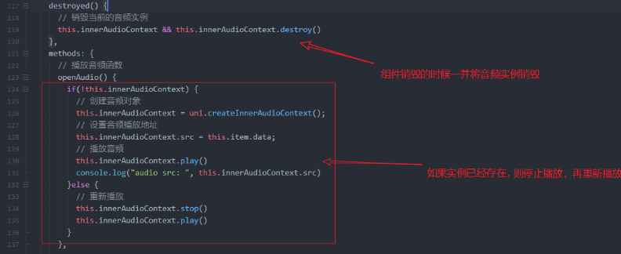


#### 7.12.2 多语音播放切换功能开发

**在nvue中使用vuex。**

必看！！！nvue和vue中使用Vuex有部分差异，详细内容参考官网资料：

<https://uniapp.dcloud.io/nvue-api?id=sharevar>

多语音播放切换功能的开发需要使用到Vuex，因此我们需要在nvue项目中引入Vuex，下面是引入步骤：

在项目根目录创建`store`文件夹，然后在`store`文件夹中创建`index.js`文件，然后在`main.js`中引入并注册。

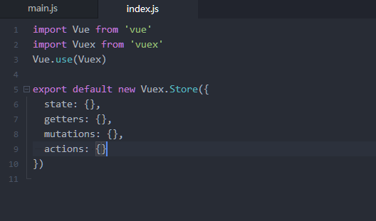

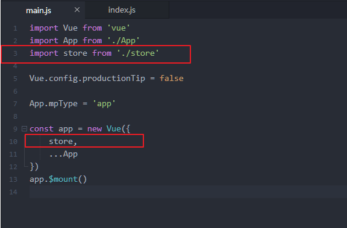

这个项目中对Vuex进行模块拆分，语音模块的状态单独使用`audio.js`文件来保存。

思考一个问题：

下面的图片中，有3个音频，如果用户点了第一个音频之后，音频就会开始播放，此时用户再点击第二个、第三个音频，这2个音频也会同时播放，导致3个音频都会同时播放，这样肯定是不行的，我们期待的效果是，用户点击第一个音频，音频播放，点击第二个音频，其他的音频都停止播放，只播放当前点击的音频。

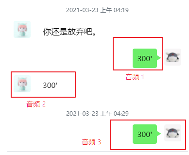

如何解决这个问题？

思路：

音频开始播放的时候，通知`vuex`，将其他的音频全部停止。

> 关于Vue的actions，记住一句话：
>
> actions是异步修改仓库的数据，并且依赖于mutations。

这一块的具体逻辑直接参考commit提交记录。


#### 7.12.3 音频播放动画效果

由于没有现成的gif动画图片，我们要手动合成gif，[gif在线合成网站](http://gif.55.la/)

`语音结构部分代码`


> 这里通过`audioPlaying`状态来控制image标签的src地址是否为gif图，true的时候显示gif，否则显示静止的图片。

当语音开始播放的时候，我们就需要将这个状态改为true了，不为播放状态的时候将其改为false。


这样就实现了语音播放动画效果的功能了。


### 7.13 短视频消息功能开发

聊天页面只显示短视频的封面，用户点击封面图片应该跳转到视频播放页面进行播放。

这个功能需要注意以下的几个点：

1. 需要获取视频封面的宽高，可以通过`image`组件的`@load`的回调函数参数获取到

2. 需要动态计算视频封面的播放按钮图标的坐标位置

   计算思路：

   拿到封面图片的宽高数据，减去播放按钮图标本身的宽高的一半再除以2就可以得出播放按钮图标水平垂直居中的坐标数据了。

   

   


在视频页面需要动态获取屏幕高度信息用于设置视频高度，怎么获取呢？

使用`uni.getSystemInfoSync()`API来获取，需要的数据是`windowHeight`字段。

`视频播放页面代码`

```html
<template>
    <view class="position-relative">
        <video :src="url" controls autoplay style="width: 750rpx;" :style="'height: ' + videoHeight + 'px;'" @ended="back"></video>
        <view 
              class="position-absolute flex justify-center align-center rounded" 
              style="top: 50rpx;left: 20rpx;width: 80rpx;height: 80rpx; background-color: rgba(255,255,255,0.3);"
              @click="back"
              >
            <!-- 关闭视频的按钮 -->
            <text class="iconfont text-white font-lg">&#xe620;</text>
        </view>
    </view>
</template>

<script>
    export default {
        data() {
            return {
                videoHeight: 300,		// 视频高度
                url: ''		// 视频播放地址
            }
        },
        onLoad(params) {
            console.log("params: ", params)
            if(!params.url) {
                this.back()
                // 非法的url
                return uni.showToast({
                    title: '非法视频',
                    icon: 'none'
                });
            }
            this.url = params.url
            // 动态获取屏幕高度以便设置视频高度
            let res = uni.getSystemInfoSync()
            this.videoHeight = res.windowHeight		// 注意动态获取的屏幕高度的单位是px
        },
        methods: {
            // 返回上一级页面
            back() {
                uni.navigateBack({
                    delta: 1
                })
            }
        }
    }
</script>

<style scoped>

</style>
```


### 7.14 处理音频时间和气泡长短

音频时间处理很容易，关键是气泡长度要怎么动态处理呢？

```js
labelStyle() {
    // 只有类型为音频时才动态设置气泡样式
    if (this.item.type === 'audio') {
        let time = this.item.options.time || 0
        /* 
						下面代码解释：
							这里做个约定，气泡最小宽度150rpx，最大宽度500rpx;
							录制时间最大为60s;
							60/500为一个比例,计算公式为: parseInt(time) / width = 60 / 500,求width即可。
					 */
        let width = parseInt(time) / (60/500)
        width = width < 150 ? 150 : width
        return `width:${width}rpx;`
    }
}
```


### 7.15 音频录制模块开发

#### 7.15.1 音频录制和文本输入切换

这个小功能还是很好实现的，通过mode判断类型然后渲染出不同的元素即可。

`chat.nvue`


#### 7.15.2 录制状态动画显示

1. 首先给录音按钮添加`touch`事件，用于监听用户的手势操作。

   

   

2. 编写录音提示弹出层

   

   > 根据`isRecording`判断是否显示录音弹出层，根据`isRecordCancel`判断是否取消录音

   


#### 7.15.3 发送录音功能

首先通过`uni-app`官方的`uni.getRecorderManager()`API获取全局唯一的录音管理器。

官方API链接：<https://uniapp.dcloud.io/api/media/record-manager?id=getrecordermanager>

```js
const RECORD = uni.getRecorderManager()
```


这是最简单的一个录音功能了，后期还要加上录音时常的限制，例如录音时间小于1s就不发送。


#### 7.15.4 计算音频时长

由于`uni-app`没有提供计算录音时长的API，因此这里使用定时器简单实现。

```js
// 监听录音开始
RECORD.onStart( _ => {
    this.recordTime = 0
    console.log("录音时长: ", this.recordTime)
    this.recordTimer = setInterval(_=>{
        this.recordTime++
    }, 1000)
})

// 监听录音结束
RECORD.onStop(e => {
    if(this.recordTimer) {
        clearInterval(this.recordTimer)
        this.recordTimer = null
    }
    if(this.recordTime < 1) {
        uni.showToast({
            title: '说话时间太短!',
            image: '/static/images/audio/kulian.png',
            mask:true
        })
        this.isRecordCancel = true
    }
    if(!this.isRecordCancel) {
        // 没有取消录音则发送录音
        this.send('audio', e.tempFilePath, {
            time: this.recordTime
        })
    }
})
```


### 7.16 视频录制&&发送视频功能

用户点击拓展菜单的`拍摄`功能，既可以选择相册中的视频也可以调用摄像头拍摄视频。

给拓展菜单的拍摄按钮添加事件名称。


然后在`handleActionClick`函数中添加`switch...case`条件判断。


