## 8.聊天信息设置页开发

1、新建页面`chat-set.nuve`

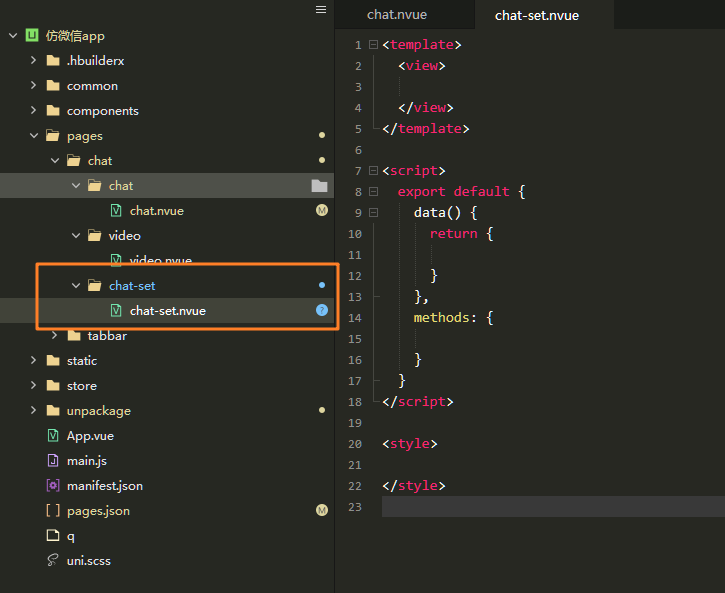

2、给`chat.nvue`中的`free-icon-button`组件绑定点击事件让其跳转到`chat-set.nvue`页面中。

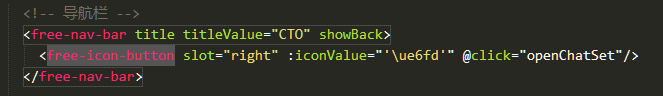

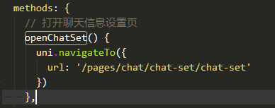

3、编写`chat-set.nvue`页面的导航栏。

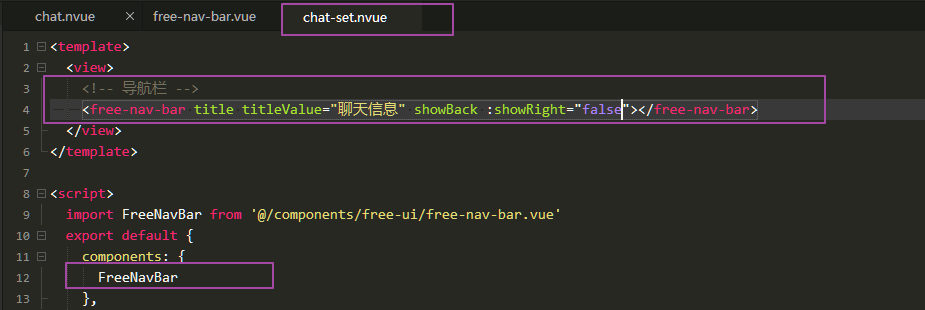

期间对导航栏组件做了下面优化。

1. 新增`showRight`props属性用于控制是否显示导航栏右侧图标以及弹出菜单

具体代码改动参考commits。

3、编写聊天成员列表。

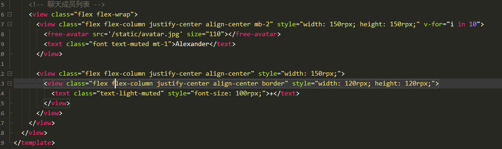

4、剩余部分编写。

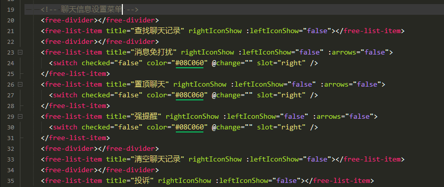

期间优化了用到的几个组件，具体代码细节直接看commits。

5、补充群聊部分的结构和样式。

参考commits。

## 9.个人设置页(个人名片页)开发

1、首先思考如何设计点击`用户头像`跳转到个人名片页。

如果直接在引用了`free-avatar`的组件上绑定`@click`势必会造成非常严重的代码冗余，为什么？因为整个应用有非常多的地方需要跳转到个人名片页，例如：

- 通讯录页面的左侧用户头像
- 朋友圈中的用户头像
- 聊天设置页面中的用户头像

那么如何设计才能不那么冗余呢？其实很简单，直接看代码。

在`free-avatar`组件中的props中增加一个新的属性，该属性用于控制用户点击头像的行为。

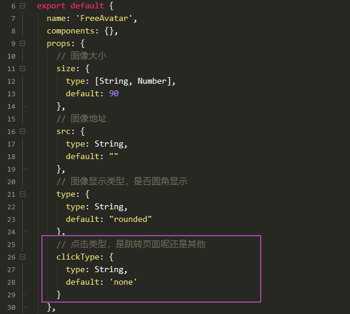

给`image`组件绑定点击事件。

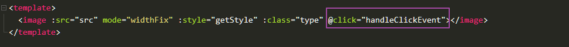

如果用户传入的`clickType`属性的值为`navigate`则说明要跳转到名片页了。

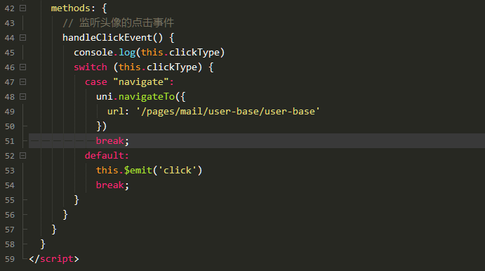

在调用`free-avatar`组件时传入属性即可。

`free-chat-item.vue`

```html
<free-avatar size="70" :src="item.avatar" v-if="!isSelf" clickType="navigate"/>
```

> 写代码之前要多思考，考虑维护性，考虑代码冗余性，例如多个页面要调用同一个组件，对这个组件都要有点击行为，你是分散性的写逻辑呢？例如a.vue写一遍，b.vue写一遍，还是直接在组件中集中处理，通过props传属性 + switch...case方式做判断。明显后者的代码更优于前者。

2、页面布局编写。

比较简单，直接参考commit。

3、操作菜单部分开发

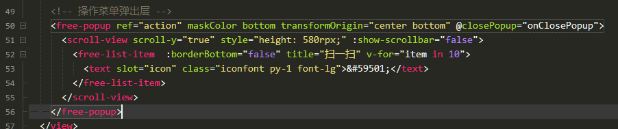

点击导航栏右上角的图标按钮显示操作菜单。

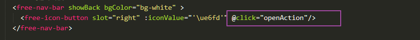

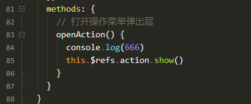

4、操作菜单-设置备注页开发。

都是一些布局代码，比较简单。

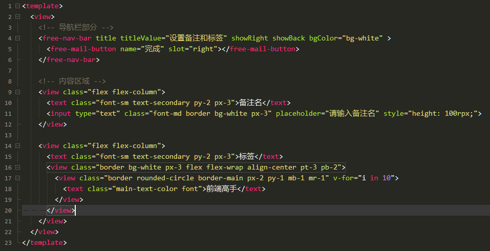

5、标签设置页开发。

主要有下面几个功能

- 添加标签
- 点击所有标签列表中的标签快速添加标签
- 点击标签列表中的标签提示用户删除标签
- 完成操作

具体代码直接参考commit。

> nvue页面的text标签之间不要换行，不然样式会有问题，这个细节坑死我了，APP没法审查元素调试，只能看代码猜，排查了1个多小时，能把我给气死😡

6、设置朋友圈动态权限。

页面非常简单，直接参考commit。

7、设为星标好友。

比较简单，直接参考commit。

8、加入和移除黑名单。

在`actions`列表里面添加2个字段。

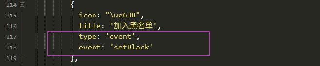![1620904890465](medias/1620904890465.png

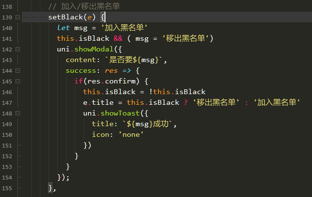

结构部分代码。

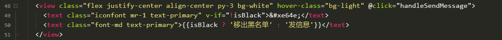


## 10.通讯录索引列表功能开发（造轮子）

1、给通讯录列表添加`scroll-view`标签，并且计算高度。

2、编写右侧索引列表。

3、通过`scroll-into-view`实现数据与索引列表的联动

4、解决小程序端滚动的兼容性问题

> nvue模式下触发的`touchstart`事件获取的Y坐标值默认不包含导航栏的高度，相对于他所在的view标签来计算的，但是小程序端得到的Y坐标值是包含状态栏和导航栏高度的。

因此需要使用条件编译进行额外处理。

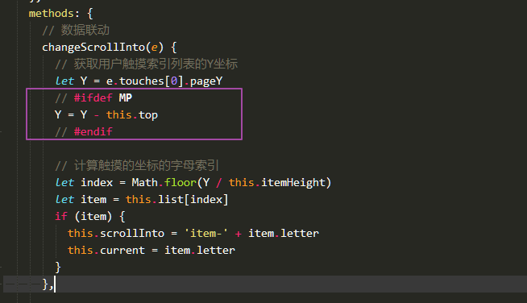

更多代码细节直接参考commit。


## 11.推荐名片开发

1、基本页面布局

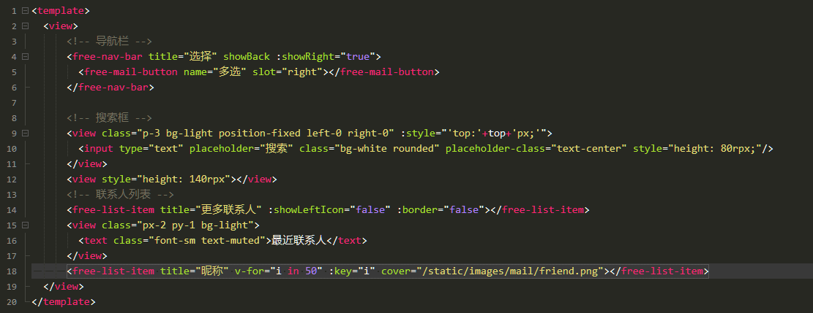

2、多选功能开发

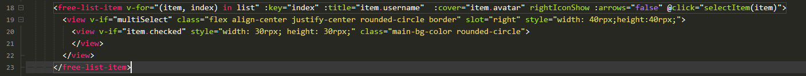

> `multiSelect`用于判断是否处于多选状态，如果处于多选状态则显示用户列表右侧的多选按钮，如果用户列表项的`item.checked`数据为true的时候就会显示选中的样式效果（绿色小圆点）。

更多实现细节参考commit。

3、限制选中数量

核心函数。

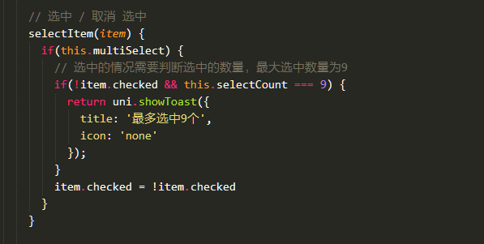

> 用户点击列表项的时候会调用这个函数，先判断用户是否开启了多选功能，如果开启了多选功能则进入后面的逻辑，判断用户当前点击的这一项是否是选中状态，如果时选中状态则直接取反变成未选中状态，否则需要同时判断当前选中的数量是否等于9，如果等于9则终止逻辑并且提示用户；注意这个this.selectCount是一个计算属性，会随着选中状态进行动态更新。更多细节直接看commit的代码吧。

4、实时搜索功能

这个功能也是比较简单的，配合计算属性可以快速实现。

首先给搜索框双向绑定一个值。

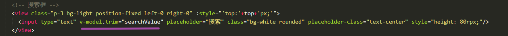

这个`searchValue`就是用来存储用户输入的字符串的。

然后添加2个计算属性。

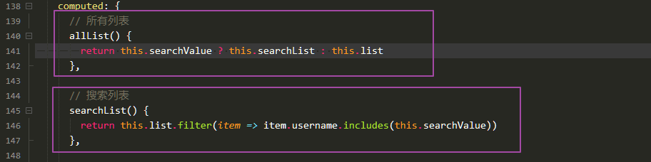

此时如果输入框输入的内容发生改变，就会触发`searchList`计算属性，属性内部就会去遍历`this.list`里面的每一项数据，判断它们的username是否包含了用户输入的内容，如果包含就返回该项。

> - filter返回的是一个Array，includes返回的是一个Boolean，具体使用方法参考MDN，这里就不再赘述。
>
> - v-model.trim这个`trim`修饰符可以过滤用户输入的首尾空格，Vue文档有介绍。

可能你有疑问，如果searchValue为空的时候咋办？答案就在`allList`这个计算属性里面，如果`this.searchValue`为空的话，则直接使用元素数据`this.list`，否则使用过滤后的搜索结果`this.searchList`，因此在模版中我们需要对allList进行数据绑定。

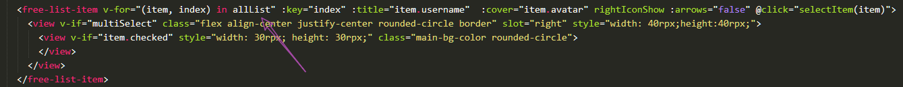

可能你会疑惑，为什么要使用`allList`单独来计算数据列表呢？为什么不直接在`searchList`里面判断`this.searchValue`是否为空值呢？如果`this.searchValue`为空值，直接`return this.list`就可以了呀？

然后模版那里的for循环直接将`allList`改成`searchList`就可以了呀；少写几行代码呢。

没错，我在做完功能的时候回头总结逻辑的时候发现确实可以优化，修改后的代码确实更加简洁了。

因此在刚开始写代码做功能的时候，很难第一次就做得很完美，很多情况都是先做完功能，然后回头来总结逻辑，这时候才有可能找到更好、更简洁的实现。

> 做完功能多总结，反复思考逻辑，问自己有没有可以进步的地方？优化的地方？
>
> 好的产品，一定是追求简单、极致的产品。

5、发送好友提示框开发与封装

结构和样式部分就不细说了，直接看代码吧。

```html
<template>
	<!-- 发送给好友弹出层 -->
	<free-popup ref="confirm" center maskColor transformOrigin="center center" :closeOnClickMask="false">
		<view class="bg-white rounded" style="width: 600rpx;">
			<view class="flex flex-column p-4">
				<text class="font-weight-bold mb-3">{{title}}</text>
				<slot></slot>
			</view>
			<!-- 底部 -->
			<view class="border-top flex" style="height: 100rpx;">
				<view class="flex-1 border-right flex align-center justify-center" @click="cancel">
					<text class="font-md text-muted">取消</text>
				</view>
				<view class="flex-1 flex justify-center align-center" @click="confirm">
					<text class="font-md main-text-color">确定</text>
				</view>
			</view>
		</view>
	</free-popup>
</template>

<script>
	import FreePopup from '@/components/free-ui/free-popup.vue';
	export default {
		name: '',
		components: {
			FreePopup
		},
		props: {
			title: {		// 弹出层标题
				type: String,
				default: '提示'
			}
		},
		data() {
			return {
				callback: false
			}
		},
		computed: {},
		watch: {},
		created() {},
		mounted() {},
		methods: {
			// 显示
			show(callback = false) {
				this.callback = callback
				this.$refs.confirm.show()
			},
			// 取消
			cancel() {
				this.$refs.confirm.hide('clickCancelBtn')
			},
			// 确定
			confirm() {
				if(typeof this.callback === 'function') {
					this.callback(()=>{
						this.cancel()
					})
				}
			}
		}
	}
</script>

<style scoped lang="less"></style>

```

在页面中调用。

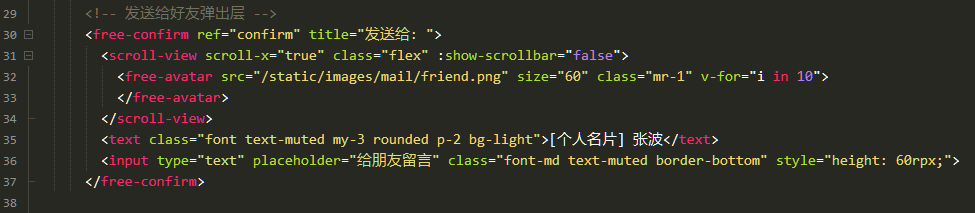

通过回调函数的方式实现弹出层关闭。

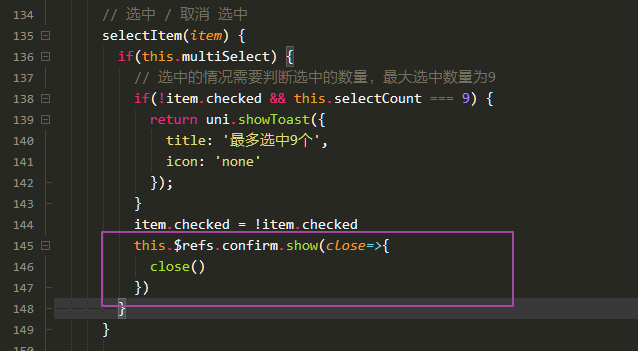

> 可以看到`<free-confirm>`下面的子标签会作为`slot`插入到`free-confirm`组件中去，这样可以让代码高度可定制化，我们在别的页面如果需要使用`free-confirm`组件的话只需要传入title，然后写好插槽代码即可。
>
> 关闭弹出层部分使用了回调函数的方式，在`free-confirm`组件中定义了`callback`属性，这个属性用来存储回调函数，当用户开启弹出层的时候，需要传入一个回调函数给`show`函数，`show`函数将传入的回调函数赋值给`callback`属性存储，然后通过`$refs`的方式开启popup，这里由于是基于`free-popup`组件进行再次封装，`show`、`hide`这些方式都是`free-popup`组件内部的方法，因此不要弄晕了，看不懂就多看几遍。
>
> 开启弹出层之后会提示用户是否取消发送或者确认发送，如果用户点击取消则会调用`cancel`方法，也就会调用`free-popup`组件内部的hide方法，并且传递`clickCancelBtn`表示需要强制关闭了，具体为什么要传这个参数可以自己参考`free-popup`组件的代码，逻辑很简单，这里不赘述。
>
> 然后用户点击确认的时候就要判断当前用户打开弹出层的时候传入的是否是一个合法的匿名函数，如果传入了非`function`类型的数据就不处理，然后调用用户传入的匿名函数，并将一个新的匿名函数传递给这个callback匿名函数，匿名函数里面包含了关闭弹出层的逻辑，在页面组件中通过`close`参数来接收这个匿名函数，直接`close()`即可执行传递过来的匿名函数，关闭弹出层。注意，这里的回调函数的执行环境是在`free-confirm`里面，这种设计是优雅的，代码精简，不算很复杂，要多写慢慢习惯吧。


## 12.用户投诉开发

代码比较简单，直接看代码。

```html
<template>
	<view class="page">
		<!-- 导航栏 -->
		<free-nav-bar title titleValue="用户投诉" showBack :showRight="true">
			<free-mail-button name="投诉" slot="right" @click="handleNavBarBtn"></free-mail-button>
		</free-nav-bar>
		<picker mode="selector" :range="range" @change="handlePickerChange">
			<free-list-item :title="cate?cate:'请选择分类'" rightIconShow :leftIconShow="false">
			</free-list-item>
		</picker>
		<textarea placeholder="请填写投诉内容..." class="bg-white p-2 font-md" v-model.trim="content"></textarea>
	</view>
</template>

<script>
	import freeNavBar from '@/components/free-ui/free-nav-bar.vue';
	import freeMailButton from '@/components/free-ui/free-mail-button.vue';
	import FreeListItem from '@/components/free-ui/free-list-item.vue'
	export default {
		components: {
			freeNavBar,
			freeMailButton,
			FreeListItem
		},
		data() {
			return {
				cate: '',		// 选择的分类数据
				range: ['抄袭','色情','低俗','政治敏感','欺诈'],		// picker分类列表数据
				content: ''	// 输入框内容
			}
		},
		methods: {
			// 投诉按钮点击事件
			handleNavBarBtn() {
				if(this.content && this.cate) {
					uni.navigateBack({
						delta:1
					})
				}
			},
			handlePickerChange(e) {
				this.cate = this.range[e.detail.value]
			}
		}
	}
</script>

<style>

</style>

```


## 13.朋友圈开发

### 13.1 渐变导航开发

基本的页面布局代码`moments.nvue`

```html
<template>
	<view>
		<free-transparent-bar></free-transparent-bar>
		<!-- 顶部背景图片部分 -->
		<view class="position-relative" style="height: 620rpx;">
			<image src="/static/images/demo/1.jpg" class="bg-secondary" style="height: 590rpx;" mode="aspectFill"></image>
			<image src="/static/images/demo/demo6.jpg" class="position-absolute bottom-0 bg-secondary rounded" style="right: 30rpx;width: 120rpx;height: 120rpx;"></image>
			<text class="font-md text-white position-absolute" style="bottom: 45rpx;right: 160rpx;">Alexander</text>
		</view>
	</view>
</template>

<script>
	import FreeTransparentBar from '@/components/free-ui/free-transparent-bar.vue'
	export default {
		components: {
			FreeTransparentBar
		},
		data() {
			return {
				
			}
		},
		methods: {
			
		}
	}
</script>

<style>

</style>
```

透明的导航栏组件`free-transparent-bar.vue`

```html
<template>
    <view>
        <!-- 导航栏 -->
        <view class="fixed-top">
            <!-- 状态栏 -->
            <view :style="'height:'+statusBarHeight+'px'"></view>
            <!-- 导航 -->
            <view class="w-100 flex align-center justify-between" style="height: 90rpx">
                <!-- 左边标题部分 -->
                <view class="flex align-center">
                    <!-- 返回按钮 -->
                    <free-icon-button :iconValue="'\ue60d'" @click="back" />
                </view>
                <!-- 右边图标部分 -->
                <view class="flex align-center">
                    <slot name="right">
                        <!-- 下面的组件是 right 插槽默认的元素，如果其他组件则下面内容会被覆盖 -->
                        <free-icon-button @click="" :iconValue="'\ue682'" />
                    </slot>
                </view>
            </view>
        </view>
    </view>
</template>

<script>
    import FreeIconButton from '@/components/free-ui/free-icon-button.vue'
    export default {
        name: 'FreeNavBar',
        components: {
            FreeIconButton
        },
        props: {},
        data() {
            return {
                // 导航栏弹出菜单列表
                navBarHeight: 0, // 状态栏高度+导航栏高度
                statusBarHeight: 0 // 状态栏高度
            }
        },

        computed: {},
        watch: {},
        created() {},
        mounted() {
            // NVUE环境下获取系统状态栏的高度
            // #ifdef APP-NVUE
            this.statusBarHeight = plus.navigator.getStatusbarHeight()
            // #endif
            /* 
				这里使用uni.upx2px的原因是因为我们获取的statusBarHeight是px单位，要进行相加
				需要转换成相同的单位才行.
			 */
            this.navBarHeight = this.statusBarHeight + uni.upx2px(90)
        },
        methods: {
            // 返回上一页
            back() {
                uni.navigateBack()
            },
            // 监听菜单点击事件
            handleMenuItemClick(e) {
                console.log(e)
            }
        },
    }
</script>

<style scoped lang="less">
</style>

```

> 这个组件其实就是copy的`free-nav-bar.vue`组件的代码，然后删除了一些没用的代码。

当用户将页面拖动到头像位置的时候，就需要开始渐变，超过头像一定距离的时候就停止渐变。

实现步骤：

1、监听页面的滚动事件，使用`onPageScroll`页面生命周期函数监听。

2、将得到的滚动值传递给`free-transparent-bar.vue`组件进行渐变的百分比。

3、计算渐变的百分比实现方式：

定义开始滚动的距离：500rpx

结束滚动的距离：620rpx

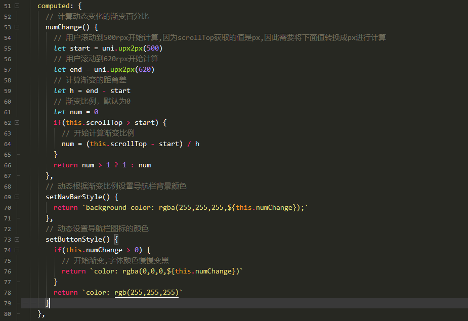

> `num = (this.scrollTop - start) / h`的含义是计算用户当前滚动的距离(this.scrollTop - start)相对于有效滚动距离(h)的比例，计算谁相对于谁的比例就用前者除以后者，因此得出来上面的公式。

### 13.2 朋友圈列表-单图多图

布局代码

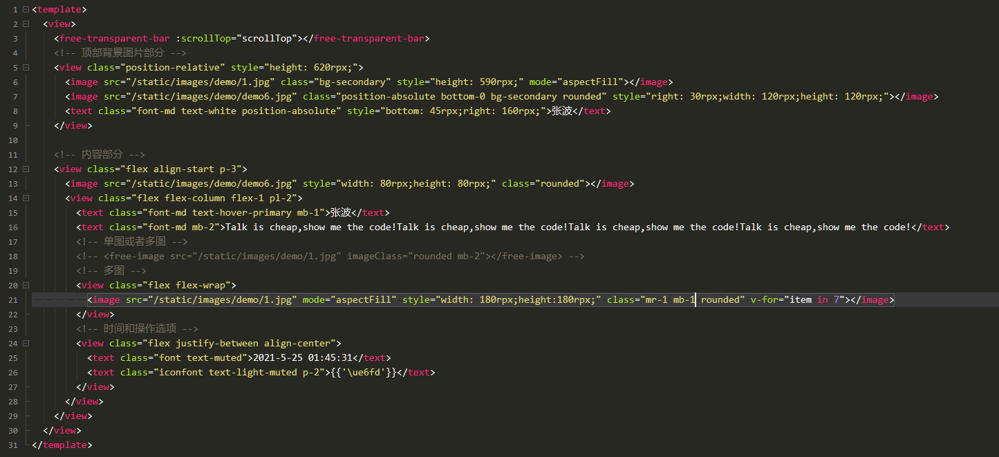

> 12行代码中添加了align-start类名，正常在h5写这种布局的时候一般都可以不加的，右侧子项的高度会随着内容自动撑开，但是nvue模式下不行，不加这个类名就会导致右侧的内容显示不全，高度塌陷，严重怀疑是weex的坑。


### 13.3 朋友圈列表-组件封装

这里为了方便后期的维护，我们将朋友圈列表封装成了一个组件`free-moment-list.vue`

```html
<template>
	<view class="p-2 flex align-start border-bottom border-light-secondary">
		<!-- 左侧头像 -->
		<free-avatar size="80" src="/static/images/demo/demo6.jpg"></free-avatar>

		<!-- 右侧内容 -->
		<view class="pl-2 flex flex-1 flex-column">
			<!-- 昵称 -->
			<text class="text-hover-primary font-md mb-1">{{item.username}}</text>
			<!-- 内容 -->
			<text class="font-md text-dark mb-1">{{item.context}}</text>
				<view class="py-2 flex flex-wrap" v-if="item.image.length">
					<block v-for="(image, imageIndex) in item.image">
						<!-- 单图 -->
						<free-image v-if="item.image.length === 1" :src="image.src" mode="aspectFill" class="mb-2" @click="previewImage(image.src)"></free-image>
						<!-- 多图 -->
						<image v-else :src="image.src" mode="aspectFill" style="width: 180rpx;height: 180rpx;" :key="index" class="mr-2 mb-2 rounded" @click="previewImage(image.src)">
						</image>
					</block>
				</view>
			<!-- 时间和操作按钮 -->
			<view class="flex justify-between align-center">
				<text class="text-light-muted font-sm">{{item.create_time | timeFormat}}</text>
				<text class="text-hover-primary iconfont font p-1">{{'\ue6fd'}}</text>
			</view>
		</view>
	</view>
</template>

<script>
	import FreeAvatar from '@/components/free-ui/free-avatar.vue'
	import FreeImage from '@/components/free-ui/free-image.vue'
	import $T from '@/common/free-lib/time.js'
	export default {
		name: '',
		components: {
			FreeAvatar,
			FreeImage,
		},
		props: {
			item: Object,
			index: Number
		},
		data() {
			return {}
		},
		computed: {
			// 预览图片的数组
			previewList() {
				return this.item.image.map(item=>item.src)
			}
		},
		watch: {},
		created() {},
		mounted() {},
		methods: {
			previewImage(src) {
				uni.previewImage({
					current: src,
					urls: this.previewList
				})
			}
		},
		filters: {
			timeFormat(value) {
				return $T.gettime(value)
			}
		}
	}
</script>

<style scoped lang="less"></style>

```

当需要遍历大数组的时候推荐使用计算属性，因为计算属性有缓存，能避免重复执行，减少性能开销。

> 我们为什么需要缓存？假设我们有一个性能开销比较大的计算属性 **A**，它需要遍历一个巨大的数组并做大量的计算。然后我们可能有其他的计算属性依赖于 **A**。如果没有缓存，我们将不可避免的多次执行 **A** 的 getter！如果你不希望有缓存，请用方法来替代。
>
> 参考Vue官网：https://cn.vuejs.org/v2/guide/computed.html

### 13.4 朋友圈列表-视频播放

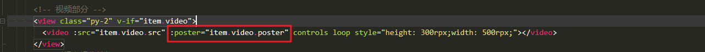

> poster属性必须依赖controls属性为true的前提才显示，而且poster地址必须为以http/https开头的网络资源地址，不能是本地图片，否则显示黑色背景。

### 13.5 朋友圈列表-点赞&评论列表

就是一些简单布局代码。

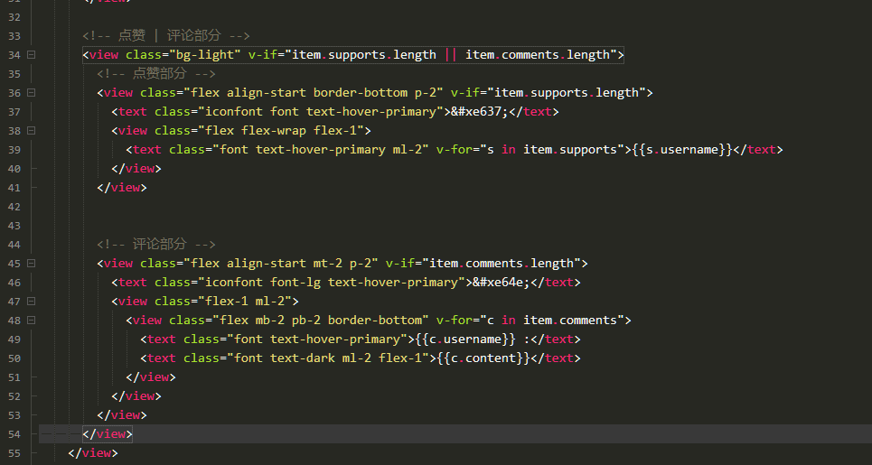

具体还是参考commit。

其次就是评论的输入框和表情包开发。

输入框还是很简单，直接套用在`chat.nvue`页面写过的`textarea`部分代码即可。

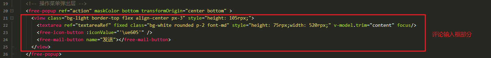

其次就是优化了输入框部分发送功能的逻辑，修改了`free-mail-button.vue`组件的代码。

`free-mail-button.vue`

```html
<template>
	<view class="py-1 px-2 rounded mr-2" :class="disabled ? 'bg-light border' : 'main-bg-color'" @click="clickEvent">
		<text class="font" :class="disabled ? 'text-light-muted' : 'text-white'">{{name}}</text>
	</view>
</template>

<script>
	export default {
		props: {
			name: {
				type: String,
				default: ""
			},
			disabled: {		// 是否禁用发送按钮
				type: Boolean,
				default: false
			}
		},
		data() {
			return {}
		},
		methods: {
			clickEvent() {
				// 禁用状态为false的时候才发送点击事件给父组件
				if(!this.disabled) {
					this.$emit('click')
				}
			}
		}
	}
</script>

<style scoped>

</style>
```

> 增加了一个`disabled`的props属性，用于发送按钮是否允许点击，为true的时候禁用，不可点击，颜色变灰，false的时候可点击，发送事件给父组件，颜色变绿。

表情包的开发以及评论的一些细节。

首先准备表情包数据列表，给表情包图标按钮绑定点击事件，点击图标开启表情包面板。

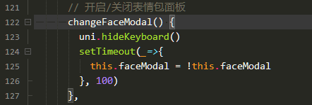

> 这个地方先关闭了键盘，然后通过定时器延迟开启/关闭表情包面板，如果不用定时器的话会有一闪而过的效果，不太好。

```js
faceModal: false,		// 是否显示表情包
faceList:["😀","😁","😂","😃","😄","😅","😆","😉","😊","😋","😎","😍","😘","😗","😙","😚","😇","😐","😑","😶","😏","😣","😥","😮","😯","😪","😫","😴","😌","😛","😜","😝","😒","😓","😔","😕","😲","😷","😖","😞","😟","😤","😢","😭","😦","😧","😨","😬","😰","😱","😳","😵","😡","😠"],
```

遍历表情包数据，给每个表情包绑定一个点击事件。

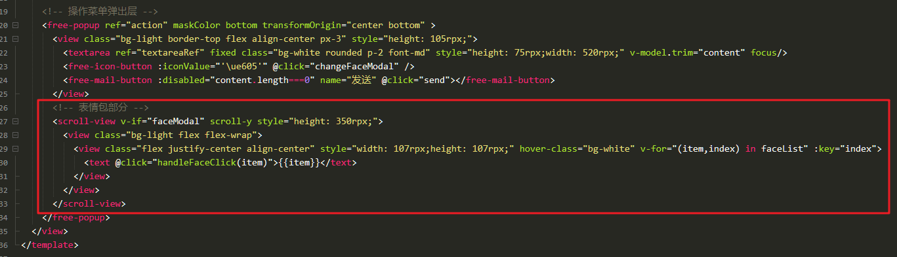

点击表情包后将表情包加入到`content`内容中。

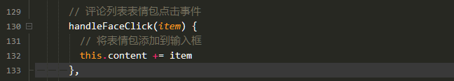

点击发送添加评论。

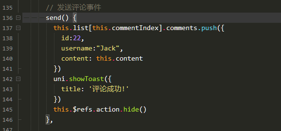

需要注意的细节。

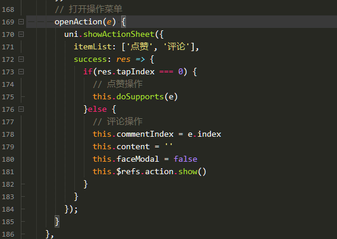

打开评论操作菜单时，需要将用户输入的内容和表情包面板进行重置。

> 这里使用`this.commentIndex`变量来临时存储用户点击打开评论弹出层时所在的列表项，否则无法知道点的是哪一个列表项，就无法添加评论，完整代码参考commit吧。


## 14.个人资料设置页开发

