## Egg.js基础教程

## 1.初识Egg.js

官方文档：https://eggjs.org/zh-cn/intro/index.html

### 1.1 什么是Egg.js？

**Egg.js 为企业级框架和应用而生**，我们希望由 Egg.js 孕育出更多上层框架，帮助开发团队和开发人员降低开发和维护成本。

就是Egg.js这个框架就是一个蛋，你的团队是鸡，你就可以孵化出鸡蛋，是鸭就是鸭蛋，是鹅就是鹅蛋，说白了就是根据Egg.js这个基础框架针对自己公司业务来封装上层框架，Egg.js不仅有约定，而且拓展性强，很适合企业级团队开发。

> [Express](http://expressjs.com/) 是 Node.js 社区广泛使用的框架，简单且扩展性强，非常适合做个人项目。但框架本身缺少约定，标准的 MVC 模型会有各种千奇百怪的写法。Egg 按照约定进行开发，奉行『约定优于配置』，团队协作成本低。

而且Egg.js是插件机制，他不会直接集成很多功能，例如ORM、模板引擎等，Egg.js是通过插件方式实现这类功能，你需要的时候你再引入即可。

记住下面的几个特性，使用过程中反复品味。

- 提供基于 Egg [定制上层框架](https://eggjs.org/zh-cn/advanced/framework.html)的能力
- 高度可扩展的[插件机制](https://eggjs.org/zh-cn/basics/plugin.html)
- 内置[多进程管理](https://eggjs.org/zh-cn/advanced/cluster-client.html)
- 基于 [Koa](http://koajs.com/) 开发，性能优异
- 框架稳定，测试覆盖率高
- [渐进式开发](https://eggjs.org/zh-cn/tutorials/progressive.html)

更多的介绍例如 异步编程、和其他框架对比之类的看官网吧。

### 1.2 创建第一个egg项目

我们推荐直接使用脚手架，只需几条简单指令，即可快速生成项目（`npm >=6.1.0`）:

```
$ mkdir egg-example && cd egg-example
$ npm init egg --type=simple
$ npm i
$ npm run dev
```


### 1.3 目录结构

```
egg-project
├── package.json
├── app.js (可选)
├── agent.js (可选)
├── app（-----------核心------------）
|   ├── router.js（路由）
│   ├── controller（控制器）
│   |   └── home.js
│   ├── service (模型)
│   |   └── user.js
│   ├── middleware (中间件)
│   |   └── response_time.js
│   ├── schedule (可选)
│   |   └── my_task.js
│   ├── public (静态资源)
│   |   └── reset.css
│   ├── view (模板视图)
│   |   └── home.tpl
│   └── extend (扩展)
│       ├── helper.js (可选)
│       ├── request.js (可选)
│       ├── response.js (可选)
│       ├── context.js (可选)
│       ├── application.js (可选)
│       └── agent.js (可选)
├── config
|   ├── plugin.js
|   ├── config.default.js
│   ├── config.prod.js
|   ├── config.test.js (可选)
|   ├── config.local.js (可选)
|   └── config.unittest.js (可选)
└── test
    ├── middleware
    |   └── response_time.test.js
    └── controller
        └── home.test.js
```


### 1.4 编写第一个API接口

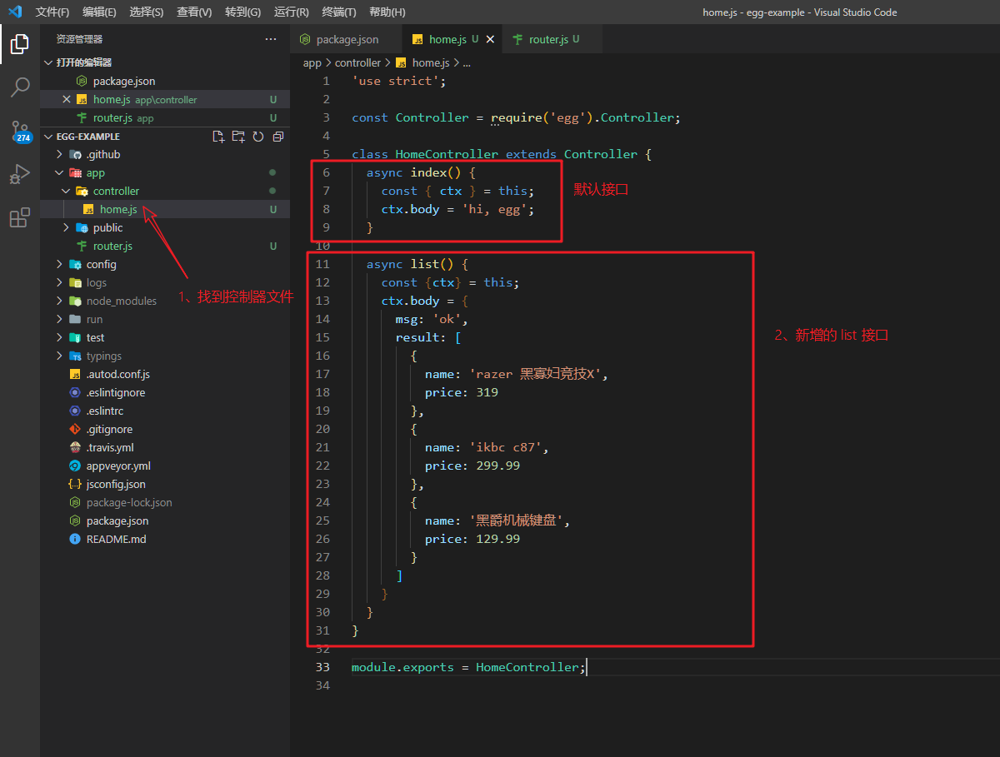

第三步打开`app`目录下面的`router.js`文件，增加路由即可。

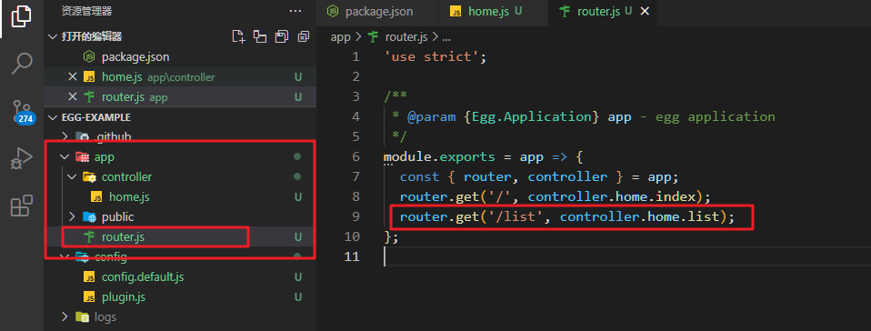

到此就是编写一个最最最基础的API接口的步骤了。

补充：通过egg插件可以快速生成控制器代码片段，安装下图的拓展插件即可。

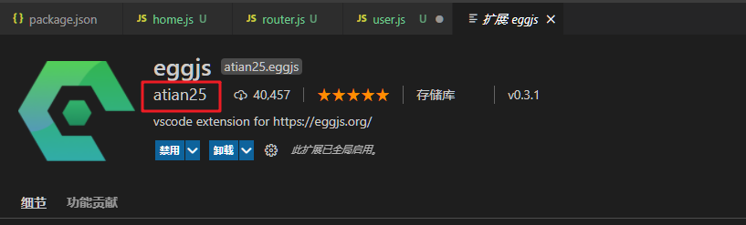


### 1.5 router

#### 1.get传参

路由写法

```js
router.get('/user/read/:id', controller.user.read)
```

控制器中获取参数写法

```js
let id = this.ctx.params.id;	// 方式1，通过this.ctx.params获取
let page = this.ctx.query.page;		// 方式2，通过this.ctx.query获取?后面的参数
```

用户输入：http://127.0.0.1:7001/user/read/1?page=1

router 匹配到`/user/read`就会调用`controller.user.read`方法，然后通过`this.ctx.params.id`获取参数1,通过`this.ctx.query.page`获取参数问号后面的 page 参数1。


#### 2.关闭CSRF&&开启跨域

文档：https://www.npmjs.com/package/egg-cors

- 安装  npm i egg-cors --save
- 配置插件

```js
// {app_root}/config/plugin.js
exports.cors = {
  enable: true,
  package: 'egg-cors',
};
```

- config / config.default.js 目录下配置

```js
config.security = {
    // 关闭 csrf
    csrf: {
      enable: false,
    },
     // 跨域白名单
    domainWhiteList: [ 'http://localhost:3000' ],
  };
  // 允许跨域的方法
  config.cors = {
    origin: '*',
    allowMethods: 'GET, PUT, POST, DELETE, PATCH'
  };
```

#### 3.post传参

通过`this.ctx.request.body`获取post请求的参数

路由写法：

```js
router.post('/user/create', controller.user.create)
```

控制器方法：

```js
// 创建用户
async create() {
    let data = this.ctx.request.body
    console.log("user create info: ", data)
    this.ctx.body = {
        msg: 'ok',
        data: {
            username: '用户名',
            password: '密码'
        }
    }
}
```

其他的put、patch等都是类似。


#### 4.资源路由

如果想通过 RESTful 的方式来定义路由， 我们提供了 `app.router.resources('routerName', 'pathMatch', controller)` 快速在一个路径上生成 [CRUD](https://en.wikipedia.org/wiki/Create,_read,_update_and_delete) 路由结构。

```js
// app/router.js
module.exports = app => {
  const { router, controller } = app;
  router.resources('posts', '/api/posts', controller.posts);
  router.resources('users', '/api/v1/users', controller.v1.users); // app/controller/v1/users.js
};
```

上面代码就在 `/posts` 路径上部署了一组 CRUD 路径结构，对应的 Controller 为 `app/controller/posts.js` 接下来， 你只需要在 `posts.js` 里面实现对应的函数就可以了。

| Method | Path            | Route Name | Controller.Action             |
| ------ | --------------- | ---------- | ----------------------------- |
| GET    | /posts          | posts      | app.controllers.posts.index   |
| GET    | /posts/new      | new_post   | app.controllers.posts.new     |
| GET    | /posts/:id      | post       | app.controllers.posts.show    |
| GET    | /posts/:id/edit | edit_post  | app.controllers.posts.edit    |
| POST   | /posts          | posts      | app.controllers.posts.create  |
| PUT    | /posts/:id      | post       | app.controllers.posts.update  |
| DELETE | /posts/:id      | post       | app.controllers.posts.destroy |

```js
// app/controller/posts.js
exports.index = async () => {};

exports.new = async () => {};

exports.create = async () => {};

exports.show = async () => {};

exports.edit = async () => {};

exports.update = async () => {};

exports.destroy = async () => {};
```

如果我们不需要其中的某几个方法，可以不用在 `posts.js` 里面实现，这样对应 URL 路径也不会注册到 Router。

理解REST的文章：https://zhuanlan.zhihu.com/p/30396391

还有阮一峰的。

RESTful API 设计指南：http://www.ruanyifeng.com/blog/2014/05/restful_api.html

理解RESTful架构：http://www.ruanyifeng.com/blog/2011/09/restful.html


#### 5.路由分组

如上所述，我们并不建议把路由规则逻辑散落在多个地方，会给排查问题带来困扰。

若确实有需求，可以如下拆分：

``` js
// app/router.js
module.exports = app => {
  const { router, controller } = app;
  require('./router/news')(app);
  require('./router/admin')(app);
};

// app/router/news.js
module.exports = app => {
  app.router.get('/news/list', app.controller.news.list);
  app.router.get('/news/detail', app.controller.news.detail);
};

// app/router/admin.js
module.exports = app => {
  app.router.get('/admin/user', app.controller.admin.user);
  app.router.get('/admin/log', app.controller.admin.log);
};
```


## 2.Sequelize

### 数据库迁移

1. 安装并配置[egg-sequelize](https://github.com/eggjs/egg-sequelize)插件（它会辅助我们将定义好的 Model 对象加载到 app 和 ctx 上）和[mysql2](https://github.com/sidorares/node-mysql2)模块：

```js
npm install --save egg-sequelize mysql2
```

2. 在`config/plugin.js`中引入 egg-sequelize 插件

```
exports.sequelize = {
  enable: true,
  package: 'egg-sequelize',
};
```

3. 在`config/config.default.js`

```js
config.sequelize = {
    dialect:  'mysql',
    host:  '127.0.0.1',
    username: 'root',
    password:  'root',
    port:  3306,
    database:  'eggapi',
    // 中国时区
    timezone:  '+08:00',
    define: {
        // 取消数据表名复数
        freezeTableName: true,
        // 自动写入时间戳 created_at updated_at
        timestamps: true,
        // 字段生成软删除时间戳 deleted_at
        paranoid: true,
        createdAt: 'created_at',
        updatedAt: 'updated_at',
        deletedAt: 'deleted_at',
        // 所有驼峰命名格式化
        underscored: true
    }
};
```

4. sequelize 提供了[sequelize-cli](https://github.com/sequelize/cli)工具来实现[Migrations](http://docs.sequelizejs.com/manual/tutorial/migrations.html)，我们也可以在 egg 项目中引入 sequelize-cli。

```js
npm install --save-dev sequelize-cli
```

5.  egg 项目中，我们希望将所有数据库 Migrations 相关的内容都放在`database`目录下，所以我们在项目根目录下新建一个`.sequelizerc`配置文件：

```js
'use strict';

const path = require('path');

module.exports = {
  config: path.join(__dirname, 'database/config.json'),
  'migrations-path': path.join(__dirname, 'database/migrations'),
  'seeders-path': path.join(__dirname, 'database/seeders'),
  'models-path': path.join(__dirname, 'app/model'),
};
```

6. 初始化 Migrations 配置文件和目录

```js
npx sequelize init:config
npx sequelize init:migrations
// npx sequelize init:models
```

7. 行完后会生成`database/config.json`文件和`database/migrations`目录，我们修改一下`database/config.json`中的内容，将其改成我们项目中使用的数据库配置：

```json
{
  "development": {
    "username": "root",
    "password": null,
    "database": "eggapi",
    "host": "127.0.0.1",
    "dialect": "mysql",
    "timezone": "+08:00"
  }
}
```

8. 创建数据库

```js
npx sequelize db:create
```

#### 创建数据迁移表

```js
npx sequelize migration:generate --name=init-user
```

1.执行完命令后，会在database / migrations / 目录下生成数据表迁移文件，然后定义

```js
'use strict';

module.exports = {
    up: async (queryInterface, Sequelize) => {
        const { INTEGER, STRING, DATE, ENUM } = Sequelize;
        // 创建表
        await queryInterface.createTable('user', {
            id: { type: INTEGER(20).UNSIGNED, primaryKey: true, autoIncrement: true },
            username: { type: STRING(30), allowNull: false, defaultValue: '', comment: '用户名称', unique: true},
            password: { type: STRING(200), allowNull: false, defaultValue: '' },
            avatar_url: { type: STRING(200), allowNull: true, defaultValue: '' },
            sex: { type: ENUM, values: ['男','女','保密'], allowNull: true, defaultValue: '男', comment: '用户性别'},
            created_at: DATE,
            updated_at: DATE
        });
    },

    down: async queryInterface => {
        await queryInterface.dropTable('user')
    }
};
```

- 执行 migrate 进行数据库变更

```php
# 升级数据库
npx sequelize db:migrate
# 如果有问题需要回滚，可以通过 `db:migrate:undo` 回退一个变更
# npx sequelize db:migrate:undo
# 可以通过 `db:migrate:undo:all` 回退到初始状态
# npx sequelize db:migrate:undo:all
```


### 模型

#### 新增操作

前面讲了如何通过 `sequelize` 生成数据库和表结构，接下来讲解如何通过模型生成数据。

我们有一个创建用户的接口：` app.router.post('/user/create', controller.user.create)`

用户访问这个接口，我们需要通过 `sequelize` 的模型来创建一条用户数据。

具体实现：

创建模型。

```js
// app / model / user.js

'use strict';
module.exports = app => {
  const { STRING, INTEGER, DATE, ENUM } = app.Sequelize;
  // 配置（重要：一定要配置详细，一定要！！！）
  const User = app.model.define('user', {
    id: { type: INTEGER(20).UNSIGNED, primaryKey: true, autoIncrement: true },
      username: { type: STRING(30), allowNull: false, defaultValue: '', comment: '用户名称', unique: true},
      password: { type: STRING(200), allowNull: false, defaultValue: '' },
      avatar_url: { type: STRING(200), allowNull: true, defaultValue: '' },
      sex: { type: ENUM, values: ['男','女','保密'], allowNull: true, defaultValue: '男', comment: '用户性别'},
      created_at: DATE,
      updated_at: DATE
  },{
    timestamps: true, // 是否自动写入时间戳
    tableName: 'user', // 自定义数据表名称
 });

  return User;
};
```

这个 Model 就可以在 Controller 和 Service 中通过 `app.model.User` 或者 `ctx.model.User` 访问到了，例如我们编写 `app/controller/user.js`：

```js
'use strict';

const Controller = require('egg').Controller;

class UserController extends Controller {
  // 创建用户
  async create() {
    // 参数验证
    // 写入数据库
    
    let res = await this.app.model.User.create({
      username: "lianghuilan",
      password: "admin.12345",
      sex: "女"
    })
    this.ctx.body = res
  }
}

module.exports = UserController;
```

用户访问接口即可往数据库增加数据。

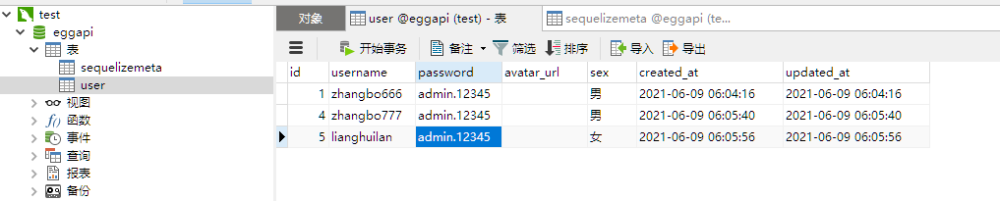


模型中的字段含义的解释：

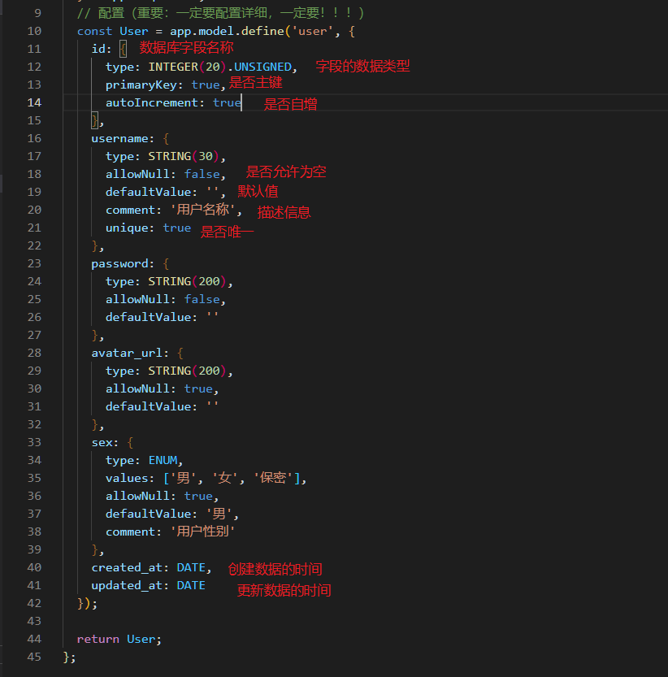

如果还是不理解这些字段的意思，建议立即自行补习 `mysql` 数据库基础知识。


#### 批量新增

使用的API：`bulkCreate`，接受一个`Array`作为参数，参考下面代码。

```js
  // 创建用户
  async create() {
    // 参数验证
    // 写入数据库
    
    // 新增单个
/*     let res = await this.app.model.User.create({
      username: "rose",
      password: "admin.12345",
      sex: "女"
    }) */

    // 批量新增
    let res = await this.app.model.User.bulkCreate([
      {
        username: "jack",
        password: "123456",
        sex: "男"
      },
      {
        username: "jack2",
        password: "123456",
        sex: "男"
      },
      {
        username: "jack3",
        password: "123456",
        sex: "男"
      },
      {
        username: "jack4",
        password: "123456",
        sex: "男"
      },
    ])
    this.ctx.body = res
  }
```


#### 修改器

什么是修改器？

就是对模型生成的数据进行修改。

例如上面的例子中批量新增了很多用户数据，但是密码是明文的，因此需要对生成的明文密码进行一次加密。

具体实现：

找到模型文件`model/user.js`，在 password 对象中增加一个 set 函数

```js
    password: {
      type: STRING(200),
      allowNull: false,
      defaultValue: '',
      // 修改器在新增、更新数据时会自动调用
      set(val) {
        let hash = val + '9876543';
        this.setDataValue("password", hash)
      }
    },
```

然后再新增数据就可以看到效果了。


#### 查询单个

`user.js`控制器中读取用户数据的函数：

```js
  // 获取指定的用户
  async read() {
    let id = parseInt(this.ctx.params.id)
    // 通过主键查询单个用户数据
    // let detail = await this.app.model.User.findByPk(id);
    // 通过条件查找
    let detail = await this.app.model.User.findOne({
      where: {
        id,
        sex: '女'
      }
    });
    if (!detail) {
      return this.ctx.body = {
        msg: "fail",
        data: "用户不存在"
      }
    }
    this.ctx.body = {
      msg: "ok",
      data: detail
    }
  }
```

需要记住这 2 个 API：

- `findByPk`，通过主键查找单个数据
- `findOne`，支持通过 where 添加条件查找单个数据


#### 查询多个

`user.js`控制器中读取用户数据的函数：

```js
  // 用户列表
  async index() {
    let result = [];
    // 查询全部数据
    // result = await this.app.model.User.findAll();
    // 查询多个并计数
    result = await this.app.model.User.findAndCountAll();
    this.ctx.body = {
      msg: "ok",
      data: result
    }
  }
```

- `findAll`，默认不传参数则查询所有数据并返回
- `findAndCountAll`，在`findAll`的基础上增加了一个`count`字段，一般可以返回给前端做分页


#### 获取器

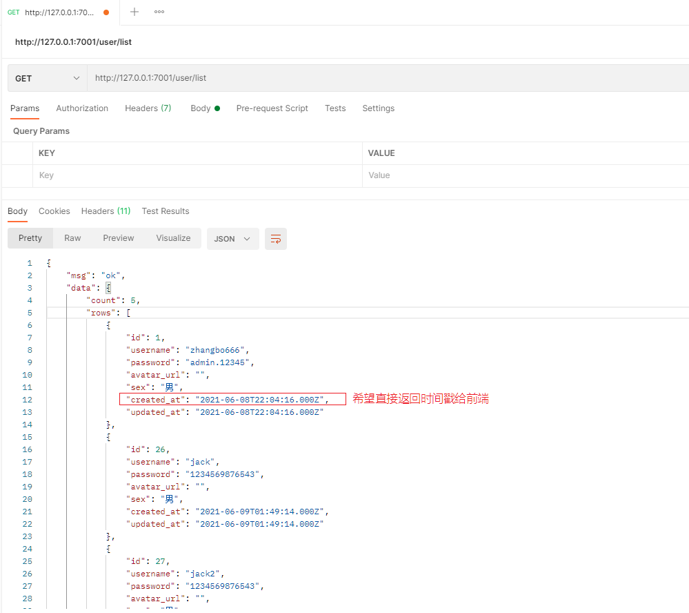

这个时候就需要使用获取器来实现了。

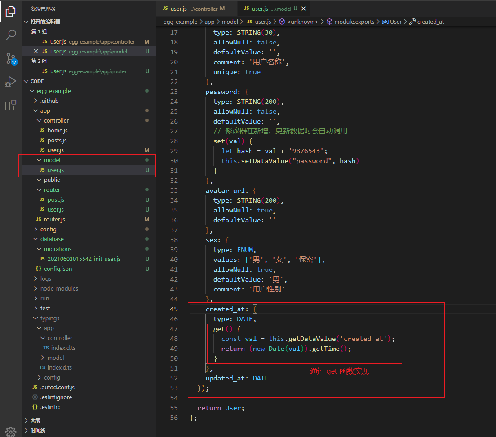

> `const val = this.getDataValue('created_at')`用于获取`created_at`的原始数据。 
>
> `get` 函数需要 return 一个值，`set`函数不需要 return。

使用修改器之后返回的数据：

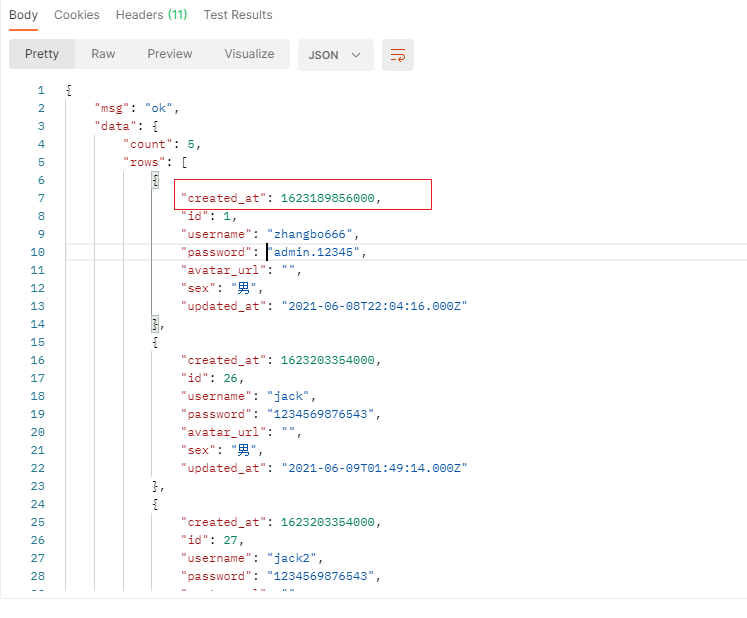


#### where

无论你是通过 findAll/find 或批量 updates/destroys 进行查询,都可以传递一个 `where` 对象来过滤查询.

`where` 通常用 attribute:value 键值对获取一个对象,其中 value 可以是匹配等式的数据或其他运算符的键值对象.

也可以通过嵌套 `or` 和 `and` `运算符` 的集合来生成复杂的 AND/OR 条件.

##### 基础

```js
const Op = Sequelize.Op;

Post.findAll({
  where: {
    authorId: 2
  }
});
// SELECT * FROM post WHERE authorId = 2

Post.findAll({
  where: {
    authorId: 12,
    status: 'active'
  }
});
// SELECT * FROM post WHERE authorId = 12 AND status = 'active';

Post.findAll({
  where: {
    [Op.or]: [{authorId: 12}, {authorId: 13}]
  }
});
// SELECT * FROM post WHERE authorId = 12 OR authorId = 13;

Post.findAll({
  where: {
    authorId: {
      [Op.or]: [12, 13]
    }
  }
});
// SELECT * FROM post WHERE authorId = 12 OR authorId = 13;

Post.destroy({
  where: {
    status: 'inactive'
  }
});
// DELETE FROM post WHERE status = 'inactive';

Post.update({
  updatedAt: null,
}, {
  where: {
    deletedAt: {
      [Op.ne]: null
    }
  }
});
// UPDATE post SET updatedAt = null WHERE deletedAt NOT NULL;

Post.findAll({
  where: sequelize.where(sequelize.fn('char_length', sequelize.col('status')), 6)
});
// SELECT * FROM post WHERE char_length(status) = 6;
```


##### 操作符

Sequelize 可用于创建更复杂比较的符号运算符 

```js
const Op = Sequelize.Op

[Op.and]: {a: 5}           // 且 (a = 5)
[Op.or]: [{a: 5}, {a: 6}]  // (a = 5 或 a = 6)
[Op.gt]: 6,                // id > 6
[Op.gte]: 6,               // id >= 6
[Op.lt]: 10,               // id < 10
[Op.lte]: 10,              // id <= 10
[Op.ne]: 20,               // id != 20
[Op.eq]: 3,                // = 3
[Op.not]: true,            // 不是 TRUE
[Op.between]: [6, 10],     // 在 6 和 10 之间
[Op.notBetween]: [11, 15], // 不在 11 和 15 之间
[Op.in]: [1, 2],           // 在 [1, 2] 之中
[Op.notIn]: [1, 2],        // 不在 [1, 2] 之中
[Op.like]: '%hat',         // 包含 '%hat'
[Op.notLike]: '%hat'       // 不包含 '%hat'
[Op.iLike]: '%hat'         // 包含 '%hat' (不区分大小写)  (仅限 PG)
[Op.notILike]: '%hat'      // 不包含 '%hat'  (仅限 PG)
[Op.startsWith]: 'hat'     // 类似 'hat%'
[Op.endsWith]: 'hat'       // 类似 '%hat'
[Op.substring]: 'hat'      // 类似 '%hat%'
[Op.regexp]: '^[h|a|t]'    // 匹配正则表达式/~ '^[h|a|t]' (仅限 MySQL/PG)
[Op.notRegexp]: '^[h|a|t]' // 不匹配正则表达式/!~ '^[h|a|t]' (仅限 MySQL/PG)
[Op.iRegexp]: '^[h|a|t]'    // ~* '^[h|a|t]' (仅限 PG)
[Op.notIRegexp]: '^[h|a|t]' // !~* '^[h|a|t]' (仅限 PG)
[Op.like]: { [Op.any]: ['cat', 'hat']} // 包含任何数组['cat', 'hat'] - 同样适用于 iLike 和 notLike
[Op.overlap]: [1, 2]       // && [1, 2] (PG数组重叠运算符)
[Op.contains]: [1, 2]      // @> [1, 2] (PG数组包含运算符)
[Op.contained]: [1, 2]     // <@ [1, 2] (PG数组包含于运算符)
[Op.any]: [2,3]            // 任何数组[2, 3]::INTEGER (仅限PG)

[Op.col]: 'user.organization_id' // = 'user'.'organization_id', 使用数据库语言特定的列标识符, 本例使用 PG
```


##### 组合

```js
{
  rank: {
    [Op.or]: {
      [Op.lt]: 1000,
      [Op.eq]: null
    }
  }
}
// rank < 1000 OR rank IS NULL

{
  createdAt: {
    [Op.lt]: new Date(),
    [Op.gt]: new Date(new Date() - 24 * 60 * 60 * 1000)
  }
}
// createdAt < [timestamp] AND createdAt > [timestamp]

{
  [Op.or]: [
    {
      title: {
        [Op.like]: 'Boat%'
      }
    },
    {
      description: {
        [Op.like]: '%boat%'
      }
    }
  ]
}
// title LIKE 'Boat%' OR description LIKE '%boat%'
```


##### 关系 / 关联

```js
// 找到所有具有至少一个 task 的  project,其中 task.state === project.state
Project.findAll({
    include: [{
        model: Task,
        where: { state: Sequelize.col('project.state') }
    }]
})
```


#### 字段限制

因为默认的查询是将所有的字段都查询出来，是比较消耗性能的，很多时候我们并不需要查询所有字段，因此我们要对查询的字段进行限制。

限制返回字段第一种写法：

```js
// 用户列表
async index() {
    let result = [];
    result = await this.app.model.User.findAll({
        attributes: ['id', 'username', 'sex']
    })

    this.ctx.body = {
        msg: "ok",
        data: result
    }
}
```

> 这里调用模型的`findAll`方法并传入一个对象，对象中的`attributes`是一个数组，数组中的每一项就是指定返回的字段。

除了传入数组的查询方式之外，还有一种查询方法，就是排除掉你不想查询的字段，然后把剩下的字段都返回，这种通过形式需要把`attributes`写成对象形式，添加`exclude`属性，属性的 value 是一个数组，然后给数组添加你要排除掉的字段即可。

```js
result = await this.app.model.User.findAll({
    attributes: {
        // 排除
        exclude: ['password']
    },
```

这种情况就会将除了`password`字段以外的其他字段都返回。

限制字段与不限制字段的查询区别如下图所示。

没有限制字段下 sequelize 是这样查询的：

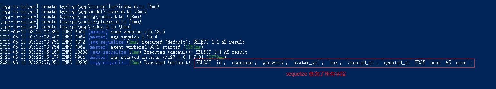


限制字段之后 sequelize 是这样查询的：

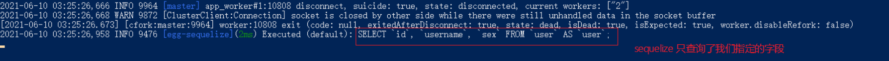


#### 排序和分页

```js
result = await this.app.model.User.findAll({
    attributes: {
        // 排除
        exclude: ['password']
    },
    order: [
        ['updated_at', 'DESC'],
        ['id', 'DESC']
    ]
})
```

返回的数据：

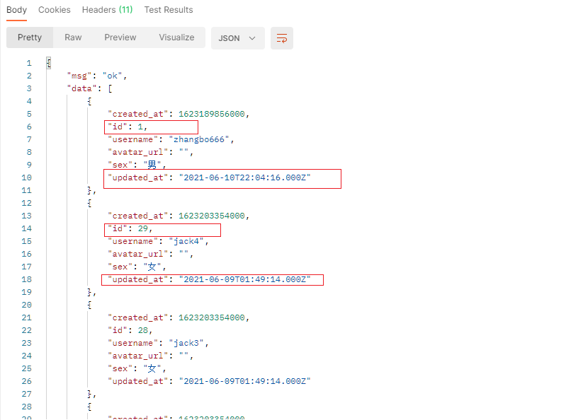

可以看到数据是先根据`updated_at`字段降序排序的，然后根据`id`进行降序排序。

```js
  // 用户列表
  async index() {
    let result = [];
    // 计算分页
    let page = this.ctx.query.page ? parseInt(this.ctx.query.page) : 1;
    let limit = 5;  // 每页记录数
    let offset = (page -  1) * 5; // 偏移值 = （每页记录数 - 1）* 5
    result = await this.app.model.User.findAll({
      // attributes: ['id', 'username', 'sex'],
      attributes: {
        // 排除
        exclude: ['password']
      },
      order: [
        ['updated_at', 'DESC'],
        ['id', 'DESC']
      ],
      offset,
      limit
    })

    this.ctx.body = {
      msg: "ok",
      data: result
    }
  }
```

> 分页还是比较简单，只需要理解 SQL 中的`offset`查询是从0开始的，`limit`是限制查询记录数量的即可。
>
> 例子：
>
> 前端的传递的`pageSize`为 10，`page`参数为 1，那么根据上面的代码就能推算出 limit 等于 10，offset 等于 （1 - 1）* 10，也就是 0，那么 SQL就会从第 0 条数据开始查，查 10 条数据就会返回给前端。
>
> 如果用户点击第二页的数据的时候，前端传递的 `page`参数此时为 2，后端 offset 此时就是 (2 - 1) * 10，那就是10，SQL 就会从第 10 条数据开始查，实际是第 11 条，因为 offset 是从 0 开始的。

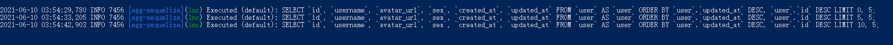

还是不理解就自行去补 mysql中的 limit offset 的知识。

> sequelize 是 Node.js 生态下的一款 ORM 框架，专门用来操作各种数据库的，学习它的前提是你已经掌握了要操作的数据库的基础知识！


#### 修改和限制修改字段

一个完整的 CRUD 一定会包含修改记录操作，来看看在 sequelize 中如何实现修改。

首先编写修改用户信息的函数。

```js
  // 修改用户信息
  async update() {
    let id = this.ctx.params.id ? parseInt(this.ctx.params.id) : 0
    // 拿到这条记录且判断是否存在
    let data = await this.app.model.User.findByPk(id);
    console.log("id: ", id)
    console.log("[+]------------", data)
    if(!data) {
      return this.ctx.body = {
        msg: "fail",
        data: "该记录不存在"
      }
    }
    
    // 拿到 post 请求传递过来的参数
    let params = this.ctx.request.body
    let res = await data.update(params, {
      // 限制更新数据的字段，只更新 username，其他字段不更新
      fields: ['username']
    });
    this.ctx.body = {
      msg: "ok",
      data: res
    }
  }
```

配置路由。

```js
module.exports = app => {
  const { router, controller } = app;
  app.router.get('/user/list', controller.user.index)
  app.router.get('/user/read/:id', controller.user.read)
  app.router.post('/user/create', controller.user.create)
  app.router.post('/user/update/:id', controller.user.update)		// 修改用户信息
}
```

> 从代码可以清晰看到整个修改数据的流程。
>
> 1. 获取用户发请求的路径参数，也就是用户的 id
> 2. 根据 id 查询记录，如果不存在则直接 return 提示信息
> 3. 拿到用户传递过来的数据，注意这里是 post 请求，要通过`this.ctx.request.body`获取
> 4. 在查询的记录上调用 `update`方法，该方法第一个参数是要修改的对象信息，第二个参数是一个对象，fields 属性的值是一个 Array，里面放的是需要限制修改的字段

发请求部分的图片。

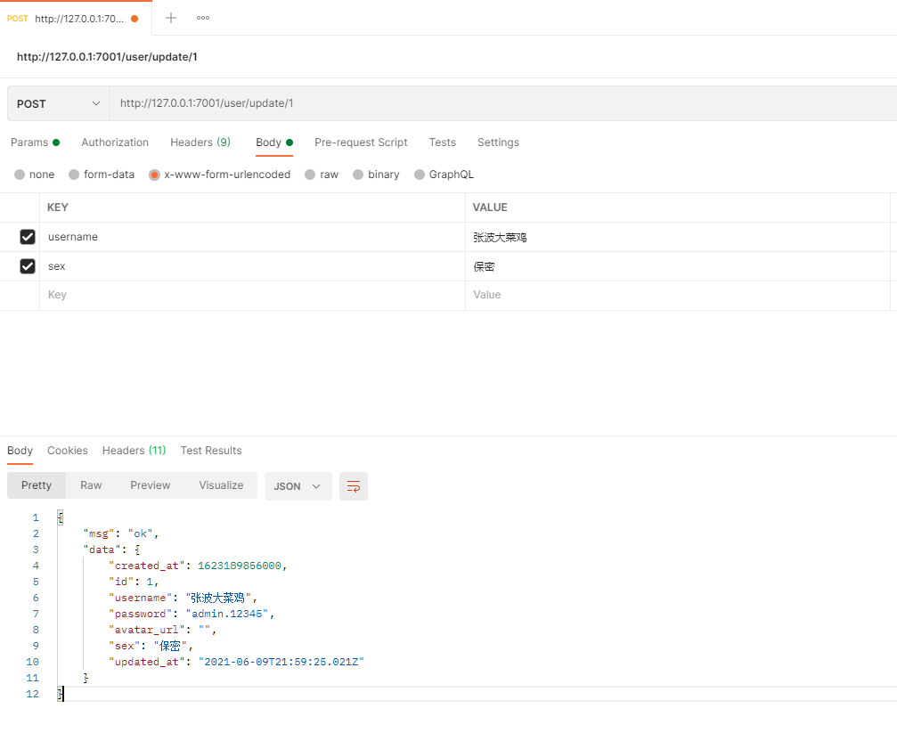


#### 删除和批量删除

删除单个数据。

```js
  // 删除用户数据
  async destroy() {
    let id = this.ctx.params.id ? parseInt(this.ctx.params.id) : 0
    let data = await this.app.model.User.findByPk(id)
    if (!data) {
      return this.ctx.body = {
        msg: 'fail',
        data: '记录不存在'
      }
    }
    // 删除用户信息
    let res = await data.destroy()
    this.ctx.body = {
      msg: 'ok',
      data: res
    }
  }
```

批量删除。

```js
  // 删除用户数据
  async destroy() {
    // let id = this.ctx.params.id ? parseInt(this.ctx.params.id) : 0
    // let data = await this.app.model.User.findByPk(id)
    // if (!data) {
    //   return this.ctx.body = {
    //     msg: 'fail',
    //     data: '记录不存在'
    //   }
    // }
    // // 删除用户信息
    // let res = await data.destroy()
    let {Op} = this.app.model.Sequelize;
    let res = await this.app.model.User.destroy({
      where: {
        id: {
          // 删除 id 大于等于 34 的记录
          [Op.gte]: 34
        }
      }
    })
    this.ctx.body = {
      msg: 'ok',
      data: res
    }
  }
```

> 删除单个数据直接获取这个数据之后调用`destroy`函数就OK，批量删除需要通过`this.app.model.User`模型对象调用`destroy`函数，然后传入`where`条件即可。


## 3.错误和异常统一处理


## 4.中间件配置

默认所有路由都走中间件，如何配置部分路由不走中间件呢？


## 5.参数验证

