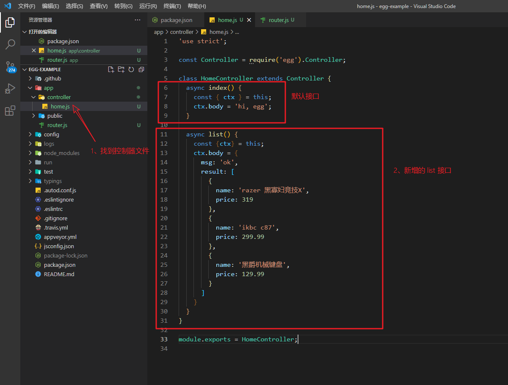
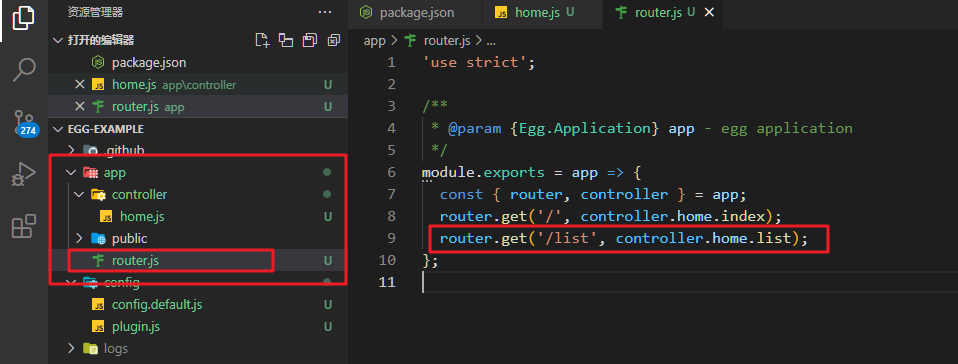
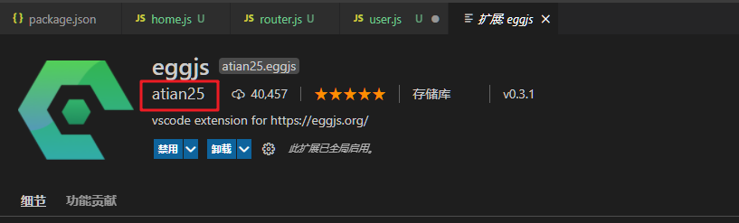

## 叮咚项目后端参考文档 v1.0

## 1.Egg.js基础

官方文档：https://eggjs.org/zh-cn/intro/index.html

### 1.1 什么是Egg.js？

**Egg.js 为企业级框架和应用而生**，我们希望由 Egg.js 孕育出更多上层框架，帮助开发团队和开发人员降低开发和维护成本。

就是Egg.js这个框架就是一个蛋，你的团队是鸡，你就可以孵化出鸡蛋，是鸭就是鸭蛋，是鹅就是鹅蛋，说白了就是根据Egg.js这个基础框架针对自己公司业务来封装上层框架，Egg.js不仅有约定，而且拓展性强，很适合企业级团队开发。

> [Express](http://expressjs.com/) 是 Node.js 社区广泛使用的框架，简单且扩展性强，非常适合做个人项目。但框架本身缺少约定，标准的 MVC 模型会有各种千奇百怪的写法。Egg 按照约定进行开发，奉行『约定优于配置』，团队协作成本低。

而且Egg.js是插件机制，他不会直接集成很多功能，例如ORM、模板引擎等，Egg.js是通过插件方式实现这类功能，你需要的时候你再引入即可。

记住下面的几个特性，使用过程中反复品味。

- 提供基于 Egg [定制上层框架](https://eggjs.org/zh-cn/advanced/framework.html)的能力
- 高度可扩展的[插件机制](https://eggjs.org/zh-cn/basics/plugin.html)
- 内置[多进程管理](https://eggjs.org/zh-cn/advanced/cluster-client.html)
- 基于 [Koa](http://koajs.com/) 开发，性能优异
- 框架稳定，测试覆盖率高
- [渐进式开发](https://eggjs.org/zh-cn/tutorials/progressive.html)

更多的介绍例如 异步编程、和其他框架对比之类的看官网吧。

### 1.2 创建第一个egg项目

我们推荐直接使用脚手架，只需几条简单指令，即可快速生成项目（`npm >=6.1.0`）:

```
$ mkdir egg-example && cd egg-example
$ npm init egg --type=simple
$ npm i
$ npm run dev
```


### 1.3 目录结构

```
egg-project
├── package.json
├── app.js (可选)
├── agent.js (可选)
├── app（-----------核心------------）
|   ├── router.js（路由）
│   ├── controller（控制器）
│   |   └── home.js
│   ├── service (模型)
│   |   └── user.js
│   ├── middleware (中间件)
│   |   └── response_time.js
│   ├── schedule (可选)
│   |   └── my_task.js
│   ├── public (静态资源)
│   |   └── reset.css
│   ├── view (模板视图)
│   |   └── home.tpl
│   └── extend (扩展)
│       ├── helper.js (可选)
│       ├── request.js (可选)
│       ├── response.js (可选)
│       ├── context.js (可选)
│       ├── application.js (可选)
│       └── agent.js (可选)
├── config
|   ├── plugin.js
|   ├── config.default.js
│   ├── config.prod.js
|   ├── config.test.js (可选)
|   ├── config.local.js (可选)
|   └── config.unittest.js (可选)
└── test
    ├── middleware
    |   └── response_time.test.js
    └── controller
        └── home.test.js
```


### 1.4 编写第一个API接口



第三步打开`app`目录下面的`router.js`文件，增加路由即可。



到此就是编写一个最最最基础的API接口的步骤了。

补充：通过egg插件可以快速生成控制器代码片段，安装下图的拓展插件即可。




### 1.5 router

#### 1.get传参

路由写法

```js
router.get('/user/read/:id', controller.user.read)
```

控制器中获取参数写法

```js
let id = this.ctx.params.id;	// 方式1，通过this.ctx.params获取
let page = this.ctx.query.page;		// 方式2，通过this.ctx.query获取?后面的参数
```

用户输入：http://127.0.0.1:7001/user/read/1?page=1

router 匹配到`/user/read`就会调用`controller.user.read`方法，然后通过`this.ctx.params.id`获取参数1,通过`this.ctx.query.page`获取参数问号后面的 page 参数1。


#### 2.关闭CSRF&&开启跨域

文档：https://www.npmjs.com/package/egg-cors

- 安装  npm i egg-cors --save
- 配置插件

```js
// {app_root}/config/plugin.js
exports.cors = {
  enable: true,
  package: 'egg-cors',
};
```

- config / config.default.js 目录下配置

```js
config.security = {
    // 关闭 csrf
    csrf: {
      enable: false,
    },
     // 跨域白名单
    domainWhiteList: [ 'http://localhost:3000' ],
  };
  // 允许跨域的方法
  config.cors = {
    origin: '*',
    allowMethods: 'GET, PUT, POST, DELETE, PATCH'
  };
```

#### 3.post传参

通过`this.ctx.request.body`获取post请求的参数

路由写法：

```js
router.post('/user/create', controller.user.create)
```

控制器方法：

```js
// 创建用户
async create() {
    let data = this.ctx.request.body
    console.log("user create info: ", data)
    this.ctx.body = {
        msg: 'ok',
        data: {
            username: '用户名',
            password: '密码'
        }
    }
}
```

其他的put、patch等都是类似。


#### 4.资源路由

如果想通过 RESTful 的方式来定义路由， 我们提供了 `app.router.resources('routerName', 'pathMatch', controller)` 快速在一个路径上生成 [CRUD](https://en.wikipedia.org/wiki/Create,_read,_update_and_delete) 路由结构。

```js
// app/router.js
module.exports = app => {
  const { router, controller } = app;
  router.resources('posts', '/api/posts', controller.posts);
  router.resources('users', '/api/v1/users', controller.v1.users); // app/controller/v1/users.js
};
```

上面代码就在 `/posts` 路径上部署了一组 CRUD 路径结构，对应的 Controller 为 `app/controller/posts.js` 接下来， 你只需要在 `posts.js` 里面实现对应的函数就可以了。

| Method | Path            | Route Name | Controller.Action             |
| ------ | --------------- | ---------- | ----------------------------- |
| GET    | /posts          | posts      | app.controllers.posts.index   |
| GET    | /posts/new      | new_post   | app.controllers.posts.new     |
| GET    | /posts/:id      | post       | app.controllers.posts.show    |
| GET    | /posts/:id/edit | edit_post  | app.controllers.posts.edit    |
| POST   | /posts          | posts      | app.controllers.posts.create  |
| PUT    | /posts/:id      | post       | app.controllers.posts.update  |
| DELETE | /posts/:id      | post       | app.controllers.posts.destroy |

```js
// app/controller/posts.js
exports.index = async () => {};

exports.new = async () => {};

exports.create = async () => {};

exports.show = async () => {};

exports.edit = async () => {};

exports.update = async () => {};

exports.destroy = async () => {};
```

如果我们不需要其中的某几个方法，可以不用在 `posts.js` 里面实现，这样对应 URL 路径也不会注册到 Router。

理解REST的文章：https://zhuanlan.zhihu.com/p/30396391

还有阮一峰的。

RESTful API 设计指南：http://www.ruanyifeng.com/blog/2014/05/restful_api.html

理解RESTful架构：http://www.ruanyifeng.com/blog/2011/09/restful.html


#### 5.路由分组

如上所述，我们并不建议把路由规则逻辑散落在多个地方，会给排查问题带来困扰。

若确实有需求，可以如下拆分：

``` js
// app/router.js
module.exports = app => {
  require('./router/news')(app);
  require('./router/admin')(app);
};

// app/router/news.js
module.exports = app => {
  app.router.get('/news/list', app.controller.news.list);
  app.router.get('/news/detail', app.controller.news.detail);
};

// app/router/admin.js
module.exports = app => {
  app.router.get('/admin/user', app.controller.admin.user);
  app.router.get('/admin/log', app.controller.admin.log);
};
```


