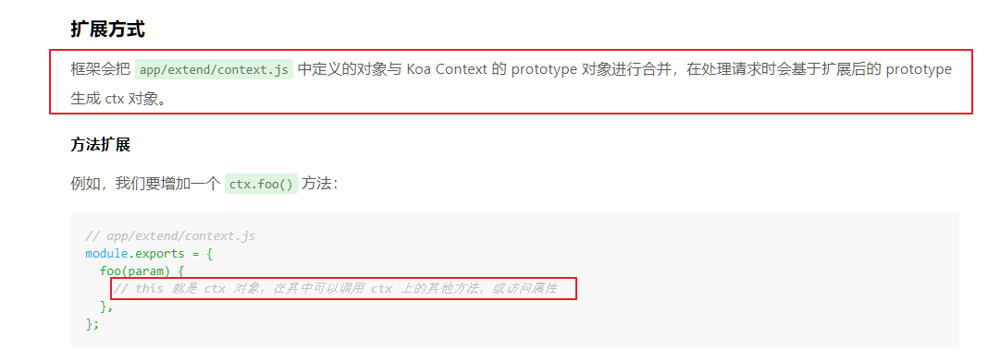

## 叮咚项目后端开发文档 v1.0

## 1.创建项目和初始化配置

### 创建项目

安装egg.js

```
全局切换镜像： 
npm config set registry https://registry.npm.taobao.org
```

我们推荐直接使用脚手架，只需几条简单指令，即可快速生成项目（`npm >=6.1.0`）:

```
mkdir egg-example && cd egg-example
npm init egg --type=simple --registry https://registry.npm.taobao.org
npm i
```

启动项目:

```
npm run dev
open http://localhost:7001
```


### 关闭CSRF开启跨域

- 安装 npm i egg-cors --save

- 配置插件

  ```js
  // {app_root}/config/plugin.js
  cors:{
    enable: true,
    package: 'egg-cors',
  },
  ```

- config / config.default.js 目录下配置

  ```js
    config.security = {
      // 关闭 csrf
      csrf: {
        enable: false,
      },
       // 跨域白名单
      domainWhiteList: [ 'http://localhost:3000' ],
    };
    // 允许跨域的方法
    config.cors = {
      origin: '*',
      allowMethods: 'GET, PUT, POST, DELETE, PATCH'
    };
  ```


## 2.全局异常处理

```js
// app/middleware/error_handler.js
module.exports = (option, app) => {
    return async function errorHandler(ctx, next) {
      try {
        await next(); 
        // 404 处理
        if(ctx.status === 404 && !ctx.body){
           ctx.body = { 
               msg:"fail",
               data:'404 错误'
           };
        }
      } catch (err) {
        // 记录一条错误日志
        app.emit('error', err, ctx);

        const status = err.status || 500;
        // 生产环境时 500 错误的详细错误内容不返回给客户端，因为可能包含敏感信息
        const error = status === 500 && app.config.env === 'prod'
          ? 'Internal Server Error'
          : err.message;

        // 从 error 对象上读出各个属性，设置到响应中
        ctx.body = { 
            msg:"fail",
            data:error
        };
        ctx.status = status;
      }
    };
  };

// config/config.default.js
config.middleware = ['errorHandler'];
```


## 3.封装API返回格式扩展

为什么要封装呢？

因为如果不封装，那就需要在控制器里的每个方法都写下面的代码，造成冗余。

```js
this.ctx.body = {
    msg: 'ok',
    data: '返回的数据'
}
```

封装之后只需要在一个文件里面编写一个 API 返回成功和返回失败的函数，控制器中直接调用这个函数即可。

```js
// app/extend/context.js
module.exports = {
  // 成功提示
  apiSuccess(data = '', msg = 'ok', code = 200) {
    this.body = { msg, data };
    this.status = code;
  },
  // 失败提示
  apiFail(data = '', msg = 'fail', code = 400) {
    this.body = { msg, data };
    this.status = code;
  },
};
```

调用：

```js
// app/controller/home.js
'use strict';

const Controller = require('egg').Controller;

class HomeController extends Controller {
  async index() {
    const { ctx } = this;
    let list = [
      {
        id: 1,
        name: '牛奶'
      },
      {
        id: 2,
        name: '菠萝'
      }
    ]
    ctx.apiSuccess(list)
    // ctx.apiFail('数据查询失败!')
  }
}

module.exports = HomeController;

```

为什么在`context.js`中不使用`this.ctx.body`来返回数据，而是直接使用`this.body`？

官方文档已经给出解释了。



文档地址：https://eggjs.org/zh-cn/basics/extend.html#application


## 4.Sequelize数据库和迁移配置

#### 数据库配置

1. 安装并配置[egg-sequelize](https://github.com/eggjs/egg-sequelize)插件（它会辅助我们将定义好的 Model 对象加载到 app 和 ctx 上）和[mysql2](https://github.com/sidorares/node-mysql2)模块：

   ```js
   npm install --save egg-sequelize mysql2
   ```

   

2. 在`config/plugin.js`中引入 egg-sequelize 插件。

   ```js
   exports.sequelize = {
     enable: true,
     package: 'egg-sequelize',
   };
   ```

   

3. 在`config/config.default.js`添加配置。

   ```js
   config.sequelize = {
       dialect:  'mysql',
       host:  '127.0.0.1',
       username: 'root',
       password:  'root',
       port:  3306,
       database:  'egg-dingdong-api-server',
       // 中国时区
       timezone:  '+08:00',
       define: {
           // 取消数据表名复数
           freezeTableName: true,
           // 自动写入时间戳 created_at updated_at
           timestamps: true,
           // 字段生成软删除时间戳 deleted_at
           // paranoid: true,
           createdAt: 'created_at',
           updatedAt: 'updated_at',
           // deletedAt: 'deleted_at',
           // 所有驼峰命名格式化
           underscored: true
       }
   };
   ```


#### 迁移配置

1. sequelize 提供了[sequelize-cli](https://github.com/sequelize/cli)工具来实现[Migrations](http://docs.sequelizejs.com/manual/tutorial/migrations.html)，我们也可以在 egg 项目中引入 sequelize-cli。

   ```js
   npm install --save-dev sequelize-cli
   ```

2. egg 项目中，我们希望将所有数据库 Migrations 相关的内容都放在`database`目录下，所以我们在项目根目录下新建一个`.sequelizerc`配置文件：

   ```js
   'use strict';
   
   const path = require('path');
   
   module.exports = {
     config: path.join(__dirname, 'database/config.json'),
     'migrations-path': path.join(__dirname, 'database/migrations'),
     'seeders-path': path.join(__dirname, 'database/seeders'),
     'models-path': path.join(__dirname, 'app/model'),
   };
   ```

3. 初始化 Migrations 配置文件和目录。

   ```js
   npx sequelize init:config
   npx sequelize init:migrations
   ```

4. 执行完后会生成`database/config.json`文件和`database/migrations`目录，我们修改一下`database/config.json`中的内容，将其改成我们项目中使用的数据库配置：

   ```js
   {
     "development": {
       "username": "root",
       "password": "root",
       "database": "egg-dingdong-api-server",
       "host": "127.0.0.1",
       "dialect": "mysql",
       "timezone": "+08:00"
     },
     "test": {
       "username": "root",
       "password": "root",
       "database": "egg-dingdong-api-server-test",
       "host": "127.0.0.1",
       "dialect": "mysql",
       "timezone": "+08:00"
     },
     "production": {
       "username": "root",
       "password": "root",
       "database": "egg-dingdong-api-server-production",
       "host": "127.0.0.1",
       "dialect": "mysql",
       "timezone": "+08:00"
     }
   }
   
   ```

5. 创建数据库。

   ```js
   npx sequelize db:create
   ```


## 5.登录注册退出功能开发

### 用户表设计和迁移

创建数据迁移表。

```js
npx sequelize migration:generate --name=user
```

执行完命令后，会在database / migrations / 目录下生成数据表迁移文件，然后定义。

```js
'use strict';

module.exports = {
  up: async (queryInterface, Sequelize) => {
    const { INTEGER, STRING, DATE, ENUM } = Sequelize;
    // 创建表
    await queryInterface.createTable('user', {
      id: {
        type: INTEGER(20).UNSIGNED,
        primaryKey: true,
        autoIncrement: true
      },
      username: {
        type: STRING(30),
        allowNull: false,
        defaultValue: '',
        comment: '用户名称',
        unique: true
      },
      nickname: {
        type: STRING(30),
        allowNull: false,
        defaultValue: '',
        comment: '昵称',
      },
      email: {
        type: STRING(160),
        comment: '用户邮箱',
        unique: true
      },
      password: {
        type: STRING(200),
        allowNull: false,
        defaultValue: ''
      },
      avatar: {
        type: STRING(200),
        allowNull: true,
        defaultValue: ''
      },
      phone: {
        type: STRING(20),
        comment: '用户手机',
        unique: true
      },
      sex: {
        type: ENUM,
        values: ['男', '女', '保密'],
        allowNull: true,
        defaultValue: '男',
        comment: '用户性别'
      },
      status: {
        type: INTEGER(1),
        allowNull: false,
        defaultValue: 1,
        comment: '状态'
      },
      sign: {
        type: STRING(200),
        allowNull: true,
        defaultValue: '',
        comment: '个性签名'
      },
      area: {
        type: STRING(200),
        allowNull: true,
        defaultValue: '',
        comment: '地区'
      },
      created_at: DATE,
      updated_at: DATE
    });
  },

  down: async queryInterface => {
    await queryInterface.dropTable('user');
  }
};
```

执行 migrate 进行数据库变更。

```js
npx sequelize db:migrate
```

然后用户表就已经创建完成了。


### 注册功能开发

创建用户表模型

```js
// app/model/user.js
'use strict';
module.exports = app => {
    const { STRING, INTEGER, DATE, ENUM, TEXT } = app.Sequelize;
    // 配置（重要：一定要配置详细，一定要！！！）
    const User = app.model.define('user', {
        id: {
            type: INTEGER(20).UNSIGNED,
            primaryKey: true,
            autoIncrement: true
        },
        username: {
            type: STRING(30),
            allowNull: false,
            defaultValue: '',
            comment: '用户名称',
            unique: true
        },
        nickname: {
            type: STRING(30),
            allowNull: false,
            defaultValue: '',
            comment: '昵称',
        },
        email: {
            type: STRING(160),
            comment: '用户邮箱',
            unique: true
        },
        password: {
            type: STRING(200),
            allowNull: false,
            defaultValue: ''
        },
        avatar: {
            type: STRING(200),
            allowNull: true,
            defaultValue: ''
        },
        phone: {
            type: STRING(20),
            comment: '用户手机',
            unique: true
        },
        sex: {
            type: ENUM,
            values: ['男', '女', '保密'],
            allowNull: true,
            defaultValue: '男',
            comment: '用户性别'
        },
        status: {
            type: INTEGER(1),
            allowNull: false,
            defaultValue: 1,
            comment: '状态'
        },
        sign: {
            type: STRING(200),
            allowNull: true,
            defaultValue: '',
            comment: '个性签名'
        },
        area: {
            type: STRING(200),
            allowNull: true,
            defaultValue: '',
            comment: '地区'
        },
        created_at: DATE,
        updated_at: DATE
    });
    return User;
};
```

注册功能代码（不完善）：

```js
  // 用户注册
  async reg() {
    let { ctx, app } = this;
    // 参数验证
    let { username, password, repassword } = this.ctx.request.body
    // 验证用户是否已经存在
    let data = await app.model.User.findOne({
      where: {
        username
      }
    })
    if (data) {
      ctx.throw(400, '用户名已存在')
    }
    // 创建用户
    let user = await app.model.User.create({
      username,
      password
    });
    if(!user) {
      ctx.throw(400, '创建用户失败');
    }
    ctx.apiSuccess(user);
  }
```

> 后续会在该功能的基础上进一步完善。


### 参数验证

插件地址：<https://www.npmjs.com/package/egg-valparams>

安装插件：

```js
npm i egg-valparams --save
```

配置插件：

```js
// config/plugin.js
valparams : {
  enable : true,
  package: 'egg-valparams'
},
// config/config.default.js
config.valparams = {
    locale    : 'zh-cn',
    throwError: false
};
```

在控制器里使用：

```js

```


###  crypto数据加密


### 登录功能开发


### Postman base_url 配置


### jwt和加密鉴权

生成token


为什么要将用户的登录信息做缓存？

